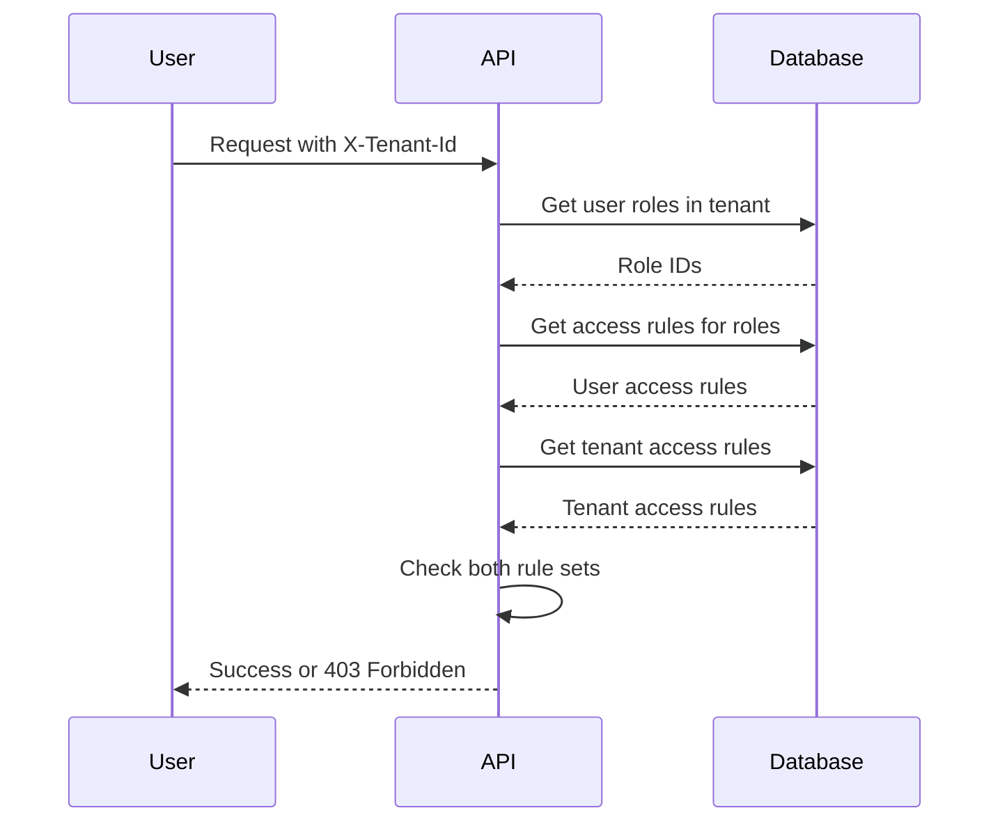

# Technische Referenz: Zugriffskontrolle

Dieses Kapitel dokumentiert die technischen Details, wie die Plattform die Zugriffskontrolle durchsetzt. Diese
Informationen sind nützlich für Systemadministratoren, die Mandanten und Rollen konfigurieren, sowie für Entwickler, die
die Plattform erweitern.

## Format der Zugriffsregeln

Zugriffsregeln verwenden ein hierarchisches Muster: `aihub.[user|admin].<service>.<resource>.<identifier>`

Beispiele:

```
aihub.user.agent.>                      # All agents (user access)
aihub.admin.agent.research.*            # All research agents (admin access)
aihub.user.knowledge.hr-docs.policies   # Specific knowledge namespace
aihub.admin.service.tenant              # Tenant management service
```

### Wildcards

**Single-level** (`*`) passt exakt auf ein Segment:

- `agent.research.*` passt auf `agent.research.instance-1`, aber nicht auf `agent.research.team.instance-1`

**Multi-level** (`>`) passt auf ein oder mehrere Segmente am Ende:

- `agent.>` passt auf `agent.research.instance-1`, `agent.analysis.team.special` und jeden anderen Agentenpfad
- Muss das letzte Token in der Regel sein

### Admin- vs. Benutzerregeln

Regeln, die mit `aihub.admin.*` beginnen, gewähren administrativen Zugriff. Benutzer mit Admin-Zugriff haben automatisch
gleichwertigen Benutzerzugriff.

Ein Benutzer mit `aihub.admin.agent.>` kann auf Ressourcen zugreifen, die entweder `aihub.admin.agent.*` oder
`aihub.user.agent.*` erfordern.

## Berechtigungsauflösung

Wenn eine Anfrage eingeht, führt die Plattform folgende Schritte aus:

1. Extrahiert die Identität des Benutzers aus dem Authentifizierungstoken
2. Liest den `X-Tenant-Id`-Header, um den Mandantenkontext zu bestimmen
3. Fragt die Rollen des Benutzers innerhalb dieses spezifischen Mandanten ab
4. Sammelt alle Zugriffsregeln aus diesen Rollen
5. Ruft die Zugriffsregeln des Mandanten ab
6. Überprüft, ob sowohl der Mandant als auch der Benutzer die angeforderte Aktion erlauben



### Zweischichtige Überprüfung

Der Zugriff erfordert das Bestehen beider Schichten:

**Schicht 1: Mandantengrenze** – Erlaubt der Mandant diese Ressource überhaupt?

Wenn die Zugriffsregeln des Mandanten die angeforderte Ressource nicht enthalten, wird der Zugriff sofort verweigert,
ohne die Benutzerrollen zu überprüfen.

**Schicht 2: Benutzerberechtigungen** – Erlaubt die Rolle des Benutzers diese Aktion?

Nachdem bestätigt wurde, dass der Mandant die Ressource erlaubt, überprüft das System, ob die Rollen des Benutzers die
erforderliche Berechtigung gewähren.

Beide müssen bestanden werden, damit der Zugriff gewährt wird.

### Beispiel

Mandant hat: `aihub.user.agent.research.*`

Benutzer hat: `aihub.user.agent.>` (aus seiner Rolle)

Benutzer fordert an: `aihub.user.agent.research.instance-1`

- Mandantenprüfung: ✓ (Mandant erlaubt Research-Agenten)
- Benutzerprüfung: ✓ (Benutzerrolle erlaubt alle Agenten)
- Ergebnis: Zugriff gewährt

Benutzer fordert an: `aihub.user.agent.finance.instance-1`

- Mandantenprüfung: ✗ (Mandant erlaubt nur Research-Agenten)
- Ergebnis: Zugriff verweigert (Benutzerprüfung nicht ausgewertet)

## Dienstebasierte Berechtigungen

Jeder Dienst benötigt eine Basisberechtigung: `aihub.user.service.<service-name>`

Bevor ressourcenspezifische Berechtigungen geprüft werden, verifiziert das System, ob der Benutzer Zugriff auf den
Dienst selbst hat.

Um auf einen Agenten zuzugreifen, benötigen Sie:

- Dienstzugriff: `aihub.user.service.agent`
- Ressourcenzugriff: `aihub.user.agent.<agent-class>.<agent-id>`

Wenn der Mandant keinen Dienstzugriff gewährt, sind keine Ressourcen in diesem Dienst zugänglich, unabhängig von anderen
Regeln.

## Pfadparameter-Substitution

Berechtigungsvorlagen verwenden Platzhalter, die aus der Anfrage aufgelöst werden:

Vorlage: `aihub.user.agent.{agent_class}.{agent_id}`

Anfrage: `GET /api/v1/agents/research/instance-alpha`

Aufgelöste Berechtigung: `aihub.user.agent.research.instance-alpha`

Das System überprüft diese konkrete Berechtigung anhand der Benutzer- und Mandantenzugriffsregeln.

## Zugriffsstufen

Das System gibt drei Stufen zurück:

**ACCESS_DENIED**: Keine Berechtigung. Gibt HTTP 403 zurück.

**ACCESS_USER**: Benutzerzugriff zum Anzeigen und Interagieren mit der Ressource.

**ACCESS_ADMIN**: Admin-Zugriff zum Ändern, Konfigurieren oder Löschen der Ressource.

Controller können zwischen Benutzer- und Admin-Zugriff zu Audit-Zwecken unterscheiden, obwohl viele Operationen nur
prüfen, ob der Zugriff gewährt (nicht verweigert) wird.

## Konfiguration über Umgebungsvariablen

Konfigurieren Sie das Standardverhalten über Umgebungsvariablen:

```bash
# Default tenant created on first startup
AIHUB_DEFAULT_TENANT_NAME="Default Organization"
AIHUB_DEFAULT_TENANT_ACCESS_RULES="aihub.admin.>"

# Automatic user signup
AIHUB_USER_SIGNUP_DEFAULT_TENANT="default"
AIHUB_USER_SIGNUP_DEFAULT_ROLES="AIHubUser,AIHubAgentUser"
FIRST_AIHUB_USER_SIGNUP_DEFAULT_ROLES="AIHubAdmin"
```

## Superuser-Umgehung

Die globale Superuser-Rolle umgeht Mandantenbeschränkungen:

- Erfordert keine Mandantenauswahl
- Wird nicht gegen Mandantengrenzen geprüft
- Hat Admin-Zugriff auf alle Ressourcen über alle Mandanten hinweg

Konfigurieren über:

```bash
SUPERUSER_TOKEN="<secure-token>"
SUPERUSER_OID="<user-id>"
```

Sparsam verwenden – Superuser-Zugriff ist für die Plattformadministration vorgesehen, nicht für den regulären Betrieb.

## Validierungsregeln

::: warning Anforderungen an das Format der Zugriffsregeln
Beim Erstellen von Zugriffsregeln gilt:

**Erforderliches Format**:

- Muss mit `aihub.user.` oder `aihub.admin.` beginnen
- Nur Kleinbuchstaben, Zahlen, Punkte, Bindestriche, Unterstriche, `*`, `>`
- Multi-Level-Wildcard `>` nur am Ende

**Verboten**:

- Großbuchstaben
- Sonderzeichen außer `.`, `-`, `_`, `*`, `>`
- `>` mitten in einer Regel

Das System validiert Regeln beim Erstellen oder Bearbeiten von Mandanten und Rollen. Ungültige Regeln lösen einen Fehler
mit dem spezifischen Problem aus.
:::

## Gängige Muster

### Breiter Plattformzugriff

```
aihub.admin.>
```

Vollständiger Admin-Zugriff auf alles. Für Systemadministrator-Mandanten verwenden.

### Dienste-Administratoren

```
aihub.admin.service.user
aihub.admin.service.role
aihub.admin.service.tenant
```

Können Benutzer, Rollen und Mandanten verwalten, aber keine anderen Dienste.

### Abteilungszugriff

```
aihub.user.agent.department-finance.*
aihub.user.knowledge.finance-docs.>
aihub.user.process.finance-workflows.*
```

Nur Zugriff auf finanzspezifische Ressourcen.

### Lesezugriff

```
aihub.user.agent.>
aihub.user.knowledge.>
```

Kann Agenten und Wissensbereiche anzeigen und verwenden, aber nicht erstellen oder ändern.

### Power-User

```
aihub.user.>
aihub.admin.agent.<department>.*
aihub.admin.knowledge.<department>-docs.>
```

Benutzerzugriff überall, Admin-Zugriff nur auf Abteilungsressourcen.

## Fehlerbehebung bei Zugriffsproblemen

::: details Checkliste zur Fehlerbehebung
Bei der Fehlerbehebung überprüfen Sie diese Punkte der Reihe nach:

1. **Mandantenauswahl**: Überprüfen Sie, ob der Benutzer den beabsichtigten Mandanten ausgewählt hat
2. **Mandantengrenze**: Bestätigen Sie, dass die Zugriffsregeln des Mandanten die Ressource enthalten
3. **Benutzerzugehörigkeit**: Überprüfen Sie, ob der Benutzer dem Mandanten angehört
4. **Rollenzuweisung**: Prüfen Sie, ob der Benutzer Rollen in diesem Mandanten hat
5. **Rollenregeln**: Überprüfen Sie, was diese Rollen erlauben
6. **Dienstzugriff**: Überprüfen Sie, ob die Service-Level-Berechtigung existiert

Die Plattform gibt detaillierte Fehlermeldungen zurück, die anzeigen, welche Berechtigung fehlgeschlagen ist. Verwenden
Sie dies, um die fehlende Regel zu identifizieren.
:::

## Leistungshinweise

Die Zugriffsprüfung ist optimiert:

- Regeln werden einmal pro Anfrage kompiliert
- Mehrere Berechtigungsprüfungen für denselben Benutzer verwenden die kompilierten Regeln wieder
- Komplexe Wildcard-Muster haben minimale Auswirkungen auf die Leistung
- Rollenänderungen treten sofort ohne Cache-Verzögerungen in Kraft

Das Wechseln von Mandanten löst eine vollständige Cache-Invalidierung im Frontend aus, wodurch Daten neu abgerufen
werden.
