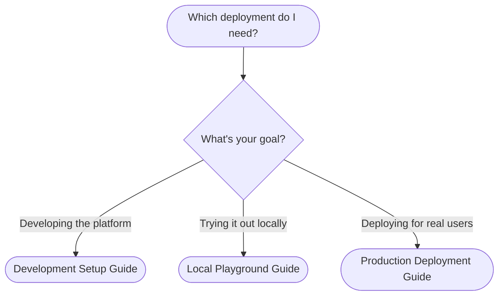

# Deployment Overview

The Swiss AI Hub deploys as a complete, self-contained platform using Docker Compose. Whether you're a developer extending the platform, an enterprise evaluating it for your organization, or an IT administrator deploying to production — there's a deployment configuration tailored to your needs.

## How Deployment Works

The Swiss AI Hub follows a simple deployment philosophy: **one command to launch everything**. The platform ships with pre-configured Docker Compose files that orchestrate all necessary services — databases, message queues, vector stores, authentication, observability, and the AI Hub itself.

Your main task is selecting the right configuration for your use case and setting up environment variables. The Docker Compose files handle service dependencies, health checks, networking, and startup order automatically. With proper preparation, you can have a fully operational AI platform running in under 30 minutes.

## Choosing Your Deployment

Two key decisions determine which deployment configuration you need:

## Configuration Approach

Regardless of which deployment you choose, the configuration follows the same pattern:

1. **Download** the appropriate Docker Compose file and config directory
2. **Create** a `.env` file with your settings
3. **Configure** authentication (Azure AD / Entra ID)
4. **Set up** LLM access (external provider or GPU models)
5. **Launch** with a single `docker compose up -d` command

Each deployment guide walks you through these steps with copy-paste commands and clear explanations. The most time-consuming part is typically the initial Azure AD app registration, which you only need to do once.

<NavigationBoxes :items="[
    { 
        'title': 'Development Setup', 
        'description': 'For platform developers who want to run the API, web frontend, and agents locally while Docker handles the infrastructure services.', 
        href: './1_development_setup'
    },
    { 
        'title': 'Local Playground', 
        'description': 'For trying out the complete Swiss AI Hub on your local machine with a single command. Perfect for demos and evaluations.', 
        href: './2_local_playground'
    },
    { 
        'title': 'Production Deployment', 
        'description': 'For deploying the Swiss AI Hub to a server with a real domain, automatic SSL certificates, and production-grade configuration.', 
        href: './3_production_deployment'
    },
]" />

