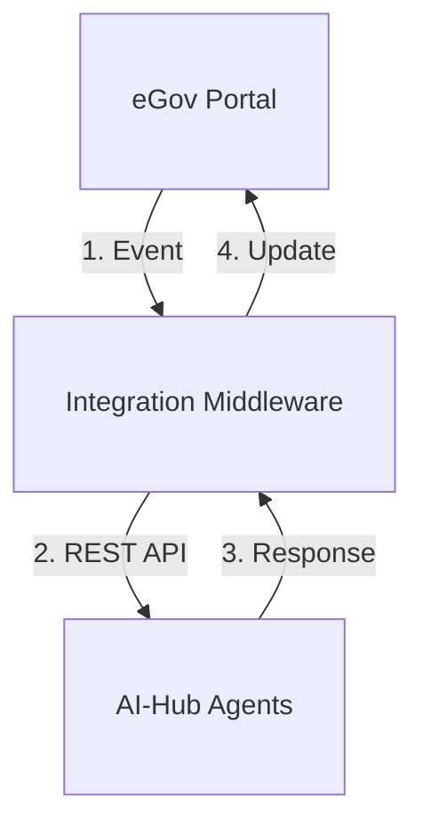
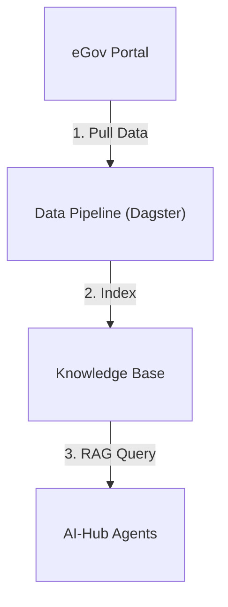

# eGovernment Portal Integration

::: warning Implementation Status
eGovernment portal integration is **not currently implemented** in the Swiss AI-Hub core platform. This documentation describes how organizations can implement custom integrations using the platform's existing APIs.
:::

## Current Capabilities

While dedicated eGovernment connectors are not provided, the platform offers multiple integration approaches:

### API-Based Integration
- **[REST API](../../16_api/2_agent_interaction_api/)**: Programmatic access to all AI-Hub capabilities
- **Custom Agents**: Develop agents that call eGov APIs directly
- **Enterprise Authentication**: SSO via OAuth 2.0, SAML, Azure AD, Keycloak
- **Event-Driven Architecture**: Webhook-based integrations with audit trails

### Data Pipeline Integration
- **[Continuous Synchronization](../../6_pipelines/)**: Automated data ingestion from external systems
- **Custom Connectors**: Extend pipelines to pull data from eGov portals
- **Scheduled/Event-Triggered**: Run pipelines on schedule or in response to portal events
- **Built on Dagster**: Enterprise-grade orchestration for reliable data flows

Pipelines are ideal for **read-heavy** integrations where AI agents need access to eGov portal data (cases, documents, metadata) but don't need to write back frequently.

## Integration Patterns

Organizations can choose between two primary integration patterns:

### Pattern 1: Real-Time API Integration (Read/Write)

**Use When**: AI needs to read and write portal data in real-time (e.g., case updates, document classification)

**Components**:
- Integration middleware translates between portal and AI-Hub APIs
- Custom agents call portal APIs directly or via middleware
- Bidirectional data flow with webhook triggers

### Pattern 2: Pipeline-Based Data Sync (Read-Heavy)

**Use When**: AI primarily reads portal data for analysis (e.g., case summarization, search)

**Components**:
- Custom pipeline connector pulls data from portal APIs
- Data indexed into knowledge base for RAG
- Scheduled or event-triggered synchronization
- Agents query knowledge base, not portal directly

**Implementation Steps**:
1. Identify use cases and determine appropriate pattern
2. Assess portal API capabilities (read/write access, auth mechanisms, rate limits)
3. Develop custom integration (middleware or pipeline connector)
4. Configure Swiss deployment for data sovereignty
5. Test and validate before production

## Security Requirements

- **Data Sovereignty**: Deploy AI-Hub in Switzerland
- **Encryption**: TLS in transit, encryption at rest
- **Access Control**: RBAC with least privilege
- **Audit Logging**: Comprehensive event logs
- **PII Handling**: Use Anonymization Guards (see language models documentation)

## Example Use Cases

### Using Real-Time API Integration
- **Document Classification**: Portal triggers AI classification on document upload, result written back to portal metadata
- **Citizen Inquiry Response**: Portal webhook triggers AI to draft response, caseworker reviews and approves in portal

### Using Pipeline-Based Sync
- **Case Summarization**: Pipeline syncs case files nightly, caseworkers query AI for summaries via chat interface
- **Knowledge Search**: Pipeline indexes all portal documents, AI provides semantic search across entire portal archive

## Roadmap

Future development may include pre-built connectors for common Swiss systems, portal widgets, and compliance certifications. Organizations interested in these capabilities should contact the AI-Hub team.

## Related Documentation

- [Agent Interaction REST API](../../16_api/2_agent_interaction_api/) - Platform HTTP interface for real-time integration
- [Data Pipelines](../../6_pipelines/) - Automated data synchronization from external systems
- [Authentication Setup](../../11_access_management/1_authentication_setup/) - Configure SSO and authentication
- [Swiss Data Protection](../../19_compliance/3_dsg/) - revDSG compliance for public sector
