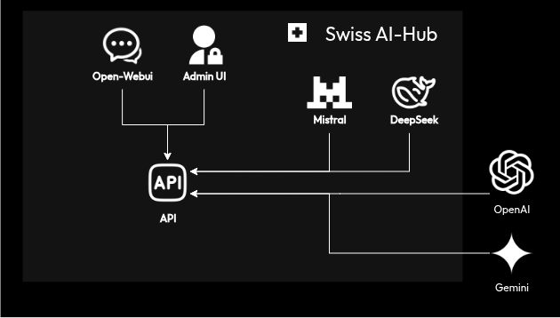
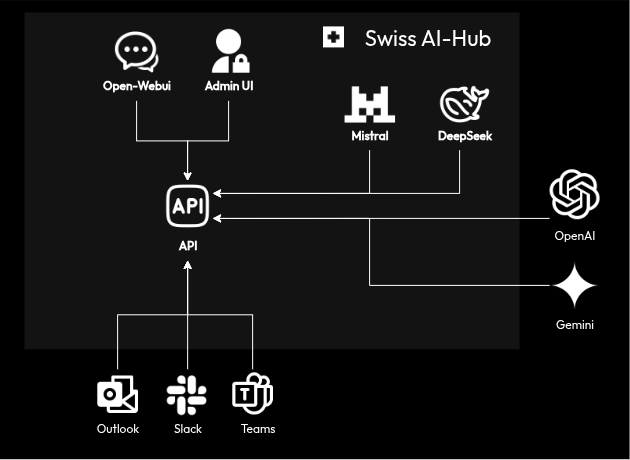
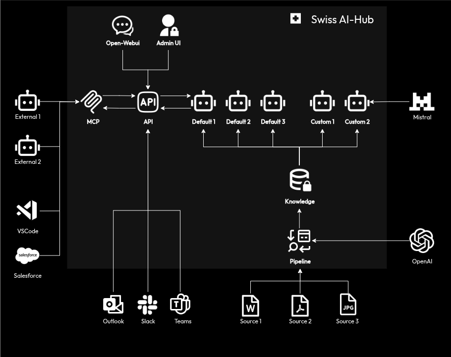

# Kernkomponenten

Der Swiss AI-Hub ist eine vollständige Plattform, die Infrastruktur für Agents, Pipelines und Prozessautomatisierung umfasst. Das hier beschriebene Stufenmodell ist ein empfohlener Einführungspfad, keine Reihe separater Softwareversionen.

Organisationen stoßen oft auf Schwierigkeiten, wenn sie komplexe Automatisierungsprojekte ohne vorherige Entwicklung grundlegender KI-Kompetenzen angehen. Das Stufenmodell bietet einen strukturierten Ansatz, der sich an erfolgreichen Einführungsmustern orientiert.

**Stufe 1** bietet jedem in der Organisation sicheren LLM-Zugang. Durch direkte Erfahrung lernen Nutzer die Fähigkeiten und Grenzen der Modelle kennen, verbessern ihre Prompt-Schreibfähigkeiten und identifizieren Aufgaben in ihrer täglichen Arbeit, bei denen KI von Vorteil sein könnte.

Nach einer gewissen Nutzungsdauer wird die Reibung beim Wechsel zwischen Arbeitsanwendungen und einer dedizierten KI-Schnittstelle zu einer häufigen Beschwerde. Dies führt zu **Stufe 1+**, die dieselben KI-Funktionen direkt in Tools wie Microsoft Teams, Slack und Outlook integriert. Dies reduziert Arbeitsunterbrechungen und fördert eine breitere Akzeptanz.

Nutzer könnten dann feststellen, dass den generischen Modellen ein spezifischer Unternehmenskontext fehlt. Zum Beispiel wäre ein Modell, das eine Stellenbewerbung bewerten soll, sich der internen Einstellungspolitik einer Organisation nicht bewusst. Dies signalisiert die Bereitschaft für **Stufe 2**.

**Stufe 2** führt spezialisierte Agents ein, die Zugang zu organisatorischem Wissen erhalten. Ein HR-Agent kann so konfiguriert werden, dass er Einstellung Kriterien aus Mitarbeiterhandbüchern versteht. Ein Finanz-Agent kann mit dem Kontenplan des Unternehmens trainiert werden, um Finanzsysteme abzufragen. Diese Agents nutzen die spezifischen Daten einer Organisation, um relevante, kontextbezogene Antworten zu liefern.

Mit zunehmender Agent-Nutzung treten repetitive Orchestrierungsmuster auf. Ein Mitarbeiter könnte ein Dokument manuell zur Analyse an einen Agenten, dann zur Überprüfung an einen Manager und schließlich für eine Hintergrundprüfung an einen anderen Agenten weiterleiten. Diese Art der mehrstufigen, manuellen Weiterleitung deutet auf die Notwendigkeit von **Stufe 3** hin.

**Stufe 3** automatisiert diese Muster als formale Prozesse. Das System kann so konfiguriert werden, dass es Stellenbewerbungen aufnimmt, sie zur Vorauswahl an einen HR-Agenten weiterleitet, nur bei Grenzfall eine menschliche Überprüfung anfordert, Hintergrundprüfungen über externe Systeme auslöst und die zuständigen Personalverantwortlichen benachrichtigt. Dies ermöglicht es menschlichen Mitarbeitern, sich auf Entscheidungsfindung und Ausnahmebehandlung zu konzentrieren.

Die Plattform umfasst all diese Funktionen von Anfang an. Das Stufenmodell beantwortet die Frage, wann welche Funktion basierend auf der organisatorischen Bereitschaft übernommen werden sollte. Die Progression gibt den Mitarbeitern Zeit, Arbeitsabläufe anzupassen, Fähigkeiten zu entwickeln und Vertrauen in das System aufzubauen.

## Stufe 1: Grundlage für sicheren KI-Zugang

Der primäre Zugangspunkt für Nutzer ist die Open-WebUI Weboberfläche, die Text-, Dokument- und Spracheingaben unterstützt.

Alle Anfragen werden über eine API-Schicht verarbeitet, die die Authentifizierung übernimmt, Berechtigungen für das angefragte Modell überprüft und die Interaktion zur Prüfung protokolliert. Die Anfrage wird dann, basierend auf der Systemkonfiguration, an das entsprechende LLM weitergeleitet, wie z.B. ein OpenAI- oder Google Gemini-Modell.

Antworten des LLM werden mittels Server-Sent Events an den Browser zurückgestreamt, sodass der Nutzer den Text sehen kann, während er generiert wird. Diese Architektur gewährleistet eine reaktionsschnelle Benutzeroberfläche, selbst bei Abfragen, die längere Verarbeitungszeiten erfordern.

Eine separate Admin-UI, die mit Nuxt erstellt wurde, bietet Administratoren Einblick in die Systemnutzung, Benutzerverwaltung und Modellkonfiguration. Sie ermöglicht es ihnen, die Modellnutzung zu überwachen, Kostenlimits festzulegen und Audit-Logs zu überprüfen.

Alle Daten, einschließlich Benutzeranfragen, LLM-Antworten, Konversationsverlauf und Systemprotokolle, werden in der internen Datenbank der Plattform gespeichert. Dies stellt sicher, dass die Daten innerhalb der kontrollierten Infrastruktur der Organisation verbleiben, es sei denn, der Zugriff auf externe Modelle ist explizit konfiguriert.

## Stufe 1+: Nutzer dort abholen, wo sie arbeiten

Die Einschränkung einer eigenständigen Weboberfläche ist die Arbeitsablaufunterbrechung durch Kontextwechsel. Stufe 1+ löst dies, indem die Funktionen der Plattform in die Anwendungen erweitert werden, die Mitarbeiter täglich nutzen. Ein Benutzer in Microsoft Teams kann einen Konversationsverlauf direkt in der Anwendung zusammenfassen, und die Antwort der KI erscheint im selben Kanal.

::: details Unterstützte Kanäle
Die Plattform nutzt das Azure Bot Framework für Integrationen. Unterstützte Kanäle umfassen:

- Alexa
- Email
- Facebook
- MS Teams
- Outlook
- Skype
- Slack
- Telegram
- WeChat
- Web
- ... und mehr
:::

Jede Integration passt sich den Interaktionsmustern des Host-Tools an. Zum Beispiel könnte eine KI-Antwort in Slack in einem Thread gepostet werden, während sie in Outlook beim Verfassen von E-Mail-Antworten helfen könnte. Die zentrale API-Schicht stellt sicher, dass alle Interaktionen, unabhängig von ihrem Ursprung, denselben Sicherheits-, Governance- und Protokollierungsrichtlinien unterliegen.

## Stufe 2: Von Daten zu kontextbezogener Intelligenz

Stufe 2 führt Funktionen zur Aufnahme und Strukturierung von Organisationsdaten ein, um KI-Agenten Kontext zu bieten. Der Prozess beginnt mit Informationsquellen wie SharePoint-Dokumentenbibliotheken.

Eine Pipeline orchestriert den Datenverarbeitungs-Workflow. Sie überwacht verbundene Quellen auf neue oder aktualisierte Dateien und löst eine Verarbeitungssequenz aus. Dokumente werden geparst, um nicht nur Text, sondern auch strukturelle Elemente wie Überschriften und Tabellen zu extrahieren. Der Inhalt wird dann basierend auf Themenwechseln oder Abschnittstrennungen in semantisch bedeutungsvolle Blöcke unterteilt. Jeder Block wird unter Verwendung eines Modells wie Mistral in ein Vektorenbettung umgewandelt.

::: tip
Die hier beschriebene Pipeline ist eine Standardkonfiguration. Das SDK ermöglicht die Erstellung kundenspezifischer Pipelines, um sich mit anderen Quellen (Datenbanken, APIs, FTP-Servern) zu verbinden, die Dokumentenverarbeitung anzupassen und Daten anzureichern.
:::

Diese Embeddings werden in einer Vektordatenbank gespeichert und indiziert, die als Wissensbasis der Plattform dient. Dies ermöglicht die semantische Suche, wodurch Agenten Informationen basierend auf Bedeutung und nicht auf exakten Schlüsselwortübereinstimmungen abrufen können. Das System bewahrt eine klare Herkunft jedes Embeddings bis zu seinem Quelldokument für Rückverfolgbarkeit und Überprüfung.

Mit einer eingerichteten Wissensbasis kann die Plattform mehrere Agenten unterstützen. Standard-Agenten könnten einen Dokumentenanalysten oder einen Dateninterpreter umfassen. Kundenspezifische Agenten können mit dem SDK erstellt werden, um organisationsspezifische Aufgaben zu bearbeiten, interne Terminologie zu verstehen oder domänenspezifisches Denken anzuwenden.

Die Plattform ist auch mittels Model Context Protocol (MCP) offen zur Außenwelt. Durch MCP können Agenten von anderen Systemen sicher auf die Plattform und deren Agenten zugreifen.

## Stufe 3: Orchestrierung von Geschäftsprozessen

Stufe 3 führt eine Prozessorchestrations-Engine ein, um mehrstufige Workflows zu automatisieren, die KI-Agenten, Menschen und externe Systeme umfassen.

Eine dedizierte Prozess-UI ermöglicht es Benutzern, diese Workflows zu visualisieren und mit ihnen zu interagieren. Sie zeigt aktive Prozesse als Flussdiagramme an, die den aktuellen Schritt, die verantwortliche Entität (Mensch, Agent oder externes System) und die nachfolgenden Schritte darstellen.

Wenn ein Prozess ausgelöst wird, bewertet die Orchestrierungs-Engine den ersten Schritt. Wenn der Schritt eine Dokumentenanalyse erfordert, wird die Aufgabe an einen KI-Agenten delegiert. Die Ausgabe des Agenten wird an den Orchestrator zurückgegeben, der dann mit dem nächsten Schritt fortfährt. Wenn ein Schritt menschliches Urteilsvermögen erfordert, wird eine Aufgabe im Arbeitsbereich des jeweiligen Benutzers in der Prozess-UI erstellt. Die Schnittstelle liefert die KI-Analyse, das Quelldokument und den Kontext für die Entscheidung. Sobald der Mensch die Aufgabe abgeschlossen hat, wird der Prozess fortgesetzt.

Externe Systeme können über Konnektoren integriert werden. Power Automate-Verbindungen können Flows auslösen, um SharePoint-Listen zu aktualisieren oder E-Mails zu versenden. Eine n8n-Integration ermöglicht die Kommunikation mit UiPath für Aufgaben der robotergestützten Prozessautomatisierung, die Legacy-Systeme betreffen.

::: tip
Der hier beschriebene Prozess ist ein Beispiel. Das SDK kann verwendet werden, um benutzerdefinierte Prozesse zu erstellen, die sich mit verschiedenen externen und internen Systemen verbinden.
:::

Die Orchestrierungs-Engine verwaltet den Zustand jedes Prozesses, handhabt Timeouts und Fehler. Wenn ein externes System nicht reagiert, kann der Prozess so konfiguriert werden, dass die Aufgabe zur manuellen Intervention an einen Menschen weitergeleitet wird. Die API-Schicht wird in dieser Stufe erweitert, um Konversationskontexte zu verwalten, die sich über mehrere Teilnehmer und lange Zeiträume erstrecken.
