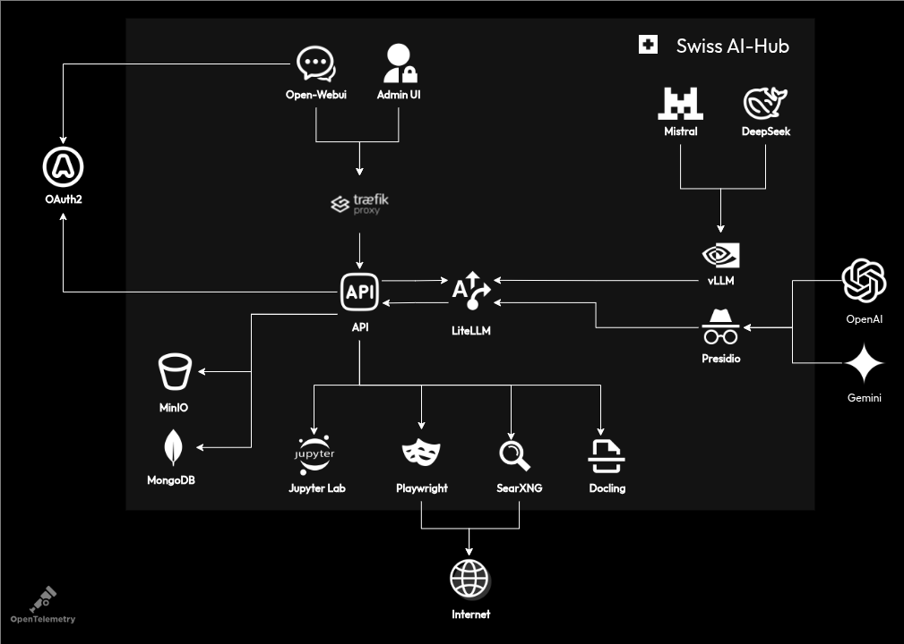
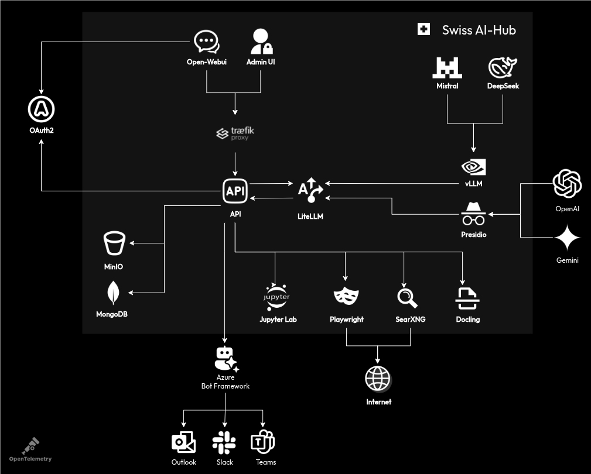
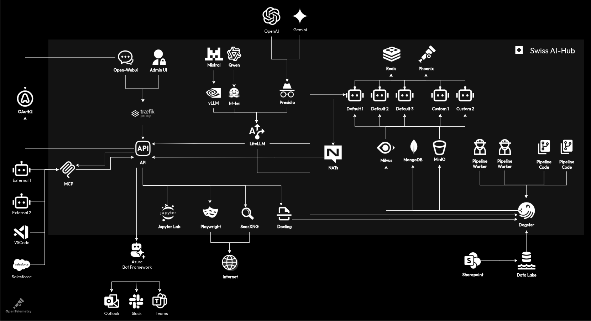
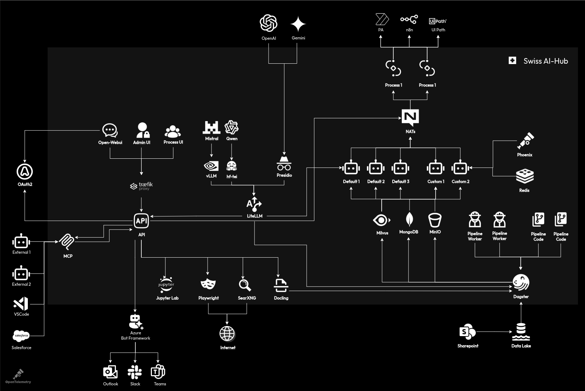

# The Infrastructure Layers

::: warning
This documentation targets readers who want to fully understand the infrastructure components included in the platform
and the role they play. This level of understanding is not required to run or deploy the platform, but proves helpful if
you want to extend, scale, or modify it. The following sections translate the business-level view into technical
implementation details.
:::

## Tier 1: Core Infrastructure Components

The foundation begins with **OAuth2** handling authentication. When users access Open-WebUI or the Admin UI, OAuth2
validates their credentials against your organization's identity provider. This component was chosen over simpler
authentication methods because it integrates with existing enterprise systems like Azure AD or Keycloak without
requiring password synchronization or custom user management.

::: info
The architectural diagrams simplify certain aspects for readability. Multiple auxiliary databases that some tools
require are omitted, and some connections between components are simplified to avoid visual clutter. The diagrams
capture the conceptual relationships between infrastructure components rather than every technical detail.
:::

Behind the authentication layer, **Traefik** serves as the reverse proxy and API gateway. Every HTTP request passes
through Traefik, which routes traffic based on path patterns, handles TLS termination, and provides load balancing when
you scale components horizontally. Traefik's dynamic configuration capabilities allow the platform to register new
services without restarts, crucial for adding custom agents or additional UI components.

The **API** layer, built on FastAPI, provides more than simple request routing. It maintains WebSocket connections for
real-time streaming, manages session state for conversations, enforces rate limits per user, and transforms requests
between different component protocols. FastAPI was selected for its async capabilities, automatic OpenAPI documentation
generation, and excellent performance under concurrent load.

**LiteLLM** acts as the universal LLM gateway. Rather than implementing separate integrations for OpenAI, Anthropic,
Google, and local models, LiteLLM provides a unified interface. It handles retry logic when models are overloaded,
tracks token usage for cost allocation, manages different rate limits across providers, and converts between different
model-specific formats. The gateway pattern allows switching models without code changes, crucial for avoiding vendor
lock-in.

For model-specific features, **vLLM** provides high-performance inference for locally hosted models like Mistral or
DeepSeek. It uses PagedAttention for efficient memory management, allowing larger models to run on available hardware.
**Presidio** adds PII detection and anonymization, scanning text for sensitive data patterns before sending to external
models or storing in databases.

Storage infrastructure uses **SeaweedFS** for S3-compatible object storage and **MongoDB** for document storage.
SeaweedFS stores uploaded files, generated reports, and model artifacts with versioning and lifecycle policies. The
SeaweedFS Filer uses **etcd** as its metadata backend, enabling high-availability deployments with multiple Filer
instances. The platform exposes two interfaces: the **S3 API** at `s3.${DOMAIN}` with AWS signature authentication for
programmatic access, and the **Filer web UI** at `datalake.${DOMAIN}` via OAuth2 proxy for developers to browse and
debug files (requires AIHubDeveloper role). MongoDB persists conversation history, user preferences, application data,
and event history. These choices provide cloud-native storage patterns that work identically whether deployed on-premise
or in cloud environments.

The platform includes integrated AI tools that enhance the chat experience. **Jupyter Lab** enables code interpretation
and execution when users ask the LLM to analyze data or run calculations. The LLM can write Python code that executes
securely in an isolated Jupyter environment, returning results directly in the conversation. **SearXNG** provides web
search capabilities when users need current information, aggregating results from multiple search engines while
preserving privacy. **Playwright** scrapes content from websites discovered through search, extracting full text when
search snippets aren't sufficient. **MinerU** parses documents users upload to the chat, extracting text and structure
from PDFs, Word documents, and presentations while preserving tables and formatting needed for accurate
question-answering.

Observability starts from day one with **OpenTelemetry** collecting metrics, traces, and logs from every component. The
data flows to appropriate backends: metrics to Prometheus, traces to Jaeger, logs to Loki. This standardized
observability stack provides unified dashboards, distributed tracing across services, and centralized log aggregation
without vendor lock-in.

## Tier 1+: Integration Infrastructure

The **Azure Bot Framework** becomes the bridge between the platform and external communication channels. When a message
arrives from Teams, Slack, or Outlook, the Bot Framework normalizes it into a standard activity format, handles
channel-specific authentication, manages conversation context, and routes it to the appropriate handler in the API.

The Bot Framework was chosen over building separate integrations because it provides a single abstraction over multiple
channels. Channel-specific features like Teams adaptive cards or Slack blocks are handled through the same interface.
The framework manages conversation references, enabling the platform to send proactive messages back to users hours or
days after the initial interaction.

Connection between the Bot Framework and the platform API happens through webhook endpoints. The API implements the Bot
Framework protocol, accepting activities and returning appropriate responses. This loose coupling means the platform can
support other bot frameworks or direct integrations without architectural changes.

## Tier 2: Knowledge and Agent Infrastructure

**NATS** transforms the platform from request-response to event-driven architecture. Agents subscribe to event streams,
the API publishes user messages, and components communicate asynchronously without direct dependencies. NATS JetStream
provides persistent message queues, ensuring no events are lost during agent restarts. The choice of NATS over
alternatives like RabbitMQ or Kafka comes from its simplicity, embedded clustering, and excellent performance for the
small-message patterns common in agent communication.

The agent infrastructure supports multiple concurrent agents (Default 1-3, Custom 1-2 in the diagram). Each agent runs
as an independent service, subscribing to relevant NATS topics and publishing responses. Agents can construct their
state by replaying the event history, access the vector stores, and report telemetry through OpenTelemetry. This
microservice pattern allows agents to be developed and scaled independently, and updated without affecting other agents
or the platform.

**Dagster** orchestrates the data pipeline infrastructure. It schedules document ingestion from sources like SharePoint,
monitors pipeline health, manages dependencies between processing steps, and provides a web UI for pipeline monitoring.
Dagster's asset-based approach treats each processed document as a managed asset with lineage, versioning, and quality
checks. The choice of Dagster over alternatives like Airflow comes from its superior local development experience and
native Python integration.

Pipeline workers implement the actual document processing. They connect to the source, download documents to SeaweedFS
for processing, parse content using MinerU, generate embeddings using configured models, and store results in the vector
database. Workers scale horizontally, with Dagster distributing work across available instances.

**Milvus** provides vector storage for semantic search. It indexes high-dimensional embeddings, performs approximate
nearest neighbor searches, supports filtered searches combining vector and metadata queries, and scales to billions of
vectors through sharding. Milvus was selected over alternatives like Pinecone or Weaviate for its open-source nature,
on-premise deployment options, and excellent performance characteristics.

**Redis** provides fast state storage that agents use to persist data independent of events. Agents store state in Redis
when they need data to survive across conversation turns or be accessible to other agent instances. Redis was chosen for
its extremely fast in-memory performance and independence from Python processes, allowing agents written in any language
to access the same state store.

**Phoenix** provides AI-specific observability beyond OpenTelemetry. It captures LLM interactions with full prompts and
responses, traces RAG retrievals showing which documents were used, analyzes embedding quality and drift, and provides
specialized dashboards for AI metrics. Phoenix integrates with the existing OpenTelemetry infrastructure, adding
AI-specific context to standard traces.

**MCP (Model Context Protocol)** opens the platform to external tools. VSCode extensions can connect to running agents
for debugging, external AI systems can interact with our agents, and automation tools can submit work items to
processes. MCP uses JSON-RPC over WebSockets, providing a language-agnostic integration point. This protocol was
developed specifically for the Swiss AI Hub to enable tool integration without exposing internal APIs.

Throughout all tiers, components communicate through well-defined interfaces. HTTP/REST for synchronous requests, NATS
for asynchronous events, and WebSockets/SSE for real-time streaming. This polyglot approach uses the right protocol for
each use case rather than forcing everything through a single pattern.

The infrastructure choices reflect operational requirements discovered through production deployments. Every component
can run in containers, scales horizontally with load balancing, provides health checks for orchestration platforms,
exposes metrics for monitoring, and supports configuration through environment variables. These operational
characteristics matter as much as functional capabilities when building a platform meant for enterprise deployment.

## Tier 3: Process Orchestration Infrastructure

The **Process UI** introduces a new user interface paradigm designed for workflow interaction rather than conversation.
Built with Vue.js and connected via WebSockets, it provides real-time workflow visualization, task queues for human
participants, form builders for structured input, and audit trails for compliance. The separation from the chat UI
reflects the different interaction patterns: chat is exploratory and conversational, while process interaction is
structured and task-oriented.

**Process orchestration** (Process 1 in the diagram) runs as a separate service managing workflow state. It interprets
workflow definitions written in python, maintains process instance state in MongoDB, coordinates work distribution
through NATS, handles timeouts and error conditions, and provides process analytics. The orchestrator was built custom
rather than using existing BPMN engines because AI agent integration required capabilities beyond standard business
process patterns.

External integrations expand the platform's reach. **Power Automate (PA)** integration happens through the Microsoft
Graph API, triggering flows and receiving callbacks. **n8n** provides a self-hosted alternative for workflow automation,
connecting to hundreds of services through its node library. **UiPath** integration enables RPA bots to participate in
processes, handling legacy system interactions that lack APIs. These integrations use webhook patterns where possible,
falling back to polling when webhooks aren't available.
