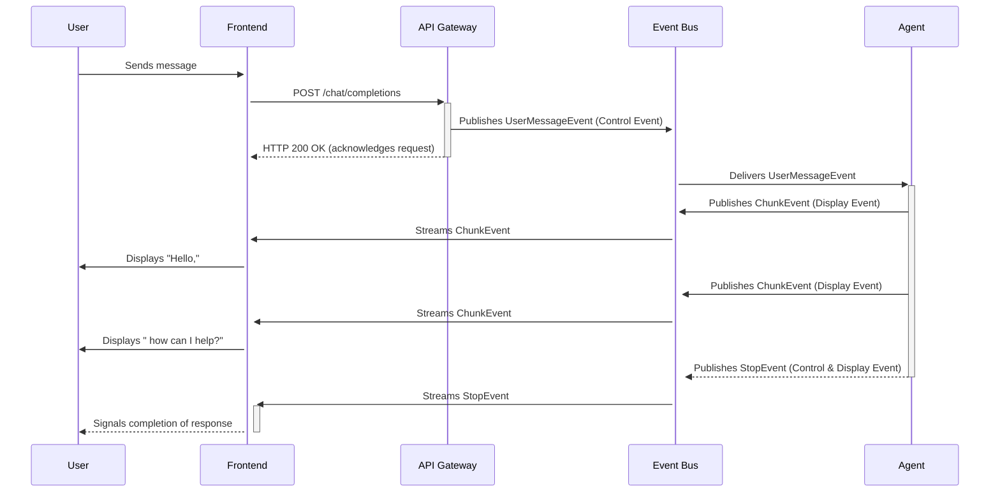
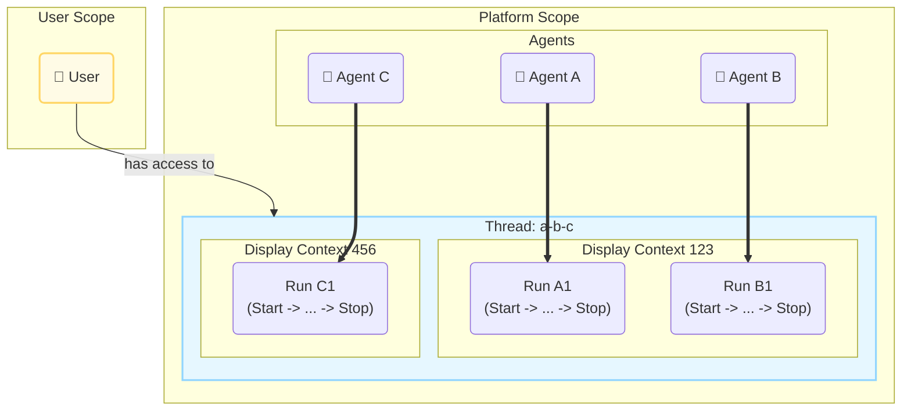
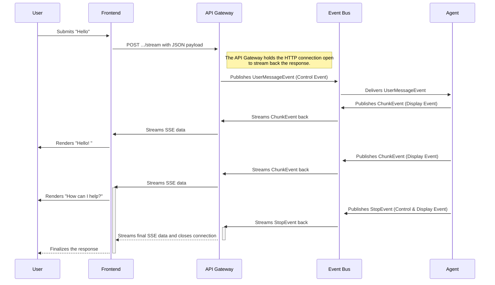
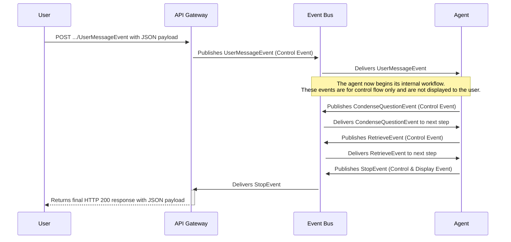
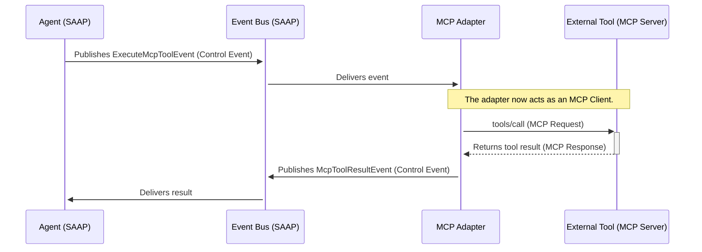
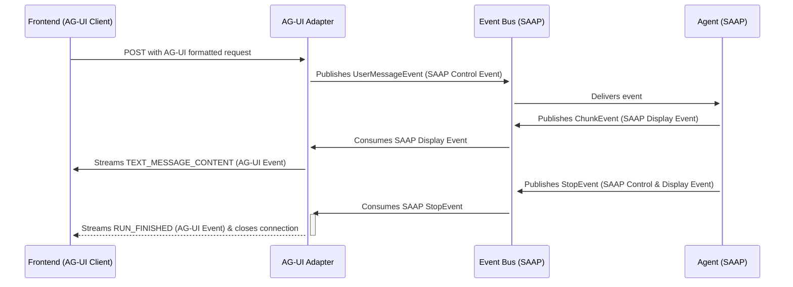

# Swiss AI Agent Protocol

The platform's infrastructure layers provide the core components, such as the message bus and databases. The Swiss AI
Agent Protocol defines the set of rules and contracts that makes them work together as a coherent system. It is an
internal, event-driven model that governs how agents operate, manage state, and communicate with the platform. Every
agent built with the SDK adheres to this protocol, and every component that interacts with an agent, from the API to the
user interface, relies on it.

The following describes the abstract rules of this protocol, not the specific Python implementation. These principles
form the foundation for building agents that are transparent, scalable, and resilient by design.

## Why a protocol? Engineering for autonomous AI

AI operations are often multi-step, asynchronous processes that can involve multiple models, long-running tasks, and
human interaction. A traditional architecture where internal components communicate through synchronous APIs can create
tight coupling. This makes the system difficult to scale, observe, and modify, as a change in one component can have
cascading effects on others.

The Swiss AI Agent Protocol addresses these challenges by defining a standardized, event-driven contract for
asynchronous communication. It provides a common language for all platform participants, ensuring that interactions are
predictable and decoupled.

### Beyond chatbots: A world of autonomous agents

Agents within the platform are not limited to conversational, request-response tasks. They are designed as persistent,
autonomous entities that can operate independently of any direct user interaction. An agent might monitor a data source,
manage a business process that takes days to complete, or perform scheduled analysis.

Because an agent's operational lifetime is not tied to a single user query, it can run for minutes, hours, or even
months. This persistent and autonomous nature introduces a level of complexity that requires a formal communication
protocol to manage state, ensure security, and provide clear observability over long periods.

### The need for a granular, interoperable contract

The protocol is a granular contract where every meaningful action, thought, or state change is defined as a distinct
event. This approach provides a high-resolution view of an agent's operations, which is necessary for detailed tracing
and debugging.

This granularity also enables interoperability. The platform can translate its rich internal event stream to support
external protocols like the OpenAI API. An adapter can listen for specific events, such as `ChunkEvent` or `StopEvent`,
and reformat them as OpenAI-compatible Server-Sent Events. This process discards any protocol-specific information that
the external system does not understand, allowing clients to interact with the platform using familiar standards.

## The protocol participants and their roles

The protocol defines the communication rules for a set of participants, not just the agents. Each participant has a
distinct role and interacts with the event stream in a specific way.

### The agent

The agent is the autonomous worker of the ecosystem. Its role is to execute business logic and complex reasoning. It
consumes `Control Events` to start or continue its work. It produces new `Control Events` to advance its internal
workflow or delegate tasks, and a rich stream of `Display Events` to report its status, reasoning, and results.

### The API gateway

The API Gateway acts as the secure entry point for all external clients. Its role is to translate between external
communication formats, such as HTTP, and the internal protocol. The API Gateway is the exclusive producer of initial
`Control Events` that originate from outside the system. It validates user identity and permissions before publishing an
event to the message bus.

### The frontend

The user interface provides a real-time view into an agent's operations. It is primarily a consumer of `Display Events`.
The frontend uses this stream of events to render the agent's activity, such as showing streaming text or internal
reasoning steps. It does not produce events directly but initiates actions by sending requests to the API Gateway.

### The process orchestrator

The process orchestrator manages high-level business processes that may involve multiple agents, human tasks, and
external systems. It functions as a specialized agent. Its protocol interaction consists of consuming `Control Events`,
often the `StopEvent` from a worker agent, and then producing a new `Control Event` to trigger the next participant in
the process.

The following diagram illustrates a typical interaction flow between these participants.



## Scoping and security: the hierarchical context

To manage long-running interactions and ensure security, every event within the protocol is scoped into a three-level
hierarchy. This structure is encoded directly into the topic of every event published on the message bus, allowing for
granular control over visibility and access.

### The three scopes of an event

- **`Run` Context**

  - **Definition:** The most granular scope. A "Run" is a single, traceable execution of a workflow, defined by the
    sequence of events between a `StartEvent` and a corresponding `StopEvent` or `ExceptionEvent`.
  - **Purpose:** It provides a unique identifier for a single, complete agent operation. This scope is essential for
    tracing and debugging, as it isolates the events of one specific task.

- **`Display` Context**

  - **Definition:** A scope designed to group multiple `Run`s together for presentation in a user interface. It can span
    multiple agents.
  - **Purpose:** It manages what an end-user or observer sees. When an agent delegates work to another agent, it can
    choose to pass on its `Display` context. If it does, the frontend, which subscribes to this context, will show the
    events from both agents as part of a single, seamless interaction. If the primary agent creates a new `Display`
    context for the delegated task, that work becomes "hidden" from that specific UI view.

- **`Thread` Context**

  - **Definition:** The highest-level scope, which groups multiple `Display` contexts and `Run`s that belong to a
    single, overarching goal or conversation.
  - **Purpose:** It maintains the long-term history and state of a process. A chat conversation is a `Thread`. An
    autonomous agent processing invoices for an entire month might operate within a single `Thread` for that month's
    work.

The following diagram illustrates this hierarchical structure.



::: details Explanation
- The entire interaction is contained within a single `Thread`, to which the `User` has access.
- Within this thread, there are two separate `Display` contexts. A user observing `Display Context 123` would see a
  seamless flow of activity from both `Run A1` (executed by Agent A) and `Run B1` (executed by Agent B). This is typical
  when one agent delegates a task to another.
- The user would not see any events from `Run C1`, as it belongs to a different `Display` context, effectively isolating
  that operation from this particular view.
:::

### Security through scoping

This hierarchical scoping is the foundation of the platform's security model. Access is granted at the **`Thread`**
level. A user can only observe events from threads of which they are a member.

Agents can also operate in threads without any human members. In this case, only administrators with sufficient
permissions for the participating agents can observe the events within that thread. This ensures that autonomous,
backend processes remain secure and isolated.

## The language: a library of standardized events

### The event: an immutable record of fact

The fundamental unit of communication in the protocol is the **Event**. An event is a structured, typed, and immutable
data record representing a fact that has occurred. Each communication consists of two distinct parts:

1. **The Topic:** The address on the message bus where the event is published. The topic provides the event's full
   context, including its scope (Thread, Display, Run) and origin.
2. **The Payload:** A self-contained JSON object containing the specific data for that event.

The system combines this contextual topic and data payload to form a complete, understandable communication.

#### The Topic Structure

The topic is a hierarchical string that provides routing and scoping information. Every event is published to a topic
that follows this structure.

::: details Example
**Topic:**

`agent.RAGAgent.wiki_agent.t948a201-....d135bfc9-....r4fg68bb-....display_event.UserMessageEvent.r4fg68bb-...`

| Segment       | Example Value   | Description                                                |
| :------------ | :-------------- | :--------------------------------------------------------- |
| `agent_class` | `RAGAgent`      | The class of the agent publishing or being targeted.       |
| `agent_id`    | `wiki_agent`    | The unique identifier of the specific agent instance.      |
| `thread_id`   | `t948a201-...`  | The identifier for the high-level thread context.          |
| `display_id`  | `d135bfc9-...`  | The identifier for the UI-facing display context.          |
| `run_id`      | `r4fg68bb-...`  | The identifier for the specific run context.               |
| `event_type`  | `display_event` | The primary category (`control_event` or `display_event`). |
| `event_name`  | `ChunkEvent`    | The specific name of the event.                            |
| `event_id`    | `r4fg68bb-...`  | A unique identifier for this single event instance.        |
:::

##### The Event Payload

The payload is the data associated with the event. Its structure is defined by the event type. All events, however,
share a common set of core attributes.

::: details JSON
**Example `UserMessageEvent` Payload:**

```json
{
  "event_id": "e423",
  "created_at": 1755015355940833270,
  "_event_name": "UserMessageEvent",
  "_parent_event_names": [
    "UserMessageEvent",
    "StartEvent",
    "ControlAndDisplayEvent",
    "ControlEvent",
    "DisplayEvent"
  ],
  "display_name": { "en": "User Request", "de": "Benutzeranfrage", "...": "..." },
  "display_description": { "en": "The agent has received a message...", "...": "..." },
  "locale": "de",
  "user": {
    "id": "cc4af21b-981a-4a76-826d-e722715082e0",
    "name": "Joel Barmettler",
    "...": "..."
  },
  "messages": [
    { "role": "system", "...": "..." },
    { "role": "user", "...": "..." }
  ]
}
```
:::

| Core Payload Attribute | Description                                                                                                                          |
| :--------------------- | :----------------------------------------------------------------------------------------------------------------------------------- |
| `event_id`             | A unique identifier for the event, matching the one in the topic.                                                                    |
| `created_at`           | A nanosecond precision timestamp marking when the event was created.                                                                 |
| `_event_name`          | The specific class name of the event. This is used by subscribers to deserialize the payload into the correct data object.           |
| `_parent_event_names`  | A list of the event's parent types in its inheritance hierarchy, which allows for filtering and routing based on broader categories. |
| `display_name`         | A human-readable name for the event, with support for multiple locales.                                                              |
| `display_description`  | A human-readable description of what the event represents, with support for multiple locales.                                        |

The remaining fields in the payload are specific to the event's type. For this `UserMessageEvent`, the payload includes
`locale`, `user` identity, and the `messages` history. Other event types will have different data fields relevant to
their purpose.

### The core categories: Control vs. Display

To ensure that agent workflows are predictable and that observation does not interfere with execution, the protocol
strictly categorizes every event. Each event's payload contains a `_parent_event_names` list, which declares whether it
belongs to the `ControlEvent` or `DisplayEvent` category, or both.

#### Control Events (instructions)

Control Events drive the workflow and cause state changes. The protocol dictates that **only a `Control Event` can
trigger the execution of an agent's step.** They represent commands, completed tasks, or responses that require the
agent to proceed to the next logical operation.

- **Example:** A `UserMessageEvent` is a `Control Event` because it instructs an agent to start a new run. A
  `HumanInTheLoopResponseEvent` is a `Control Event` because it provides the necessary input for a paused workflow to
  continue.

#### Display Events (commentary)

Display Events are purely informational and are intended for observation by users or monitoring systems. The protocol
mandates that **a `Display Event` must never influence the logical flow of an agent's workflow.** Their purpose is to
provide a real-time narrative of the agent's internal state, reasoning process, or partial results. This separation
ensures that a failure in a UI or logging component cannot break the agent's core logic.

- **Example:** A `ThoughtEvent` provides a window into the agent's reasoning. A `ChunkEvent` streams a piece of a text
  response to the user interface.

Some events can serve both functions. For example, a `StopEvent` is a `Control Event` because it terminates the workflow
run, but it is also a `Display Event` because the user interface needs to be informed that the process is complete. Such
events adhere to the rules of both categories.

### The core event library

The protocol defines a standard library of event types for common operations in AI and agentic systems. While developers
can create custom events to handle domain-specific logic, this core library provides the essential building blocks for
managing workflow lifecycles, interacting with users, and ensuring observability.

The following tables serve as a reference for the most common events, categorized by their function.

#### Lifecycle events

These events manage the state of a single workflow `Run`.

| Event                | Category          | Purpose                                                                             |
| :------------------- | :---------------- | :---------------------------------------------------------------------------------- |
| **`StartEvent`**     | Control & Display | Signals the beginning of a new workflow run and carries its initial context.        |
| **`StopEvent`**      | Control & Display | Signals the successful completion of a workflow run. No further steps are executed. |
| **`ExceptionEvent`** | Control & Display | Signals that an unrecoverable error occurred during a run, causing it to terminate. |

#### User interaction events

These events handle direct input from human users.

| Event                  | Category          | Purpose                                                                                                                      |
| :--------------------- | :---------------- | :--------------------------------------------------------------------------------------------------------------------------- |
| **`UserMessageEvent`** | Control & Display | A specialized `StartEvent` that is triggered by a user sending a message. It contains the message history and user identity. |

#### Streaming and reasoning events

These `Display Events` provide real-time updates to user interfaces about an agent's internal processing.

| Event              | Category | Purpose                                                                                                                     |
| :----------------- | :------- | :-------------------------------------------------------------------------------------------------------------------------- |
| **`ChunkEvent`**   | Display  | Contains a small piece of a larger text response, enabling token-by-token streaming to the UI.                              |
| **`ThoughtEvent`** | Display  | Provides a textual description of the agent's internal reasoning or current action, offering transparency into its process. |

##### **Observability and tracing events**

These events provide detailed telemetry for monitoring, debugging, and cost management. They are typically
`Display Events` but can sometimes also be `Control Events`.

| Event                | Category          | Purpose                                                                                                             |
| :------------------- | :---------------- | :------------------------------------------------------------------------------------------------------------------ |
| **`LLMEvent`**       | Control & Display | Records the details of a call to a Large Language Model, including the prompt, response, and invocation parameters. |
| **`RetrieverEvent`** | Control & Display | Records the results of a retrieval operation from a knowledge base, including the documents that were fetched.      |
| **`LLMCostEvent`**   | Display           | Records the calculated cost of an LLM interaction, including token counts and associated expenses.                  |

#### Asynchronous interaction pattern events

These events manage complex, multi-step interactions that require pausing and resuming a workflow.

| Event                             | Category          | Purpose                                                                                           |
| :-------------------------------- | :---------------- | :------------------------------------------------------------------------------------------------ |
| **`HumanInTheLoopRequestEvent`**  | Control & Display | Pauses the workflow and sends a request to a human user for input or approval.                    |
| **`HumanInTheLoopResponseEvent`** | Control & Display | Carries the response from a human user, allowing the paused workflow to resume.                   |
| **`AgentInTheLoopRequestEvent`**  | Control & Display | Pauses the workflow and delegates a task to another agent.                                        |
| **`AgentInTheLoopResponseEvent`** | Control & Display | Carries the final `StopEvent` from the delegated agent, allowing the original workflow to resume. |

## Protocol in action: sequence diagrams

This section provides step-by-step walkthroughs of common interactions to illustrate how the protocol's participants and
events work together in practice. The following sequence diagrams visualize the flow of events between participants
during these interactions.

::: warning
`ThreadId`, `DisplayId`, `RunId` and `EventId` ObjectIds. However, for the purposes of this documentation, they are
represented as strings that start with prefix `t` for Thread, `d` for Display, `r` for Run, and `e` for Event.
:::

### Example: a simple user query

This scenario traces the lifecycle of a single user message, from the initial HTTP request to the final streamed
response. It demonstrates how a synchronous request is handled by the platform's asynchronous, event-driven core.



#### Step 1: The user sends a message

The user types "Hello" into the chat interface. The Frontend packages this into an HTTP request to a dynamic endpoint on
the API Gateway. The `/stream` suffix indicates that the client expects a streaming response.

::: details Request / Response Details
**HTTP Request:** `POST /agents/MyChatAgent/dev_agent/UserMessageEvent/stream`

**Request Body:**

```json
{
  "messages": [
    { "role": "user", "content": "Hello" }
  ]
}
```
:::

#### Step 2: The API Gateway initiates the workflow

The API Gateway authenticates the user, creates a new `Run` and `Display` context, and translates the HTTP request into
a `UserMessageEvent`. It then publishes this `Control Event` to the event bus on a precisely structured topic.

::: details NATs topic & Event Payload
**NATS Topic:** `agent.MyChatAgent.dev_agent.t948.d135.r4fg.control_event.UserMessageEvent.e423`

**Event Payload:**

```json
{
  "event_id": "e423",
  "created_at": 1755015355940833270,
  "_event_name": "UserMessageEvent",
  "_parent_event_names": ["UserMessageEvent", "StartEvent", "ControlAndDisplayEvent", "ControlEvent", "DisplayEvent"],
  "locale": "en",
  "user": { "id": "cc4af21b-981a-4a76-826d-e722715082e0", "name": "Test User" },
  "messages": [{ "role": "user", "content": "Hello" }]
}
```
:::

An `Agent` instance subscribed to this topic consumes the event, which triggers the start of its workflow.

#### Step 3: The agent streams back the response

As the agent processes the request, it generates results and publishes `Display Events` as they become available. The
API Gateway receives these events from the bus and streams only their payload back to the Frontend as Server-Sent Events
(SSE).

::: details NATs topic & Event Payload (First Chunk)
**NATS Topic:**

`agent.MyChatAgent.dev_agent.t948.d135.r4fg.display_event.ChunkEvent.e453`

**SSE Stream to Frontend:**

```
data: {"event_id":"e453","created_at":1755015356940833271,"_event_name":"ChunkEvent","_parent_event_names":["ChunkEvent","DisplayEvent"],"display_name":{"en":"Chunk"},"display_description":{"en":"A chunk of a larger response."},"content":"Hello! "}\n\n
```
:::

::: details NATs topic & Event Payload (Second Chunk)
**NATS Topic:**

`agent.MyChatAgent.dev_agent.t948.d135.r4fg.display_event.ChunkEvent.e545`

**SSE Stream to Frontend:**

```
data: {"event_id":"e545","created_at":1755015357940833272,"_event_name":"ChunkEvent","_parent_event_names":["ChunkEvent","DisplayEvent"],"display_name":{"en":"Chunk"},"display_description":{"en":"A chunk of a larger response."},"content":"How can I help?"}\n\n
```
:::

#### Step 4: The agent completes the run

Once the agent has finished generating its response, it publishes a final `StopEvent`.

::: details NATs topic & Event Payload
**NATS Topic:**

`agent.MyChatAgent.dev_agent.t948.d135.r4fg.display_event.StopEvent.e598`

**SSE Stream to Frontend:**

```
data: {"event_id":"e598","created_at":1755015358940833273,"_event_name":"StopEvent","_parent_event_names":["StopEvent","ControlAndDisplayEvent","ControlEvent","DisplayEvent"],"display_name":{"en":"Stop"},"display_description":{"en":"Signals the end of a run."}}\n\n
```
:::

Upon streaming this final event, the API Gateway closes the HTTP connection. The Frontend finalizes the display, and the
interaction is complete.

### Example: an agent with an internal workflow

This scenario demonstrates how an agent can execute a multi-step internal process without exposing its intermediate
steps to the end-user. The user sends a single request and receives a single, final response. This is achieved by using
`Control Events` for internal state transitions and a final `Display Event` for the result.



#### Step 1: The user sends a query

The user asks a question that requires the agent to retrieve information. The client makes a standard, non-streaming
HTTP request.

::: details Request / Response Details
**HTTP Request:**

```
POST /agents/RAGAgent/prod_rag/UserMessageEvent
```

**Request Body:**

```json
{
  "messages": [
    { "role": "user", "content": "What is the Swiss AI Hub?" }
  ]
}
```
:::

#### Step 2: The API Gateway initiates the workflow

The Gateway creates the necessary contexts and publishes the `UserMessageEvent`. The API Gateway holds the HTTP
connection open, waiting for a final event to form the response.

::: details NATs topic & Event Payload
**NATS Topic:**

`agent.RAGAgent.prod_rag.t948.d135.r4fg.control_event.UserMessageEvent.e423`

**Event Payload:**

```json
{
  "event_id": "e423",
  "created_at": 1755015355940833270,
  "_event_name": "UserMessageEvent",
  "_parent_event_names": ["UserMessageEvent", "StartEvent", "ControlAndDisplayEvent", "ControlEvent", "DisplayEvent"],
  "messages": [{ "role": "user", "content": "What is the Swiss AI Hub?" }]
}
```
:::

#### Step 3: The agent executes its internal workflow

The agent consumes the `UserMessageEvent` and begins a sequence of internal steps. Each step communicates with the next
by publishing a `Control Event`.

::: details NATs topic & Event Payload (First internal step)
**Condense Question:** **NATS Topic:**

`agent.RAGAgent.prod_rag.t948.d135.r4fg.control_event.CondenseQuestionEvent.e453`

**Event Payload:**

```json
{
  "event_id": "e453",
  "created_at": 1755015356940833271,
  "_event_name": "CondenseQuestionEvent",
  "_parent_event_names": ["CondenseQuestionEvent", "ControlEvent"],
  "condensed_question": "Definition and purpose of the Swiss AI Hub"
}
```
:::

::: details NATs topic & Event Payload (Second internal step)
**Retrieve Documents:** **NATS Topic:**

`agent.RAGAgent.prod_rag.t948.d135.r4fg.control_event.RetrieveEvent.e545`

**Event Payload:**

```json
{
  "event_id": "e545",
  "created_at": 1755015357940833272,
  "_event_name": "RetrieveEvent",
  "_parent_event_names": ["RetrieveEvent", "ControlEvent"],
  "nodes": [ { "id": "doc-1", "content": "The Swiss AI Hub is an open..." } ]
}
```
:::

Because these are **only `Control Events`** and not `Display Events`, they are not streamed to the API Gateway or any
observing client. They exist only on the internal event bus to orchestrate the agent's logic.

#### Step 4: The agent returns the final result

After the final internal step, the agent generates a complete answer and publishes it within a `StopEvent`. This event
is both a `Control Event` (terminating the run) and a `Display Event`.

::: details NATs topic & Event Payload
**NATS Topic:**

`agent.RAGAgent.prod_rag.t948.d135.r4fg.display_event.StopEvent.e598`

**Event Payload:**

```json
{
  "event_id": "e598",
  "created_at": 1755015358940833273,
  "_event_name": "StopEvent",
  "_parent_event_names": ["StopEvent", "ControlAndDisplayEvent", "ControlEvent", "DisplayEvent"],
  "content": "The Swiss AI Hub is an open AI platform that you own and control."
}
```
:::

The API Gateway receives this single `Display Event`, uses its payload to construct the final HTTP response, and sends
it back to the client, closing the connection.

::: details HTTP Response Body
**HTTP Response Body:**

```json
{
  "event_id": "e598",
  "created_at": 1755015358940833273,
  "_event_name": "StopEvent",
  "_parent_event_names": ["StopEvent", "ControlAndDisplayEvent", "ControlEvent", "DisplayEvent"],
  "content": "The Swiss AI Hub is an open AI platform that you own and control."
}
```
:::

## Agent2Agent Protocol

To better understand the design choices behind the Swiss AI Agent Protocol, it is useful to compare it with other
standards in the agentic ecosystem. The Agent2Agent (A2A) Protocol, an open standard for communication between
independent AI agents, serves as an excellent point of reference. While both protocols are event-driven and designed for
asynchronous operations, they solve different problems and operate at different levels.

### Core philosophy and scope

The most fundamental difference lies in their intended scope.

- **The A2A Protocol** is designed for **external interoperability**. Its primary goal is to enable agents built by
  different vendors, on different platforms, to communicate with each other over the public internet or within a
  corporate network. It treats each agent as an opaque, independent service.

- **The Swiss AI Agent Protocol** is designed for **internal cohesion**. It is the private, internal language that
  orchestrates all components *within* a single, cohesive Swiss AI Hub instance. Its primary goals are extreme
  decoupling of internal components, deep observability, and the management of long-running, autonomous processes within
  the platform's secure boundary.

### Architectural model

The two protocols are based on different architectural patterns.

- **A2A** uses a **client-server model** over standard web transports (HTTP with JSON-RPC, gRPC, or REST). An A2A Client
  makes a direct request to an A2A Server, which then manages a specific `Task`. This is a point-to-point interaction
  model.

- **The Swiss AI Agent Protocol** uses a **publish-subscribe model** over a central message bus (NATS). Participants
  publish events to the bus without knowledge of the subscribers. Any number of other participants - be it other agents,
  the API Gateway, or logging services - can subscribe to these events. This is a broadcast-based, many-to-many
  interaction model.

### State management

Their approaches to managing the state of an operation differ significantly.

- **In A2A**, the server-side agent is **stateful**. It creates and manages a `Task` object which progresses through a
  defined lifecycle (`submitted`, `working`, `completed`, etc.). The state of the interaction is held by the remote
  agent.

- **In the Swiss AI Agent Protocol**, the agent's code is **stateless**. The state of a `Run` is externalized and
  managed by the platform's infrastructure. The event history is stored immutably in the message bus's stream
  (JetStream), and ephemeral context is held in a distributed store (Redis). This allows any available agent instance to
  process any event in a workflow, enabling high scalability and resilience.

### Data model and granularity

The structure of the communication itself reflects their different goals.

- **A2A** defines a set of RPC methods (`message/send`, `tasks/get`) and data objects (`Task`, `Message`, `Part`,
  `Artifact`). This structure is well-suited for a remote procedure call system where a client manages a task on a
  server.

- **The Swiss AI Agent Protocol** is more granular, centered on the strict distinction between `Control Events` and
  `Display Events`. This high-resolution event stream is designed for maximum internal observability. Every internal
  step, thought, and state transition can be an individual event, providing a complete audit trail of the agent's
  execution.

### Discovery mechanism

How participants learn about each other is another key difference.

- **A2A** relies on a static **`AgentCard`**. This is a JSON document, often hosted at a well-known URI, that acts as a
  digital business card, describing the agent's capabilities, endpoint, and authentication requirements.

- **The Swiss AI Agent Protocol** uses **dynamic, real-time discovery**. The API Gateway periodically broadcasts a
  discovery request on the internal message bus. All running agents respond, allowing the Gateway to dynamically
  generate and register its own secure, type-safe REST endpoints on the fly.

### Summary of differences

| Aspect           | Swiss AI Agent Protocol                         | A2A Protocol                                         |
| :--------------- | :---------------------------------------------- | :--------------------------------------------------- |
| **Primary Goal** | Internal cohesion, observability, and control   | External interoperability between independent agents |
| **Architecture** | Publish-Subscribe (via Message Bus)             | Client-Server (via HTTP/gRPC/REST)                   |
| **State**        | Agent code is stateless; state is externalized  | Remote agent is stateful; manages a `Task` object    |
| **Data Unit**    | `Event` (Control vs. Display)                   | `Task`, `Message`, `Part`, `Artifact`                |
| **Granularity**  | Very high; every internal step can be an event  | Higher-level; focused on task state and results      |
| **Discovery**    | Dynamic; API endpoints are generated at runtime | Static; based on a published `AgentCard`             |

### Interoperability and coexistence

The Swiss AI Agent Protocol and the A2A Protocol are not mutually exclusive; they are complementary and can work
together. The Swiss AI Agent Protocol governs the internal workings of the platform, while A2A can be used for
communication with the outside world.

A Swiss AI Hub instance could expose an **A2A Adapter Agent**. This specialized agent would act as a bridge:

1. **Externally,** it would present a standard A2A endpoint and an `AgentCard`, appearing as a compliant A2A agent to
   the outside world.
2. **Internally,** it would be a participant in the Swiss AI Agent Protocol.

When this adapter agent receives an A2A `message/send` request, it would translate that request into an internal
`StartEvent` and publish it to the bus to trigger another, internal agent. It would then subscribe to the resulting
stream of internal `Display Events` and `StopEvent`s, translating them back into A2A `Task` updates and `Artifacts` to
send back to the external A2A client.

This approach allows the Swiss AI Hub to benefit from its highly observable and scalable internal architecture while
still participating openly in a broader, interoperable ecosystem of AI agents.

## Model Context Protocol (MCP)

The Model Context Protocol (MCP) is an open-source standard for connecting AI applications to external systems, such as
data sources, tools, and workflows. While both the Swiss AI Agent Protocol and MCP facilitate communication in AI
systems, they are designed to solve different problems and operate at different architectural layers. They are
complementary, not competing.

### Core philosophy and scope

The primary difference is their intended scope and purpose.

- **MCP** is designed for **connecting an agent to its tools**. It standardizes how an AI application (an MCP Host)
  discovers and interacts with external capabilities (exposed by MCP Servers). Its focus is on providing context and
  enabling action-taking in the outside world.

- **The Swiss AI Agent Protocol** is designed for **orchestrating the internal components of the platform**. It is the
  private language that governs how autonomous agents, APIs, and other services within a Swiss AI Hub instance
  collaborate. Its focus is on the lifecycle, state management, and observability of internal processes.

### Architectural model

The protocols are based on different interaction patterns.

- **MCP** uses a **client-server model**. An MCP Host (the AI application) creates a dedicated MCP Client for each MCP
  Server it needs to communicate with. The interaction is a direct, point-to-point connection where the client requests
  capabilities from the server.

- **The Swiss AI Agent Protocol** uses a **publish-subscribe model** over a central message bus. Participants publish
  events without knowledge of who is listening. This enables a decoupled, many-to-many communication pattern where
  multiple components can react to a single event.

### Data model and primitives

Their data models are tailored to their respective functions.

- **MCP** defines a set of primitives that a server can expose: `Tools` (executable functions), `Resources` (read-only
  data), and `Prompts` (reusable templates). The protocol is centered on the AI application discovering and then
  utilizing these capabilities.

- **The Swiss AI Agent Protocol**'s core primitive is the `Event`, strictly categorized into `Control Events` (which
  drive logic) and `Display Events` (which provide observability). The protocol is centered on the flow of these events
  to manage state transitions and report on activity within a distributed system.

### Summary of differences

| Aspect             | Swiss AI Agent Protocol                                       | Model Context Protocol (MCP)                               |
| :----------------- | :------------------------------------------------------------ | :--------------------------------------------------------- |
| **Primary Goal**   | Internal orchestration and observability                      | Connecting an agent to external tools and data             |
| **Architecture**   | Publish-Subscribe (via Message Bus)                           | Client-Server (direct connections)                         |
| **Interaction**    | Many-to-many, broadcast-based                                 | One-to-one, request-response                               |
| **Core Primitive** | The `Event` (Control vs. Display)                             | `Tool`, `Resource`, `Prompt`                               |
| **Purpose**        | To manage the internal state and flow of autonomous processes | To provide an AI application with capabilities and context |

### Interoperability and coexistence

The two protocols can coexist and complement each other effectively. A Swiss AI Hub agent can act as an MCP Host to
interact with external tools.

This is achieved by creating an **MCP Adapter** within the agent's workflow. The adapter is a component that translates
between the two protocols.



In this flow:

1. An internal agent, operating on the Swiss AI Agent Protocol, decides it needs to use an external tool. It publishes a
   `Control Event` (e.g., `ExecuteMcpToolEvent`) containing the tool name and arguments.
2. The `McpAdapter`, subscribed to such events, consumes it.
3. The adapter then acts as an MCP Client, sending a standard `tools/call` JSON-RPC request to the external MCP Server.
4. When the MCP Server responds, the adapter packages the result into a new internal `Control Event` (e.g.,
   `McpToolResultEvent`) and publishes it back to the event bus.
5. The original agent, or another subscribed agent, consumes the result and continues its workflow.

This pattern allows agents within the Swiss AI Hub to leverage the rich ecosystem of external tools and data sources
available via MCP, while still benefiting from the robust internal orchestration, security, and observability provided
by the Swiss AI Agent Protocol.

## Agent User Interaction Protocol (AG-UI)

The Agent User Interaction Protocol (AG-UI) is an open standard designed specifically to standardize communication
between front-end applications and AI agents. It focuses on the agent-to-user interactivity layer. Like the other
protocols discussed, AG-UI is complementary to the Swiss AI Agent Protocol, addressing a different part of the overall
system architecture.

### Core philosophy and scope

The protocols are designed with different scopes and objectives in mind.

- **AG-UI** is a **presentation-layer protocol**. Its exclusive focus is to create a standardized, real-time
  communication channel between an AI agent and a client application (the user interface). It defines a vocabulary for
  streaming UI updates, managing shared state for the UI, and handling human-in-the-loop interactions.

- **The Swiss AI Agent Protocol** is a **full-stack, internal orchestration protocol**. It governs the communication
  between *all* internal components of the platform, not just the link to the UI. Its scope includes agent-to-agent
  delegation, process orchestration, and the management of long-running, autonomous tasks that may have no UI at all.

### Architectural model

Their architectural models reflect their different scopes.

- **AG-UI** defines a **client-server model for the UI channel**. An AG-UI Client (in the frontend) connects to an AG-UI
  compatible agent or server. The protocol standardizes the events that flow over this specific connection.

- **The Swiss AI Agent Protocol** uses a **platform-wide publish-subscribe model**. Events are broadcast on a central
  message bus and can be consumed by any authorized participant. The API Gateway acts as a bridge to the frontend, but
  the protocol itself governs the entire internal ecosystem.

### Tool and state management

The two protocols have fundamentally different philosophies regarding tools and state.

- **In AG-UI**, tools are **frontend-defined**. The client application declares which tools are available and passes
  them to the agent during a run. The agent can then request to call these tools, but the implementation and execution
  happen on the client side. State management is also UI-centric, with `STATE_SNAPSHOT` and `STATE_DELTA` events
  designed specifically to keep a client's UI in sync with the agent.

- **In the Swiss AI Agent Protocol**, an agent's capabilities are **backend-defined** and inherent to its
  implementation. The agent's tools and logic are part of its own secure backend service. State management is more
  general-purpose, with `RunContext` and `ThreadContext` designed to manage the persistent state of long-running backend
  processes, not just UI synchronization.

### Event model

While both are event-driven, their event vocabularies are tailored for different purposes.

- **AG-UI** specifies a concise set of approximately 16 event types (e.g., `TEXT_MESSAGE_CHUNK`, `TOOL_CALL_START`,
  `STATE_DELTA`) that are directly mapped to common UI rendering and interactivity needs.

- **The Swiss AI Agent Protocol** has an extensive and extensible library of events. Its key distinction is the strict
  separation of `Control Events` from `Display Events`, which allows for complex internal workflows that are decoupled
  from what is shown to the user.

### Summary of differences

| Aspect           | Swiss AI Agent Protocol                                       | Agent User Interaction Protocol (AG-UI)           |
| :--------------- | :------------------------------------------------------------ | :------------------------------------------------ |
| **Primary Goal** | Full-stack internal orchestration and control                 | Standardizing the agent-to-UI communication link  |
| **Scope**        | Entire internal platform                                      | The presentation layer                            |
| **Architecture** | Publish-Subscribe (many-to-many)                              | Client-Server (for the UI channel)                |
| **Tools**        | Backend-defined, inherent to the agent                        | Frontend-defined, passed to the agent             |
| **State**        | Manages backend process state (`Run`/`Thread` Context)        | Synchronizes UI state (`Snapshot`/`Delta` events) |
| **Event Model**  | Extensible library; strict `Control` vs. `Display` separation | Fixed set of UI-centric events                    |

### Interoperability and coexistence

The two protocols are highly complementary. The Swiss AI Agent Protocol can serve as the backend engine for an AG-UI
compatible server, allowing frontends built with tools like CopilotKit to connect seamlessly to a Swiss AI Hub instance.

This is achieved by creating an **AG-UI Adapter**. This adapter is a service that translates between the two protocols.



In this model, the `AG-UI Adapter`:

1. Exposes an HTTP endpoint that is compliant with the AG-UI specification.
2. Receives AG-UI requests from the frontend and translates them into internal Swiss AI Agent Protocol `Control Events`.
3. Subscribes to the internal `Display Event` stream for a given `Display` context.
4. Translates the granular internal events (like `ChunkEvent` and `ThoughtEvent`) into the corresponding AG-UI events
   and streams them back to the frontend.

This allows developers to build rich user interfaces using AG-UI-native tools while leveraging the security,
scalability, and observability of the Swiss AI Hub's backend protocol.
