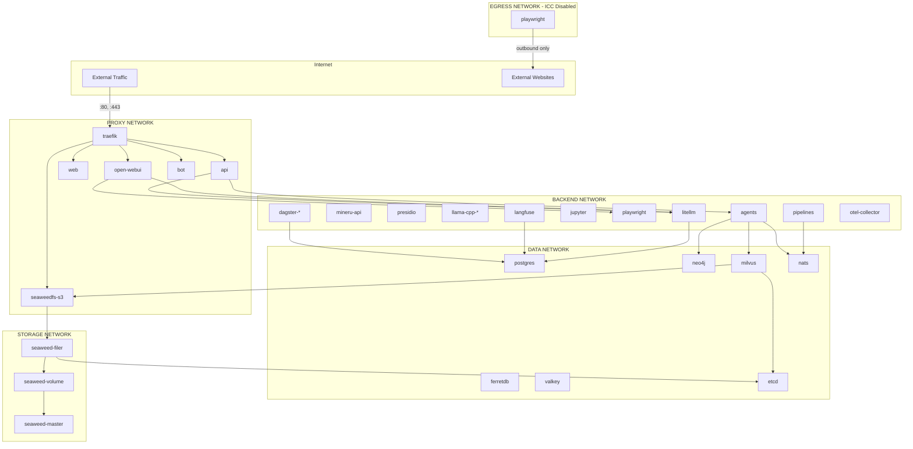

# Docker-Netzwerk-Isolation

Die AI-Hub Plattform implementiert Netzwerksegmentierung, um Sicherheitsgrenzen zwischen Services durchzusetzen. Dieser
Defense-in-Depth-Ansatz begrenzt den "Blast Radius" potenzieller Sicherheitsverletzungen und erzwingt das Prinzip der
geringsten Rechte auf der Netzwerkebene.

## Netzwerkzonen

Die Plattform verwendet fünf isolierte Docker-Netzwerke:

| Netzwerk  | Zweck                           | Externer Zugriff | ICC aktiviert |
| --------- | ------------------------------- | ---------------- | ------------- |
| `proxy`   | Externer Traffic über Traefik   | Ingress + Egress | Ja            |
| `backend` | Interne Anwendungsservices      | Nein             | Ja            |
| `data`    | Datenbanken und Message Broker  | Nein             | Ja            |
| `storage` | SeaweedFS Objektspeicher        | Nein             | Ja            |
| `egress`  | Nur ausgehender Internetzugriff | Nur Egress       | Nein          |

Das `egress`-Netzwerk ist für Services konzipiert, die das Internet erreichen müssen (ausgehend), aber nicht vom
Internet erreichbar sein sollen (kein Ingress). Inter-Container Communication (ICC) ist in diesem Netzwerk deaktiviert,
was bedeutet, dass Container über dieses Netzwerk nicht miteinander kommunizieren können – sie können es nur für den
ausgehenden Internetzugriff nutzen.

## Netzwerkzuweisungen für Services

Jeder Service wird nur den Netzwerken zugewiesen, die er für seinen Betrieb benötigt:

### Proxy-Netzwerk-Services

Services, die von außerhalb des Docker-Netzwerks zugänglich sind:

- **traefik**: Reverse-Proxy und API-Gateway
- **api**: REST-API und WebSocket-Endpunkte
- **web**: Admin-UI-Frontend
- **open-webui**: Chat-Oberfläche
- **bot**: MS Teams/Slack-Integration
- **seaweedfs-s3**: S3-kompatible Storage API
- **oauth2proxy-**\*: Authentifizierungs-Proxys

### Backend-Netzwerk-Services

Interne Anwendungs- und Verarbeitungs-Services:

- **litellm**: LLM-Gateway und Request-Routing
- **mineru-api**: Dokumenten-Parsing und -Extraktion
- **presidio-analyzer/anonymizer**: PII-Erkennung und Anonymisierung
- **llama-cpp-**\*: Lokale LLM-Inferenz (Chat, Embedding, Reranking)
- **speaches**: Sprache-zu-Text und Text-zu-Sprache
- **jupyter**: Code-Ausführungsumgebung
- **playwright**: Web-Scraping und -Automatisierung (auch im `egress`-Netzwerk für Internetzugriff)
- **agents**: Alle Agent-Worker (RAG, Expert, Wrapping)
- **pipelines**: Datenverarbeitungs-Pipelines
- **dagster-**\*: Pipeline-Orchestrierung
- **langfuse**: AI Observability
- **otel-collector**: Telemetrie-Aggregation

### Daten-Netzwerk-Services

Persistenz- und Messaging-Infrastruktur:

- **postgres**: Primäre PostgreSQL-Datenbank
- **pgbouncer**: Verbindungs-Pooler für Dagster
- **postgres-ferretdb**: PostgreSQL-Backend für FerretDB
- **ferretdb**: MongoDB-kompatibler Dokumenten-Store
- **neo4j**: Graphdatenbank für Mem0-Speicher
- **milvus-standalone**: Vektordatenbank
- **etcd**: Verteilter Key-Value-Store (Milvus-Metadaten)
- **valkey**: Redis-kompatibler In-Memory-Cache
- **nats**: Message Broker für ereignisgesteuerte Kommunikation

### Storage-Netzwerk-Services

Verteilter Objektspeicher-Cluster:

- **seaweedfs-master**: Cluster-Koordinator
- **seaweedfs-volume**: Datenspeicher-Nodes
- **seaweedfs-filer**: Dateisystem-Schnittstelle
- **seaweedfs-s3**: S3-API-Gateway
- **etcd**: Filer-Metadaten-Backend

### Egress-Netzwerk-Services

Services, die ausgehenden Internetzugriff, aber keinen eingehenden Zugriff benötigen:

- **playwright**: Web-Scraping und Browser-Automatisierung (muss Webseiten abrufen)

Dieses Netzwerk hat ICC (Inter-Container Communication) deaktiviert, wodurch die laterale Bewegung zwischen Containern
in diesem Netzwerk verhindert wird. Services nutzen `egress` ausschließlich für den ausgehenden Internetzugriff und
müssen andere Netzwerke (z.B. `backend`) für die Inter-Service-Kommunikation verwenden.

## Netzwerktopologie



## Sicherheitsaspekte

### Was jede Netzwerkbegrenzung schützt

#### Proxy → Backend-Grenze

- Externe Benutzer können nicht direkt auf interne Verarbeitungs-Services zugreifen
- Ein kompromittierter Traefik kann Datenbanken nicht erreichen, ohne die API zu durchlaufen

#### Backend → Daten-Grenze

- Verarbeitungs-Services greifen über definierte Schnittstellen auf Datenbanken zu
- Ein kompromittierter KI-Service kann andere Datenbanken nicht direkt manipulieren

#### Daten → Storage-Grenze

- Die interne Cluster-Kommunikation von SeaweedFS ist isoliert
- Datenbank-Services können Speicheroperationen nicht beeinträchtigen

### Service-Sichtbarkeitsmatrix

| Von \\ Nach | proxy | backend | data | storage | egress | Internet |
| ----------- | ----- | ------- | ---- | ------- | ------ | -------- |
| Extern      | ✓     | ✗       | ✗    | ✗       | ✗      | -        |
| proxy       | ✓     | ✓       | ✗    | ✗       | ✗      | ✓        |
| backend     | ✗     | ✓       | ✓    | ✓       | ✗      | ✗        |
| data        | ✗     | ✗       | ✓    | ✓       | ✗      | ✗        |
| storage     | ✗     | ✗       | ✗    | ✓       | ✗      | ✗        |
| egress      | ✗     | ✗       | ✗    | ✗       | ✗\*    | ✓        |

\*ICC im egress-Netzwerk deaktiviert – Container können über dieses Netzwerk nicht miteinander kommunizieren.

## Betriebliche Überlegungen

### Hinzufügen neuer Services

Wenn Sie einen neuen Service hinzufügen, legen Sie fest, welche Netzwerke er benötigt:

1. **Benötigt externen Zugriff (Ingress)?** → Zum `proxy`-Netzwerk hinzufügen
2. **Ist es ein Anwendungs-Service?** → Zum `backend`-Netzwerk hinzufügen
3. **Benötigt Datenbankzugriff?** → Zum `data`-Netzwerk hinzufügen
4. **Benötigt Objektspeicher?** → Zum `storage`-Netzwerk hinzufügen
5. **Benötigt nur ausgehenden Internetzugriff (kein Ingress)?** → Zum `egress`-Netzwerk hinzufügen

Hinweis: Das `egress`-Netzwerk ist speziell für Services gedacht, die externe Websites/APIs erreichen müssen, aber nicht
von außen erreichbar sein sollen. Es hat ICC deaktiviert, sodass Services im `egress`-Netzwerk nicht miteinander
kommunizieren können – verwenden Sie `backend` für die Inter-Service-Kommunikation.

### Fehlerbehebung bei Netzwerkproblemen

Wenn ein Service einen anderen Service nicht erreichen kann:

1. Überprüfen Sie, ob beide Services sich in einem gemeinsamen Netzwerk befinden
2. Prüfen Sie, ob das Zielnetzwerk als `internal: true` markiert ist
3. Verwenden Sie `docker network inspect <network>`, um verbundene Container anzuzeigen
4. Überprüfen Sie, ob die Service-Namen den DNS-Erwartungen (container_name) entsprechen

### Befehle zur Netzwerkprüfung

```bash
# List all networks
docker network ls

# Inspect a specific network
docker network inspect backend

# See which networks a container is connected to
docker inspect <container> --format '{{json .NetworkSettings.Networks}}'
```
