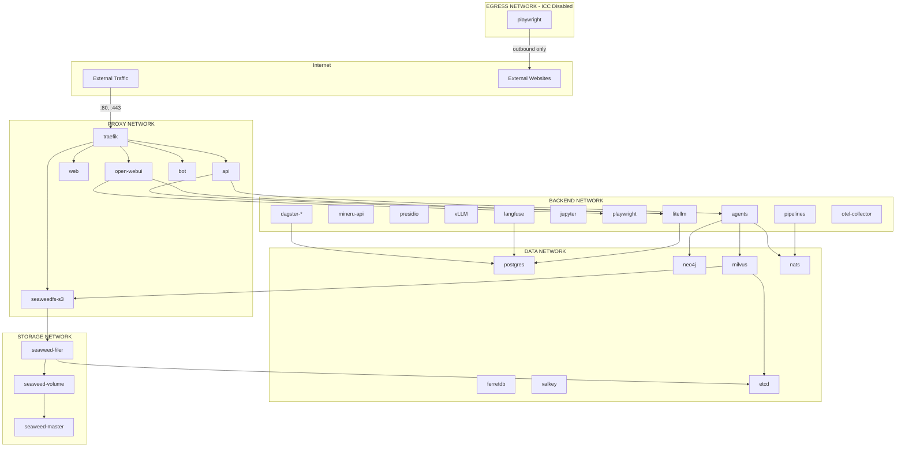

# Docker Network Isolation

The AI-Hub platform implements network segmentation to enforce security boundaries between services. This
defense-in-depth approach limits the blast radius of potential security breaches and enforces the principle of least
privilege at the network layer.

## Network Zones

The platform uses five isolated Docker networks:

| Network   | Purpose                       | External Access  | ICC Enabled |
| --------- | ----------------------------- | ---------------- | ----------- |
| `proxy`   | External traffic via Traefik  | Ingress + Egress | Yes         |
| `backend` | Internal application services | No               | Yes         |
| `data`    | Databases and message broker  | No               | Yes         |
| `storage` | SeaweedFS object storage      | No               | Yes         |
| `egress`  | Outbound internet access only | Egress only      | No          |

The `egress` network is designed for services that need to reach the internet (outbound) but should not be reachable
from the internet (no ingress). Inter-Container Communication (ICC) is disabled on this network, meaning containers
cannot communicate with each other via this network—they can only use it for outbound internet access.

## Service Network Assignments

Each service is assigned to only the networks it requires for operation:

### Proxy Network Services

Services accessible from outside the Docker network:

- **traefik**: Reverse proxy and API gateway
- **api**: REST API and WebSocket endpoints
- **web**: Admin UI frontend
- **open-webui**: Chat interface
- **bot**: MS Teams/Slack integration
- **seaweedfs-s3**: S3-compatible storage API
- **oauth2proxy-**\*: Authentication proxies

### Backend Network Services

Internal application and processing services:

- **litellm**: LLM gateway and request routing
- **mineru-api**: Document parsing and extraction
- **presidio-analyzer/anonymizer**: PII detection and anonymization
- **vLLM**: Local LLM inference (chat, embedding, reranking) — GPU deployments only
- **speaches**: Speech-to-text and text-to-speech
- **jupyter**: Code execution environment
- **playwright**: Web scraping and automation (also on `egress` for internet access)
- **agents**: All agent workers (rag, expert, wrapping)
- **pipelines**: Data processing pipelines
- **dagster-**\*: Pipeline orchestration
- **langfuse**: AI observability
- **otel-collector**: Telemetry aggregation

### Data Network Services

Persistence and messaging infrastructure:

- **postgres**: Primary PostgreSQL database
- **pgbouncer**: Connection pooler for Dagster
- **postgres-ferretdb**: PostgreSQL backend for FerretDB
- **ferretdb**: MongoDB-compatible document store
- **neo4j**: Graph database for Mem0 memory storage
- **milvus-standalone**: Vector database
- **etcd**: Distributed key-value store (Milvus metadata)
- **valkey**: Redis-compatible in-memory cache
- **nats**: Message broker for event-driven communication

### Storage Network Services

Distributed object storage cluster:

- **seaweedfs-master**: Cluster coordinator
- **seaweedfs-volume**: Data storage nodes
- **seaweedfs-filer**: File system interface
- **seaweedfs-s3**: S3 API gateway
- **etcd**: Filer metadata backend

### Egress Network Services

Services that require outbound internet access but no inbound access:

- **playwright**: Web scraping and browser automation (needs to fetch web pages)

This network has ICC (Inter-Container Communication) disabled, preventing lateral movement between containers on this
network. Services use `egress` solely for outbound internet access and must use other networks (e.g., `backend`) for
inter-service communication.

## Network Topology



## Security Implications

### What Each Network Boundary Protects

**Proxy → Backend Boundary**

- External users cannot directly access internal processing services
- Compromised Traefik cannot reach databases without going through API

**Backend → Data Boundary**

- Processing services access databases through defined interfaces
- Compromised AI service cannot directly manipulate other databases

**Data → Storage Boundary**

- SeaweedFS internal cluster communication is isolated
- Database services cannot interfere with storage operations

### Service Visibility Matrix

| From \\ To | proxy | backend | data | storage | egress | Internet |
| ---------- | ----- | ------- | ---- | ------- | ------ | -------- |
| External   | ✓     | ✗       | ✗    | ✗       | ✗      | -        |
| proxy      | ✓     | ✓       | ✗    | ✗       | ✗      | ✓        |
| backend    | ✗     | ✓       | ✓    | ✓       | ✗      | ✗        |
| data       | ✗     | ✗       | ✓    | ✓       | ✗      | ✗        |
| storage    | ✗     | ✗       | ✗    | ✓       | ✗      | ✗        |
| egress     | ✗     | ✗       | ✗    | ✗       | ✗\*    | ✓        |

\*ICC disabled on egress network - containers cannot communicate with each other via this network.

## Operational Considerations

### Adding New Services

When adding a new service, determine which networks it needs:

1. **Needs external access (ingress)?** → Add to `proxy`
2. **Is an application service?** → Add to `backend`
3. **Needs database access?** → Add to `data`
4. **Needs object storage?** → Add to `storage`
5. **Needs outbound internet only (no ingress)?** → Add to `egress`

Note: The `egress` network is specifically for services that need to reach external websites/APIs but should not be
reachable from outside. It has ICC disabled, so services on `egress` cannot communicate with each other—use `backend`
for inter-service communication.

### Debugging Network Issues

If a service cannot reach another service:

1. Verify both services are on a common network
2. Check if the target network is marked `internal: true`
3. Use `docker network inspect <network>` to see connected containers
4. Check service names match DNS expectations (container_name)

### Network Inspection Commands

```bash
# List all networks
docker network ls

# Inspect a specific network
docker network inspect backend

# See which networks a container is connected to
docker inspect <container> --format '{{json .NetworkSettings.Networks}}'
```
