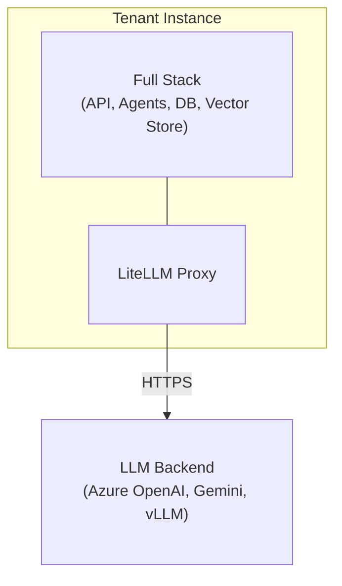
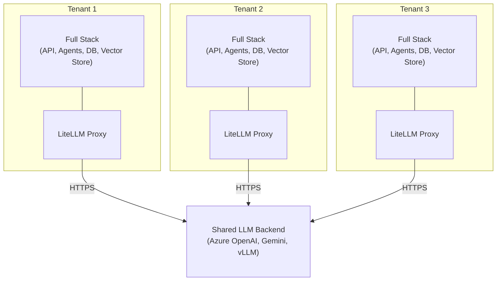

# Bereitstellungsoptionen

## Überblick

Der AI-Hub kann als einzelne isolierte Instanz für eine Organisation bereitgestellt werden oder als mehrere isolierte
Instanzen, die optional gemeinsame Backend-LLM-Ressourcen nutzen.

## Single-Tenant-Bereitstellung

### Isolierte Instanz

Eine Single-Tenant-Bereitstellung betreibt eine vollständige, eigenständige AI-Hub-Instanz. Die Organisation erhält eine
dedizierte Infrastruktur: separate Datenbanken, Vektor-Stores, Dateispeicher und Anwendungsdienste. Im Gegensatz zu
Multi-Tenant-SaaS-Plattformen, bei denen Kunden Datenbanken und Anwendungsserver gemeinsam nutzen, hat ein Tenant seinen
eigenen dedizierten Stack.

Die Instanz umfasst die API, Agenten, Pipelines, die Weboberfläche und Bot-Integrationen. Sie verfügt über eigene
Datenbanken (FerretDB/PostgreSQL), Vektor-Stores (Milvus oder Azure AI Search) und Dateispeicher (SeaweedFS oder Azure
Data Lake). Das Monitoring läuft über SigNoz und Phoenix. NATS übernimmt das Event-Streaming. Die Instanz verfügt über
einen eigenen LiteLLM-Proxy für Kostenverfolgung und Versionskontrolle.

### LLM-Backend

Die Instanz verbindet sich über ihren LiteLLM-Proxy mit LLM-Diensten. Der Proxy kann sich mit Azure OpenAI, Google
Gemini, selbst gehosteten Modellen (vLLM, llama.cpp, HF-TEI) oder einer Mischung davon verbinden. Der Proxy verwaltet
die Modellauswahl, Budgets, Ratenbegrenzungen und Versionen. Alle Prompts, Antworten und Benutzerdaten verbleiben
innerhalb der Tenant-Instanz.

---

## Hosting-Optionen

Der AI-Hub kann je nach organisatorischen Anforderungen auf drei Arten gehostet werden.

### On-Premise (eigener Server)

Sie betreiben den AI-Hub auf Ihren eigenen Servern in Ihrem Rechenzentrum.

Sie benötigen x86_64-Server mit CPU, RAM und Speicherplatz. NVIDIA-GPUs eignen sich für selbst gehostete LLM-Inferenz.
Für den Netzwerkzugang entweder ausgehendes HTTPS für Cloud-basierte LLM-Dienste oder Air-Gapped mit lokalen Modellen.

Die Infrastruktur liegt in Ihrer Kontrolle. Keine Cloud-Abhängigkeiten. Funktioniert in Air-Gapped-Umgebungen mit selbst
gehosteten LLMs.

---

### Private Cloud (eigene Cloud)

Sie betreiben den AI-Hub in Ihrer eigenen Cloud-Umgebung (Schweizer Cloud-Anbieter, Azure, AWS, GCP).

Daten bleiben in Ihrem Cloud-Konto unter Ihrer Kontrolle. Sie wählen die Region (z.B. Schweiz für Datenresidenz). Sie
verwalten die Cloud-Ressourcen und -Kosten.

Cloud-Anbieter verfügen in der Regel über Sicherheits- und Compliance-Zertifizierungen. Sie benötigen
Internetkonnektivität für den LLM-Proxy-Zugriff (HTTPS), optional VPN für den administrativen Zugriff und privates
Netzwerk zwischen Diensten (internes DNS).

---

### SaaS (Schweizer Cloud-Hosting)

bbv hostet und verwaltet den AI-Hub für Sie auf einer Schweizer Cloud-Infrastruktur.

bbv kümmert sich um Infrastrukturbereitstellung, Updates, Backups, Monitoring und Betriebsaufgaben. Daten bleiben in der
Schweiz unter Schweizer Rechtshoheit. Sicherheits- und Compliance-Zertifizierungen des Cloud-Anbieters.

Sie greifen über eine Weboberfläche und APIs auf den AI-Hub zu. bbv bietet SLAs für Verfügbarkeit und Support. Weniger
Betriebsaufwand für Ihr Team.

---

## Multi-Tenant-Bereitstellung

### Gemeinsames LLM-Backend

Bei der Bereitstellung mehrerer Tenant-Instanzen können diese Backend-LLM-Ressourcen gemeinsam nutzen. Mehrere Tenants
verwenden dasselbe Azure OpenAI-Abonnement, Google Gemini API-Schlüssel oder selbst gehostete Modelle. Sie können auch
Authentifizierungsinfrastrukturen wie Azure AD oder Keycloak gemeinsam nutzen.

Jeder Tenant hat weiterhin seinen eigenen LiteLLM-Proxy. Der Proxy verwaltet die Modellauswahl, Budgets,
Ratenbegrenzungen und Versionen pro Tenant. Die LLM-Nutzung wird pro Tenant verfolgt. Prompts, Antworten und
Benutzerdaten verbleiben innerhalb jeder Tenant-Instanz.

Die gemeinsam genutzten LLM-Backends sind zustandslos. Sie speichern keine Prompts oder Antworten. Konversationeller
Kontext und Verlauf bleiben in der eigenen Infrastruktur jedes Tenants.

## Merkmale

### Datenisolation

Die Daten jedes Tenants bleiben in seiner Instanz. Es gibt keine gemeinsame Datenbank oder Vektor-Store. Daten können
nicht zwischen Organisationen übertragen werden. Die Einrichtung erfüllt die Anforderungen des Schweizer
Datenschutzgesetzes (revDSG), die GDPR-Anforderungen zur Datenisolation und die Sicherheitsstandards des Schweizer
öffentlichen Sektors.

### Konfiguration

Jede Instanz kann unabhängig konfiguriert werden. Tenants können benutzerdefinierte Agenten, spezialisierte Pipelines
für ihre Datenquellen, ihre eigene Zugriffskontrolle (RBAC, OIDC mit lokalem IdP), benutzerdefinierte Wissensbasen und
dedizierte Authentifizierungsanbieter wie Azure AD oder Keycloak bereitstellen.

### Skalierung und Updates

Die Ressourcenzuweisung erfolgt pro Tenant. Sie skalieren Rechenleistung, Arbeitsspeicher und Speicher basierend auf der
tatsächlichen Nutzung. Jeder Tenant kann Updates nach seinem eigenen Zeitplan anwenden. Das Testen neuer Funktionen in
einer Instanz beeinflusst andere nicht. SLAs variieren je nach Vertrag.

### Compliance und Audit

Auditoren können die Infrastruktur eines einzelnen Tenants prüfen. Protokolle und Traces verbleiben in der
Tenant-Instanz. Richtlinien zur Backup-Aufbewahrung können pro Tenant konfiguriert werden. Penetrationstests können auf
einzelne Instanzen beschränkt werden.

## Bereitstellungsmodell

### Single-Tenant-Infrastruktur

Eine Single-Tenant-Bereitstellung umfasst:

```
Tenant Instance
├── Application Layer
│   ├── API Service (FastAPI + WebSocket gateway)
│   ├── Web Interface (Nuxt.js frontend)
│   ├── OpenWebUI (LLM chat interface)
│   ├── Agent Services (RAG, specialized agents)
│   ├── Pipeline Services (Dagster + custom pipelines)
│   └── Bot Service (MS Teams, Slack integrations)
│
├── Data Layer
│   ├── Database (FerretDB + PostgreSQL)
│   ├── Vector Store (Milvus or Azure AI Search)
│   ├── Document Store (SeaweedFS or Azure Data Lake)
│   └── Cache (Valkey)
│
├── LLM Layer
│   ├── LiteLLM Proxy
│   │   ├── Cost tracking and budgets
│   │   ├── Model routing configuration
│   │   ├── Rate limiting
│   │   └── Version control
│   └── Presidio (PII anonymization)
│
├── Observability Layer
│   ├── Phoenix (AI tracing and evaluation)
│   └── OpenTelemetry (distributed tracing)
│
└── Infrastructure Layer
    ├── NATS (message bus)
    ├── Docling (document processing)
    └── Traefik (reverse proxy + SSL termination)
```

Der LiteLLM-Proxy verbindet sich mit LLM-Diensten (Azure OpenAI, Google Gemini, selbst gehostete Modelle).

### Multi-Tenant-Infrastruktur

Bei der Bereitstellung mehrerer Tenants erhält jeder Tenant die gleiche oben gezeigte Infrastruktur. Sie können
Backend-LLM-Ressourcen gemeinsam nutzen:

```
Shared LLM Backend Resources
├── LLM API Subscriptions
│   ├── Azure OpenAI subscription (shared API keys)
│   ├── Google Gemini API keys
│   └── Other cloud provider credentials
│
├── Self-Hosted Model Infrastructure
│   ├── vLLM deployment (GPU cluster)
│   ├── llama.cpp servers
│   └── HF-TEI instances
│
└── Optional Shared Services
    ├── Central Authentication (Azure AD, Keycloak)
    └── Central Monitoring Dashboard (optional)
```

Netzwerkarchitektur:

- Jeder Tenant hat seine eigene LiteLLM-Proxy-Instanz
- Tenant-LiteLLM-Proxys verbinden sich mit gemeinsam genutzten LLM-Backends (Azure OpenAI, Gemini, selbst gehostete
  Modelle)
- Gemeinsam genutzte LLM-Backends verwenden gemeinsame API-Anmeldeinformationen (pro Tenant-LiteLLM konfiguriert)
- Keine direkte Kommunikation zwischen Tenant-Instanzen
- Optional: Gemeinsamer Authentifizierungsanbieter (Azure AD, Keycloak)

Datenisolation und Souveränität. Unabhängige Skalierung und Ressourcenzuweisung. Benutzerdefinierte Konfigurationen pro
Tenant. Flexible Update-Zeitpläne. Klare Compliance-Grenzen.

---

## Architekturdiagramme

### Single-Tenant-Bereitstellung



Die Tenant-Instanz verbindet sich über ihren LiteLLM-Proxy mit LLM-Diensten.

### Multi-Tenant-Bereitstellung mit gemeinsamem LLM-Backend



Jeder Tenant hat seine eigene LiteLLM-Proxy-Instanz (unabhängige Kostenverfolgung, Versionierung, Konfiguration). Alle
Tenant-LiteLLM-Proxys verbinden sich mit gemeinsam genutzten LLM-Backend-Ressourcen (Azure OpenAI-Abonnements, selbst
gehostete Modelle). Prompts, Antworten und Benutzerdaten bleiben innerhalb der Tenant-Grenzen.

---

## Sicherheitsüberlegungen

### Tenant-Isolation

Tenant-Instanzen kommunizieren nicht miteinander. Jeder Tenant verfügt über separate Datenbanken, Vektor-Stores und
Dateispeicher. Jeder Tenant verbindet sich mit seinem eigenen IdP (Azure AD, Keycloak). LiteLLM erzwingt pro-Tenant
API-Schlüssel und Quoten.

### LLM-Proxy-Sicherheit

LiteLLM speichert keine Prompts oder Antworten (zustandsloser Betrieb). Die API-Schlüsselverwaltung umfasst sichere
Schlüsselgenerierung, Rotation und Widerruf. Pro-Tenant-Anfragebegrenzungen verhindern Missbrauch. Alle LLM-Anfragen
werden mit Tenant-ID, aber ohne Prompt-Inhalt protokolliert. Die Presidio-Integration ist optional für PII-Erkennung und
-Redaktion.

### Datenübertragung

Die gesamte Kommunikation ist mit TLS verschlüsselt (Tenant zum LLM-Proxy). Die Zertifikatsverwaltung verwendet Let's
Encrypt für die Produktion und mkcert für die Entwicklung. Die API-Authentifizierung verwendet Bearer-Tokens (OAuth 2.0,
JWT).

### Ruhende Daten

PostgreSQL verwendet transparente Datenverschlüsselung (TDE). Persistente Volumes sind verschlüsselt (LUKS, Azure Disk
Encryption). Geheimnisse werden über Umgebungsvariablen, Azure Key Vault oder Docker-Secrets verwaltet.

---

## Nächste Schritte

- [Produktionskonfiguration](../2_production_configuration/) – Konfigurationsanleitung für Produktionsbereitstellungen
- [Skalierungsüberlegungen](../3_scaling_considerations/) – Skalierung von Tenant-Instanzen
- [Sicherung und Wiederherstellung](../4_backup_and_recovery/) – Sicherungsstrategien für die Pro-Tenant-Architektur
- [Updates und Wartung](../6_updates_and_maintenance/) – Verwaltung von Updates über mehrere Instanzen hinweg

---

## FAQ

::: details Können Tenants Agenten oder Pipelines teilen?
Nein. Jede Tenant-Instanz verfügt über einen eigenen isolierten Satz von Agenten und Pipelines. Dieselben
Agenten-Definitionen (Code) können jedoch über mehrere Tenant-Instanzen hinweg bereitgestellt werden. Anpassungen sind
Tenant-spezifisch.
:::

::: details Welche Daten sieht das gemeinsam genutzte LLM-Backend?
Jeder Tenant hat seinen eigenen LiteLLM-Proxy, sodass Prompts und Antworten in der Tenant-Instanz verbleiben. Die
gemeinsam genutzten LLM-Backends (Azure OpenAI, Gemini, selbst gehostete Modelle) sehen API-Anfragen von mehreren
Tenant-LiteLLM-Proxys (zustandslos, nicht persistent), Modellinferenzanfragen (Prompts und Completions nur während der
Übertragung), keine Tenant-Identifikation oder Kontext und anonymisierte PII-Daten, falls aktiviert.

Sie sehen nicht, welcher Tenant die Anfrage gestellt hat, den Konversationsverlauf oder gespeicherte Daten. Der gesamte
Kontext bleibt im LiteLLM-Proxy und der Datenbank des Tenants.
:::

::: details Kann ein Tenant ausschließlich selbst gehostete Modelle verwenden?
Ja. Für Air-Gapped- oder vollständig On-Premise-Bereitstellungen können Sie selbst gehostete LLMs (vLLM, llama.cpp,
HF-TEI) bereitstellen, LiteLLM so konfigurieren, dass es an lokale Modelle weiterleitet, und dies ohne erforderliche
ausgehende Internetverbindung betreiben.
:::

::: details Wie werden Kosten pro Tenant verfolgt?
LiteLLM verfolgt die API-Nutzung pro Tenant und Benutzer: Token-Anzahl (Eingabe/Ausgabe), Modellnutzung (GPT-4, Gemini
usw.), Kostenberechnungen basierend auf Modellpreisen und monatliche Budgetdurchsetzung.

Die Daten sind in der LiteLLM-Admin-Benutzeroberfläche verfügbar und für die Abrechnung exportierbar.
:::

::: details Können Tenants unterschiedlichen LLM-Zugriff haben?
Ja. Die LiteLLM-Konfiguration ermöglicht einen pro-Tenant-Modellzugriff. Zum Beispiel könnte Tenant A nur GPT-4o für
strikte Compliance verwenden, Tenant B könnte GPT-4o plus Gemini 2.0 für mehr Flexibilität verwenden, und Tenant C
könnte ausschließlich selbst gehostete Modelle für eine Air-Gapped-Bereitstellung verwenden.
:::

::: details Was passiert, wenn der LLM-Proxy nicht verfügbar ist?
Tenant-Instanzen werden eine Beeinträchtigung LLM-abhängiger Funktionen erfahren. RAG-Agenten können keine Antworten
generieren. Embeddings können für neue Dokumente nicht erstellt werden. Vorhandene Daten und die Benutzeroberfläche
bleiben jedoch zugänglich, und nicht-LLM-Funktionen (Dokumenten-Upload, RBAC, Observability) funktionieren weiterhin.

Minderung: Bereitstellung von LiteLLM mit hoher Verfügbarkeit (mehrere Replikate, Lastausgleich).
:::

::: details Wie verwalten Sie Updates über mehrere Tenant-Instanzen hinweg?
Siehe [Updates und Wartung](../6_updates_and_maintenance/) für Strategien wie gestaffelte Rollouts (Pilot- bis
Produktionsumgebung), Blue-Green-Deployments, automatisierte Update-Orchestrierung (Ansible, Kubernetes-Operatoren) und
pro-Tenant-Update-Zeitpläne.
:::

## Verwandte Dokumentation

- [Kernkomponenten](../../2_architecture/1_core_components/) – AI-Hub-Architektur
- [Authentifizierung & Autorisierung](../../11_access_management/1_authentication_setup/) –
  Tenant-Authentifizierungskonfiguration
- [Monitoring und Alarmierung](../5_monitoring_and_alerting/) – Observability für Multi-Instanz-Bereitstellungen
- [Schweizer Datenschutz](../../19_compliance/3_dsg/) – revDSG-Compliance für den öffentlichen Sektor
