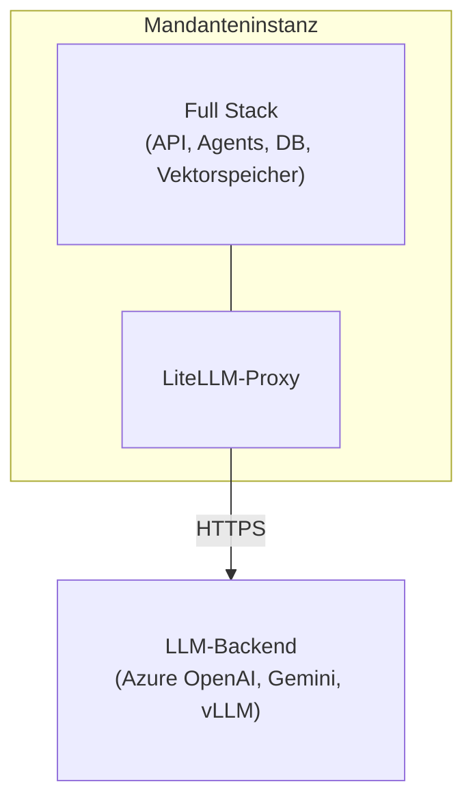
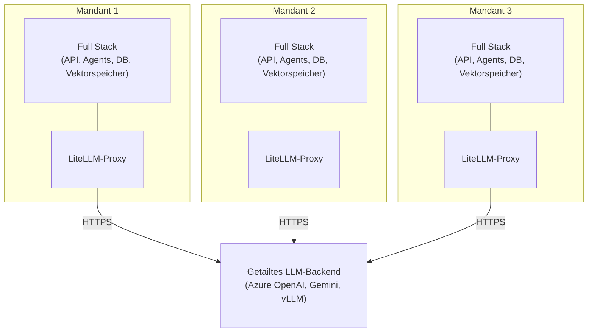

# Bereitstellungsoptionen

## Überblick

Der AI-Hub kann als einzelne isolierte Instanz für eine Organisation oder als mehrere isolierte Instanzen bereitgestellt
werden, die optional Backend-LLM-Ressourcen gemeinsam nutzen.

## Single-Tenant-Bereitstellung

### Isolierte Instanz

Eine Single-Tenant-Bereitstellung betreibt eine vollständige, eigenständige AI-Hub-Instanz. Die Organisation erhält eine
dedizierte Infrastruktur: separate Datenbanken, Vektorspeicher, Dateispeicher und Anwendungsdienste. Im Gegensatz zu
Multi-Tenant-SaaS-Plattformen, bei denen Kunden Datenbanken und Anwendungsserver gemeinsam nutzen, verfügt ein Mandant
über seinen eigenen dedizierten Stack.

Die Instanz umfasst die API, Agents, Pipelines, die Weboberfläche und Bot-Integrationen. Sie verfügt über eigene
Datenbanken (FerretDB/PostgreSQL), Vektorspeicher (Milvus oder Azure AI Search) und Dateispeicher (SeaweedFS oder Azure
Data Lake). Das Monitoring erfolgt über SigNoz und Phoenix. NATS übernimmt das Event-Streaming. Die Instanz besitzt
einen eigenen LiteLLM-Proxy für Kostenverfolgung und Versionskontrolle.

### LLM-Backend

Die Instanz verbindet sich über ihren LiteLLM-Proxy mit LLM-Diensten. Der Proxy kann sich mit Azure OpenAI, Google
Gemini, selbst gehosteten Modellen (vLLM, llama.cpp, HF-TEI) oder einer Mischung davon verbinden. Der Proxy verwaltet
die Modellauswahl, Budgets, Ratenbegrenzungen und Versionen. Alle Prompts, Antworten und Benutzerdaten verbleiben
innerhalb der Mandanteninstanz.

---

## Hosting-Optionen

Der AI-Hub kann je nach organisatorischen Anforderungen auf drei Arten gehostet werden.

### On-Premise (eigene Server)

Sie betreiben den AI-Hub auf Ihren eigenen Servern in Ihrem Rechenzentrum.

Sie benötigen x86_64-Server mit CPU, RAM und Speicherplatz. NVIDIA GPUs eignen sich für selbst gehostete LLM-Inferenz.
Für den Netzwerkzugriff benötigen Sie entweder ausgehendes HTTPS für Cloud-basierte LLM-Dienste oder eine
Air-Gapped-Umgebung mit lokalen Modellen.

Die Infrastruktur liegt unter Ihrer Kontrolle. Keine Cloud-Abhängigkeiten. Funktioniert in Air-Gapped-Umgebungen mit
selbst gehosteten LLMs.

---

### Private Cloud (eigene Cloud-Umgebung)

Sie betreiben den AI-Hub in Ihrer eigenen Cloud-Umgebung (Schweizer Cloud-Anbieter, Azure, AWS, GCP).

Die Daten verbleiben in Ihrem Cloud-Konto unter Ihrer Kontrolle. Sie wählen die Region (z.B. Schweiz für die
Datenresidenz). Sie verwalten die Cloud-Ressourcen und -Kosten.

Cloud-Anbieter verfügen typischerweise über Sicherheits- und Compliance-Zertifizierungen. Sie benötigen
Internetkonnektivität für den LLM-Proxy-Zugriff (HTTPS), optional VPN für den administrativen Zugriff und private
Netzwerke zwischen Diensten (internes DNS).

---

### SaaS (Schweizer Cloud-Hosting)

bbv hostet und verwaltet den AI-Hub für Sie auf einer in der Schweiz basierten Cloud-Infrastruktur.

bbv übernimmt die Infrastrukturbereitstellung, Updates, Backups, Monitoring und operative Aufgaben. Die Daten verbleiben
in der Schweiz unter Schweizer Rechtshoheit. Sicherheits- und Compliance-Zertifizierungen vom Cloud-Anbieter.

Sie greifen über eine Weboberfläche und APIs auf den AI-Hub zu. bbv bietet SLAs für Verfügbarkeit und Support. Weniger
Betriebsaufwand für Ihr Team.

---

## Multi-Tenant-Bereitstellung

### Geteiltes LLM-Backend

Bei der Bereitstellung mehrerer Mandanteninstanzen können diese Backend-LLM-Ressourcen gemeinsam nutzen. Mehrere
Mandanten verwenden dasselbe Azure OpenAI-Abonnement, dieselben Google Gemini API-Schlüssel oder selbst gehostete
Modelle. Sie können auch Authentifizierungsinfrastrukturen wie Azure AD oder Keycloak gemeinsam nutzen.

Jeder Mandant verfügt weiterhin über einen eigenen LiteLLM-Proxy. Der Proxy verwaltet die Modellauswahl, Budgets,
Ratenbegrenzungen und Versionen pro Mandant. Die LLM-Nutzung wird pro Mandant verfolgt. Prompts, Antworten und
Benutzerdaten verbleiben in jeder Mandanteninstanz.

Die geteilten LLM-Backends sind zustandslos. Sie speichern keine Prompts oder Antworten dauerhaft. Der
Konversationskontext und die Historie verbleiben in der eigenen Infrastruktur jedes Mandanten.

## Eigenschaften

### Datenisolation

Die Daten jedes Mandanten verbleiben in dessen Instanz. Es gibt keine gemeinsame Datenbank oder Vektorspeicher. Daten
können nicht zwischen Organisationen austreten. Das Setup erfüllt die Anforderungen des Schweizer Datenschutzgesetzes
(revDSG), die GDPR-Anforderungen an die Datenisolation und die Sicherheitsstandards des Schweizer öffentlichen Sektors.

### Konfiguration

Jede Instanz kann unabhängig konfiguriert werden. Mandanten können benutzerdefinierte Agents, spezialisierte Pipelines
für ihre Datenquellen, eigene Zugriffssteuerungen (RBAC, OIDC mit lokalem IdP), benutzerdefinierte Wissensdatenbanken
und dedizierte Authentifizierungsanbieter wie Azure AD oder Keycloak bereitstellen.

### Skalierung und Updates

Die Ressourcenzuweisung erfolgt pro Mandant. Sie skalieren Rechenleistung, Arbeitsspeicher und Speicherplatz basierend
auf der tatsächlichen Nutzung. Jeder Mandant kann Updates nach eigenem Zeitplan anwenden. Das Testen neuer Funktionen in
einer Instanz beeinflusst andere nicht. SLAs variieren je nach Vertrag.

### Compliance und Auditing

Auditoren können die Infrastruktur eines einzelnen Mandanten prüfen. Protokolle und Traces verbleiben innerhalb der
Mandanteninstanz. Backup-Aufbewahrungsrichtlinien können pro Mandant konfiguriert werden. Penetrationstests können auf
einzelne Instanzen zugeschnitten werden.

## Bereitstellungsmodell

### Single-Tenant-Infrastruktur

Eine Single-Tenant-Bereitstellung enthält:

```
Tenant Instance
├── Application Layer
│   ├── API Service (FastAPI + WebSocket gateway)
│   ├── Web Interface (Nuxt.js frontend)
│   ├── OpenWebUI (LLM chat interface)
│   ├── Agent Services (RAG, specialized agents)
│   ├── Pipeline Services (Dagster + custom pipelines)
│   └── Bot Service (MS Teams, Slack integrations)
│
├── Data Layer
│   ├── Database (FerretDB + PostgreSQL)
│   ├── Vector Store (Milvus or Azure AI Search)
│   ├── Document Store (SeaweedFS or Azure Data Lake)
│   └── Cache (Valkey)
│
├── LLM Layer
│   ├── LiteLLM Proxy
│   │   ├── Cost tracking and budgets
│   │   ├── Model routing configuration
│   │   ├── Rate limiting
│   │   └── Version control
│   └── Presidio (PII anonymization)
│
├── Observability Layer
│   ├── Phoenix (AI tracing and evaluation)
│   └── OpenTelemetry (distributed tracing)
│
└── Infrastructure Layer
    ├── NATS (message bus)
    ├── Docling (document processing)
    └── Traefik (reverse proxy + SSL termination)
```

Der LiteLLM-Proxy verbindet sich mit LLM-Diensten (Azure OpenAI, Google Gemini, selbst gehostete Modelle).

### Multi-Tenant-Infrastruktur

Bei der Bereitstellung mehrerer Mandanten erhält jeder Mandant die gleiche oben gezeigte Infrastruktur. Sie können
Backend-LLM-Ressourcen gemeinsam nutzen:

```
Shared LLM Backend Resources
├── LLM API Subscriptions
│   ├── Azure OpenAI subscription (shared API keys)
│   ├── Google Gemini API keys
│   └── Other cloud provider credentials
│
├── Self-Hosted Model Infrastructure
│   ├── vLLM deployment (GPU cluster)
│   ├── llama.cpp servers
│   └── HF-TEI instances
│
└── Optional Shared Services
    ├── Central Authentication (Azure AD, Keycloak)
    └── Central Monitoring Dashboard (optional)
```

Netzwerkarchitektur:

- Jeder Mandant verfügt über eine eigene LiteLLM-Proxy-Instanz
- LiteLLM-Proxys der Mandanten verbinden sich mit geteilten LLM-Backends (Azure OpenAI, Gemini, selbst gehostete
  Modelle)
- Geteilte LLM-Backends verwenden gemeinsame API-Anmeldeinformationen (konfiguriert pro LiteLLM des Mandanten)
- Keine direkte Kommunikation zwischen Mandanteninstanzen
- Optional: Geteilter Authentifizierungsanbieter (Azure AD, Keycloak)

Datenisolation und -souveränität. Unabhängige Skalierung und Ressourcenzuweisung. Benutzerdefinierte Konfigurationen pro
Mandant. Flexible Update-Zeitpläne. Klare Compliance-Grenzen.

---

## Architekturdiagramme

### Single-Tenant-Bereitstellung



Die Mandanteninstanz verbindet sich über ihren LiteLLM-Proxy mit LLM-Diensten.

### Multi-Tenant-Bereitstellung mit geteiltem LLM-Backend



Jeder Mandant verfügt über eine eigene LiteLLM-Proxy-Instanz (unabhängige Kostenverfolgung, Versionierung,
Konfiguration). Alle LiteLLM-Proxys der Mandanten verbinden sich mit geteilten LLM-Backend-Ressourcen (Azure
OpenAI-Abonnements, selbst gehostete Modelle). Prompts, Antworten und Benutzerdaten verbleiben innerhalb der
Mandantengrenzen.

---

## Sicherheitsaspekte

### Mandantenisolation

Mandanteninstanzen kommunizieren nicht miteinander. Jeder Mandant verfügt über separate Datenbanken, Vektorspeicher und
Dateispeicher. Jeder Mandant verbindet sich mit seinem eigenen IdP (Azure AD, Keycloak). LiteLLM erzwingt
mandantenbasierte API-Schlüssel und Quoten.

### LLM-Proxy-Sicherheit

LiteLLM speichert Prompts oder Antworten nicht dauerhaft (zustandsloser Betrieb). Das API-Schlüsselmanagement umfasst
die sichere Generierung, Rotation und den Widerruf von Schlüsseln. Pro-Mandanten-Anfragelimits verhindern Missbrauch.
Alle LLM-Anfragen werden mit Mandanten-ID, aber ohne Prompt-Inhalt protokolliert. Die Presidio-Integration ist optional
für die Erkennung und Redaktion von PII.

### Daten während der Übertragung

Die gesamte Kommunikation wird mit TLS verschlüsselt (Mandant zu LLM-Proxy). Das Zertifikatsmanagement verwendet Let's
Encrypt für die Produktion und mkcert für die Entwicklung. Die API-Authentifizierung verwendet Bearer-Tokens (OAuth 2.0,
JWT).

### Ruhende Daten

PostgreSQL verwendet transparente Datenverschlüsselung (TDE). Persistente Volumes sind verschlüsselt (LUKS, Azure Disk
Encryption). Geheimnisse werden über Umgebungsvariablen, Azure Key Vault oder Docker-Secrets verwaltet.

---

## Nächste Schritte

- [Produktionskonfiguration](../2_production_configuration/) - Konfigurationsanleitung für Produktionsbereitstellungen
- [Skalierungsaspekte](../3_scaling_considerations/) - Skalierung von Mandanteninstanzen
- [Sicherung und Wiederherstellung](../4_backup_and_recovery/) - Backup-Strategien für die Pro-Mandanten-Architektur
- [Updates und Wartung](../6_updates_and_maintenance/) - Verwaltung von Updates über mehrere Instanzen hinweg

---

## FAQ

::: details Können Mandanten Agents oder Pipelines teilen?
Nein. Jede Mandanteninstanz verfügt über einen eigenen isolierten Satz von Agents und Pipelines. Dieselben
Agent-Definitionen (Code) können jedoch über mehrere Mandanteninstanzen hinweg bereitgestellt werden. Anpassungen sind
mandantenspezifisch.
:::

::: details Welche Daten sieht das geteilte LLM-Backend?
Jeder Mandant verfügt über einen eigenen LiteLLM-Proxy, sodass Prompts und Antworten innerhalb der Mandanteninstanz
verbleiben. Die geteilten LLM-Backends (Azure OpenAI, Gemini, selbst gehostete Modelle) sehen API-Anfragen von mehreren
LiteLLM-Proxys der Mandanten (zustandslos, nicht persistent), Modellinferenzanfragen (Prompts und Completions nur
während der Übertragung), keine Mandantenidentifikation oder Kontext und anonymisierte PII-Daten, falls aktiviert.

Sie sehen nicht, welcher Mandant die Anfrage gestellt hat, die Konversationshistorie oder gespeicherte Daten. Der
gesamte Kontext verbleibt im LiteLLM-Proxy und in der Datenbank des Mandanten.
:::

::: details Kann ein Mandant ausschließlich selbst gehostete Modelle verwenden?
Ja. Für Air-Gapped- oder vollständig On-Premise-Bereitstellungen können Sie selbst gehostete LLMs (vLLM, llama.cpp,
HF-TEI) bereitstellen, LiteLLM so konfigurieren, dass es an lokale Modelle weiterleitet, und dies ohne erforderliche
ausgehende Internetverbindung betreiben.
:::

::: details Wie werden Kosten pro Mandant verfolgt?
LiteLLM verfolgt die API-Nutzung pro Mandant und Benutzer: Token-Zählungen (Input/Output), Modellnutzung (GPT-4, Gemini
usw.), Kostenberechnungen basierend auf der Modellpreisgestaltung und monatliche Budgetdurchsetzung.

Die Daten sind in der LiteLLM-Admin-Oberfläche verfügbar und können für die Abrechnung exportiert werden.
:::

::: details Können Mandanten unterschiedlichen LLM-Zugriff haben?
Ja. Die LiteLLM-Konfiguration erlaubt den modellbasierten Zugriff pro Mandant. Zum Beispiel könnte Mandant A nur GPT-4o
für strikte Compliance verwenden, Mandant B GPT-4o plus Gemini 2.0 für mehr Flexibilität und Mandant C nur selbst
gehostete Modelle für eine Air-Gapped-Bereitstellung.
:::

::: details Was passiert, wenn der LLM-Proxy nicht verfügbar ist?
Mandanteninstanzen werden eine Beeinträchtigung der LLM-abhängigen Funktionen erfahren. RAG-Agents können keine
Antworten generieren. Embeddings können nicht für neue Dokumente erstellt werden. Vorhandene Daten und die
Benutzeroberfläche bleiben jedoch zugänglich, und nicht-LLM-Funktionen (Dokumenten-Upload, RBAC, Observability)
funktionieren weiterhin.

Abhilfe: Stellen Sie LiteLLM mit hoher Verfügbarkeit bereit (mehrere Replikate, Load Balancing).
:::

::: details Wie werden Updates über viele Mandanteninstanzen hinweg verwaltet?
Siehe [Updates und Wartung](../6_updates_and_maintenance/) für Strategien wie gestaffelte Rollouts (Pilot bis
Produktion), Blue-Green-Deployments, automatisierte Update-Orchestrierung (Ansible, Kubernetes-Operatoren) und
mandantenbasierte Update-Zeitpläne.
:::

## Verwandte Dokumentation

- [Kernkomponenten](../../2_architecture/1_core_components/) - AI-Hub Architektur
- [Authentifizierung & Autorisierung](../../11_access_management/1_authentication_setup/) -
  Mandanten-Authentifizierungskonfiguration
- [Monitoring und Alerting](../5_monitoring_and_alerting/) - Observability für Multi-Instanz-Bereitstellungen
- [Schweizer Datenschutz](../../19_compliance/3_dsg/) - revDSG Compliance für den öffentlichen Sektor
