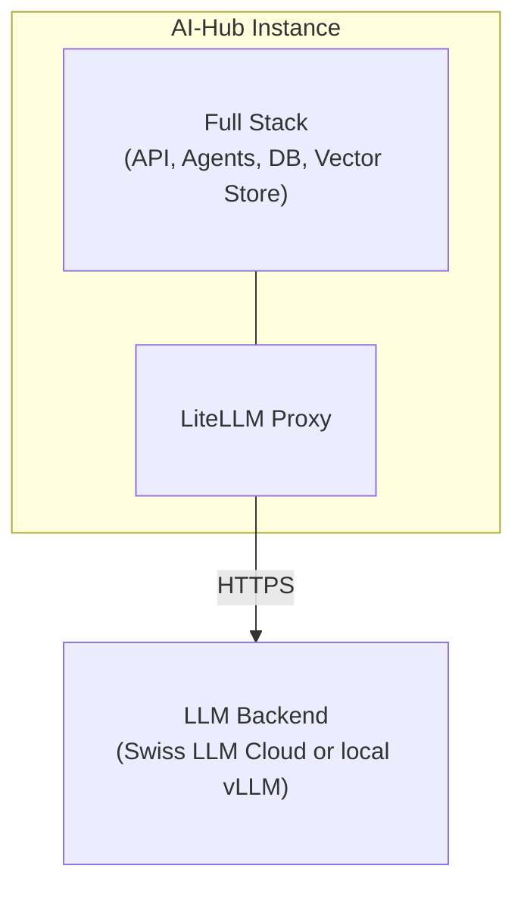
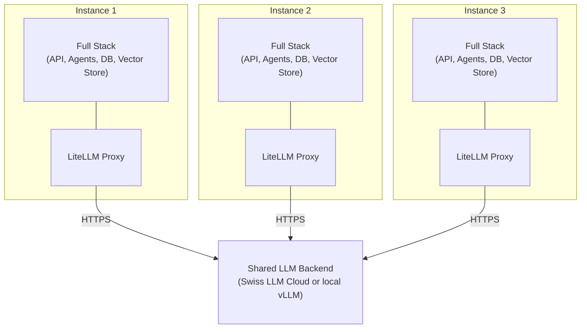

# Deployment-Optionen

## Übersicht

Der AI-Hub kann als eine einzelne isolierte Instanz für eine Organisation oder als mehrere isolierte Instanzen, die
optional Backend-LLM-Ressourcen gemeinsam nutzen, bereitgestellt werden.

::: info Multi-Tenancy vs. Multi-Instancing
Dieses Kapitel beschreibt **Multi-Instancing** (mehrere isolierte AI-Hub-Instanzen). Für **Multi-Tenancy** (mehrere
organisatorische Grenzen innerhalb einer einzelnen Instanz) siehe [Multi-Tenancy](/de/docs/16_multi_tenancy/).

Beide Bereitstellungsmodelle sind gültig und dienen unterschiedlichen Zwecken. Multi-Instancing bietet eine strikte
Isolation zwischen Organisationen, während Multi-Tenancy eine logische Trennung innerhalb einer gemeinsam genutzten
Plattforminstanz bietet.
:::

## Einzelinstanz-Deployment

### Isolierte Instanz

Ein Einzelinstanz-Deployment betreibt eine vollständige, eigenständige AI-Hub-Instanz. Die Organisation erhält eine
dedizierte Infrastruktur: separate Datenbanken, Vektor-Stores, Dateispeicher und Anwendungs-Services.

Die Instanz umfasst die API, Agents, Pipelines, die Weboberfläche und Bot-Integrationen. Sie verfügt über eigene
Datenbanken (FerretDB/PostgreSQL), Vektor-Stores (Milvus) und Dateispeicher (SeaweedFS). Das Monitoring erfolgt über
Langfuse und OpenTelemetry. NATS übernimmt das Event-Streaming. Die Instanz besitzt einen eigenen LiteLLM-Proxy für
Kostenverfolgung und Versionskontrolle.

### LLM-Backend

Die Instanz verbindet sich über ihren LiteLLM-Proxy mit LLM-Services. Nicht-GPU-Deployments werden über die Swiss LLM
Cloud (ein in der Schweiz gehosteter Anbieter) geleitet. GPU-Deployments führen alle Inferenzen lokal über vLLM auf
einer NVIDIA RTX 6000 Pro (96 GB VRAM) aus. Der Proxy verwaltet die Modellauswahl, Budgets, Ratenbegrenzungen und
Versionen. Alle Prompts, Antworten und Benutzerdaten verbleiben innerhalb der Instanz.

______________________________________________________________________

## Hosting-Optionen

Der AI-Hub kann je nach organisatorischen Anforderungen auf drei Arten gehostet werden.

### On-Premise (eigener Server)

Sie betreiben den AI-Hub auf Ihren eigenen Servern in Ihrem Rechenzentrum.

Sie benötigen x86_64-Server mit CPU, RAM und Speicherplatz. NVIDIA-GPUs eignen sich für selbst gehostete LLM-Inferenz.
Für den Netzwerkzugriff ist entweder ausgehendes HTTPS für Cloud-basierte LLM-Services erforderlich oder eine
Air-Gapped-Umgebung mit lokalen Modellen.

Die Infrastruktur liegt unter Ihrer Kontrolle. Keine Cloud-Abhängigkeiten. Funktioniert in Air-Gapped-Umgebungen mit
selbst gehosteten LLMs.

______________________________________________________________________

### Private Cloud (eigene Cloud)

Sie betreiben den AI-Hub in Ihrer eigenen Cloud-Umgebung (Schweizer Cloud-Anbieter, Azure, AWS, GCP).

Die Daten verbleiben in Ihrem Cloud-Konto unter Ihrer Kontrolle. Sie wählen die Region (z.B. Schweiz für Datenresidenz).
Sie verwalten die Cloud-Ressourcen und -Kosten.

Cloud-Anbieter verfügen typischerweise über Sicherheits- und Compliance-Zertifizierungen. Sie benötigen
Internetverbindung für den LLM-Proxy-Zugriff (HTTPS), optional VPN für administrativen Zugriff und privates Netzwerk
zwischen Services (internes DNS).

______________________________________________________________________

### SaaS (Schweizer Cloud-Hosting)

bbv hostet und verwaltet den AI-Hub für Sie auf einer Schweizer Cloud-Infrastruktur.

bbv übernimmt die Infrastrukturprovisionierung, Updates, Backups, Monitoring und operative Aufgaben. Daten verbleiben in
der Schweiz unter Schweizer Rechtshoheit. Sicherheits- und Compliance-Zertifizierungen vom Cloud-Anbieter.

Sie greifen über eine Weboberfläche und APIs auf den AI-Hub zu. bbv bietet SLAs für Verfügbarkeit und Support. Weniger
operativer Aufwand für Ihr Team.

______________________________________________________________________

## Multi-Instanz-Deployment

::: tip Wann Multi-Instancing verwenden
Nutzen Sie mehrere isolierte Instanzen, wenn Sie eine **strikt getrennte Isolation** zwischen Organisationen mit einer
0%igen Wahrscheinlichkeit von Datenlecks benötigen. Zum Beispiel eine Krankenversicherung mit einer medizinischen
Gutachterkommission, die streng vertrauliche Daten verarbeitet, die eine absolute Isolation von der
Hauptversicherungsabteilung erfordern.

Selbst eine Fehlkonfiguration des AI-Hubs kann keine Datenlecks zwischen Instanzen verursachen. Admins einer Instanz
können eine andere Instanz ohne separaten Login weder konfigurieren noch auf diese zugreifen.

Für logische Trennung innerhalb einer gemeinsam genutzten Plattform verwenden Sie stattdessen
[Multi-Tenancy](/de/docs/16_multi_tenancy/).
:::

### Gemeinsames LLM-Backend

Beim Deployment mehrerer Instanzen können diese Backend-LLM-Ressourcen gemeinsam nutzen. Mehrere Instanzen können
dieselben Swiss LLM Cloud-Zugangsdaten verwenden oder einen lokalen vLLM-GPU-Server gemeinsam nutzen. Sie können auch
Authentifizierungsinfrastrukturen wie Azure AD oder Keycloak gemeinsam nutzen.

Jede Instanz verfügt weiterhin über einen eigenen LiteLLM-Proxy. Der Proxy verwaltet die Modellauswahl, Budgets,
Ratenbegrenzungen und Versionen pro Instanz. Die LLM-Nutzung wird pro Instanz verfolgt. Prompts, Antworten und
Benutzerdaten verbleiben innerhalb jeder Instanz.

Die gemeinsam genutzten LLM-Backends sind zustandslos. Sie persistieren weder Prompts noch Antworten.
Konversationskontext und -historie verbleiben in der eigenen Infrastruktur jeder Instanz.

## Merkmale

### Datenisolation

Die Daten jeder Instanz bleiben isoliert. Es gibt keine gemeinsame Datenbank oder Vektor-Store. Daten können nicht
zwischen Organisationen gelangen. Das Setup erfüllt das Schweizer Datenschutzgesetz (revDSG), die GDPR-Anforderungen an
die Datenisolation und die Sicherheitsstandards des Schweizer öffentlichen Sektors.

::: info Multi-Tenancy innerhalb von Instanzen
Jede Instanz kann auch [Multi-Tenancy](/de/docs/16_multi_tenancy/) verwenden, um logische Grenzen für Abteilungen,
Kunden oder Projekte innerhalb dieser Instanz zu schaffen. Multi-Tenancy bietet flexible Zugriffssteuerung bei
gleichzeitiger strikter Isolation zwischen Instanzen.
:::

### Konfiguration

Jede Instanz kann unabhängig konfiguriert werden. Organisationen können benutzerdefinierte Agents, spezialisierte
Pipelines für ihre Datenquellen, eigene Zugriffssteuerung (RBAC, OIDC mit lokalem IdP), benutzerdefinierte
Wissensdatenbanken und dedizierte Authentifizierungsanbieter wie Azure AD oder Keycloak deployen.

### Skalierung und Updates

Die Ressourcenzuweisung erfolgt pro Instanz. Sie skalieren Rechenleistung, Speicher und Storage basierend auf der
tatsächlichen Nutzung. Jede Instanz kann Updates nach eigenem Zeitplan anwenden. Das Testen neuer Funktionen in einer
Instanz hat keine Auswirkungen auf andere. SLAs variieren je nach Vertrag.

### Compliance und Auditing

Auditoren können die Infrastruktur einer einzelnen Instanz überprüfen. Logs und Traces verbleiben innerhalb der Instanz.
Backup-Aufbewahrungsrichtlinien können pro Instanz konfiguriert werden. Penetrationstests können auf einzelne Instanzen
zugeschnitten werden.

## Deployment-Modell

### Einzelinstanz-Infrastruktur

Ein Einzelinstanz-Deployment enthält:

```
AI-Hub Instance
├── Application Layer
│   ├── API Service (FastAPI + WebSocket gateway)
│   ├── Web Interface (Nuxt.js frontend)
│   ├── OpenWebUI (LLM chat interface)
│   ├── Agent Services (RAG, specialized agents)
│   ├── Pipeline Services (Dagster + custom pipelines)
│   └── Bot Service (MS Teams, Slack integrations)
│
├── Data Layer
│   ├── Database (FerretDB + PostgreSQL)
│   ├── Vector Store (Milvus)
│   ├── Document Store (SeaweedFS)
│   └── Cache (Valkey)
│
├── LLM Layer
│   ├── LiteLLM Proxy
│   │   ├── Cost tracking and budgets
│   │   ├── Model routing configuration
│   │   ├── Rate limiting
│   │   └── Version control
│   └── Presidio (PII anonymization)
│
├── Observability Layer
│   ├── Langfuse (LLM tracing, cost tracking, and evaluation)
│   └── OpenTelemetry (distributed tracing)
│
└── Infrastructure Layer
    ├── NATS (message bus)
    ├── MinerU (document processing)
    └── Traefik (reverse proxy + SSL termination)
```

Der LiteLLM-Proxy verbindet sich mit LLM-Services (Swiss LLM Cloud für Nicht-GPU, lokales vLLM für GPU-Deployments).

### Multi-Instanz-Infrastruktur

Beim Deployment mehrerer Instanzen erhält jede Instanz dieselbe oben gezeigte Infrastruktur. Sie können
Backend-LLM-Ressourcen gemeinsam nutzen:

```
Shared LLM Backend Resources
├── Cloud LLM Provider
│   ├── Swiss LLM Cloud credentials (shared API keys)
│   └── Other cloud provider credentials (optional)
│
├── Self-Hosted Model Infrastructure (GPU)
│   └── vLLM deployment (NVIDIA RTX 6000 Pro, 96 GB VRAM)
│
└── Optional Shared Services
    ├── Central Authentication (Azure AD, Keycloak)
    └── Central Monitoring Dashboard (optional)
```

Netzwerkarchitektur:

- Jede Instanz verfügt über einen eigenen LiteLLM-Proxy
- Instanz-LiteLLM-Proxies verbinden sich mit gemeinsam genutzten LLM-Backends (Swiss LLM Cloud oder lokales vLLM)
- Gemeinsam genutzte LLM-Backends verwenden gemeinsame API-Zugangsdaten (konfiguriert pro Instanz-LiteLLM)
- Keine direkte Kommunikation zwischen Instanzen
- Optional: Gemeinsamer Authentifizierungsanbieter (Azure AD, Keycloak)

Datenisolation und Souveränität. Unabhängige Skalierung und Ressourcenzuweisung. Benutzerdefinierte Konfigurationen pro
Instanz. Flexible Update-Zeitpläne. Klare Compliance-Grenzen.

______________________________________________________________________

## Architekturdiagramme

### Einzelinstanz-Deployment



Die Instanz verbindet sich über ihren LiteLLM-Proxy mit LLM-Services.

### Multi-Instanz-Deployment mit gemeinsamem LLM-Backend



Jede Instanz verfügt über einen eigenen LiteLLM-Proxy (unabhängige Kostenverfolgung, Versionierung, Konfiguration). Alle
Instanz-LiteLLM-Proxies verbinden sich mit gemeinsam genutzten LLM-Backend-Ressourcen (Swiss LLM Cloud oder lokales
vLLM). Prompts, Antworten und Benutzerdaten verbleiben innerhalb der Instanzgrenzen.

______________________________________________________________________

## Sicherheitsüberlegungen

### Instanzisolation

Instanzen kommunizieren nicht miteinander. Jede Instanz verfügt über separate Datenbanken, Vektor-Stores und
Dateispeicher. Jede Instanz verbindet sich mit einem eigenen IdP (Azure AD, Keycloak) oder kann einen gemeinsamen IdP
mit separater Namespace-Isolation nutzen. LiteLLM erzwingt API-Schlüssel und Quotas pro Instanz.

### LLM-Proxy-Sicherheit

LiteLLM persistiert keine Prompts oder Antworten (zustandsloser Betrieb). Das API-Schlüsselmanagement umfasst sichere
Schlüsselgenerierung, -rotation und -widerruf. Pro-Instanz-Anfragebegrenzungen verhindern Missbrauch. Alle LLM-Anfragen
werden mit Instanz-ID, aber ohne Prompt-Inhalt protokolliert. Die Presidio-Integration ist optional für die Erkennung
und Redaktion von PII (personenbezogene identifizierbare Informationen).

### Daten während der Übertragung

Die gesamte Kommunikation ist mit TLS verschlüsselt (Instanz zu LLM-Proxy). Das Zertifikatsmanagement verwendet Let's
Encrypt für die Produktion und mkcert für die Entwicklung. Die API-Authentifizierung verwendet Bearer-Tokens (OAuth 2.0,
JWT).

### Ruhende Daten

PostgreSQL verwendet transparente Datenverschlüsselung (TDE). Persistente Volumes werden verschlüsselt (LUKS, Azure Disk
Encryption). Secrets werden über Umgebungsvariablen, Azure Key Vault oder Docker Secrets verwaltet.

______________________________________________________________________

## Nächste Schritte

- [Multi-Tenancy](/de/docs/16_multi_tenancy/) - Logische Trennung innerhalb einer einzelnen Instanz
- [Produktionskonfiguration](/de/docs/2_production_configuration/) - Konfigurationsanleitung für Produktions-Deployments
- [Überlegungen zur Skalierung](/de/docs/3_scaling_considerations/) - Skalierung von Instanzen
- [Backup und Wiederherstellung](/de/docs/4_backup_and_recovery/) - Backup-Strategien für die Pro-Instanz-Architektur
- [Updates und Wartung](/de/docs/6_updates_and_maintenance/) - Verwaltung von Updates über mehrere Instanzen hinweg

______________________________________________________________________

## FAQ

::: details Können Instanzen Agents oder Pipelines teilen?
Nein. Jede Instanz verfügt über einen eigenen isolierten Satz von Agents und Pipelines. Dieselben Agent-Definitionen
(Code) können jedoch über mehrere Instanzen hinweg deployed werden. Anpassungen sind instanzspezifisch.

Für die gemeinsame Nutzung von Agents innerhalb einer Organisation verwenden Sie
[Multi-Tenancy](/de/docs/16_multi_tenancy/), um logische Grenzen innerhalb einer einzelnen Instanz zu schaffen.
:::

::: details Was ist der Unterschied zwischen Multi-Instancing und Multi-Tenancy?
**Multi-Instancing** (dieses Kapitel) bedeutet, mehrere vollständig isolierte AI-Hub-Installationen zu betreiben. Jede
verfügt über separate Datenbanken, Vektor-Stores und Anwendungsserver. Selbst eine Fehlkonfiguration kann keine
Datenlecks zwischen Instanzen verursachen. Verwenden Sie dies, wenn Sie absolute Isolation benötigen (z.B. verschiedene
juristische Einheiten, hochsensible Abteilungen).

**Multi-Tenancy** ([Kapitel 15](/de/docs/16_multi_tenancy/)) bedeutet, organisatorische Grenzen innerhalb einer
einzelnen AI-Hub-Instanz zu schaffen. Mehrere Mandanten teilen sich die Infrastruktur, haben aber eine logische Trennung
durch Zugriffssteuerung. Verwenden Sie dies für Abteilungen, Projekte oder Kunden innerhalb derselben Organisation.

Sie können beides kombinieren: Betreiben Sie mehrere Instanzen (strikte Isolation), wobei jede Instanz Multi-Tenancy
(flexible Trennung innerhalb dieser Instanz) verwendet.
:::

::: details Welche Daten sieht das gemeinsame LLM-Backend?
Jede Instanz verfügt über einen eigenen LiteLLM-Proxy, sodass Prompts und Antworten innerhalb der Instanz verbleiben.
Die gemeinsam genutzten LLM-Backends (Swiss LLM Cloud oder lokales vLLM) sehen API-Anfragen von mehreren
Instanz-LiteLLM-Proxies (zustandslos, nicht persistent), Modellanfragen (Prompts und Completions nur während der
Übertragung), keine Instanzidentifikation oder Kontext und anonymisierte PII-Daten, falls aktiviert.

Sie sehen nicht, welche Instanz die Anfrage gestellt hat, die Konversationshistorie oder gespeicherte Daten. Der gesamte
Kontext verbleibt im LiteLLM-Proxy und in der Datenbank der Instanz.
:::

::: details Kann eine Instanz ausschliesslich selbst gehostete Modelle verwenden?
Ja. Für Air-Gapped- oder vollständige On-Premise-Deployments verwenden Sie die GPU-Variante der docker-compose-Datei.
Alle Inferenzen werden lokal über vLLM auf einer NVIDIA RTX 6000 Pro (96 GB VRAM) ausgeführt, ohne dass eine ausgehende
Internetverbindung erforderlich ist.
:::

::: details Wie werden Kosten pro Instanz verfolgt?
LiteLLM verfolgt die API-Nutzung pro Instanz und Benutzer: Token-Anzahl (Input/Output), Modellnutzung (GPT-4, Gemini
usw.), Kostenberechnungen basierend auf Modellpreisen und monatliche Budgetdurchsetzung.

Die Daten sind in der LiteLLM-Admin-UI verfügbar und für die Abrechnung exportierbar.
:::

::: details Können Instanzen unterschiedlichen LLM-Zugriff haben?
Ja. Die LiteLLM-Konfiguration erlaubt den Modellzugriff pro Instanz. Zum Beispiel könnte Instanz A die Swiss LLM Cloud
mit einer bestimmten Auswahl an Modellen verwenden, Instanz B eine andere Modellauswahl für Flexibilität, und Instanz C
könnte ausschliesslich lokales vLLM für ein Air-Gapped-Deployment verwenden.
:::

::: details Was passiert, wenn der LLM-Proxy nicht verfügbar ist?
Instanzen werden eine Beeinträchtigung LLM-abhängiger Funktionen erfahren. RAG-Agents können keine Antworten generieren.
Embeddings können nicht für neue Dokumente erstellt werden. Vorhandene Daten und die Benutzeroberfläche bleiben jedoch
zugänglich, und Nicht-LLM-Funktionen (Dokumentenupload, RBAC, Observability) funktionieren weiterhin.

Abhilfemassnahme: Deployen Sie LiteLLM mit hoher Verfügbarkeit (mehrere Replikate, Lastverteilung).
:::

::: details Wie verwalten Sie Updates über viele Instanzen hinweg?
Siehe [Updates und Wartung](/de/docs/6_updates_and_maintenance/) für Strategien wie gestaffelte Rollouts (Pilot zu
Produktion), Blue-Green-Deployments, automatisierte Update-Orchestrierung (Ansible, Kubernetes-Operatoren) und
Update-Zeitpläne pro Instanz.
:::

## Zugehörige Dokumentation

- [Multi-Tenancy](/de/docs/16_multi_tenancy/) - Schaffung organisatorischer Grenzen innerhalb einer Instanz
- [Kernkomponenten](/de/docs/2_architecture/1_core_components/) - AI-Hub-Architektur
- [Authentifizierung & Autorisierung](/de/docs/11_access_management/1_authentication_setup/) -
  Authentifizierungskonfiguration
- [Monitoring und Alerting](/de/docs/5_monitoring_and_alerting/) - Observability für Multi-Instanz-Deployments
- [Schweizer Datenschutz](/de/docs/21_compliance/3_dsg/) - revDSG-Compliance für den öffentlichen Sektor
