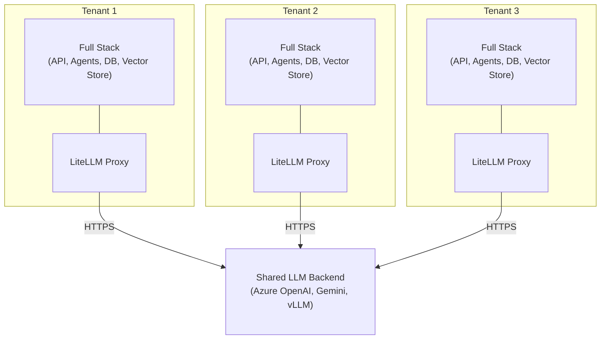

# Deployment Options

## Overview

The AI-Hub uses a multi-instance deployment model where each tenant gets their own isolated infrastructure. This addresses the data sovereignty, security, and compliance needs typical of Swiss organizations.

## Core Deployment Philosophy: Fully Isolated Instances with Shared LLM Backend

### The multi-instance model

Unlike multi-tenant SaaS platforms where customers share application and database infrastructure, the AI-Hub deploys a separate instance per tenant. Each tenant (municipality, canton, department, or organization) gets their own isolated deployment with dedicated components:

Application services include the API, agents, pipelines, web interface, and bot integrations. Data storage covers databases (FerretDB/PostgreSQL) and vector stores (Milvus/Azure AI Search). File storage handles documents via SeaweedFS or Azure Data Lake. The observability stack provides monitoring, tracing, and logging through SigNoz and Phoenix. NATS handles event streaming and communication. Each tenant runs their own LiteLLM proxy instance for independent cost tracking and version control.

### Shared infrastructure: LLM backend resources

While each tenant operates a fully isolated instance (including their own LiteLLM proxy), backend LLM resources can be shared across tenants to reduce costs:

Resources that can be optionally shared include API credentials like Azure OpenAI subscriptions and Google Gemini API keys (accessed via tenant-specific LiteLLM proxies), self-hosted models like centralized vLLM, llama.cpp, or HF-TEI deployments serving multiple tenants, and authentication infrastructure such as a central Azure AD or Keycloak for organizations managing multiple tenant instances.

This hybrid approach reduces costs by sharing expensive LLM API subscriptions and GPU infrastructure. Each tenant still configures their own LiteLLM proxy with their own model selection, budgets, rate limits, and versions. Tenants can use different LiteLLM versions and routing configurations. Each tenant's LLM usage is tracked independently through their LiteLLM proxy. Prompts, responses, and user data never leave the tenant instance.

Shared LLM backends (Azure OpenAI, Google Gemini, self-hosted models) are stateless and do not persist tenant prompts or responses. All conversational context, history, and user data remain within the isolated tenant instance.

## Why this architecture?

This deployment model addresses the data sovereignty and compliance requirements common in Swiss organizations.

### Data sovereignty

Each tenant's data stays within their isolated instance. There's no shared database, no shared vector store, and no way for data to leak between organizations. This covers Swiss Data Protection Law (revDSG), GDPR requirements for data isolation, and Swiss public sector security standards.

### Independent configuration and customization

Each instance can be configured separately. You can deploy custom agents tailored to specific organizational needs, specialized pipelines for unique data sources and formats, organization-specific access control (RBAC, OIDC integration with local IdP), custom knowledge bases and RAG configurations, and dedicated authentication providers like Azure AD or Keycloak.

### Independent scaling and updates

Resource allocation is isolated, so you can scale compute, memory, and storage based on each tenant's actual usage. Update schedules are flexible—each tenant can apply updates at their own pace. You can test new features in one instance without affecting others. SLAs can be adjusted per contract with different uptime guarantees and support levels.

### Simplified compliance and auditing

Data boundaries are clear, so auditors can inspect a single tenant's infrastructure. All logs and traces remain within the tenant instance. Backup policies can be configured per organizational requirements for retention periods. Penetration testing can be scoped to individual instances.

## Deployment model

Each tenant receives a complete, independent AI-Hub deployment.

Infrastructure components per tenant:
```
Tenant Instance
├── Application Layer
│   ├── API Service (FastAPI + WebSocket gateway)
│   ├── Web Interface (Nuxt.js frontend)
│   ├── Agent Services (RAG, specialized agents)
│   ├── Pipeline Services (Dagster + custom pipelines)
│   └── Bot Service (MS Teams, Slack integrations)
│
├── Data Layer
│   ├── Database (FerretDB + PostgreSQL)
│   ├── Vector Store (Milvus or Azure AI Search)
│   └── Document Store (SeaweedFS or Azure Data Lake)
│
├── LLM Layer (Per-Tenant)
│   ├── LiteLLM Proxy (tenant-specific instance)
│   │   ├── Cost tracking and budgets
│   │   ├── Model routing configuration
│   │   ├── Rate limiting
│   │   └── Version control
│   └── Presidio (PII anonymization)
│
├── Observability Layer
│   ├── Phoenix (AI tracing and evaluation)
│   ├── SigNoz (metrics, logs, traces)
│   └── OpenTelemetry Collector
│
└── Infrastructure Layer
    ├── NATS (message bus)
    ├── Docling (document processing)
    └── Traefik (reverse proxy + SSL termination)
```

Shared infrastructure (across all tenants):
```
Shared LLM Backend Resources
├── LLM API Subscriptions
│   ├── Azure OpenAI subscription (shared API keys)
│   ├── Google Gemini API keys
│   └── Other cloud provider credentials
│
├── Self-Hosted Model Infrastructure
│   ├── vLLM deployment (GPU cluster)
│   ├── llama.cpp servers
│   └── HF-TEI instances
│
└── Optional Shared Services
    ├── Central Authentication (Azure AD, Keycloak)
    └── Central Monitoring Dashboard (optional)
```

Network architecture:
- Each tenant has their own LiteLLM proxy instance
- Tenant LiteLLM proxies connect to shared LLM backends (Azure OpenAI, Gemini, self-hosted models)
- Shared LLM backends use common API credentials (configured per tenant's LiteLLM)
- No direct communication between tenant instances
- Optional: Shared authentication provider (Azure AD, Keycloak)

This provides maximum data isolation and sovereignty, independent scaling and resource allocation, custom configurations per tenant, flexible update schedules, and clear compliance boundaries.

---

## Hosting options

The AI-Hub can be hosted in different ways depending on organizational requirements and constraints.

### Option 1: Swiss cloud hosting

Deploy each tenant instance to a Swiss-based cloud provider with full data residency guarantees.

Data remains in Switzerland under Swiss legal jurisdiction. Providers typically offer enterprise security and compliance certifications. Disaster recovery and high availability are simpler to implement than on-premise.

Network requirements include internet connectivity for LLM proxy access (HTTPS), optional VPN for administrative access, and private networking between tenant services (internal DNS).

---

### Option 2: On-premise hosting

Deploy tenant instances entirely within the organization's own data center or server infrastructure.

Requirements include modern x86_64 servers with sufficient CPU, RAM, and storage. NVIDIA GPUs are optional for self-hosted LLM inference. Network access needs outbound HTTPS for shared LLM access, or the system can run fully air-gapped with local models.

This gives complete infrastructure control with no cloud dependencies. You can reuse existing data center infrastructure. It's compatible with air-gapped environments when using self-hosted LLMs.

---

### Option 3: Hybrid deployment

Tenant instance on-premise or in Swiss cloud, with centralized LLM infrastructure in a separate cloud region.

Example scenarios: tenant instance in Swiss cloud or on-premise, shared LLM via Azure OpenAI in EU regions or other LLM providers.

This gives flexibility in infrastructure placement and cost optimization for LLM hosting. You get access to more models. All data stays in Switzerland since LLM access is stateless. PII data can be anonymized via Presidio.

---

## Architecture diagrams

### Multi-instance deployment with shared LLM backend



Each tenant has their own LiteLLM proxy instance (independent cost tracking, versioning, configuration). All tenant LiteLLM proxies connect to shared LLM backend resources (Azure OpenAI subscriptions, self-hosted models). Prompts, responses, and user data stay within tenant boundaries. Shared expensive LLM API subscriptions and GPU infrastructure reduce costs.

---

## Security considerations

### Tenant isolation

Tenant instances do not communicate with each other. Each tenant has separate databases, vector stores, and file storage. Each tenant connects to their own IdP (Azure AD, Keycloak). LiteLLM enforces per-tenant API keys and quotas.

### LLM proxy security

LiteLLM does not persist prompts or responses (stateless operation). API key management includes secure key generation, rotation, and revocation. Per-tenant request limits prevent abuse. All LLM requests are logged with tenant ID but without prompt content. Presidio integration is optional for PII detection and redaction.

### Data in transit

All communication is encrypted with TLS (tenant to LLM proxy). Certificate management uses Let's Encrypt for production and mkcert for development. API authentication uses bearer tokens (OAuth 2.0, JWT).

### Data at rest

PostgreSQL uses transparent data encryption (TDE). Persistent volumes are encrypted (LUKS, Azure Disk Encryption). Secrets are managed via environment variables, Azure Key Vault, or Docker secrets.

---

## Next steps

- [Production Configuration](../2_production_configuration/) - Configuration guide for production deployments
- [Scaling Considerations](../3_scaling_considerations/) - Scaling tenant instances
- [Backup and Recovery](../4_backup_and_recovery/) - Backup strategies for per-tenant architecture
- [Updates and Maintenance](../6_updates_and_maintenance/) - Managing updates across multiple instances

---

## FAQ

::: details Can tenants share agents or pipelines?

No. Each tenant instance has its own isolated set of agents and pipelines. However, the same agent definitions (code) can be deployed across multiple tenant instances. Customizations are tenant-specific.
:::

::: details What data does the shared LLM backend see?

Each tenant has their own LiteLLM proxy, so prompts and responses stay within the tenant instance. The shared LLM backends (Azure OpenAI, Gemini, self-hosted models) see API requests from multiple tenant LiteLLM proxies (stateless, not persisted), model inference requests (prompts and completions in transit only), no tenant identification or context, and anonymous PII data if enabled.

They do not see which tenant made the request, conversational history, or any stored data. All context remains in the tenant's LiteLLM proxy and database.
:::

::: details Can a tenant use self-hosted models exclusively?

Yes. For air-gapped or fully on-premise deployments, you can deploy self-hosted LLMs (vLLM, llama.cpp, HF-TEI), configure LiteLLM to route to local models, and run with no outbound internet connectivity required.
:::

::: details How are costs tracked per tenant?

LiteLLM tracks API usage per tenant and user: token counts (input/output), model usage (GPT-4, Gemini, etc.), cost calculations based on model pricing, and monthly budget enforcement.

Data is available in the LiteLLM admin UI and exportable for billing.
:::

::: details Can tenants have different LLM access?

Yes. LiteLLM configuration allows per-tenant model access. For example, Tenant A might only use GPT-4o for strict compliance, Tenant B might use GPT-4o plus Gemini 2.0 for more flexibility, and Tenant C might use self-hosted models only for air-gapped deployment.

:::

::: details What happens if the LLM proxy is unavailable?

Tenant instances will experience LLM-dependent feature degradation. RAG agents cannot generate responses. Embeddings cannot be created for new documents. However, existing data and UI remain accessible, and non-LLM features (document upload, RBAC, observability) continue working.

Mitigation: Deploy LiteLLM with high availability (multiple replicas, load balancing).
:::

::: details How do you manage updates across many tenant instances?

See [Updates and Maintenance](../6_updates_and_maintenance/) for strategies including phased rollouts (pilot to production), blue-green deployments, automated update orchestration (Ansible, Kubernetes operators), and per-tenant update schedules.

:::

## Related documentation

- [Core Components](../../2_architecture/1_core_components/) - AI-Hub architecture
- [Authentication & Authorization](../../11_access_management/1_authentication_setup/) - Tenant authentication configuration
- [Monitoring and Alerting](../5_monitoring_and_alerting/) - Observability for multi-instance deployments
- [Swiss Data Protection](../../19_compliance/3_dsg/) - revDSG compliance for public sector