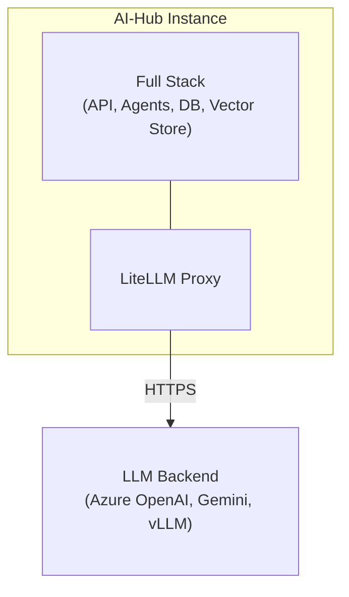
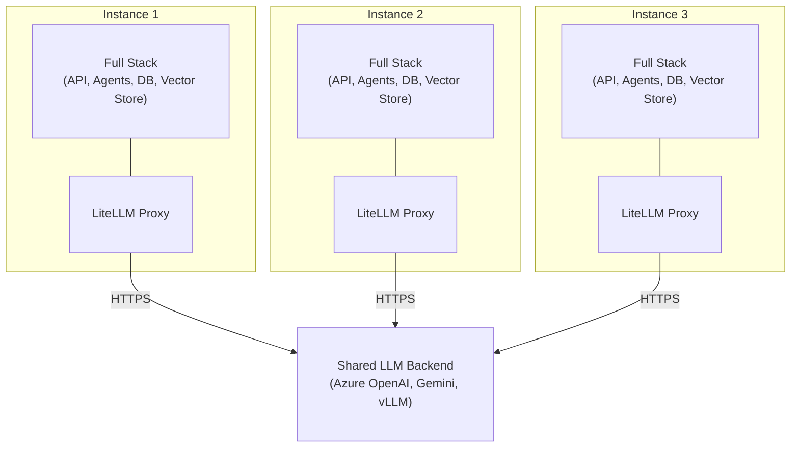

# Deployment Options

## Overview

The AI-Hub can be deployed as a single isolated instance for one organization, or as multiple isolated instances that
optionally share backend LLM resources.

::: info Multi-tenancy vs Multi-instancing
This chapter describes **multi-instancing** (multiple isolated AI-Hub instances). For **multi-tenancy** (multiple
organizational boundaries within a single instance), see [Multi-tenancy](../../16_multi_tenancy/).

Both deployment models are valid and serve different purposes. Multi-instancing provides hard isolation between
organizations, while multi-tenancy provides logical separation within a shared platform instance.
:::

## Single instance deployment

### Isolated instance

A single instance deployment runs a complete, self-contained AI-Hub instance. The organization gets dedicated
infrastructure: separate databases, vector stores, file storage, and application services.

The instance includes the API, agents, pipelines, web interface, and bot integrations. It has its own databases
(FerretDB/PostgreSQL), vector stores (Milvus or Azure AI Search), and file storage (SeaweedFS or Azure Data Lake).
Monitoring runs through SigNoz and Langfuse. NATS handles event streaming. The instance has its own LiteLLM proxy for
cost tracking and version control.

### LLM backend

The instance connects to LLM services via its LiteLLM proxy. The proxy can connect to Azure OpenAI, Google Gemini,
self-hosted models (vLLM, llama.cpp, HF-TEI), or a mix of these. The proxy handles model selection, budgets, rate
limits, and versions. All prompts, responses, and user data stay within the instance.

---

## Hosting options

The AI-Hub can be hosted in three ways depending on organizational requirements.

### On-premise (bring your own server)

You run the AI-Hub on your own servers in your data center.

You need x86_64 servers with CPU, RAM, and storage. NVIDIA GPUs work for self-hosted LLM inference. For network access,
either outbound HTTPS for cloud-based LLM services, or air-gapped with local models.

Infrastructure is under your control. No cloud dependencies. Works in air-gapped environments with self-hosted LLMs.

---

### Private cloud (bring your own cloud)

You run the AI-Hub in your own cloud environment (Swiss cloud provider, Azure, AWS, GCP).

Data stays in your cloud account under your control. You choose the region (e.g., Switzerland for data residency). You
manage the cloud resources and costs.

Cloud providers typically have security and compliance certifications. You need internet connectivity for LLM proxy
access (HTTPS), optionally VPN for administrative access, and private networking between services (internal DNS).

---

### SaaS (Swiss cloud hosting)

bbv hosts and manages the AI-Hub for you on Swiss-based cloud infrastructure.

bbv handles infrastructure provisioning, updates, backups, monitoring, and operational tasks. Data stays in Switzerland
under Swiss legal jurisdiction. Security and compliance certifications from the cloud provider.

You access the AI-Hub through a web interface and APIs. bbv provides SLAs for uptime and support. Less operational
overhead for your team.

---

## Multi-instance deployment

::: tip When to use multi-instancing
Use multiple isolated instances when you need **hard separation** between organizations with 0% chance of data leakage.
For example, a health insurance company with a medical review commission that handles top-secret data requiring absolute
isolation from the main insurance department.

Even a misconfiguration of the AI-Hub cannot cause data leakage between instances. Admins from one instance cannot
configure or access another instance without a separate login.

For logical separation within a shared platform, use [multi-tenancy](../../16_multi_tenancy/) instead.
:::

### Shared LLM backend

When deploying multiple instances, they can share backend LLM resources. Multiple instances use the same Azure OpenAI
subscription, Google Gemini API keys, or self-hosted models. They can also share authentication infrastructure like
Azure AD or Keycloak.

Each instance still has their own LiteLLM proxy. The proxy handles model selection, budgets, rate limits, and versions
per instance. LLM usage is tracked per instance. Prompts, responses, and user data stay within each instance.

The shared LLM backends are stateless. They don't persist prompts or responses. Conversational context and history
remain in each instance's own infrastructure.

## Characteristics

### Data isolation

Each instance's data stays isolated. There's no shared database or vector store. Data can't leak between organizations.
The setup meets Swiss Data Protection Law (revDSG), GDPR data isolation requirements, and Swiss public sector security
standards.

::: info Multi-tenancy within instances
Each instance can also use [multi-tenancy](../../16_multi_tenancy/) to create logical boundaries for departments,
customers, or projects within that instance. Multi-tenancy provides flexible access control while maintaining hard
isolation between instances.
:::

### Configuration

Each instance can be configured independently. Organizations can deploy custom agents, specialized pipelines for their
data sources, their own access control (RBAC, OIDC with local IdP), custom knowledge bases, and dedicated authentication
providers like Azure AD or Keycloak.

### Scaling and updates

Resource allocation is per-instance. You scale compute, memory, and storage based on actual usage. Each instance can
apply updates on their own schedule. Testing new features in one instance doesn't affect others. SLAs vary per contract.

### Compliance and auditing

Auditors can inspect a single instance's infrastructure. Logs and traces stay within the instance. Backup retention
policies can be configured per instance. Penetration testing can be scoped to individual instances.

## Deployment model

### Single instance infrastructure

A single instance deployment contains:

```
AI-Hub Instance
├── Application Layer
│   ├── API Service (FastAPI + WebSocket gateway)
│   ├── Web Interface (Nuxt.js frontend)
│   ├── OpenWebUI (LLM chat interface)
│   ├── Agent Services (RAG, specialized agents)
│   ├── Pipeline Services (Dagster + custom pipelines)
│   └── Bot Service (MS Teams, Slack integrations)
│
├── Data Layer
│   ├── Database (FerretDB + PostgreSQL)
│   ├── Vector Store (Milvus or Azure AI Search)
│   ├── Document Store (SeaweedFS or Azure Data Lake)
│   └── Cache (Valkey)
│
├── LLM Layer
│   ├── LiteLLM Proxy
│   │   ├── Cost tracking and budgets
│   │   ├── Model routing configuration
│   │   ├── Rate limiting
│   │   └── Version control
│   └── Presidio (PII anonymization)
│
├── Observability Layer
│   ├── Langfuse (LLM tracing, cost tracking, and evaluation)
│   └── OpenTelemetry (distributed tracing)
│
└── Infrastructure Layer
    ├── NATS (message bus)
    ├── Docling (document processing)
    └── Traefik (reverse proxy + SSL termination)
```

The LiteLLM proxy connects to LLM services (Azure OpenAI, Google Gemini, self-hosted models).

### Multi-instance infrastructure

When deploying multiple instances, each instance gets the same infrastructure shown above. They can share backend LLM
resources:

```
Shared LLM Backend Resources
├── LLM API Subscriptions
│   ├── Azure OpenAI subscription (shared API keys)
│   ├── Google Gemini API keys
│   └── Other cloud provider credentials
│
├── Self-Hosted Model Infrastructure
│   ├── vLLM deployment (GPU cluster)
│   ├── llama.cpp servers
│   └── HF-TEI instances
│
└── Optional Shared Services
    ├── Central Authentication (Azure AD, Keycloak)
    └── Central Monitoring Dashboard (optional)
```

Network architecture:

- Each instance has their own LiteLLM proxy
- Instance LiteLLM proxies connect to shared LLM backends (Azure OpenAI, Gemini, self-hosted models)
- Shared LLM backends use common API credentials (configured per instance's LiteLLM)
- No direct communication between instances
- Optional: Shared authentication provider (Azure AD, Keycloak)

Data isolation and sovereignty. Independent scaling and resource allocation. Custom configurations per instance.
Flexible update schedules. Clear compliance boundaries.

---

## Architecture diagrams

### Single instance deployment



The instance connects to LLM services via its LiteLLM proxy.

### Multi-instance deployment with shared LLM backend



Each instance has their own LiteLLM proxy (independent cost tracking, versioning, configuration). All instance LiteLLM
proxies connect to shared LLM backend resources (Azure OpenAI subscriptions, self-hosted models). Prompts, responses,
and user data stay within instance boundaries.

---

## Security considerations

### Instance isolation

Instances do not communicate with each other. Each instance has separate databases, vector stores, and file storage.
Each instance connects to their own IdP (Azure AD, Keycloak) or can share a common IdP with separate namespace
isolation. LiteLLM enforces per-instance API keys and quotas.

### LLM proxy security

LiteLLM does not persist prompts or responses (stateless operation). API key management includes secure key generation,
rotation, and revocation. Per-instance request limits prevent abuse. All LLM requests are logged with instance ID but
without prompt content. Presidio integration is optional for PII detection and redaction.

### Data in transit

All communication is encrypted with TLS (instance to LLM proxy). Certificate management uses Let's Encrypt for
production and mkcert for development. API authentication uses bearer tokens (OAuth 2.0, JWT).

### Data at rest

PostgreSQL uses transparent data encryption (TDE). Persistent volumes are encrypted (LUKS, Azure Disk Encryption).
Secrets are managed via environment variables, Azure Key Vault, or Docker secrets.

---

## Next steps

- [Multi-tenancy](../../16_multi_tenancy/) - Logical separation within a single instance
- [Production Configuration](../2_production_configuration/) - Configuration guide for production deployments
- [Scaling Considerations](../3_scaling_considerations/) - Scaling instances
- [Backup and Recovery](../4_backup_and_recovery/) - Backup strategies for per-instance architecture
- [Updates and Maintenance](../6_updates_and_maintenance/) - Managing updates across multiple instances

---

## FAQ

::: details Can instances share agents or pipelines?
No. Each instance has its own isolated set of agents and pipelines. However, the same agent definitions (code) can be
deployed across multiple instances. Customizations are instance-specific.

For sharing agents within an organization, use [multi-tenancy](../../16_multi_tenancy/) to create logical boundaries
within a single instance.
:::

::: details What's the difference between multi-instancing and multi-tenancy?
**Multi-instancing** (this chapter) means running multiple completely isolated AI-Hub installations. Each has separate
databases, vector stores, and application servers. Even a misconfiguration cannot cause data leakage between instances.
Use this when you need absolute isolation (e.g., different legal entities, highly sensitive departments).

**Multi-tenancy** ([chapter 15](../../16_multi_tenancy/)) means creating organizational boundaries within a single
AI-Hub instance. Multiple tenants share infrastructure but have logical separation through access control. Use this for
departments, projects, or customers within the same organization.

You can combine both: Run multiple instances (hard isolation) where each instance uses multi-tenancy (flexible
separation within that instance).
:::

::: details What data does the shared LLM backend see?
Each instance has their own LiteLLM proxy, so prompts and responses stay within the instance. The shared LLM backends
(Azure OpenAI, Gemini, self-hosted models) see API requests from multiple instance LiteLLM proxies (stateless, not
persisted), model inference requests (prompts and completions in transit only), no instance identification or context,
and anonymous PII data if enabled.

They do not see which instance made the request, conversational history, or any stored data. All context remains in the
instance's LiteLLM proxy and database.
:::

::: details Can an instance use self-hosted models exclusively?
Yes. For air-gapped or fully on-premise deployments, you can deploy self-hosted LLMs (vLLM, llama.cpp, HF-TEI),
configure LiteLLM to route to local models, and run with no outbound internet connectivity required.
:::

::: details How are costs tracked per instance?
LiteLLM tracks API usage per instance and user: token counts (input/output), model usage (GPT-4, Gemini, etc.), cost
calculations based on model pricing, and monthly budget enforcement.

Data is available in the LiteLLM admin UI and exportable for billing.
:::

::: details Can instances have different LLM access?
Yes. LiteLLM configuration allows per-instance model access. For example, Instance A might only use GPT-4o for strict
compliance, Instance B might use GPT-4o plus Gemini 2.0 for more flexibility, and Instance C might use self-hosted
models only for air-gapped deployment.
:::

::: details What happens if the LLM proxy is unavailable?
Instances will experience LLM-dependent feature degradation. RAG agents cannot generate responses. Embeddings cannot be
created for new documents. However, existing data and UI remain accessible, and non-LLM features (document upload, RBAC,
observability) continue working.

Mitigation: Deploy LiteLLM with high availability (multiple replicas, load balancing).
:::

::: details How do you manage updates across many instances?
See [Updates and Maintenance](../6_updates_and_maintenance/) for strategies including phased rollouts (pilot to
production), blue-green deployments, automated update orchestration (Ansible, Kubernetes operators), and per-instance
update schedules.
:::

## Related documentation

- [Multi-tenancy](../../16_multi_tenancy/) - Creating organizational boundaries within an instance
- [Core Components](../../2_architecture/1_core_components/) - AI-Hub architecture
- [Authentication & Authorization](../../11_access_management/1_authentication_setup/) - Authentication configuration
- [Monitoring and Alerting](../5_monitoring_and_alerting/) - Observability for multi-instance deployments
- [Swiss Data Protection](../../21_compliance/3_dsg/) - revDSG compliance for public sector
