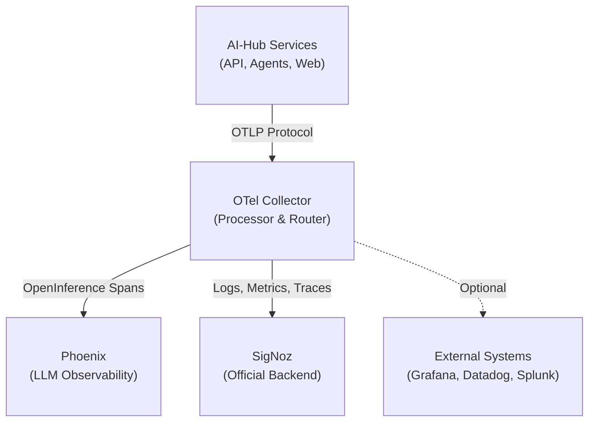
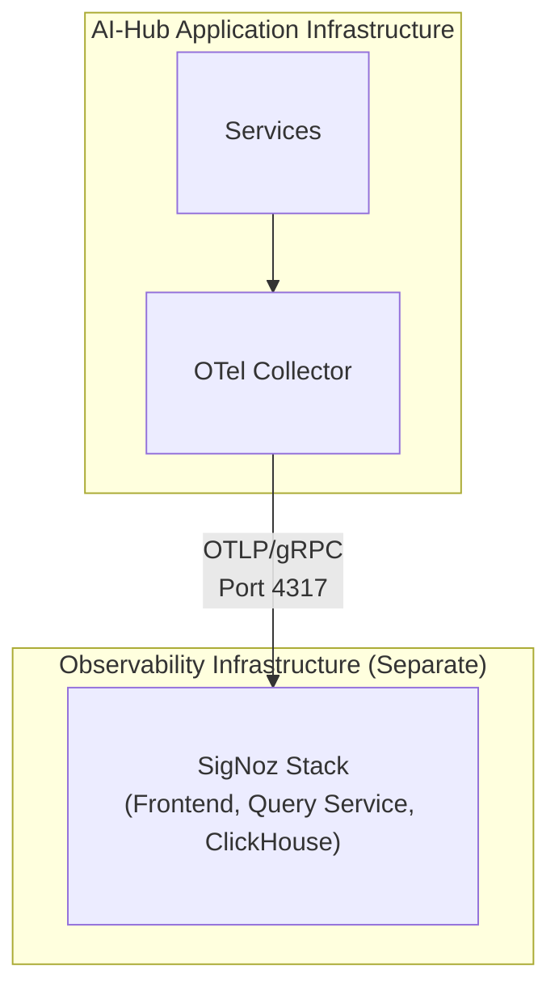

# Externe Log-Aggregation

Die Observability-Architektur des Swiss AI-Hub basiert auf **OpenTelemetry**, wodurch Sie Logs, Metriken und Traces in externe Systeme für zentralisierte Verwaltung, Langzeitarchivierung und erweiterte Analysen exportieren können. Obwohl die Plattform vorkonfiguriert ist, um mit **SigNoz** als offiziell unterstütztem Backend zu arbeiten, stellt die OpenTelemetry-Grundlage sicher, dass Sie nie an einen einzelnen Anbieter gebunden sind.

## Architekturübersicht

Alle Telemetriedaten fließen durch einen zentralen **OpenTelemetry Collector**, der als Verarbeitungs- und Routing-Hub fungiert:



Der Collector empfängt Telemetriedaten über das **OpenTelemetry Protocol (OTLP)**, verarbeitet sie (Filterung, Batching, Anreicherung) und exportiert sie an ein oder mehrere Backends. Diese Architektur bietet mehrere wesentliche Vorteile:

- **Zentrale Steuerung**: Ein zentraler Punkt zur Konfiguration von Datenflüssen und Transformationen
- **Leistung**: Batching und Komprimierung reduzieren den Netzwerk-Overhead
- **Flexibilität**: Verschiedene Datentypen an verschiedene Backends routen
- **Ausfallsicherheit**: Integrierte Wiederholungsversuche und Warteschlangen bewältigen temporäre Ausfälle

## SigNoz: Das offizielle Backend

**SigNoz** ist das offiziell unterstützte Observability-Backend für den Swiss AI-Hub. Es ist eine Open-Source, OpenTelemetry-native Plattform, die vereinheitlichte Logs, Metriken und Traces in einer einzigen Oberfläche bereitstellt.

### Warum SigNoz?

- **OpenTelemetry Native**: Von Grund auf auf OTel-Standards aufgebaut
- **Vereinheitlichte Observability**: Logs, Metriken und Traces in einer Plattform
- **Kosteneffizient**: Open-Source mit vorhersehbaren Preisen
- **Volltextsuche**: Leistungsstarke Log-Abfrage und -Filterung
- **Verteilte Traces**: End-to-End-Visualisierung von Anforderungsabläufen
- **Benutzerdefinierte Dashboards**: Vorgefertigte und anpassbare Visualisierungen
- **Flexible Warnmeldungen**: Multi-Channel-Benachrichtigungen (E-Mail, Slack, Teams, PagerDuty)

### Bereitstellungsoptionen

Die Plattform unterstützt zwei SigNoz-Bereitstellungsmodelle:

#### SigNoz Cloud (Am einfachsten)

SigNoz bietet einen vollständig verwalteten Cloud-Dienst mit regionalen Endpunkten (EU, US, IN). Der AI-Hub ist vorkonfiguriert, um SigNoz Cloud zu verwenden – Sie müssen lediglich Ihren Ingestion Key und den regionalen Endpunkt über Umgebungsvariablen bereitstellen:

```bash
OTEL_CLOUD_ENDPOINT="ingest.eu.signoz.cloud:443"
OTEL_CLOUD_HEADERS="{'signoz-ingestion-key':<your_key>}"
```

#### Selbst gehostetes SigNoz (Für Produktion empfohlen)

Für Produktions-Deployments wird die **Selbst-Haltung von SigNoz auf einer dedizierten VM** aus mehreren Gründen dringend empfohlen:

- **Leistungsisolation**: Der Observability-Overhead beeinflusst die Anwendungsleistung nicht
- **Hohe Verfügbarkeit**: Die Anwendung läuft weiter, auch wenn das Monitoring fehlschlägt
- **Datensouveränität**: Volle Kontrolle über Speicherort und Aufbewahrung von Telemetriedaten
- **Sicherheit**: Netzwerkisolation zwischen Anwendungs- und Observability-Ebenen



SigNoz kann mit Docker Compose auf einer separaten VM mit entsprechenden Ressourcen (4+ CPU-Kerne, 8+ GB RAM, 100+ GB Speicher) bereitgestellt werden. Der OTel Collector des AI-Hub wird dann so konfiguriert, dass er auf den selbst gehosteten Endpunkt anstelle von SigNoz Cloud zeigt.

## Datenerfassung

Die Plattform sammelt und exportiert automatisch:

### Logs
- **Anwendungsprotokolle**: Strukturierte JSON-Protokolle von allen Python-Diensten (INFO, WARNING, ERROR, CRITICAL)
- **Container-Protokolle**: Alle stdout/stderr-Ausgaben von Docker-Containern
- **Zugriffsprotokolle**: HTTP-Anfragen und -Antworten vom API-Gateway
- **Sicherheitsprotokolle**: Authentifizierungsereignisse und Berechtigungsprüfungen

### Traces
- **Verteilte Traces**: End-to-End-Anforderungsabläufe über Dienste hinweg (API → Agent → LLM → Datenbank)
- **OpenInference Traces**: LLM-spezifische Spans mit Prompt-/Response-Inhalt, Token-Nutzung und Kosten

::: info Duale Tracing-Strategie
OpenInference Traces werden **sowohl** an Phoenix (lokales, spezialisiertes LLM-Debugging) als auch an SigNoz (Cloud, Langzeitspeicherung und Korrelation) gesendet. Dieser duale Ansatz bietet sofortige Debugging-Fähigkeiten bei gleichzeitiger umfassender Observability.
:::

### Metriken
- **Infrastrukturmetriken** (geplant): CPU, Speicher, Netzwerk, Disk-I/O pro Container
- **Anwendungsmetriken** (geplant): API-Latenz, Fehlerraten, Agent-Ausführungszeiten
- **Geschäftsmetriken**: Aktive Sitzungen, Dokumentenverarbeitungsdurchsatz, Kosten pro Operation

## Konfiguration

Der OTel Collector wird über `/configs/otel/otel-collector-config.dev.yaml` konfiguriert. Die Standardkonfiguration umfasst:

- **Generischer Cloud-Exporter**: Zur Flexibilität über Umgebungsvariablen konfiguriert
- **Filterung**: Entfernt „laute“ Health-Check- und Datenbank-Spans
- **Batching**: Optimiert die Netzwerknutzung durch Batching von Telemetriedaten
- **Wiederholungslogik**: Behandelt temporäre Netzwerkausfälle
- **Komprimierung**: Reduziert die Bandbreite mit Gzip-Komprimierung

Alle Backends werden über Umgebungsvariablen konfiguriert, was den Wechsel zwischen SigNoz Cloud, selbst gehostetem SigNoz oder alternativen Backends ohne Codeänderungen erleichtert.

## Alternative Backends

Obwohl **SigNoz das offiziell unterstützte Backend ist**, ermöglicht Ihnen die OpenTelemetry-Grundlage, Daten an jedes OTel-kompatible System zu senden.
Um ein alternatives Backend zu verwenden, aktualisieren Sie die Umgebungsvariablen so, dass sie auf den OTLP-Endpunkt Ihres gewählten Systems zeigen. Einige Backends erfordern möglicherweise zusätzliche Exporter-Konfigurationen in der OTel Collector-Konfigurationsdatei.

---

## Nächste Schritte

- Erkunden Sie die [SigNoz-Dokumentation](https://signoz.io/docs/) für Abfrage-Builder und Alarmkonfiguration
- Überprüfen Sie die [OpenTelemetry Collector-Dokumentation](https://opentelemetry.io/docs/collector/) für erweiterte Konfiguration
- Konfigurieren Sie die [Phoenix LLM Observability](../../../10_chat_ui/10_observability/) für KI-spezifisches Debugging
- Richten Sie [Kostenverfolgung](../../../14_cost_control/) für die Überwachung der LLM-Nutzung ein
