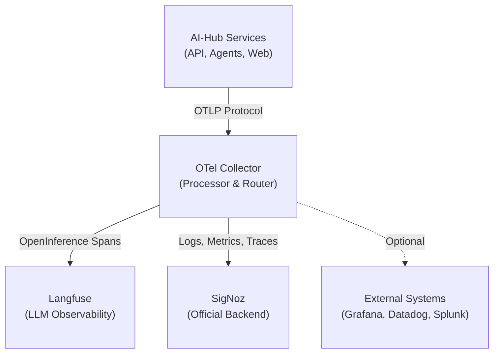
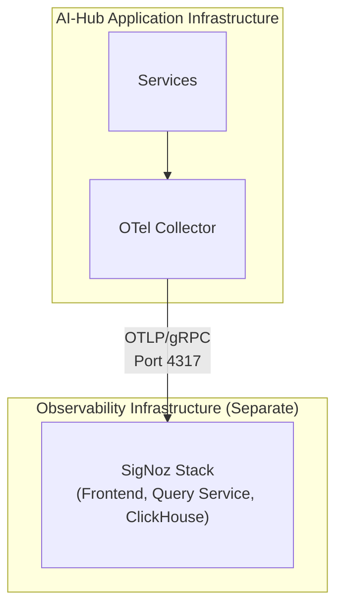

# Externe Log-Aggregation

Die Observability-Architektur des Swiss AI-Hub basiert auf **OpenTelemetry** und ermöglicht Ihnen den Export von Logs,
Metriken und Traces in externe Systeme für zentralisiertes Management, langfristige Speicherung und erweiterte Analysen.
Obwohl die Plattform vorkonfiguriert ist, um mit **SigNoz** als offiziell unterstütztem Backend zu arbeiten, stellt die
OpenTelemetry-Grundlage sicher, dass Sie nie an einen einzelnen Anbieter gebunden sind.

## Architekturübersicht

Die gesamte Telemetrie fließt durch einen zentralen **OpenTelemetry Collector**, der als Verarbeitungs- und Routing-Hub
fungiert:



Der Collector empfängt Telemetriedaten über das **OpenTelemetry Protocol (OTLP)**, verarbeitet sie (Filterung, Batching,
Anreicherung) und exportiert sie an ein oder mehrere Backends. Diese Architektur bietet mehrere wesentliche Vorteile:

- **Zentralisierte Kontrolle**: Ein einziger Punkt zur Konfiguration von Datenflüssen und Transformationen
- **Performance**: Batching und Komprimierung reduzieren den Netzwerk-Overhead
- **Flexibilität**: Weiterleitung verschiedener Datentypen an unterschiedliche Backends
- **Resilienz**: Integrierte Wiederholungsversuche und Warteschlangen bewältigen temporäre Ausfälle

## SigNoz: Das offizielle Backend

**SigNoz** ist das offiziell unterstützte Observability-Backend für den Swiss AI-Hub. Es ist eine Open-Source-,
OpenTelemetry-native Plattform, die vereinheitlichte Logs, Metriken und Traces in einer einzigen Oberfläche
bereitstellt.

### Warum SigNoz?

- **OpenTelemetry Native**: Von Grund auf auf OTel-Standards aufgebaut
- **Vereinheitlichte Observability**: Logs, Metriken und Traces auf einer Plattform
- **Kosteneffizient**: Open Source mit vorhersehbaren Preisen
- **Volltextsuche**: Leistungsstarke Log-Abfrage und -Filterung
- **Distributed Tracing**: End-to-End-Visualisierung des Anfrageflusses
- **Benutzerdefinierte Dashboards**: Vorgefertigte und anpassbare Visualisierungen
- **Flexible Benachrichtigungen**: Multi-Kanal-Benachrichtigungen (E-Mail, Slack, Teams, PagerDuty)

### Deployment-Optionen

Die Plattform unterstützt zwei SigNoz-Deployment-Modelle:

#### SigNoz Cloud (Am einfachsten)

SigNoz bietet einen vollständig verwalteten Cloud-Service mit regionalen Endpunkten (EU, US, IN). Der AI-Hub ist
vorkonfiguriert, um SigNoz Cloud zu verwenden – Sie müssen lediglich Ihren Ingestion Key und den regionalen Endpunkt
über Umgebungsvariablen bereitstellen:

```bash
OTEL_CLOUD_ENDPOINT="ingest.eu.signoz.cloud:443"
OTEL_CLOUD_HEADERS="{'signoz-ingestion-key':<your_key>}"
```

#### Self-Hosted SigNoz (Für Produktion empfohlen)

Für Produktions-Deployments wird **das Self-Hosting von SigNoz auf einer dedizierten VM** aus mehreren Gründen dringend
empfohlen:

- **Performance-Isolation**: Observability-Overhead beeinträchtigt die Anwendungs-Performance nicht
- **Hohe Verfügbarkeit**: Die Anwendung läuft auch bei Ausfall des Monitorings weiter
- **Datenhoheit**: Volle Kontrolle über Speicherort und Aufbewahrung von Telemetriedaten
- **Sicherheit**: Netzwerkisolation zwischen Anwendungs- und Observability-Ebenen



SigNoz kann mittels Docker Compose auf einer separaten VM mit entsprechenden Ressourcen (4+ CPU-Kerne, 8+ GB RAM, 100+
GB Speicher) deployed werden. Der OTel Collector des AI-Hub wird dann so konfiguriert, dass er auf den selbst gehosteten
Endpunkt anstatt auf SigNoz Cloud verweist.

## Datenerfassung

Die Plattform sammelt und exportiert automatisch:

### Logs

- **Anwendungs-Logs**: Strukturierte JSON-Logs von allen Python Services (INFO, WARNING, ERROR, CRITICAL)
- **Container-Logs**: Alle stdout/stderr-Ausgaben von Docker-Containern
- **Zugriffs-Logs**: HTTP-Anfragen und -Antworten vom API Gateway
- **Sicherheits-Logs**: Authentifizierungsereignisse und Berechtigungsprüfungen

### Traces

- **Distributed Traces**: End-to-End-Anfrageflüsse über Services hinweg (API → Agent → LLM → Datenbank)
- **OpenInference Traces**: LLM-spezifische Spans mit Prompt-/Response-Inhalt, Token-Nutzung und Kosten

::: info Dual-Tracing-Strategie
OpenInference-Traces werden **sowohl** an Langfuse (lokales, spezialisiertes LLM-Debugging) als auch an SigNoz (Cloud,
Langzeitspeicherung und Korrelation) gesendet. Dieser duale Ansatz bietet sofortige Debugging-Fähigkeiten bei
gleichzeitiger umfassender Observability.
:::

### Metriken

- **Infrastruktur-Metriken** (geplant): CPU, Arbeitsspeicher, Netzwerk, Disk I/O pro Container
- **Anwendungs-Metriken** (geplant): API-Latenz, Fehlerraten, Agent-Ausführungszeiten
- **Business-Metriken**: Aktive Sessions, Dokumentenverarbeitungsdurchsatz, Kosten pro Operation

## Konfiguration

Der OTel Collector wird über `/configs/otel/otel-collector-config.dev.yaml` konfiguriert. Die Standardkonfiguration
umfasst:

- **Generischer Cloud Exporter**: Konfiguriert über Umgebungsvariablen für Flexibilität
- **Filterung**: Entfernt überflüssige Health-Check- und Datenbank-Spans
- **Batching**: Optimiert die Netzwerknutzung durch Batching von Telemetriedaten
- **Retry-Logik**: Behandelt temporäre Netzwerkausfälle
- **Komprimierung**: Reduziert die Bandbreite mit gzip-Kompression

Alle Backends werden über Umgebungsvariablen konfiguriert, was den einfachen Wechsel zwischen SigNoz Cloud, selbst
gehostetem SigNoz oder alternativen Backends ohne Codeänderungen ermöglicht.

## Alternative Backends

Obwohl **SigNoz das offiziell unterstützte Backend ist**, ermöglicht die OpenTelemetry-Grundlage, Daten an jedes
OTel-kompatible System zu senden. Um ein alternatives Backend zu verwenden, aktualisieren Sie die Umgebungsvariablen, um
auf den OTLP-Endpunkt Ihres gewählten Systems zu verweisen. Einige Backends erfordern möglicherweise eine zusätzliche
Exporter-Konfiguration in der OTel Collector Konfigurationsdatei.

______________________________________________________________________

## Nächste Schritte

- Erkunden Sie die [SigNoz-Dokumentation](https://signoz.io/docs/) für Query Builder und Alert-Konfiguration
- Lesen Sie die [OpenTelemetry Collector-Dokumentation](https://opentelemetry.io/docs/collector/) für erweiterte
  Konfiguration
- Konfigurieren Sie [Langfuse LLM Observability](../../../10_chat_ui/10_observability/) für AI-spezifisches Debugging
- Richten Sie [Kosten-Tracking](../../../14_cost_control/) für die Überwachung der LLM-Nutzung ein
