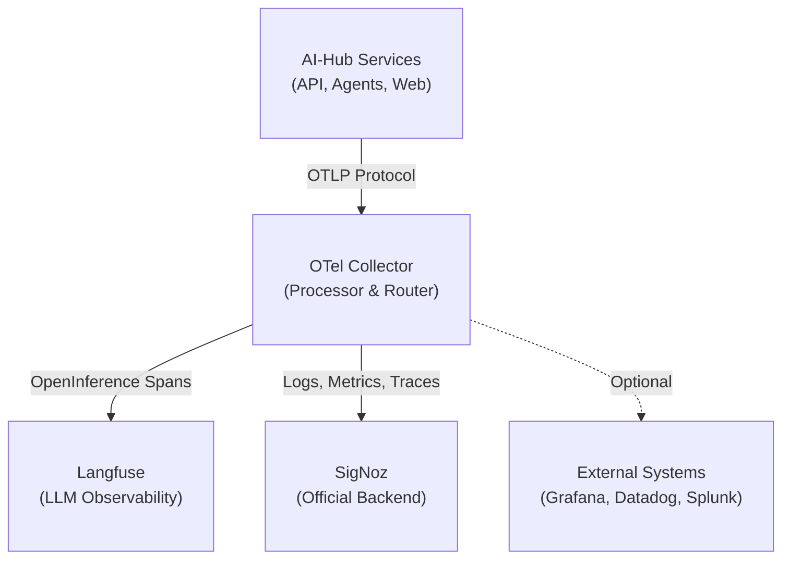
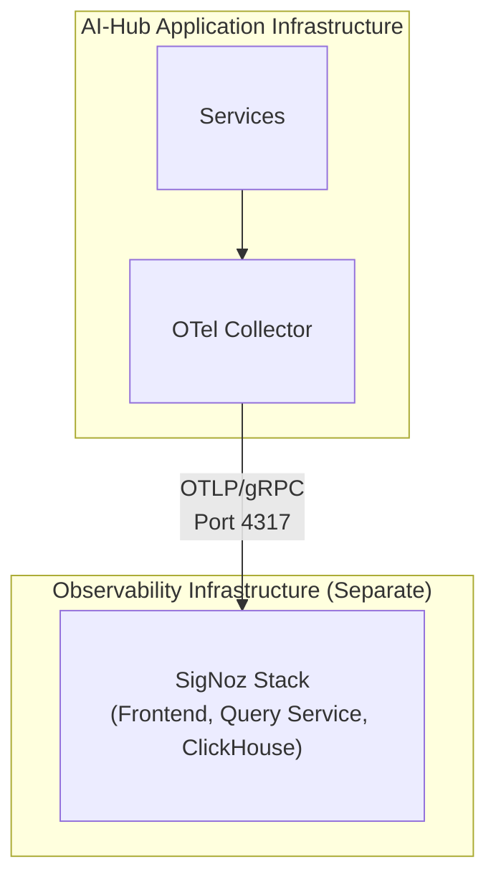

# Externe Log-Aggregation

Die Beobachtbarkeitsarchitektur des Swiss AI-Hubs basiert auf **OpenTelemetry**, wodurch Sie Logs, Metriken und Traces
in externe Systeme für zentralisierte Verwaltung, Langzeitarchivierung und erweiterte Analysen exportieren können.
Während die Plattform vorkonfiguriert ist, um mit **SigNoz** als offiziell unterstütztem Backend zu arbeiten, stellt die
OpenTelemetry-Grundlage sicher, dass Sie nie an einen einzigen Anbieter gebunden sind.

## Architekturübersicht

Alle Telemetriedaten fließen durch einen zentralen **OpenTelemetry Collector**, der als Verarbeitungs- und Routing-Hub
fungiert:



Der Collector empfängt Telemetriedaten über das **OpenTelemetry Protocol (OTLP)**, verarbeitet sie (Filterung, Batching,
Anreicherung) und exportiert sie an ein oder mehrere Backends. Diese Architektur bietet mehrere wesentliche Vorteile:

- **Zentrale Steuerung**: Ein einziger Punkt zur Konfiguration von Datenflüssen und Transformationen
- **Performance**: Batching und Komprimierung reduzieren den Netzwerk-Overhead
- **Flexibilität**: Verschiedene Datentypen an verschiedene Backends leiten
- **Resilienz**: Integrierte Wiederholungsversuche und Warteschlangen verarbeiten vorübergehende Ausfälle

## SigNoz: Das offizielle Backend

**SigNoz** ist das offiziell unterstützte Observability-Backend für den Swiss AI-Hub. Es ist eine Open-Source-,
OpenTelemetry-native Plattform, die vereinheitlichte Logs, Metriken und Traces in einer einzigen Oberfläche
bereitstellt.

### Warum SigNoz?

- **OpenTelemetry Native**: Von Grund auf auf OTel-Standards aufgebaut
- **Vereinheitlichte Observability**: Logs, Metriken und Traces in einer Plattform
- **Kosteneffizient**: Open Source mit vorhersehbarer Preisgestaltung
- **Volltextsuche**: Leistungsstarke Log-Abfrage und -Filterung
- **Distributed Tracing**: End-to-End-Visualisierung des Anfrageflusses
- **Benutzerdefinierte Dashboards**: Vorgefertigte und anpassbare Visualisierungen
- **Flexible Alarmierung**: Multi-Kanal-Benachrichtigungen (E-Mail, Slack, Teams, PagerDuty)

### Bereitstellungsoptionen

Die Plattform unterstützt zwei SigNoz-Bereitstellungsmodelle:

#### SigNoz Cloud (Am einfachsten)

SigNoz bietet einen vollständig verwalteten Cloud-Dienst mit regionalen Endpunkten (EU, US, IN). Der AI-Hub ist für die
Nutzung von SigNoz Cloud vorkonfiguriert – Sie müssen lediglich Ihren Ingestion Key und den regionalen Endpunkt über
Umgebungsvariablen bereitstellen:

```bash
OTEL_CLOUD_ENDPOINT="ingest.eu.signoz.cloud:443"
OTEL_CLOUD_HEADERS="{'signoz-ingestion-key':<your_key>}"
```

#### Self-Hosted SigNoz (Für die Produktion empfohlen)

Für Produktionsbereitstellungen wird die **Selbst-Hinterlegung von SigNoz auf einer dedizierten VM** aus mehreren
Gründen dringend empfohlen:

- **Leistungsisolation**: Observability-Overhead beeinflusst die Anwendungsleistung nicht
- **Hohe Verfügbarkeit**: Die Anwendung läuft weiter, auch wenn die Überwachung fehlschlägt
- **Datenhoheit**: Volle Kontrolle über den Speicherort und die Aufbewahrung von Telemetriedaten
- **Sicherheit**: Netzwerkisolation zwischen Anwendungs- und Observability-Ebenen



SigNoz kann mit Docker Compose auf einer separaten VM mit geeigneten Ressourcen (4+ CPU-Kerne, 8+ GB RAM, 100+ GB
Speicher) bereitgestellt werden. Der OTel Collector des AI-Hubs wird dann so konfiguriert, dass er auf den selbst
gehosteten Endpunkt statt auf SigNoz Cloud zeigt.

## Datenerfassung

Die Plattform sammelt und exportiert automatisch:

### Logs

- **Anwendungsprotokolle**: Strukturierte JSON-Logs von allen Python-Diensten (INFO, WARNING, ERROR, CRITICAL)
- **Container-Logs**: Alle stdout/stderr-Ausgaben von Docker-Containern
- **Zugriffsprotokolle**: HTTP-Anfragen und -Antworten vom API-Gateway
- **Sicherheitsprotokolle**: Authentifizierungsereignisse und Berechtigungsprüfungen

### Traces

- **Verteilte Traces**: End-to-End-Anfrageflüsse über Dienste hinweg (API → Agent → LLM → Datenbank)
- **OpenInference Traces**: LLM-spezifische Spans mit Prompt-/Antwortinhalten, Token-Nutzung und Kosten

::: info Dual Tracing Strategy
OpenInference Traces werden an **sowohl** Langfuse (lokales, spezialisiertes LLM-Debugging) als auch SigNoz (Cloud,
Langzeitarchivierung und Korrelation) gesendet. Dieser duale Ansatz bietet sofortige Debugging-Fähigkeiten bei
gleichzeitiger umfassender Beobachtbarkeit.
:::

### Metriken

- **Infrastrukturmetriken** (geplant): CPU, Speicher, Netzwerk, Festplatten-I/O pro Container
- **Anwendungsmetriken** (geplant): API-Latenz, Fehlerraten, Agent-Ausführungszeiten
- **Geschäftsmetriken**: Aktive Sitzungen, Dokumentenverarbeitungsdurchsatz, Kosten pro Operation

## Konfiguration

Der OTel Collector wird über `/configs/otel/otel-collector-config.dev.yaml` konfiguriert. Die Standardkonfiguration
umfasst:

- **Generischer Cloud Exporter**: Konfiguriert über Umgebungsvariablen für Flexibilität
- **Filterung**: Entfernt überflüssige Health-Check- und Datenbank-Spans
- **Batching**: Optimiert die Netzwerknutzung durch Batching von Telemetriedaten
- **Wiederholungslogik**: Behandelt temporäre Netzwerkausfälle
- **Komprimierung**: Reduziert die Bandbreite mit Gzip-Kompression

Alle Backends werden über Umgebungsvariablen konfiguriert, was den Wechsel zwischen SigNoz Cloud, selbst gehostetem
SigNoz oder alternativen Backends ohne Codeänderung erleichtert.

## Alternative Backends

Während **SigNoz das offiziell unterstützte Backend ist**, ermöglicht Ihnen die OpenTelemetry-Grundlage, Daten an jedes
OTel-kompatible System zu senden. Um ein alternatives Backend zu verwenden, aktualisieren Sie die Umgebungsvariablen so,
dass sie auf den OTLP-Endpunkt Ihres gewählten Systems zeigen. Einige Backends erfordern möglicherweise zusätzliche
Exporter-Konfigurationen in der OTel Collector Konfigurationsdatei.

---

## Nächste Schritte

- Erkunden Sie die [SigNoz-Dokumentation](https://signoz.io/docs/) für Abfrage-Builder und Alarmkonfiguration
- Überprüfen Sie die [OpenTelemetry Collector Dokumentation](https://opentelemetry.io/docs/collector/) für erweiterte
  Konfiguration
- Konfigurieren Sie [Langfuse LLM Observability](../../../10_chat_ui/10_observability/) für AI-spezifisches Debugging
- Richten Sie [Kostenverfolgung](../../../14_cost_control/) für die Überwachung der LLM-Nutzung ein
