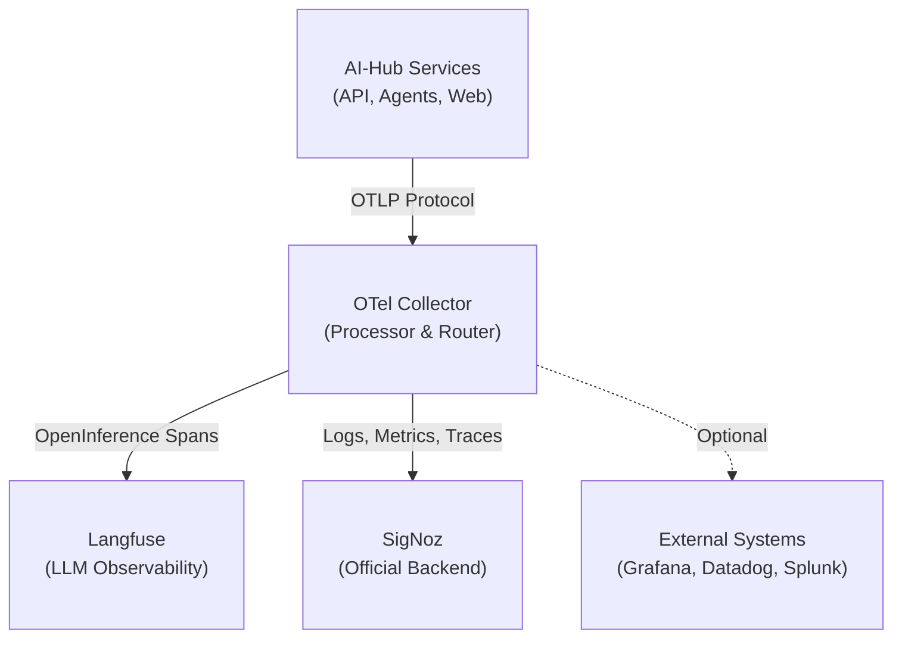
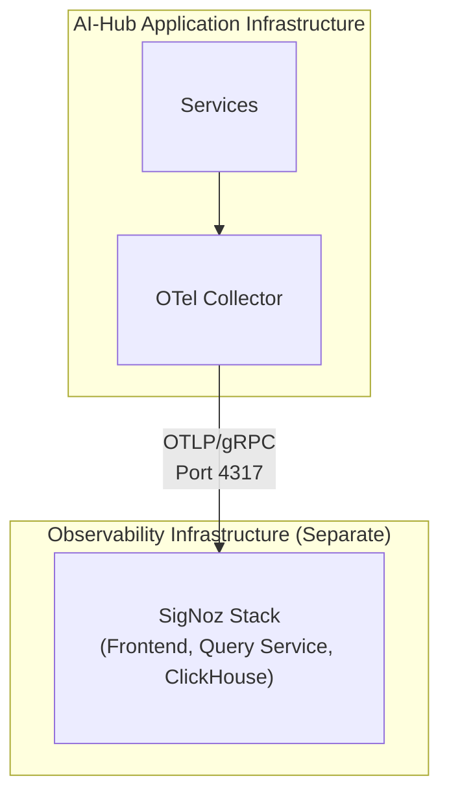

# External Log Aggregation

The Swiss AI-Hub's observability architecture is built on **OpenTelemetry**, enabling you to export logs, metrics, and
traces to external systems for centralized management, long-term retention, and advanced analytics. While the platform
is pre-configured to work with **SigNoz** as the officially supported backend, the OpenTelemetry foundation ensures
you're never locked into a single vendor.

## Architecture Overview

All telemetry flows through a central **OpenTelemetry Collector** that acts as a processing and routing hub:



The collector receives telemetry via the **OpenTelemetry Protocol (OTLP)**, processes it (filtering, batching,
enriching), and exports it to one or more backends. This architecture provides several key benefits:

- **Centralized Control**: A single point for configuring data flows and transformations
- **Performance**: Batching and compression reduce network overhead
- **Flexibility**: Route different data types to different backends
- **Resilience**: Built-in retries and queuing handle temporary outages

## SigNoz: The Official Backend

**SigNoz** is the officially supported observability backend for the Swiss AI-Hub. It is an open-source,
OpenTelemetry-native platform that provides unified logs, metrics, and traces in a single interface.

### Why SigNoz?

- **OpenTelemetry Native**: Built from the ground up on OTel standards
- **Unified Observability**: Logs, metrics, and traces in one platform
- **Cost-Effective**: Open-source with predictable pricing
- **Full-Text Search**: Powerful log querying and filtering
- **Distributed Tracing**: End-to-end request flow visualization
- **Custom Dashboards**: Pre-built and customizable visualizations
- **Flexible Alerting**: Multi-channel notifications (email, Slack, Teams, PagerDuty)

### Deployment Options

The platform supports two SigNoz deployment models:

#### SigNoz Cloud (Easiest)

SigNoz offers a fully managed cloud service with regional endpoints (EU, US, IN). The AI-Hub is pre-configured to use
SigNoz Cloud - you only need to provide your ingestion key and region endpoint via environment variables:

```bash
OTEL_CLOUD_ENDPOINT="ingest.eu.signoz.cloud:443"
OTEL_CLOUD_HEADERS="{'signoz-ingestion-key':<your_key>}"
```

#### Self-Hosted SigNoz (Production Recommended)

For production deployments, **self-hosting SigNoz on a dedicated VM** is strongly recommended for several reasons:

- **Performance Isolation**: Observability overhead doesn't affect application performance
- **High Availability**: Application continues running even if monitoring fails
- **Data Sovereignty**: Full control over telemetry data location and retention
- **Security**: Network isolation between application and observability layers



SigNoz can be deployed using Docker Compose on a separate VM with appropriate resources (4+ CPU cores, 8+ GB RAM, 100+
GB storage). The AI-Hub's OTel Collector is then configured to point to the self-hosted endpoint instead of SigNoz
Cloud.

## Data Collection

The platform automatically collects and exports:

### Logs

- **Application Logs**: Structured JSON logs from all Python services (INFO, WARNING, ERROR, CRITICAL)
- **Container Logs**: All stdout/stderr output from Docker containers
- **Access Logs**: HTTP requests and responses from the API gateway
- **Security Logs**: Authentication events and permission checks

### Traces

- **Distributed Traces**: End-to-end request flows across services (API → Agent → LLM → Database)
- **OpenInference Traces**: LLM-specific spans with prompt/response content, token usage, and costs

::: info Dual Tracing Strategy
OpenInference traces are sent to **both** Langfuse (local, specialized LLM debugging) and SigNoz (cloud, long-term
storage and correlation). This dual approach provides immediate debugging capabilities while maintaining comprehensive
observability.
:::

### Metrics

- **Infrastructure Metrics** (planned): CPU, memory, network, disk I/O per container
- **Application Metrics** (planned): API latency, error rates, agent execution times
- **Business Metrics**: Active sessions, document processing throughput, cost per operation

## Configuration

The OTel Collector is configured via `/configs/otel/otel-collector-config.dev.yaml`. The default configuration includes:

- **Generic Cloud Exporter**: Configured via environment variables for flexibility
- **Filtering**: Removes noisy health check and database spans
- **Batching**: Optimizes network usage by batching telemetry
- **Retry Logic**: Handles temporary network failures
- **Compression**: Reduces bandwidth with gzip compression

All backends are configured via environment variables, making it easy to switch between SigNoz Cloud, self-hosted
SigNoz, or alternative backends without modifying code.

## Alternative Backends

While **SigNoz is the officially supported backend**, the OpenTelemetry foundation allows you to send data to any
OTel-compatible system. To use an alternative backend, update the environment variables to point to your chosen system's
OTLP endpoint. Some backends may require additional exporter configuration in the OTel Collector config file.

______________________________________________________________________

## Next Steps

- Explore the [SigNoz documentation](https://signoz.io/docs/) for query builders and alert configuration
- Review the [OpenTelemetry Collector documentation](https://opentelemetry.io/docs/collector/) for advanced
  configuration
- Configure [Langfuse LLM Observability](../../../10_chat_ui/10_observability/) for AI-specific debugging
- Set up [Cost Tracking](../../../14_cost_control/) for LLM usage monitoring
