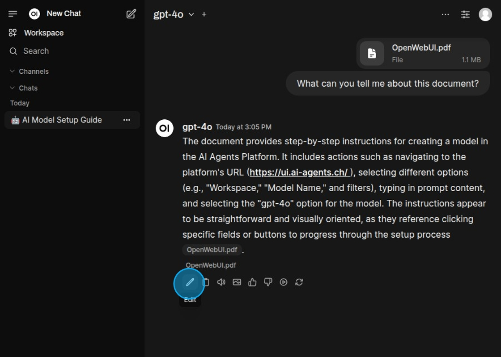
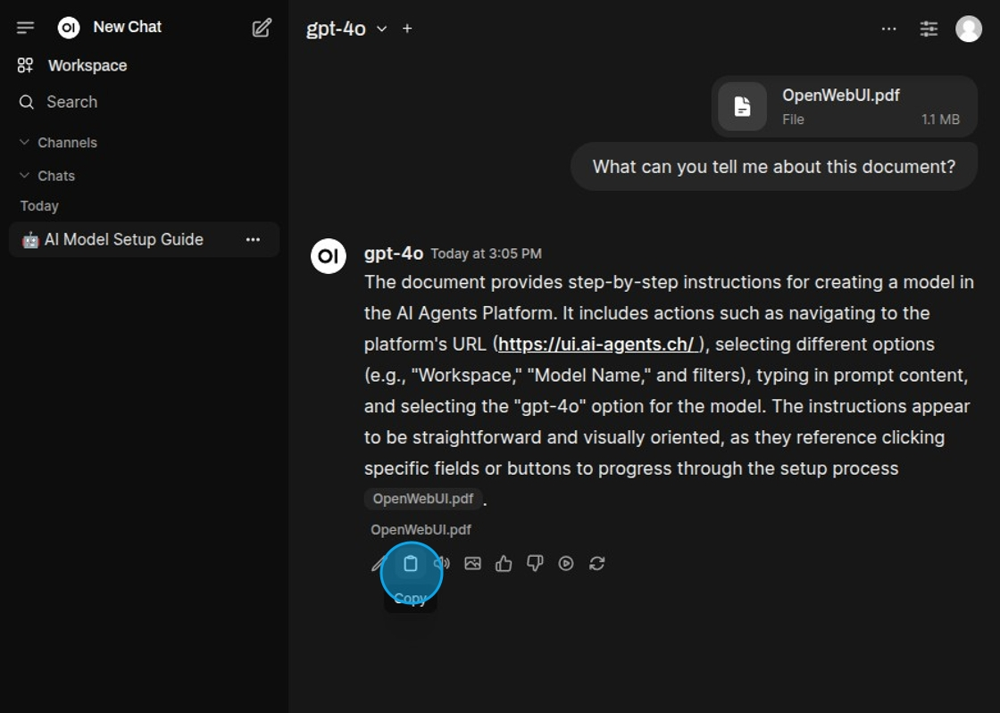
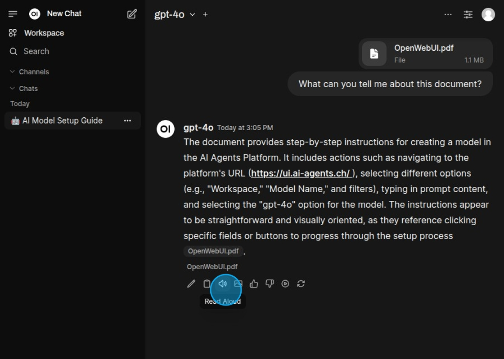
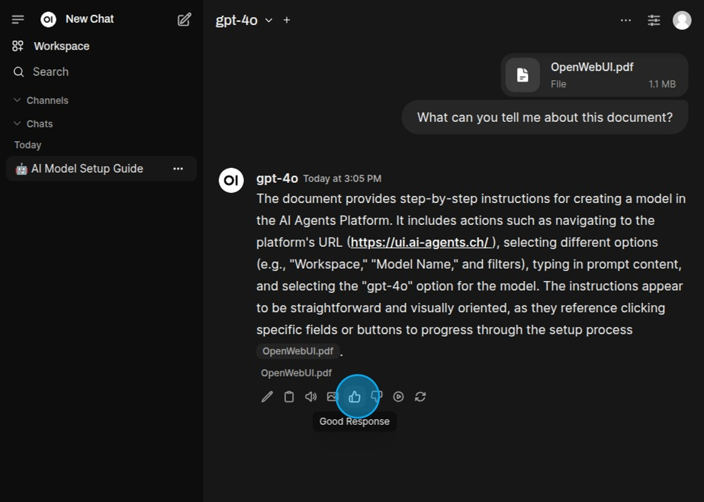
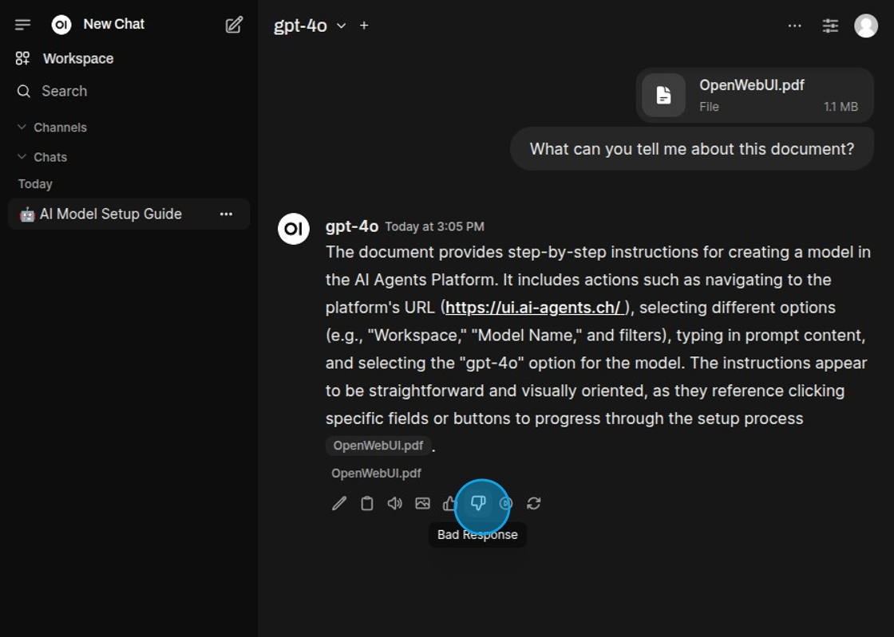
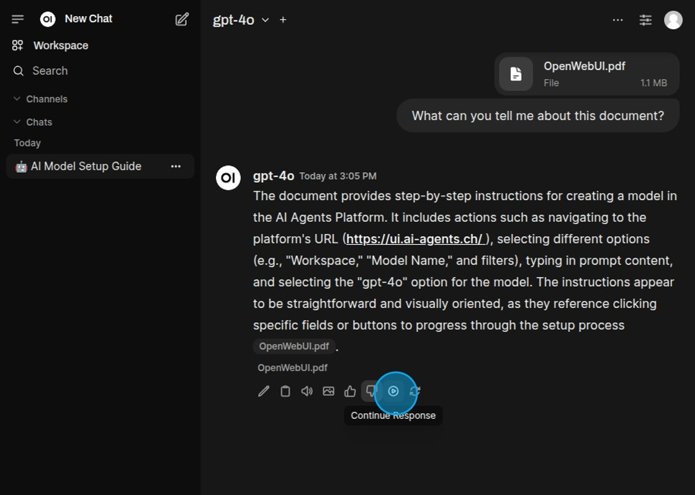
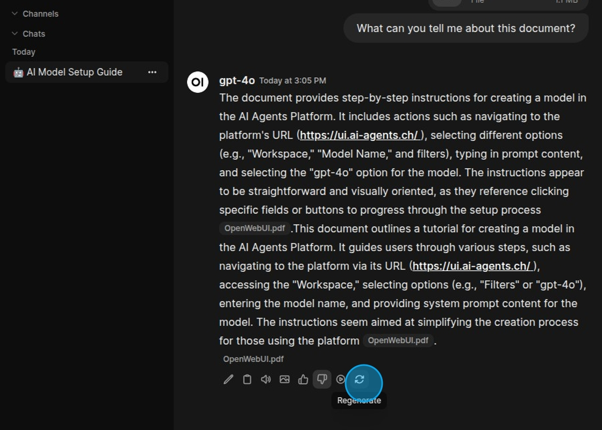

## Actions

Actions are the small icons underneath each response from the model. These can perform different things, from reading
the response aloud to giving feedback on the quality of the answer.

The response can be edited.

Copy the response to clipboard.

Read the response aloud.

Generate an image based on the response.

Positive feedback can be given.

Here the response can be rated and enriched with details in order to better evaluate how well the models perform.

Negative feedback can also be given.

The response can be continued.

The response can be regenerated.

Regenerated responses can be deleted again.

