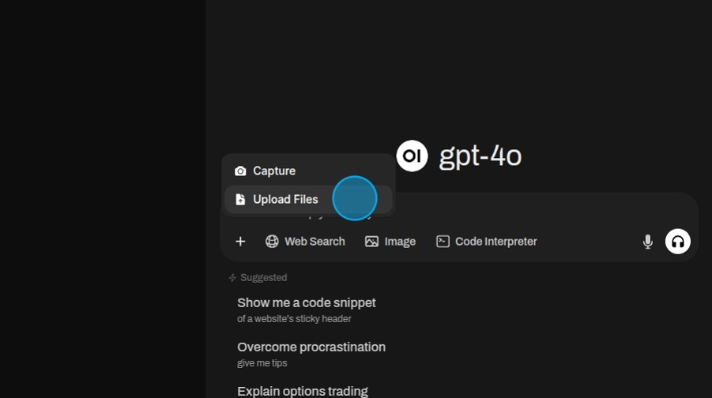
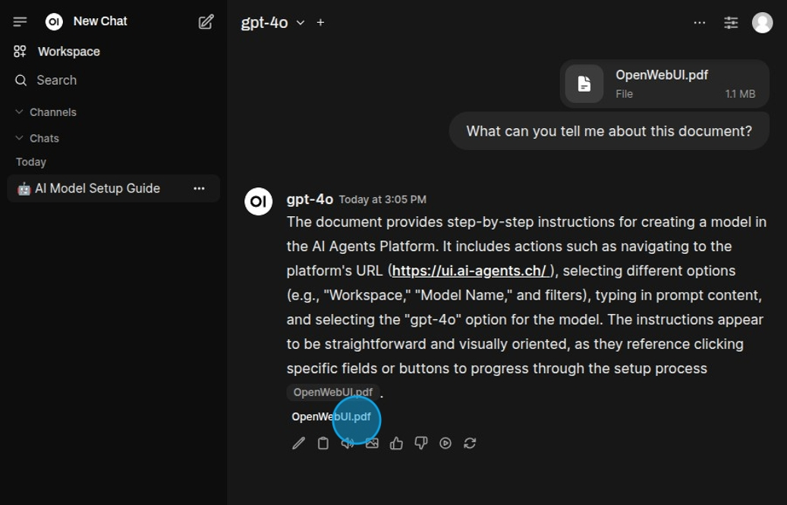

## File Upload

To upload files click the "More" button.

Then select "Upload Files". In the pop up navigate to the files you want to use and upload them.

After uploading the files write ask a question.

The model will use the files to answer the question.

Click on a reference to view which parts where used to answer the question.

The citation gives a clear rundown of the different parts used to generate the answer.

