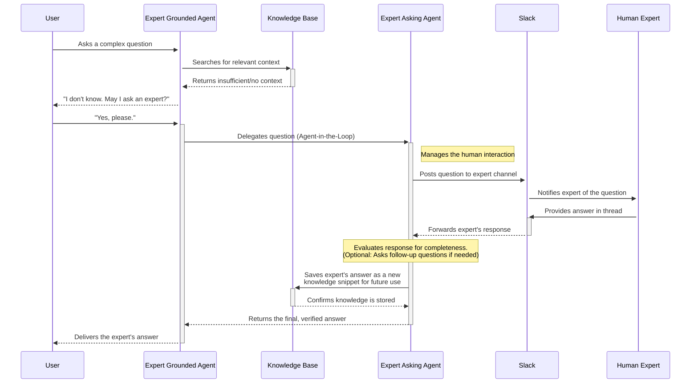

# Die Expert Agents: Eine Brücke zwischen KI und menschlichem Wissen

Was passiert, wenn eine KI die Antwort auf eine kritische Geschäftsfrage nicht kennt? In den meisten Systemen rät sie entweder (halluziniert) oder gibt auf. Der Swiss AI Hub bietet mit den **Expert Agents** eine leistungsstarke Alternative – ein spezialisiertes Agentenpaar, das entwickelt wurde, um die Lücke zwischen den Fähigkeiten der KI und dem menschlichen Fachwissen Ihrer Organisation nahtlos zu schließen.

Dieses innovative System stellt sicher, dass Benutzer stets präzise, vertrauenswürdige Antworten erhalten. Wenn die KI an die Grenzen ihres Wissens stößt, versagt sie nicht; stattdessen eskaliert sie die Frage intelligent an einen benannten menschlichen Experten und lernt aus dessen Antwort.

## Die Herausforderung: Wenn das Wissen der KI nicht ausreicht

Eine KI ist nur so gut wie die Informationen, auf die sie Zugriff hat. Selbst mit einer umfassenden Wissensdatenbank wird es immer neue, nuancierte oder undokumentierte Fragen geben. Hier wird das Risiko von KI-Halluzinationen zu einem großen Problem für Unternehmen. Eine falsche Antwort ist oft schlimmer als gar keine Antwort.

Die Expert Agents wurden entwickelt, um dieses Problem zu lösen, indem sie einen zuverlässigen, auditierbaren Prozess für die Mensch-KI-Zusammenarbeit schaffen.

## Ein Zwei-Agenten-System für nahtlose Zusammenarbeit

Die Expert Agents sind kein einzelner Agent, sondern ein Paar von Spezialisten, die im Konzert zusammenarbeiten:

1.  **Der Expert Grounded Agent**: Dies ist der Agent, mit dem Ihre Benutzer interagieren. Seine primäre Anweisung ist es, **niemals zu raten**. Er versucht zunächst, eine Frage mit seinem verfügbaren Wissen zu beantworten. Wenn er feststellt, dass die Informationen unzureichend sind, um eine vollständige und genaue Antwort zu geben, wird er nicht fortfahren. Stattdessen wird er den Benutzer transparent informieren und, mit dessen Zustimmung, die Anfrage eskalieren.

2.  **Der Expert Asking Agent**: Dieser Agent arbeitet hinter den Kulissen. Sobald der Benutzer seine Zustimmung gibt, nimmt er die Frage auf und leitet sie an die richtigen menschlichen Experten in Ihrer Organisation weiter. Er verwaltet den gesamten Konsultationsprozess und stellt sicher, dass das Wissen des Experten effektiv erfasst wird.

Diese Aufgabentrennung schafft einen robusten und zuverlässigen Workflow.

### Der Workflow der Expertenkonsultation in Aktion

Das folgende Diagramm veranschaulicht den vollständigen Ablauf, von der ersten Frage des Benutzers bis zur endgültigen, von Experten verifizierten Antwort und der Erfassung neuen Wissens.

::: details Ablauf im Detail
1.  **Erste Anfrage und Suche**: Der Benutzer stellt dem **Expert Grounded Agent** eine Frage. Der Agent konsultiert zuerst die **Knowledge Base**, um eine Antwort zu finden.
2.  **Wissenslücke identifiziert**: Die Suche liefert unzureichende Informationen. Der Agent erkennt, dass er nicht zuverlässig antworten kann.
3.  **Benutzerzustimmung zur Eskalation**: Der Agent informiert den Benutzer transparent über die Wissenslücke und bittet um Erlaubnis, einen menschlichen Experten zu konsultieren.
4.  **Delegation an Spezialagent**: Sobald der Benutzer zustimmt, delegiert der Grounded Agent die Aufgabe an den **Expert Asking Agent**.
5.  **Expertenkonsultation in Slack**: Der Asking Agent veröffentlicht die Frage in einem vorkonfigurierten **Slack-Kanal** und benachrichtigt den benannten **Human Expert**.
6.  **Wissenserfassung und -speicherung**: Der Experte gibt eine Antwort in Slack. Der Asking Agent erfasst diese Antwort, verarbeitet sie in ein strukturiertes Format und speichert sie als neues dauerhaftes Wissen in der **Knowledge Base**.
7.  **Antwortlieferung**: Die verifizierte Antwort wird vom Asking Agent zurück an den Grounded Agent übergeben, der sie dann dem Benutzer liefert.

Wenn das nächste Mal jemand eine ähnliche Frage stellt, findet der Agent das neu erfasste Expertenwissen in seiner Wissensdatenbank und kann sofort antworten, ohne erneut eskalieren zu müssen.
:::

## Warum dies ein Wendepunkt für Ihr Unternehmen ist

Dieses Human-in-the-Loop-Muster liefert einen tiefgreifenden Wert, der über die Beantwortung einer einzelnen Frage hinausgeht.

-   **Garantierte Genauigkeit und Vertrauen**: Indem die Agenten sich weigern zu antworten, wenn sie unsicher sind, eliminieren sie das Risiko von Halluzinationen. Benutzer lernen, der KI zu vertrauen, weil sie wissen, dass ihre Antworten immer auf verifizierten Informationen basieren, sei es aus einem Dokument oder von einem menschlichen Experten.
-   **Erstellt eine lebendige Wissensdatenbank**: Das wertvollste Wissen Ihrer Organisation befindet sich oft in den Köpfen Ihrer Experten. Dieses System bietet eine reibungslose Möglichkeit, dieses implizite Wissen zu erfassen und in ein durchsuchbares, wiederverwendbares digitales Asset umzuwandeln. Jede Expertenkonsultation macht Ihre KI aktiv intelligenter.
-   **Experten arbeiten in ihrem Workflow**: Ihre Fachexperten müssen kein neues Tool lernen. Sie bringen ihr Wissen in der Umgebung ein, in der sie bereits arbeiten – **Slack**. Die KI erledigt den Rest.
-   **Intelligente Nachfrage**: Wenn die erste Antwort eines Experten kurz oder unvollständig ist, ist der Expert Asking Agent intelligent genug, dies zu erkennen. Er kann automatisch klärende Nachfragen generieren und stellen, bis er eine umfassende Antwort hat, wodurch sichergestellt wird, dass das erfasste Wissen vollständig und wertvoll ist.
-   **Skalierbare Expertise**: Dieses System vervielfacht die Wirkung Ihrer Experten. Sie beantworten eine Frage einmal, und dieses Wissen steht dann der gesamten Organisation über die KI für immer zur Verfügung. Dies entlastet Ihre Experten, sodass sie sich auf wirklich neuartige und komplexe Herausforderungen konzentrieren können.

Durch die Implementierung der Expert Agents deployen Sie nicht nur einen KI-Assistenten; Sie bauen ein dynamisches, sich selbst verbesserndes Organisationsgehirn auf, das kontinuierlich von Ihren sachkundigsten Mitarbeitern lernt.
