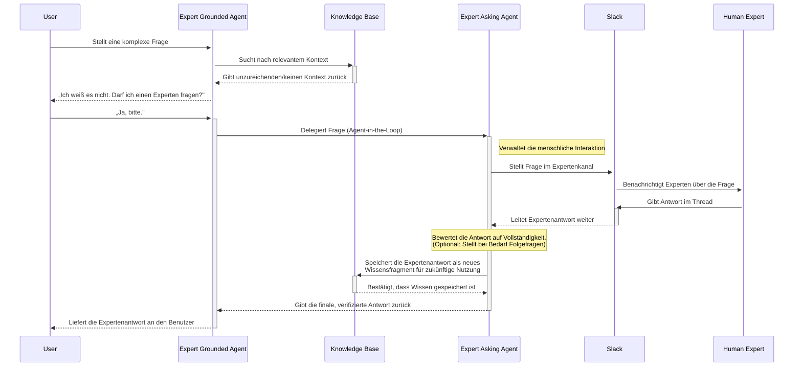

# Experte befragt Agenten

Wenn ein RAG-Agent eine Frage aus seiner Wissensdatenbank nicht beantworten kann, kann er die Anfrage an menschliche
Experten eskalieren. Die Expertenagenten implementieren diesen Eskalations-Workflow durch zwei spezialisierte Agenten,
die zusammenarbeiten.

## Architektur des Agentenpaars

Das System verwendet zwei Agenten:

Der Expert Grounded Agent interagiert mit Benutzern. Er durchsucht seine Wissensdatenbank nach Antworten. Wenn die
Informationen unzureichend sind, informiert er den Benutzer und bittet um Erlaubnis, die Frage an einen menschlichen
Experten zu eskalieren.

Der Expert Asking Agent verwaltet den Konsultationsprozess. Er stellt Fragen über Slack an Experten, erfasst deren
Antworten und speichert die Antworten in der Wissensdatenbank für zukünftige Anfragen.

## Workflow

Das Sequenzdiagramm zeigt den vollständigen Konsultations-Workflow.

Der Benutzer stellt dem Expert Grounded Agent eine Frage. Der Agent durchsucht die Wissensdatenbank. Wenn die Suche
unzureichende Informationen liefert, informiert der Agent den Benutzer und bittet um Erlaubnis, einen Experten zu
konsultieren.

Mit Zustimmung des Benutzers delegiert der Grounded Agent an den Expert Asking Agent unter Verwendung des
Agent-in-the-Loop-Musters. Der Asking Agent stellt die Frage in einem konfigurierten Slack-Kanal und benachrichtigt den
benannten Experten.

Der Experte gibt eine Antwort im Slack-Thread. Der Asking Agent kann die Vollständigkeit der Antwort bewerten und bei
Bedarf Folgefragen stellen. Sobald er zufrieden ist, speichert er die Antwort in der Wissensdatenbank und gibt die
Antwort an den Grounded Agent zurück, der sie dem Benutzer übermittelt.

Zukünftige Anfragen zum gleichen Thema rufen die gespeicherte Expertenantwort aus der Wissensdatenbank ab, ohne eine
weitere Konsultation zu erfordern.

## Wissenserfassung

Jede Expertenkonsultation erweitert die Wissensdatenbank. Experten beantworten Fragen einmal, und ihre Antworten werden
für alle Benutzer durchsuchbar. Dies wandelt implizites Wissen in dokumentierte Informationen um, ohne dass Experten
zusätzliche Tools über ihren bestehenden Slack-Workspace hinaus verwenden müssen.

Der Asking Agent kann unvollständige Antworten erkennen und Folgefragen generieren, um sicherzustellen, dass das
erfasste Wissen für zukünftige Abfragen umfassend genug ist.
