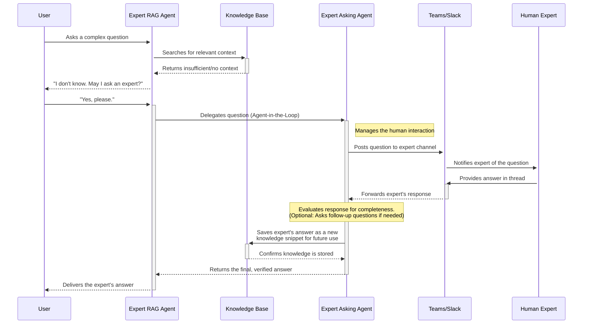

# Agent befragt Experten

Wenn ein RAG-Agent eine Frage aus seiner Wissensbasis nicht beantworten kann, kann er die Anfrage an menschliche
Experten eskalieren. Die Expert Agents implementieren diesen Eskalations-Workflow durch zwei spezialisierte Agents, die
zusammenarbeiten.

## Architektur des Agentenpaars

Das System verwendet zwei Agents:

Der **Expert RAG Agent** interagiert mit Benutzern. Er durchsucht seine Wissensbasis nach Antworten. Wenn die
Informationen unzureichend sind, informiert er den Benutzer und bittet um Erlaubnis, die Frage an einen menschlichen
Experten zu eskalieren.

Der **Expert Asking Agent** verwaltet den Konsultationsprozess. Er postet Fragen an Experten über Microsoft Teams oder
Slack, erfasst deren Antworten und speichert die Antworten in der Wissensbasis für zukünftige Anfragen.

## Workflow



Das Sequenzdiagramm zeigt den vollständigen Konsultations-Workflow.

Der Benutzer stellt dem Expert RAG Agenten eine Frage. Der Agent durchsucht die Wissensbasis. Wenn die Suche
unzureichende Informationen liefert, informiert der Agent den Benutzer und bittet um Erlaubnis, einen Experten zu
konsultieren.

Mit Zustimmung des Benutzers delegiert der RAG Agent an den Expert Asking Agent unter Verwendung des
Agent-in-the-Loop-Musters. Der Asking Agent postet die Frage in einen konfigurierten Teams- oder Slack-Kanal und
benachrichtigt den benannten Experten.

Der Experte gibt eine Antwort im Kanal-Thread. Der Asking Agent kann die Vollständigkeit der Antwort bewerten und bei
Bedarf Nachfragen stellen. Sobald er zufrieden ist, speichert er die Antwort in der Wissensbasis und gibt die Antwort an
den RAG Agenten zurück, der sie dem Benutzer übermittelt.

Zukünftige Anfragen zum gleichen Thema rufen die gespeicherte Expertenantwort aus der Wissensbasis ab, ohne eine weitere
Konsultation zu erfordern.

## Wissenserfassung

Jede Expertenkonsultation erweitert die Wissensbasis. Experten beantworten Fragen einmal, und ihre Antworten werden für
alle Benutzer durchsuchbar. Dies wandelt implizites Wissen in dokumentierte Informationen um, ohne dass Experten
zusätzliche Tools über ihren bestehenden Teams- oder Slack-Arbeitsbereich hinaus verwenden müssen.

Der Asking Agent kann unvollständige Antworten erkennen und Nachfragen generieren, um sicherzustellen, dass das erfasste
Wissen für zukünftige Abrufe ausreichend umfassend ist.

## Konfiguration

Der Expert Asking Agent erfordert eine Kanal-Konfiguration, um mit menschlichen Experten zu kommunizieren. Konfigurieren
Sie die folgenden Umgebungsvariablen in Ihrer `.env`-Datei:

### Auswahl des Kanaltyps

```bash
# Channel type: "teams" or "slack"
EXPERT_ASKING_CHANNEL_TYPE="teams"
```

### Microsoft Teams Konfiguration

Erforderlich, wenn `EXPERT_ASKING_CHANNEL_TYPE="teams"`:

```bash
# Teams channel ID (format: 19:xxxxx@thread.tacv2)
TEAMS_CHANNEL_ID="19:your-channel-id@thread.tacv2"

# Azure AD tenant ID (UUID format)
TEAMS_TENANT_ID="00000000-0000-0000-0000-000000000000"

# Bot application ID from Azure Bot Service (UUID format)
TEAMS_BOT_ID="00000000-0000-0000-0000-000000000000"
```

Um diese Werte zu finden:

- **TEAMS_CHANNEL_ID**: Klicken Sie in Teams mit der rechten Maustaste auf den Kanal und wählen Sie "Link zum Kanal
  abrufen". Die Kanal-ID befindet sich in der URL.
- **TEAMS_TENANT_ID**: Verfügbar im Azure-Portal unter Azure Active Directory > Übersicht.
- **TEAMS_BOT_ID**: Die Anwendungs-ID Ihrer Azure Bot Service-Registrierung.

### Slack Konfiguration

Erforderlich, wenn `EXPERT_ASKING_CHANNEL_TYPE="slack"`:

```bash
# Slack channel ID (format: C followed by alphanumeric characters)
SLACK_CHANNEL_ID="C00000000"

# Bot Framework service URL for Slack
SLACK_SERVICE_URL="https://slack.botframework.com"
```

Um diese Werte zu finden:

- **SLACK_CHANNEL_ID**: Klicken Sie in Slack mit der rechten Maustaste auf den Kanalnamen und wählen Sie "Link
  kopieren". Die Kanal-ID ist der letzte Teil der URL (beginnt mit "C").
- **SLACK_SERVICE_URL**: Verwenden Sie `https://slack.botframework.com` für globale oder
  `https://europe.slack.botframework.com` für EU-Datenresidenz.

## Deployment

Sowohl der Expert RAG Agent als auch der Expert Asking Agent werden als Docker-Container deployed. Sie sind in der
Standard-Docker-Compose-Konfiguration enthalten und werden automatisch durch die CI-Pipeline gebaut.

Zum Deployment:

1. Konfigurieren Sie die Umgebungsvariablen in Ihrer `.env`-Datei
2. Starten Sie die Services mit Docker Compose:

```bash
docker compose up -d expert_rag_agent expert_asking_agent
```

Die Agents verbinden sich mit NATS für die Ereigniskommunikation und mit Redis für das Zustandsmanagement.
