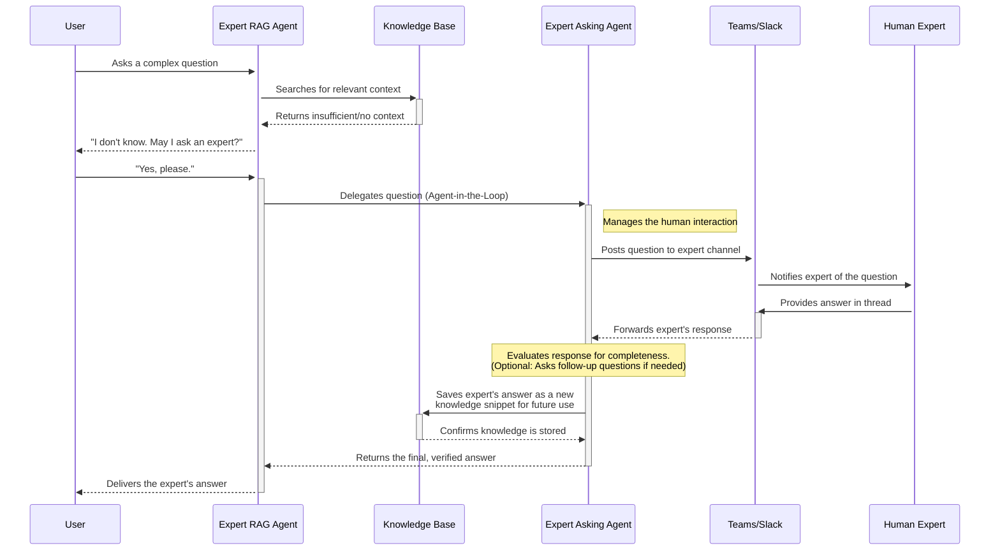

# Expert asking agent

When a RAG agent cannot answer a question from its knowledge base, it can escalate the query to human experts. The
expert agents implement this escalation workflow through two specialized agents that work together.

## Agent pair architecture

The system uses two agents:

The **Expert RAG Agent** interacts with users. It searches its knowledge base for answers. When information is
insufficient, it informs the user and asks permission to escalate the question to a human expert.

The **Expert Asking Agent** manages the consultation process. It posts questions to experts via Microsoft Teams or
Slack, captures their responses, and stores the answers in the knowledge base for future queries.

## Workflow



The sequence diagram shows the complete consultation workflow.

The user asks the Expert RAG Agent a question. The agent searches the knowledge base. If the search returns insufficient
information, the agent informs the user and requests permission to consult an expert.

With user consent, the RAG Agent delegates to the Expert Asking Agent using the agent-in-the-loop pattern. The Asking
Agent posts the question to a configured Teams or Slack channel, notifying the designated expert.

The expert provides an answer in the channel thread. The Asking Agent can evaluate response completeness and ask
follow-up questions if needed. Once satisfied, it stores the answer in the knowledge base and returns the response to
the RAG Agent, which delivers it to the user.

Future queries on the same topic retrieve the stored expert answer from the knowledge base without requiring another
consultation.

## Knowledge capture

Each expert consultation adds to the knowledge base. Experts answer questions once, and their responses become
searchable for all users. This converts tacit knowledge into documented information without requiring experts to use
additional tools beyond their existing Teams or Slack workspace.

The Asking Agent can detect incomplete responses and generate follow-up questions to ensure captured knowledge is
comprehensive enough for future retrieval.

## Configuration

The Expert Asking Agent requires channel configuration to communicate with human experts. Configure the following
environment variables in your `.env` file:

### Channel type selection

```bash
# Channel type: "teams" or "slack"
EXPERT_ASKING_CHANNEL_TYPE="teams"
```

### Microsoft Teams configuration

Required when `EXPERT_ASKING_CHANNEL_TYPE="teams"`:

```bash
# Teams channel ID (format: 19:xxxxx@thread.tacv2)
TEAMS_CHANNEL_ID="19:your-channel-id@thread.tacv2"

# Azure AD tenant ID (UUID format)
TEAMS_TENANT_ID="00000000-0000-0000-0000-000000000000"

# Bot application ID from Azure Bot Service (UUID format)
TEAMS_BOT_ID="00000000-0000-0000-0000-000000000000"
```

To find these values:

- **TEAMS_CHANNEL_ID**: In Teams, right-click the channel and select "Get link to channel". The channel ID is in the
  URL.
- **TEAMS_TENANT_ID**: Available in Azure Portal under Azure Active Directory > Overview.
- **TEAMS_BOT_ID**: The Application ID from your Azure Bot Service registration.

### Slack configuration

Required when `EXPERT_ASKING_CHANNEL_TYPE="slack"`:

```bash
# Slack channel ID (format: C followed by alphanumeric characters)
SLACK_CHANNEL_ID="C00000000"

# Bot Framework service URL for Slack
SLACK_SERVICE_URL="https://slack.botframework.com"
```

To find these values:

- **SLACK_CHANNEL_ID**: In Slack, right-click the channel name and select "Copy link". The channel ID is the last part
  of the URL (starts with "C").
- **SLACK_SERVICE_URL**: Use `https://slack.botframework.com` for global or `https://europe.slack.botframework.com` for
  EU data residency.

## Deployment

Both the Expert RAG Agent and Expert Asking Agent are deployed as Docker containers. They are included in the standard
docker-compose configuration and built automatically by the CI pipeline.

To deploy:

1. Configure the environment variables in your `.env` file
2. Start the services with docker-compose:

```bash
docker compose up -d expert_rag_agent expert_asking_agent
```

The agents will connect to NATS for event communication and Redis for state management.
