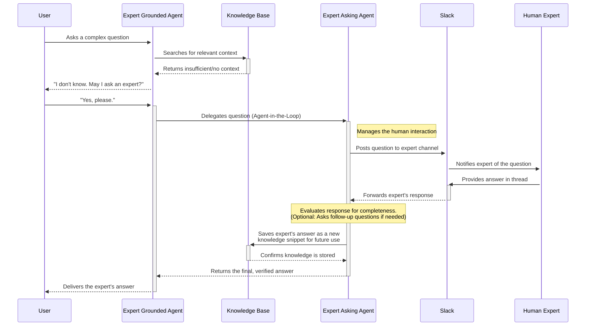

# Expert asking agent

When a RAG agent cannot answer a question from its knowledge base, it can escalate the query to human experts. The
expert agents implement this escalation workflow through two specialized agents that work together.

## Agent pair architecture

The system uses two agents:

The Expert Grounded Agent interacts with users. It searches its knowledge base for answers. When information is
insufficient, it informs the user and asks permission to escalate the question to a human expert.

The Expert Asking Agent manages the consultation process. It posts questions to experts via Slack, captures their
responses, and stores the answers in the knowledge base for future queries.

## Workflow

The sequence diagram shows the complete consultation workflow.

The user asks the Expert Grounded Agent a question. The agent searches the knowledge base. If the search returns
insufficient information, the agent informs the user and requests permission to consult an expert.

With user consent, the Grounded Agent delegates to the Expert Asking Agent using the agent-in-the-loop pattern. The
Asking Agent posts the question to a configured Slack channel, notifying the designated expert.

The expert provides an answer in the Slack thread. The Asking Agent can evaluate response completeness and ask follow-up
questions if needed. Once satisfied, it stores the answer in the knowledge base and returns the response to the Grounded
Agent, which delivers it to the user.

Future queries on the same topic retrieve the stored expert answer from the knowledge base without requiring another
consultation.

## Knowledge capture

Each expert consultation adds to the knowledge base. Experts answer questions once, and their responses become
searchable for all users. This converts tacit knowledge into documented information without requiring experts to use
additional tools beyond their existing Slack workspace.

The Asking Agent can detect incomplete responses and generate follow-up questions to ensure captured knowledge is
comprehensive enough for future retrieval.
