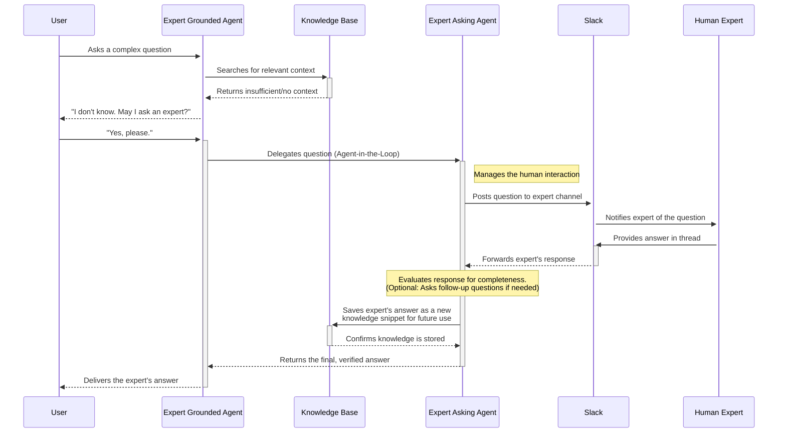

# The Expert Agents: Bridging AI and Human Knowledge

What happens when an AI doesn't know the answer to a critical business question? In most systems, it either guesses (hallucinates) or gives up. The Swiss AI Hub offers a powerful alternative with the **Expert Agents**—a specialized agent pair designed to seamlessly bridge the gap between AI's capabilities and your organization's human expertise.

This innovative system ensures users always receive accurate, trustworthy answers. When the AI reaches the limits of its knowledge, it doesn't fail; instead, it intelligently escalates the question to a designated human expert and learns from their response.

## The Challenge: When AI's Knowledge Isn't Enough

An AI is only as good as the information it has access to. Even with a comprehensive knowledge base, there will always be new, nuanced, or undocumented questions. This is where the risk of AI hallucination becomes a major concern for enterprises. An incorrect answer is often worse than no answer at all.

The Expert Agents are designed to solve this problem by creating a reliable, auditable process for human-AI collaboration.

## A Two-Agent System for Seamless Collaboration

The Expert Agents are not a single agent but a pair of specialists that work in concert:

1.  **The Expert Grounded Agent**: This is the agent your users interact with. Its primary directive is to **never guess**. It first attempts to answer a question using its available knowledge. If it determines that the information is insufficient to provide a complete and accurate answer, it will not proceed. Instead, it will transparently inform the user and, with their consent, escalate the query.

2.  **The Expert Asking Agent**: This agent works behind the scenes. Once the user gives consent, it takes the question and relays it to the right human experts in your organization. It manages the entire consultation process, ensuring the expert's knowledge is captured effectively.

This separation of duties creates a robust and reliable workflow.

### The Expert Consultation Workflow in Action

The following diagram illustrates the complete flow, from the user's initial question to the final, expert-verified answer and the capture of new knowledge.

::: details Breaking Down the Flow
1.  **Initial Query and Search**: The user asks the **Expert Grounded Agent** a question. The agent first consults the **Knowledge Base** to find an answer.
2.  **Knowledge Gap Identified**: The search returns insufficient information. The agent recognizes it cannot answer reliably.
3.  **User Consent for Escalation**: The agent transparently informs the user about the knowledge gap and asks for permission to consult a human expert.
4.  **Delegation to Specialist Agent**: Once the user agrees, the Grounded Agent delegates the task to the **Expert Asking Agent**.
5.  **Expert Consultation in Slack**: The Asking Agent posts the question to a pre-configured **Slack channel**, notifying the designated **Human Expert**.
6.  **Knowledge Capture and Storage**: The expert provides an answer in Slack. The Asking Agent captures this response, processes it into a structured format, and saves it back into the **Knowledge Base** as a new piece of permanent knowledge.
7.  **Answer Delivery**: The verified answer is passed from the Asking Agent back to the Grounded Agent, which then delivers it to the user.

The next time someone asks a similar question, the agent will find the newly captured expert knowledge in its knowledge base and be able to answer instantly without needing to escalate again.
:::

## Why This is a Game-Changer for Your Business

This human-in-the-loop pattern delivers profound value beyond just answering a single question.

-   **Guaranteed Accuracy and Trust**: By refusing to answer when uncertain, the agents eliminate the risk of hallucination. Users learn to trust the AI because they know its answers are always grounded in verified information, whether from a document or a human expert.
-   **Creates a Living Knowledge Base**: Your organization's most valuable knowledge often resides in the minds of your experts. This system provides a frictionless way to capture that tacit knowledge and turn it into a searchable, reusable digital asset. Every expert consultation actively makes your AI smarter.
-   **Experts Work in Their Flow**: Your subject matter experts don't need to learn a new tool. They contribute their knowledge in the environment where they already work—**Slack**. The AI handles the rest.
-   **Intelligent Follow-Up**: If an expert's initial response is brief or incomplete, the Expert Asking Agent is smart enough to recognize this. It can automatically generate and ask clarifying follow-up questions until it has a comprehensive answer, ensuring the captured knowledge is complete and valuable.
-   **Scalable Expertise**: This system multiplies the impact of your experts. They answer a question once, and that knowledge is then available to the entire organization forever through the AI. This frees up your experts' time to focus on the truly novel and complex challenges.

By implementing the Expert Agents, you are not just deploying an AI assistant; you are building a dynamic, self-improving organizational brain that continuously learns from your most knowledgeable people.

