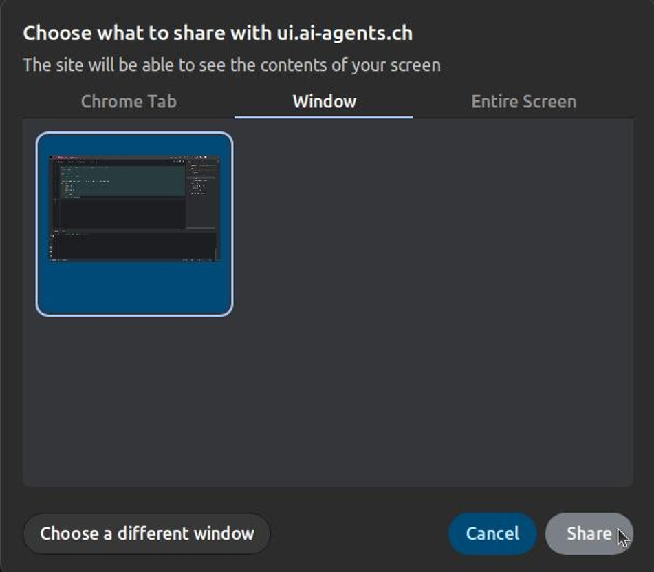
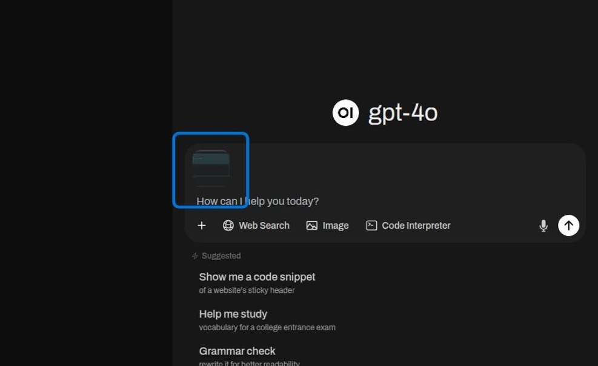

## Screen Capture
Select "More".

Then select "Capture".

Choose what should be captured, a tab from the browser, a window, or the entire screen.

Once selected it can be shared.

The captured image appears in the chat box.

Type "What can you tell me about this screenshot?"

Ask something about the image.

And the model will analyze it and give an answer.

Models that don't support vision capabilities will produce an error.

