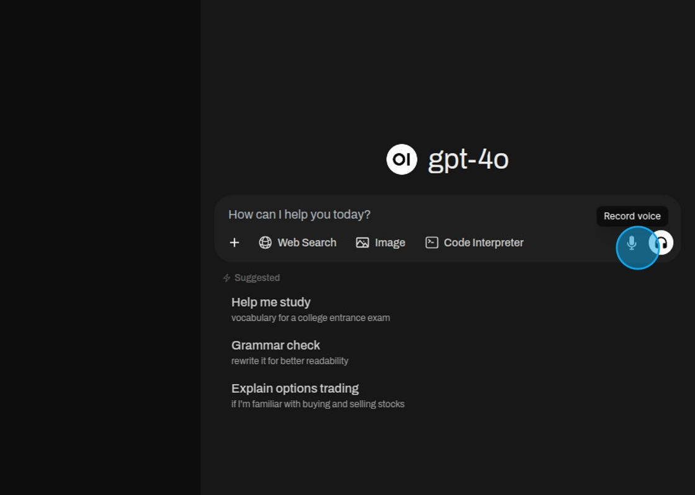

## Speech To Text

Begin a voice recording.

A timeline indicates how long the recording has lasted.

To complete the recording and transcribe the audio as a prompt select the check mark.

The recorded audio will be displayed as input which can be altered or directly sent to the model.

