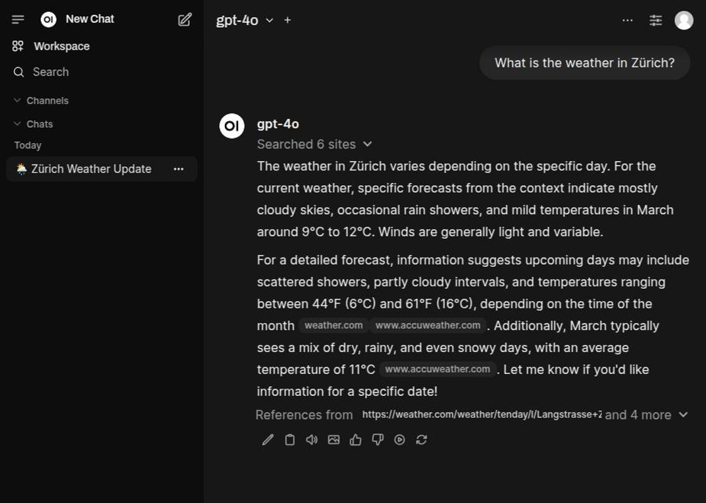

## Web Search

Select "Web Search".

Enter something you want to search for.

The model will take some time coming up with a search query and then executing that search. After which it will output
what it found.

The websites it retrieved the information from are listed as references.

