# Daten-Pipelines

Pipelines sind automatisierte Workflows, die Dokumente in durchsuchbare Wissensdatenbanken für KI-Agenten umwandeln. Sie
überwachen Dateispeicherorte, verarbeiten Dokumente bei Änderungen und pflegen Vektordatenbanken, die von Agenten für
Informationen abgefragt werden.

## Dokumentverarbeitungs-Workflow

Rohe Dokumente können nicht direkt von Agenten abgefragt werden. PDFs und Word-Dateien müssen in Text umgewandelt, in
überschaubare Teile zerlegt und in Vektor-Embeddings transformiert werden, die eine semantische Suche ermöglichen.
Pipelines übernehmen diese Transformation automatisch.

```mermaid
flowchart LR
    A[📄 Documents<br/>SharePoint/Upload] --> B[📖 Parse<br/>Extract text & structure]
    B --> C[✂️ Chunk<br/>Break into pieces]
    C --> D[🔢 Embed<br/>Convert to vectors]
    D --> E[💾 Store<br/>Vector database]
    E --> F[🤖 Agents<br/>Query & retrieve]

    style A fill:#1e40af,stroke:#1e3a8a,stroke-width:2px,color:#fff
    style B fill:#b45309,stroke:#92400e,stroke-width:2px,color:#fff
    style C fill:#9f1239,stroke:#881337,stroke-width:2px,color:#fff
    style D fill:#047857,stroke:#065f46,stroke-width:2px,color:#fff
    style E fill:#6d28d9,stroke:#5b21b6,stroke-width:2px,color:#fff
    style F fill:#b91c1c,stroke:#991b1b,stroke-width:2px,color:#fff
```

Das Diagramm zeigt den vollständigen Fluss von der Dokumentenerfassung bis zu den Agentenabfragen. Jede Phase
transformiert die Daten, um sie durchsuchbar und abrufbar zu machen.

## Automatische Synchronisierung

Pipelines überwachen Datenquellen auf Änderungen. Wenn ein Dokument hinzugefügt, geändert oder gelöscht wird,
verarbeitet die Pipeline die Änderung und aktualisiert die Wissensdatenbank. Dies hält die Antworten der Agenten ohne
manuelles Eingreifen aktuell.

## Orchestrierung mit Dagster

Dagster orchestriert die Pipeline-Ausführung und kümmert sich um Planung, Wiederholungen und Protokollierung. Jeder
Verarbeitungsschritt wird verfolgt, wodurch ein Audit-Trail von der Dokumentenerfassung bis zur Speicherung entsteht.
Sie können Pipeline-Läufe überprüfen, um Probleme zu beheben, die Dokumentenverarbeitung zu verifizieren und die
Datenqualität zu überwachen.
