# Data pipelines

## What are pipelines

Pipelines are automated workflows that prepare your documents for AI agents. Without pipelines, agents cannot access your company's documents, policies, or technical documentation. Pipelines bridge the gap between where your information lives (SharePoint, file uploads) and what agents can actually search and understand.

Think of pipelines as a document preparation factory. Raw documents enter one end, and searchable, agent-ready knowledge comes out the other end. This process runs automatically whenever documents are added or changed.

## Why pipelines matter

AI agents cannot simply read a PDF or Word document the way humans do. Documents need preparation:

**Format conversion** - PDFs and Word files must be converted to plain text while preserving their structure (headings, tables, lists).

**Size management** - A 200-page manual is too large for an agent to process at once. Pipelines break documents into smaller, searchable pieces.

**Semantic indexing** - Agents need to find information by meaning, not just keywords. Pipelines convert text into mathematical representations that capture meaning, enabling agents to find relevant content even when exact words differ.

Without pipelines, you would need to manually prepare every document, update them whenever content changes, and maintain the searchable indexes yourself. Pipelines automate this entire process.

```mermaid
flowchart LR
    A[📄 Documents<br/>SharePoint/Upload] --> B[📖 Parse<br/>Extract text & structure]
    B --> C[✂️ Chunk<br/>Break into pieces]
    C --> D[🔢 Embed<br/>Convert to vectors]
    D --> E[💾 Store<br/>Vector database]
    E --> F[🤖 Agents<br/>Query & retrieve]

    style A fill:#1e40af,stroke:#1e3a8a,stroke-width:2px,color:#fff
    style B fill:#b45309,stroke:#92400e,stroke-width:2px,color:#fff
    style C fill:#9f1239,stroke:#881337,stroke-width:2px,color:#fff
    style D fill:#047857,stroke:#065f46,stroke-width:2px,color:#fff
    style E fill:#6d28d9,stroke:#5b21b6,stroke-width:2px,color:#fff
    style F fill:#b91c1c,stroke:#991b1b,stroke-width:2px,color:#fff
```

## Pipeline stages

Documents flow through five processing stages:

**Connect and ingest** - Pipelines pull documents from SharePoint automatically or accept manual uploads through the web interface. The SharePoint connector monitors for new or changed files.

**Parse and understand** - Text, tables, and structure are extracted from PDFs, Word documents, and other formats. The parser identifies headings, lists, and sections to preserve document organization.

**Chunk and segment** - Large documents split into smaller pieces. Each chunk contains a coherent thought or section, making it easier for agents to find specific information without reading entire documents.

**Embed and vectorize** - Text chunks convert to numerical vectors that capture meaning. This allows semantic search where agents find relevant content based on concepts rather than exact word matches.

**Index and store** - Vectors, original text, and metadata go into the vector database. Agents query this database to retrieve relevant information when answering questions.

## Automatic synchronization

Pipelines watch data sources for changes. When documents are added, updated, or deleted, the pipeline detects the change and updates the knowledge base automatically. Agent responses stay current without manual intervention.

## Orchestration and monitoring

Dagster orchestrates pipeline execution. It handles scheduling, retries failed operations, and logs every run. Each processing step is tracked, letting you trace how any document was processed and troubleshoot issues.

## Operational characteristics

Pipelines operate independently from agents. Teams can build and modify pipelines without changing agent code. Agents simply query the knowledge base without knowing how documents were processed.

All pipeline operations are logged. When reviewing agent responses, you can trace back to the exact document chunk and the specific pipeline run that processed it, providing full audit trails.