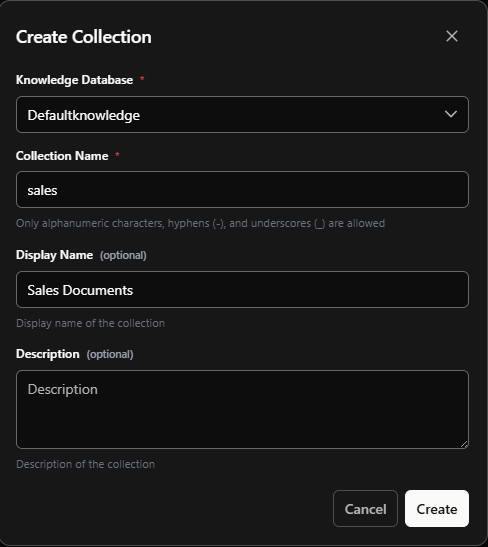

# Wissensorganisation mit Sammlungen

Sammlungen (technisch als „namespaces“ bezeichnet) organisieren Dokumente innerhalb einer Wissensdatenbank. Jeder
namespace ist ein logischer Container für verwandte Dokumente.

## Wie Sammlungen funktionieren

Wenn Dokumente ingestiert werden, erhalten sie ein Sammlungs-Label als metadata. Dieses Label begleitet jeden chunk des
Dokuments im vector store. Wenn ein Agent nach Informationen sucht, filtert er nach Sammlung, um nur relevante Dokumente
abzurufen.

Sammlungen sind nicht verschachtelt. Es sind flache metadata-Attribute. Agenten können gleichzeitig über mehrere
Sammlungen hinweg suchen, ohne eine Hierarchie navigieren zu müssen.

## Zugriffssteuerung

Die Zugriffssteuerung für Sammlungen operiert auf Agenten-Ebene, nicht auf Benutzer-Ebene. Wenn Sie einen Agenten so
konfigurieren, dass er auf bestimmte Sammlungen zugreift, sehen alle Benutzer, die mit diesem Agenten interagieren,
Antworten, die auf demselben Wissensset basieren.

Alle Benutzer erhalten dieselben Agenten-Antworten von einer gegebenen Agenten-Instanz. Sollten Benutzer bestimmte
Informationen nicht abrufen dürfen, gewähren Sie ihnen keinen Zugriff auf diesen Agenten. Derselbe Agenten-Workflow kann
mehrfach mit unterschiedlichen Sammlungs-Konfigurationen deployed werden, um separate Instanzen für verschiedene
Zielgruppen zu erstellen.

## Konfiguration

Agenten legen in ihrer retrieval-Konfiguration fest, welche Sammlungen durchsucht werden sollen. Die Plattform
durchsucht alle konfigurierten Sammlungen parallel und führt die Ergebnisse nach Relevanz-Scores zusammen. Aktualisieren
Sie den Sammlungszugriff von Agenten über die Konfiguration, ohne Codeänderungen vornehmen zu müssen.

Das Beschränken des retrievals auf relevante Sammlungen reduziert den Suchraum und verbessert die Performance.
Sammlungen können unterschiedlichen retention policies und Update-Zyklen folgen.

## Benennung

Sammlungsnamen können alphanumerische Zeichen, Bindestriche und Unterstriche enthalten. Verwenden Sie klare, deskriptive
Namen wie „hr“, „sales-policies“ oder „technical_docs“.

::: info Technischer Hinweis
Während die UI diese als „collections“ bezeichnet, sind sie technisch als „namespaces“ in der Codebase implementiert und
erscheinen als namespace metadata auf Dokumenten-chunks im vector store.
:::
