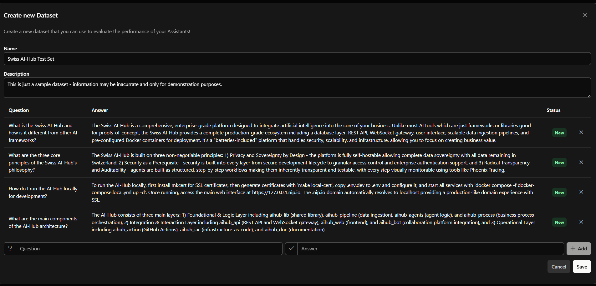
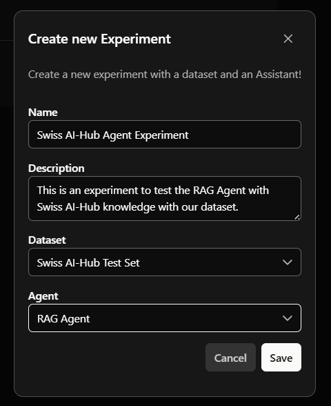
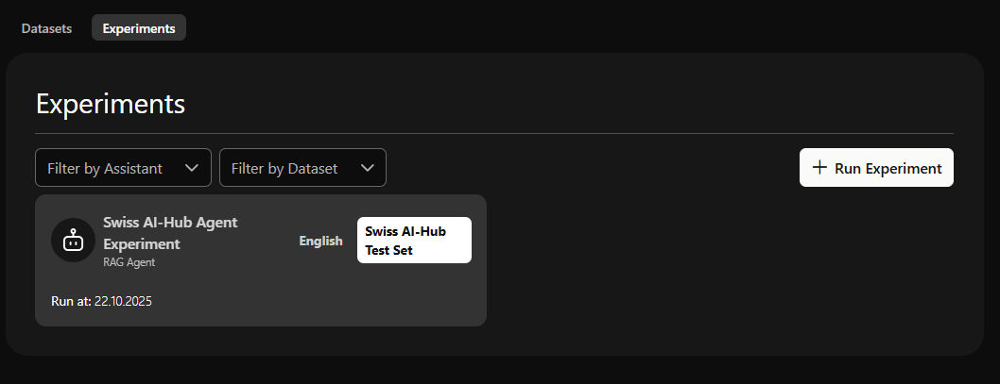
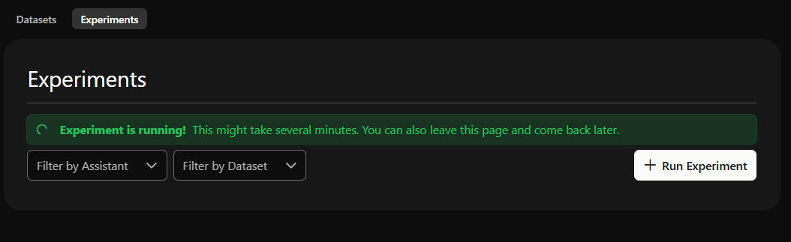
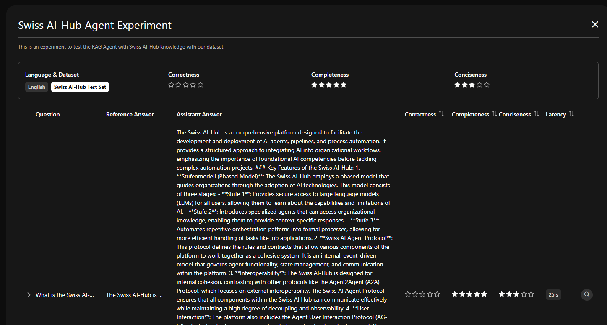

# Agentenbewertungen

Agentenbewertungen testen und messen die Qualität von KI-Agenten vor und nach dem Deployment. Sie erhalten Daten
darüber, ob Ihre Agenten genaue, vollständige und prägnante Antworten liefern.

Bewertungen testen Agenten anhand vordefinierter Fragen mit bekannten richtigen Antworten. Sie stellen die Fragen und
erwarteten Antworten bereit, und das System misst, wie gut Ihr Agent abschneidet.

Vorteile von Bewertungen:

- Überprüfung der Agenten-Performance vor und nach dem Deployment
- Messbare Bewertungen anstelle subjektiver Meinungen
- Verfolgung von Qualitätsänderungen bei der Aktualisierung von Wissensdatenbanken und Prompts
- Führen von Audit-Trails für regulatorische Anforderungen

## Datasets

Datasets sind Sammlungen von Testfragen mit Referenzantworten.

Decken Sie repräsentative Fragen ab, die Ihr Agent erhalten wird. Fügen Sie klare, genaue Referenzantworten und Edge
Cases hinzu. Beginnen Sie mit mindestens 10 Frage-Antwort-Paaren. 20-50 Paare funktionieren besser.

::: details Beispiel-Dataset-Struktur
- Frage: „Wie setze ich mein Passwort zurück?“
- Referenzantwort: „Klicken Sie auf der Anmeldeseite auf ‚Passwort vergessen‘, geben Sie Ihre E-Mail-Adresse ein und
  folgen Sie dem Link zum Zurücksetzen, der an Ihren Posteingang gesendet wird.“
:::

Um ein Dataset zu erstellen, navigieren Sie zum Bewertungsdienst (unter `Services > Evaluations`), geben Sie einen Namen
und eine Beschreibung an, fügen Sie Fragen und erwartete Antworten hinzu und speichern Sie.

 *Übersicht der Datasets, die alle
Bewertungs-Datasets mit Erstellungsdaten zeigt*

 *Hinzufügen von Testfragen mit erwarteten
Antworten*

::: tip
Beginnen Sie mit 20-30 Fragen, die einfache und komplexe Szenarien abdecken. Aktualisieren Sie Datasets, wenn sich Ihr
Agent weiterentwickelt. Organisieren Sie sie nach Thema oder Anwendungsfall.
:::

## Ausführen von Experimenten

Experimente testen Ihren Agenten anhand eines Datasets und liefern Qualitätsbewertungen.

Um ein Experiment auszuführen, wählen Sie einen Agenten aus, wählen Sie ein Test-Dataset, starten Sie das Experiment und
überprüfen Sie dann die Bewertungen und die Analyse.

 *Erstellen eines Experiments durch
Auswahl eines Agenten und Datasets*

 *Übersicht der Experimente mit Liste
vergangener Experimente – klicken Sie für Details*

 *Fortschritt des Experiments während
der Ausführung*

Führen Sie Experimente vor dem Deployment eines neuen Agenten aus, nach wesentlichen Änderungen an der Konfiguration
oder Wissensdatenbank und regelmäßig (wöchentlich oder monatlich) zur Qualitätsüberwachung.

### Wie KI-Richter arbeiten

Jede Frage wird an Ihren Agenten gesendet. Drei KI-Richter (LLMs) bewerten die Antwort anhand der Referenzantwort. Die
Ergebnisse werden gemittelt und als Sternenbewertungen angezeigt.

### Bewertungsmetriken

Drei Metriken, bewertet von 0-5 Sternen:

| Metrik          | Beschreibung                                                                                                            | Bewertungsleitfaden                                                         |
| --------------- | ----------------------------------------------------------------------------------------------------------------------- | --------------------------------------------------------------------------- |
| Korrektheit     | Faktische Genauigkeit im Vergleich zur Referenzantwort. Frei von Fehlinformationen, Halluzinationen oder Widersprüchen. | 5: Entspricht Referenz 3: Einige Fehler 0: Falsch/irreführend       |
| Vollständigkeit | Behandelt alle Teile der Anfrage, einschließlich mehrteiliger Fragen und impliziter Bedürfnisse.                        | 5: Alle Teile beantwortet 3: Einige Aspekte fehlen 0: Unvollständig |
| Prägnanz        | Effizient und direkt. Vermeidet irrelevante Abschweifungen, Redundanzen oder übermäßiges Füllmaterial.                  | 5: Auf den Punkt 3: Weitschweifig 0: Übermäßig                      |

Bewertungsbereiche:

- 4-5 Sterne: Produktionsreif.
- 3-4 Sterne: Funktioniert gut, kann aber kleinere Probleme haben. Überprüfen Sie fehlerhafte Testfälle.
- Unter 3 Sternen: Vor dem Deployment genau überprüfen.

### Ergebnisse anzeigen

 *Experimentergebnisse, die Gesamtmetriken und
detaillierte Aufschlüsselung pro Frage zeigen*

Die Ergebnisseite zeigt oben Sternenbewertungen für die drei Metriken. Darunter befindet sich eine Tabelle mit jeder
Testfrage, der Referenzantwort, der Antwort des Agenten, den Bewertungen und der Antwortlatenz.

Erweitern Sie Fragen, um den vollständigen Text anzuzeigen. Niedrige Korrektheitsbewertungen bedeuten in der Regel
Lücken in der Wissensdatenbank oder Abrufprobleme. Niedrige Vollständigkeitsbewertungen deuten darauf hin, dass der
Agent Teile von mehrteiligen Fragen übersieht. Niedrige Prägnanzbewertungen bedeuten übermäßig weitschweifige Antworten.

Aktualisieren Sie die Wissensdatenbank, System-Prompts oder Abrufeinstellungen Ihres Agenten basierend auf den
Ergebnissen. Führen Sie das Experiment erneut aus, um Verbesserungen zu überprüfen.

::: tip
Phoenix kann für tiefere Untersuchungen, einschließlich Konversationsverläufen und Roh-Telemetriedaten, aufgerufen
werden.
:::

## Was nicht implementiert ist

Die folgenden Funktionen sind derzeit nicht implementiert:

- Bias-Überwachung und Modell-Drift-Erkennung: Keine automatisierte Bias-Erkennung, Fairness-Metriken oder
  Drift-Erkennung. Das Bewertungs-Framework und OpenTelemetry-Tracing bieten grundlegende Funktionen, die erweitert
  werden könnten.

- Produktions-A/B-Tests: Keine integrierte Traffic-Aufteilung oder parallele Tests von Agentenvarianten in der
  Produktion. Der Vergleich vor dem Deployment durch Experimente wird unterstützt.
