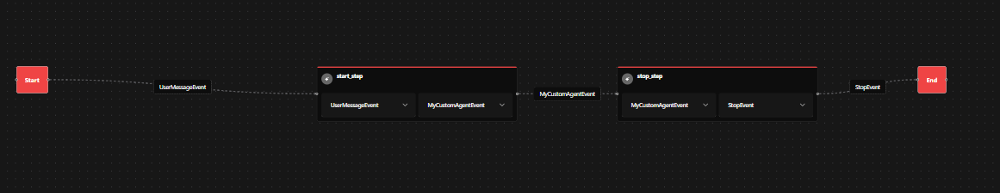

# Ihr erster Agent

Erstellen Sie Ihren ersten Agenten mit dem AI-Hub Agent (`aihub_agent`) SDK – ein einfacher
Nachrichtenverarbeitungs-Agent mit einem 2-Schritte-Workflow.

## Was Sie lernen werden

Diese Schnellstartanleitung behandelt die wesentlichen Bausteine:

- **Agentenstruktur**: Wie Agents Nachrichten in Steps verarbeiten
- **Event-Fluss**: Datenfluss zwischen Workflow-Schritten
- **Konfiguration**: Einstellungen, die das Agentenverhalten steuern
- **Testen**: Ihren Agenten lokal ausführen

## Voraussetzungen

Sie benötigen die AI-Hub Entwicklungsumgebung. Bevor Sie beginnen, stellen Sie sicher, dass Sie die Schritte zur
[Einrichtung der Entwicklungsumgebung](../1_dev_environment_setup/) abgeschlossen haben.

## Wie Agents funktionieren

AI-Hub Agents sind **ereignisgesteuerte Workflows** mit drei wesentlichen Teilen:

- **Steps**: Mit `@step()` dekorierte Funktionen, die Events verarbeiten
- **Events**: Datenobjekte, die zwischen Steps fließen
- **Konfiguration**: Typisierte Einstellungen, die das Agentenverhalten steuern

## Einige grundlegende Konzepte zum Starten!

Betrachten wir den Standard-Agenten, der bei der Einrichtung der Entwicklungsumgebung erstellt wurde:

```python
import logging

from aihub_agent.agents.Agent import Agent
from aihub_lib.nats.events.user import UserMessageEvent
from aihub_lib.nats.events import StopEvent
from aihub_agent.workflow.decorators.step import step

logger = logging.getLogger(__name__)


class MyCustomAgent(Agent):

    @step()
    async def start_step(
        self,
        event: UserMessageEvent,
    ) -> StopEvent:
        content = event.messages[-1].content
        print(f"[Step 1]: UserMessageEvent: {content}")
        hello_world_message = "Hello World!\n"
        return StopEvent(final_message=hello_world_message)
```

Wenn Sie die Benutzeroberfläche starten und versuchen, den Agenten in der OpenWebUI zu verwenden, stellen Sie fest, dass
der Agent nicht antwortet.


### Chunk-Events zur Anzeige von Live-Chat-Antworten verwenden

Der Grund, warum Sie keine Antwort in der Chat-Oberfläche sehen, ist, dass nur spezielle Events (`DisplayEvents`) in der
UI angezeigt werden. Und bei Chat-Oberflächen setzt sich die Antwort insbesondere aus `ChunkEvent`s zusammen. Lassen Sie
uns daher unseren Step so konfigurieren, dass er ein solches `ChunkEvent` anzeigt. Dafür müssen wir den `EventDisplayer`
in der Step-Funktion verwenden und die `display_chunk`-Methode mit dem anzuzeigenden Inhalt als erstem Argument und der
Quelle dieses Chunks als zweitem Argument aufrufen. Üblicherweise ist dies der Modellname oder das Sprachmodell, das
diesen Chunk erzeugt. Da wir den Chunk in unserem Fall vorerst hart codieren, verwenden wir einfach den `ClassName` des
Agenten als Quelle.

```python
import logging

from aihub_agent.agents.Agent import Agent
from aihub_lib.nats.events.user import UserMessageEvent
from aihub_lib.nats.events import StopEvent
from aihub_agent.workflow.decorators.step import step
from aihub_lib.displayers.EventDisplayer import EventDisplayer # [!code ++]

logger = logging.getLogger(__name__)


class MyCustomAgent(Agent):

    @step()
    async def start_step(
        self,
        event: UserMessageEvent,
        displayer: EventDisplayer, # [!code ++]
    ) -> StopEvent:
        content = event.messages[-1].content
        print(f"[Step 1]: UserMessageEvent: {content}")
        hello_world_message = "Hello World!\n"
        await displayer.display_chunk(hello_world_message, "MyCustomAgent") # [!code ++]
        return StopEvent(final_message=hello_world_message)
```

Nun sehen wir, dass der Agent mit einer tatsächlichen Nachricht antwortet.


### Die Leistung des Streamings sehen

Wie Sie vielleicht von anderen KI-Tools wissen, erzeugen große Sprachmodelle ihre Antworten Stück für Stück. Anstatt die
Antwort am Ende als Ganzes anzuzeigen, können wir die endgültige Antwort Stück für Stück aufbauen, was es uns
ermöglicht, dem Benutzer so schnell wie möglich einen Teil der Antwort zu zeigen. Lassen Sie uns dies demonstrieren:

```python
import logging
import asyncio # [!code ++]

from aihub_agent.agents.Agent import Agent
from aihub_lib.nats.events.user import UserMessageEvent
from aihub_lib.nats.events import StopEvent
from aihub_agent.workflow.decorators.step import step
from aihub_lib.displayers.EventDisplayer import EventDisplayer

logger = logging.getLogger(__name__)


class MyCustomAgent(Agent):

    @step()
    async def start_step(
        self,
        event: UserMessageEvent,
        displayer: EventDisplayer,
    ) -> StopEvent:
        content = event.messages[-1].content
        print(f"[Step 1]: UserMessageEvent: {content}")
        hello_world_message = "Hello World!\n"
        await displayer.display_chunk(hello_world_message, "MyCustomAgent")
        await asyncio.sleep(2) # [!code ++]
        repeat_message = f"You said: {content}!\n" # [!code ++]
        await displayer.display_chunk(repeat_message, "MyCustomAgent") # [!code ++]
        return StopEvent(final_message=hello_world_message)
```

Wir haben gerade einen zweiten Chunk hinzugefügt, der angezeigt wird. Wenn Sie den Agenten nun erneut ausführen, sehen
Sie, dass er zuerst mit `Hello World!` antwortet und nach 2 Sekunden mit `You said: Hello!` antwortet.
<video controls="controls" src="../../../../media/sdk/your_first_agent/show_chunk_delay.mp4" type="video/mp4" />

### Denkschritte hinzufügen

Besonders wenn der Agent länger braucht, um sein Ergebnis zu finalisieren, ist es eine gute Praxis, den Benutzer darüber
zu informieren, was im Agenten vor sich geht. Um dies zu ermöglichen, können Sie `ThoughtEvent`s anzeigen. Auch hier
verwenden wir den `EventDisplayer`, diesmal jedoch mit der `display_thought`-Methode.

```python
import logging
import asyncio

from aihub_agent.agents.Agent import Agent
from aihub_lib.nats.events.user import UserMessageEvent
from aihub_lib.nats.events import StopEvent
from aihub_agent.workflow.decorators.step import step
from aihub_lib.displayers.EventDisplayer import EventDisplayer

logger = logging.getLogger(__name__)


class MyCustomAgent(Agent):

    @step()
    async def start_step(
        self,
        event: UserMessageEvent,
        displayer: EventDisplayer,
    ) -> StopEvent:
        content = event.messages[-1].content
        print(f"[Step 1]: UserMessageEvent: {content}")
        await displayer.display_thought("Drinking coffee...")  # [!code ++]
        hello_world_message = "Hello World!\n"
        await displayer.display_chunk(hello_world_message, "MyCustomAgent")
        await asyncio.sleep(2)
        repeat_message = f"You said: {content}!\n"
        await displayer.display_chunk(repeat_message, "MyCustomAgent")
        return StopEvent(final_message=hello_world_message)
```

Nun sehen Sie, dass es einen zusätzlichen Abschnitt in der Antwort namens `Thinking...` gibt. Wenn Sie diesen erweitern,
sehen Sie unseren Gedanken, der mit dem Inhalt `Drinking coffee...` erstellt wurde.


## Erstellen Sie Ihren ersten Multistep-Agenten

### 1. Erstellen Sie ein benutzerdefiniertes Event (`events/MyCustomAgentEvent.py`):

Erstellen Sie zunächst ein Event, um Daten zwischen Steps zu übergeben:

```python
from typing import Annotated

from aihub_lib.nats.events import ControlEvent
from pydantic import Field


class MyCustomAgentEvent(ControlEvent):
    word_count: Annotated[int, Field(description="The word count of the processed content")]

```

### 2. Agenten-Implementierung anpassen (`MyCustomAgent.py`):

```python
import logging
import asyncio

from aihub_agent.agents.Agent import Agent
from aihub_lib.nats.events.user import UserMessageEvent
from aihub_lib.nats.events import StopEvent
from aihub_agent.workflow.decorators.step import step
from aihub_lib.displayers.EventDisplayer import EventDisplayer

from .events.MyCustomAgentEvent import MyCustomAgentEvent # [!code ++]

logger = logging.getLogger(__name__)


class MyCustomAgent(Agent):

    @step()
    async def start_step(
        self,
        event: UserMessageEvent,
        displayer: EventDisplayer,
    ) -> MyCustomAgentEvent:
        content = event.messages[-1].content
        print(f"[Step 1]: UserMessageEvent: {content}")
        await displayer.display_thought("Drinking coffee...")
        hello_world_message = "Hello World!\n"
        await displayer.display_chunk(hello_world_message, "MyCustomAgent")
        await asyncio.sleep(2)
        repeat_message = f"You said: {content}!\n"
        await displayer.display_chunk(repeat_message, "MyCustomAgent")
        word_count = len(content.split()) # [!code ++]
        return MyCustomAgentEvent(word_count=word_count) # [!code ++]
        return StopEvent(final_message=hello_world_message) # [!code --]

    @step() # [!code ++]
    async def stop_step( # [!code ++]
        self, # [!code ++]
        event: MyCustomAgentEvent, # [!code ++]
        displayer: EventDisplayer, # [!code ++]
    ) -> StopEvent: # [!code ++]
        await displayer.display_chunk(f"The word count is {event.word_count} words\n", "MyCustomAgent") # [!code ++]
        return StopEvent() # [!code ++]
```

Nun haben Sie einen ersten Agenten, der in zwei Steps agiert. Im ersten Step erledigen wir alles, was wir zuvor getan
haben, aber wir zählen auch die Anzahl der Wörter in der Benutzernachricht. Diese Information wird dann an einen zweiten
Step weitergegeben, wo wir der Antwort zusätzlich `The word count is X words` hinzufügen, wobei X die Anzahl der Wörter
ist, die wir im ersten Step gezählt haben. Wir haben die beiden Steps verbunden, indem wir unser neues Event
`MyCustomAgentEvent` als Output des ersten Steps und als Input für den zweiten Step definiert haben.

Wenn Sie zur Agentenübersicht navigieren, dort Ihren Agenten auswählen und dann zu `Workflow` gehen, können Sie den
Workflow und die Steps Ihres Agenten sehen. Sie können sehen, welche Steps definiert sind und welche Input- und
Output-Events diese Steps haben.



### 3. Agenten-Konfiguration hinzufügen (`MyCustomAgentConfig.py`):

Oft möchten Sie Ihren Agenten beim Start konfigurierbar machen. Dafür können Sie die Konfigurationsklasse verwenden.
Wenn Sie Ihren Agenten über die CLI eingerichtet haben, wurde bereits eine grundlegende Konfigurationsdatei für Sie
erstellt, die wie folgt aussieht:

```python
from typing import Annotated

from pydantic import Field
from aihub_lib.agents.AgentConfig import AgentConfig


class MyCustomAgentConfig(AgentConfig):
    """Configuration class for My First Agent Agent."""

    config_value: Annotated[str, Field(
        default="Default Config Value",
        description="Some configuration value for the agent"
    )]
```

Wir können auf diese Konfiguration in jedem Step zugreifen, falls wir dies benötigen. Zum Beispiel können wir den Inhalt
des Feldes `config_value` im zweiten Step unseres Agenten lesen und seinen String-Wert ebenfalls als Chunk posten.
Normalerweise verwenden Sie die Konfiguration jedoch, um eine Logik in Ihren Steps zu konfigurieren, sei es mit
System-Prompts oder Konfigurationen für bestimmte Methoden.

```python
import logging
import asyncio

from aihub_agent.agents.Agent import Agent
from aihub_lib.nats.events.user import UserMessageEvent
from aihub_lib.nats.events import StopEvent
from aihub_agent.workflow.decorators.step import step
from aihub_lib.displayers.EventDisplayer import EventDisplayer

from .events.MyCustomAgentEvent import MyCustomAgentEvent
from .MyCustomAgentConfig import MyCustomAgentConfig  # [!code ++]

logger = logging.getLogger(__name__)


class MyCustomAgent(Agent):

    @step()
    async def start_step(
        self,
        event: UserMessageEvent,
        displayer: EventDisplayer,
    ) -> MyCustomAgentEvent:
        content = event.messages[-1].content
        print(f"[Step 1]: UserMessageEvent: {content}")
        await displayer.display_thought("Drinking coffee...")
        hello_world_message = "Hello World!\n"
        await displayer.display_chunk(hello_world_message, "MyCustomAgent")
        await asyncio.sleep(2)
        repeat_message = f"You said: {content}!\n"
        await displayer.display_chunk(repeat_message, "MyCustomAgent")
        word_count = len(content.split())
        return MyCustomAgentEvent(word_count=word_count)

    @step()
    async def stop_step(
        self,
        event: MyCustomAgentEvent,
        config: MyCustomAgentConfig,  # [!code ++]
        displayer: EventDisplayer,
    ) -> StopEvent:
        await displayer.display_chunk(f"The word count is {event.word_count} words\n", "MyCustomAgent")
        await displayer.display_chunk(f"My config sais: {config.config_value}", "MyCustomAgent")
        return StopEvent()
```

Sie können die Konfigurationswerte in Ihrer `trigger.py` oder beim Bauen des Agenten in der `main.py` festlegen.

```python{10}
async def main():
    servers_list = [NatsSettings().ENDPOINT]
    runner = AgentRunner(
        agent_type=MyCustomAgent,
        default_agent_config=MyCustomAgentConfig(
            agent_class=MyCustomAgent.__name__,
            agent_id="my_custom_agent",
            name=LocaleString(en="My Custom Agent"),
            description=LocaleString(en="This is a simple agent created from a template."),
            config_value="My first Config Value"
        ),
        redis_url=RedisSettings().URL,
        servers=servers_list,
    )

    await runner.run_forever()


if __name__ == "__main__":
    asyncio.run(main())
```

### 4. Testskript (`trigger.py`):

## Ihren Agenten ausführen und debuggen

1. **Führen Sie das Testskript aus**:

Um Ihren Agenten schnell zu testen, können Sie ein `trigger.py`-Skript schreiben, das den Agenten startet und sein
StartEvent sendet. Auf diese Weise können Sie den Agenten ohne Benutzeroberfläche testen.

::: code-group

```python [trigger.py]
import asyncio
from aihub_lib.i18n.LocaleString import LocaleString
from aihub_lib.nats.events import UserMessageEvent
from aihub_lib.testing.auth_utils.fake_user import fake_user
from aihub_lib.infrastructure.logging.logger import enable_logging
from aihub_agent.runners.AgentTestRunner import AgentTestRunner
from llama_index.core.base.llms.types import ChatMessage, MessageRole

from MyAgent import MyAgent
from MyAgentConfig import MyAgentConfig

# Enable detailed logging to see event flow
enable_logging()

async def main():
    # Configure the agent
    config = MyAgentConfig(
        agent_class=MyCustomAgent.__name__,
        agent_id="my_custom_agent",
        name=LocaleString(en="My Custom Agent"),
        description=LocaleString(en="This is a simple agent created from a template."),
        config_value="My first Config Value"
    )
    
    # Create test runner
    runner = AgentTestRunner(agent_type=MyAgent, default_agent_config=config)
    
    # Run the agent with a test message
    async with runner.test_run() as topic:
        await runner.send_event_from_topic(
            topic=topic,
            start_event=UserMessageEvent(
                messages=[ChatMessage(
                    content="Hello world this is my first agent",
                    role=MessageRole.USER
                )],
                user=fake_user()
            )
        )
    
    print(f"Agent completed: {runner.has_stop_event}")

if __name__ == "__main__":
    asyncio.run(main())
```

```bash
python trigger.py
```

Erwartete Ausgabe:

```
[Step 1] Processing message: 'Hello world this is my first agent' -> 'HELLO WORLD THIS IS MY FIRST AGENT'
[Step 2] Creating response: 'Processed: HELLO WORLD THIS IS MY FIRST AGENT (Words: 7)'
Agent completed: True
```

2. **Debuggen mit Phoenix Tracing** – Öffnen Sie `http://localhost:6006`, um Folgendes zu sehen:

   - Schritt-für-Schritt-Ausführungsfluss
   - Event-Datenfluss zwischen Steps
   - Timing- und Performance-Metriken
   - Event-Payload-Details

3. **Überprüfen Sie die Logs** – Der Aufruf von `enable_logging()` zeigt den Event-Fluss in Echtzeit und hilft bei der
   Fehlersuche.

## Den Workflow verstehen

Ihr Agent folgt diesem Event-Fluss:

1. **UserMessageEvent** → `process_message()` → **MessageEvent**
2. **MessageEvent** → `create_response()` → **StopEvent**

Jeder Step:

- Empfängt ein Event als Input
- Verarbeitet die Daten
- Gibt ein neues Event zurück
- Die Workflow-Engine leitet Events an den nächsten Step weiter

## Was Sie gelernt haben

- **Ereignisgesteuerte Workflows**: Steps verarbeiten Events und erzeugen neue Events
- **Benutzerdefinierte Events**: Erstellen von typisierten Datenobjekten zur Übergabe zwischen Steps
- **Konfiguration**: Verwenden von typisierten Einstellungen zur Steuerung des Agentenverhaltens
- **Testen**: Verwenden Sie `AgentTestRunner` für isolierte Tests
- **Debugging**: Phoenix Tracing und Logging für Observability

## Nächste Schritte

- [Ihre erste Pipeline](../4_your_first_pipeline/)
- [Agents bauen](../../2_building_agents/) – Erfahren Sie mehr über fortgeschrittene Agentenmuster
