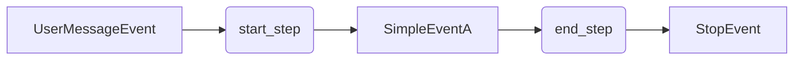
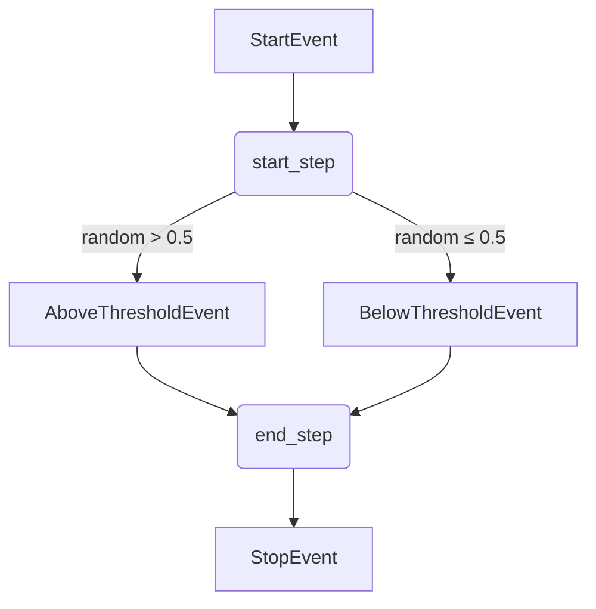
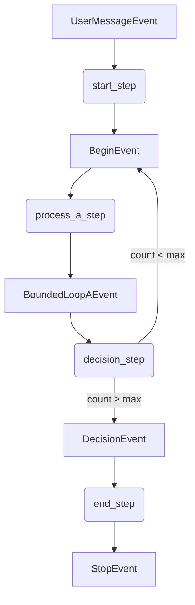
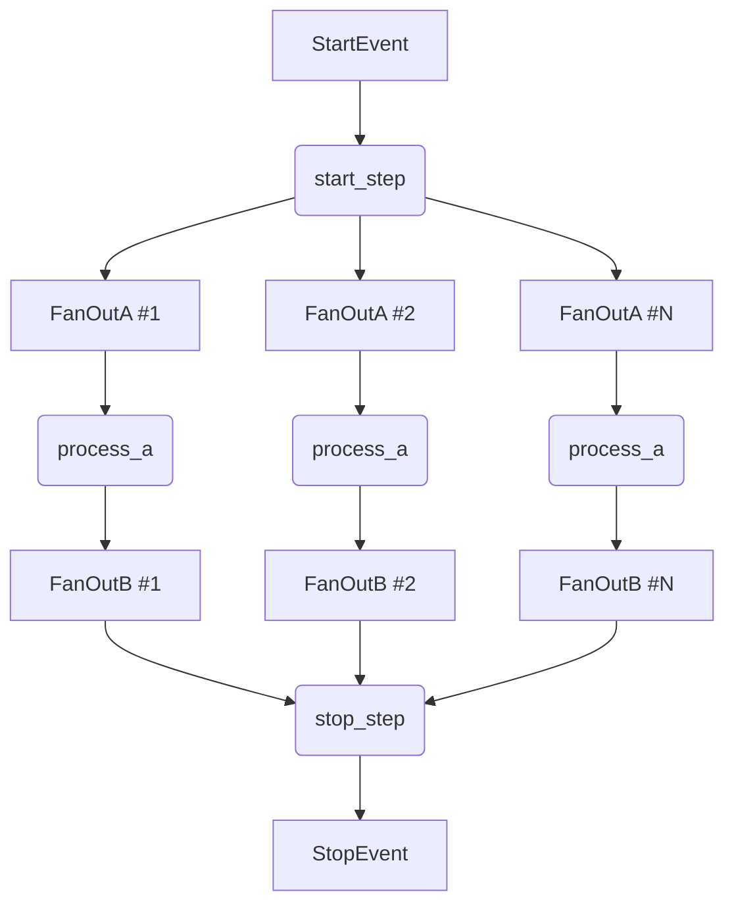
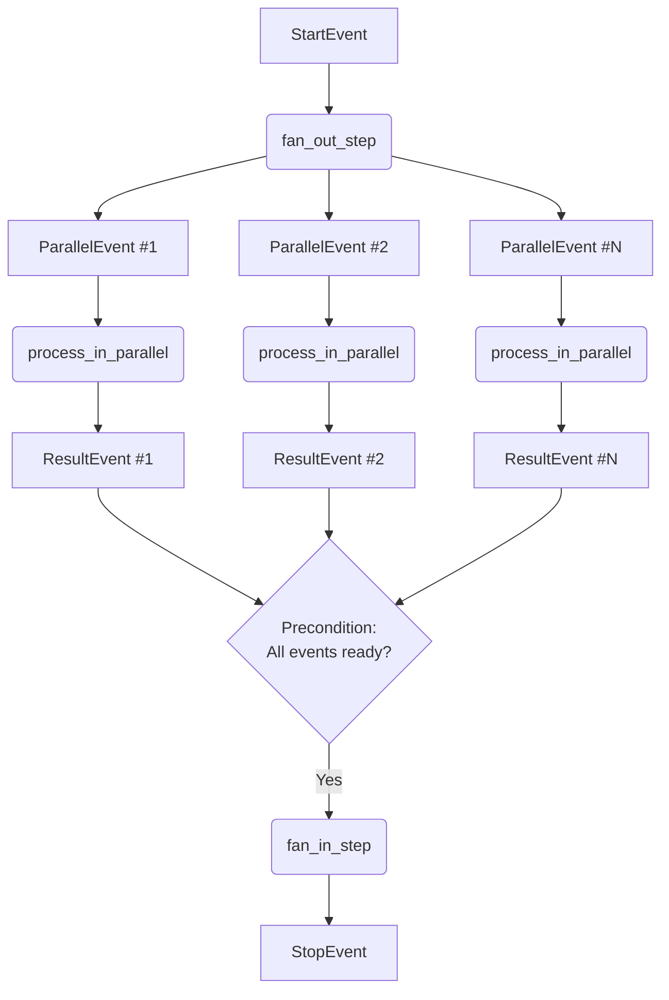
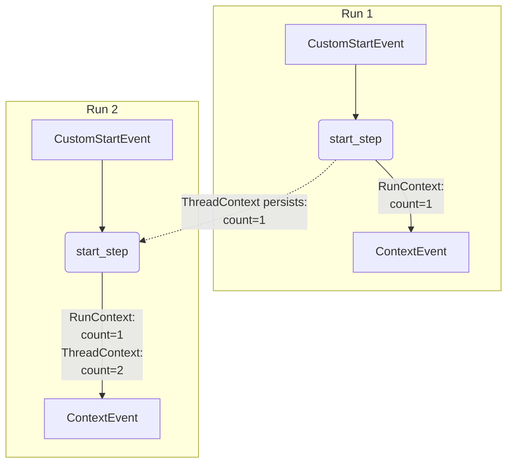
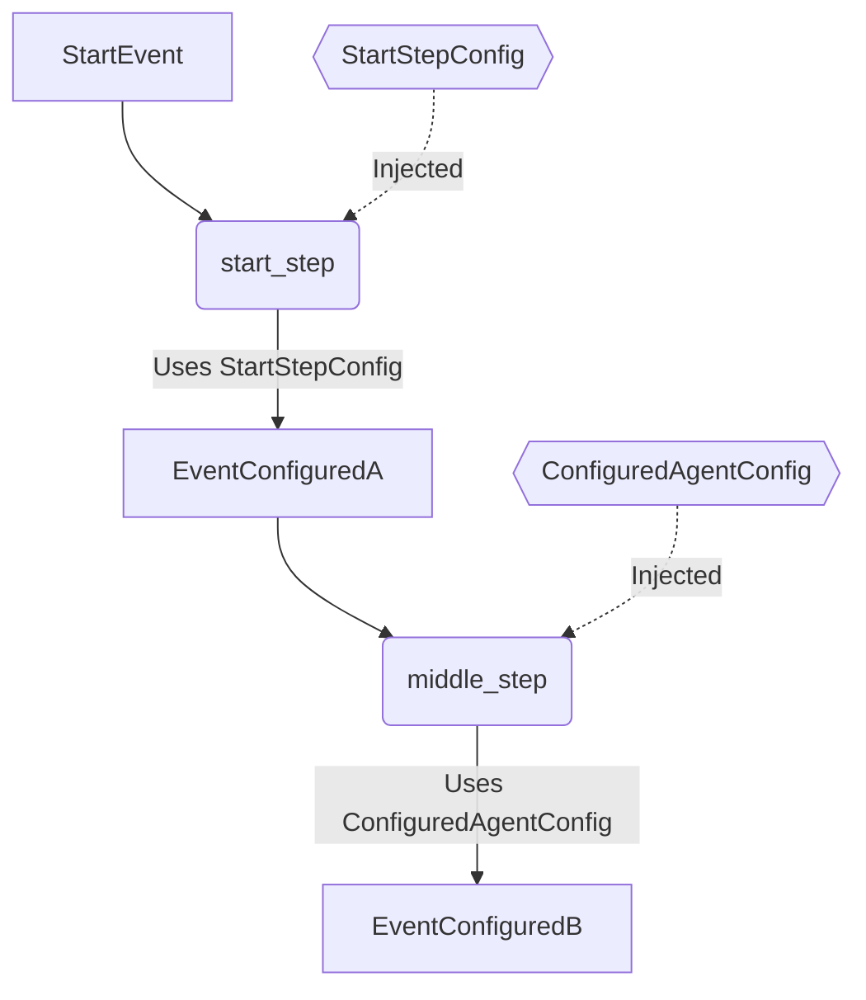
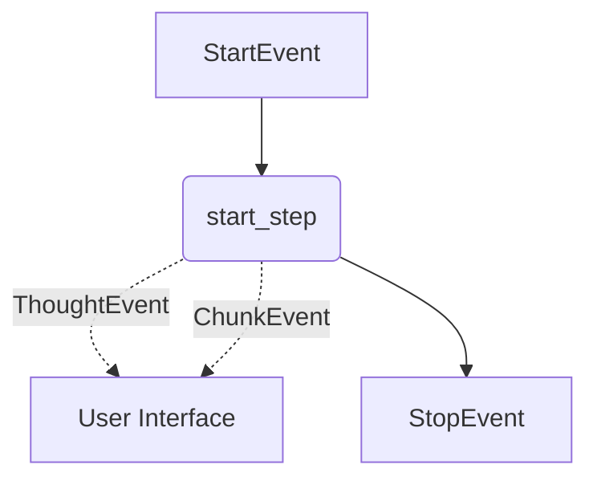
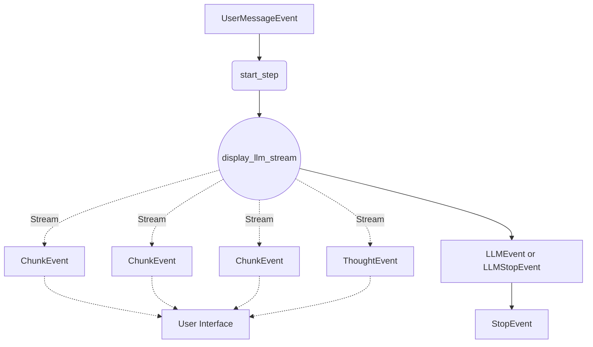
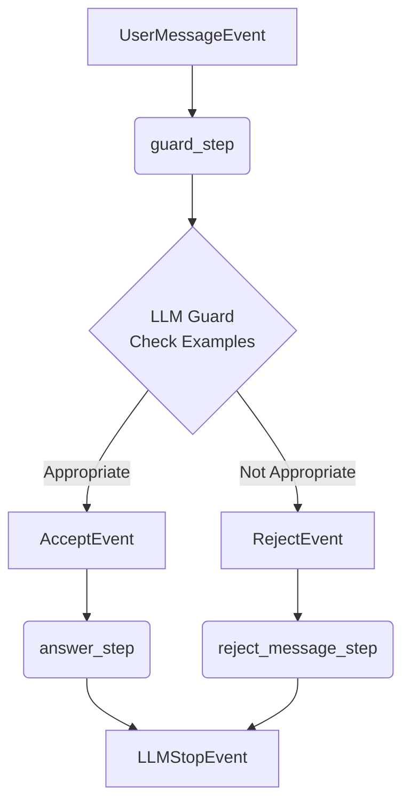

# Core Workflow Patterns

This page covers the fundamental, reusable patterns for building agent workflows. By combining these building blocks,
you can create sophisticated and robust agents. Each pattern includes a concise code example and an explanation of its
purpose.

For complete, runnable examples, see the `playground/minimal_workflow/` directory.

## Workflow Control Patterns

These patterns define the fundamental flow of execution in an agent, from simple sequences to complex branching and
parallel processing.

### Simple Linear Workflow

A **linear workflow** is the most basic pattern, where steps execute in a direct sequence from a start event to a stop
event.

- **When to use it**: Ideal for simple, sequential tasks like processing a single input to produce a single output.
- **How it works**: One step returns a `ControlEvent` that is consumed by the next step, forming a direct chain.



```python
class SimpleAgent(Agent):
    @step()
    async def start_step(self, event: UserMessageEvent) -> SimpleEventA:
        return SimpleEventA(payload=event.messages[-1].content)

    @step()
    async def end_step(self, event: SimpleEventA) -> StopEvent:
        return StopEvent()
```

### Conditional Workflow (Branching)

A **conditional workflow** creates decision points, allowing the agent to follow different paths based on runtime
conditions.

- **When to use it**: For routing logic, handling different user intents, or classifying data.
- **How it works**: A step's return type hint includes multiple event types (e.g., `EventA | EventB`). The dispatcher
  routes the workflow to the step that handles the specific event type that was returned.



```python
class ConditionalAgent(Agent):
    @step()
    async def start_step(self, event: StartEvent) -> AboveThresholdEvent | BelowThresholdEvent:
        if random.random() > 0.5:
            return AboveThresholdEvent()
        return BelowThresholdEvent()

    @step()
    async def end_step(self, event: AboveThresholdEvent | BelowThresholdEvent) -> StopEvent:
        # This step runs for either outcome of the start_step
        return StopEvent()
```

### Bounded Loops (Iteration)

A **looping workflow** executes a step or a series of steps multiple times. It's crucial to ensure loops have a clear
exit condition.

- **When to use it**: Ideal for retry logic, iterative refinement, or processing a batch of items.
- **How it works**: A step returns an event that routes the flow back to an earlier step, using `RunContext` to track
  state. Use the `@step(max_executions_per_run=N)` parameter as a safety guard against infinite loops.



```python
class BoundedLoopAgent(Agent):
    @step()
    async def start_step(self, event: UserMessageEvent, run_context: RunContext) -> BeginEvent:
        print("[SimpleAgent.start_step]")
        await run_context.set("loop_count", 0)
        return BeginEvent(count=0)

    @step()
    async def process_a_step(self, event: BeginEvent) -> BoundedLoopAEvent:
        print("[BoundedLoopAgent.process_a_step]")
        return BoundedLoopAEvent()

    @step()
    async def decision_step(
        self, event: BoundedLoopAEvent, agent_config: BoundedLoopAgentConfig, run_context: RunContext
    ) -> DecisionEvent | BeginEvent:
        loop_count = await run_context.get("loop_count")
        print("[BoundedLoopAgent.decision_step]", loop_count)
        if loop_count < agent_config.loop_max:
            await run_context.set("loop_count", loop_count + 1)
            return BeginEvent(count=loop_count + 1)

        return DecisionEvent()

    @step()
    async def end_step(self, event: DecisionEvent) -> StopEvent:
        print("[SimpleAgent.end_step]")
        return StopEvent()

```

### Fan-Out / Fan-In (Parallel Processing)

This powerful pattern allows an agent to split a task into multiple parallel branches (**fan-out**) and then aggregate
the results (**fan-in**).

- **When to use it**: For processing multiple documents, making parallel API calls, or any task that can be broken down
  into independent sub-tasks.
- **How it works**:
  - **Fan-Out**: A step returns a `list` of events. The dispatcher then triggers the next step *once for each event in
    the list*, creating parallel execution branches.
  - **Fan-In**: A later step uses a **precondition** to wait until all parallel branches have produced their result
    events before it runs.

#### Fixed Number of Events

Use `FixedList({event}, {number_of_events})` to specify a fixed number of expected events:



```python
N = 5


class FanOutAgent(Agent):
    @step()
    async def start_step(self, _: StartEvent) -> list[FanOutA]:
        print("[start_step]")
        return [FanOutA(payload=str(i)) for i in range(N)]

    @step()
    async def process_a(self, event: FanOutA) -> FanOutB:
        return FanOutB(payload=event.payload)

    @step()
    async def stop_step(self, _: FixedList(FanOutB, N)) -> StopEvent:
        print("[stop_step]")
        return StopEvent()
```

#### Using Preconditions

For dynamic fan-in scenarios, use a precondition function to check if all results are ready:



```python
# The precondition function checks if all results are ready
@precondition()
async def ensure_enough_events(events: list[ParallelEvent], config: PreconditionAgentConfig) -> bool:
    return len(events) == config.number_of_events

class ParallelProcessingAgent(Agent):
    @step()
    async def fan_out_step(self, _: StartEvent, config: PreconditionAgentConfig) -> list[ParallelEvent]:
        # 1. Fan-Out: Return a list of events to start parallel branches
        return [ParallelEvent(payload=str(i)) for i in range(config.number_of_events)]

    @step()
    async def process_in_parallel(self, event: ParallelEvent) -> ResultEvent:
        # 2. This step runs in parallel for each ParallelEvent
        # ... process the event ...
        return ResultEvent(...)

    @step(precondition=ensure_enough_events)
    async def fan_in_step(self, _: list[ResultEvent]) -> StopEvent:
        # 3. Fan-In: This step only runs after the precondition is met
        # (i.e., all parallel branches have produced a ResultEvent)
        return StopEvent()
```

## State and Configuration Patterns

These patterns focus on managing an agent's memory and behavior dynamically.

### Context Management (The Agent's Memory)

The SDK provides injectable **context objects** to store information during and between runs.

- **When to use it**: For tracking progress, remembering user preferences, or passing data between non-sequential steps.
- **How it works**:
  - **`RunContext`**: Ephemeral memory for a *single* workflow run. It's created on a `StartEvent` and destroyed on a
    `StopEvent`.
  - **`ThreadContext`**: Persistent memory for a conversation *thread*. It survives across multiple agent runs.



```python
class ContextAgent(Agent):
    @step()
    async def start_step(self, event: CustomStartEvent, thread_context: ThreadContext, run_context: RunContext) -> ContextEvent:
        thread_count = await thread_context.get("count", 0) # Persists across runs
        run_count = await run_context.get("count", 0)     # Resets each run

        await thread_context.set("count", thread_count + 1)
        await run_context.set("count", run_count + 1)
        return ContextEvent(thread_count=thread_count + 1, run_count=run_count + 1)
```

### Configuration-Driven Behavior

Separate your agent's logic from its settings using `AgentConfig` and `StepConfig` classes.

- **When to use it**: To create reusable agents, manage settings for different environments.
- **How it works**: The dispatcher injects the entire `AgentConfig` or a specific `StepConfig` into your step based on
  its type hint.



```python
class ConfiguredAgent(Agent):
    @step()
    async def start_step(self, event: StartEvent, config: StartStepConfig) -> EventConfiguredA:
        # Injects only the specific configuration for this step
        return EventConfiguredA(payload=config.some_step_value)

    @step()
    async def middle_step(self, event: EventConfiguredA, config: ConfiguredAgentConfig) -> EventConfiguredB:
        # Injects the entire agent's configuration
        return EventConfiguredB(payload=config.some_agent_value)
```

## User Interaction and Feedback

This pattern is essential for creating transparent and user-friendly agents.

### Displaying Information

Agents can provide real-time feedback to the user without interrupting the workflow's logic.

- **When to use it**: To show "chain-of-thought" reasoning, provide status updates for long-running tasks, or stream
  back partial results.
- **How it works**: Inject the `EventDisplayer` into a step. Use its methods (`display_thought`, `display_chunk`) to
  send `DisplayEvent`s to the user interface. These events do not affect the control flow.



```python
class DisplayingAgent(Agent):
    @step()
    async def start_step(self, event: StartEvent, displayer: EventDisplayer) -> StopEvent:
        await displayer.display_thought("Let me think....")
        await displayer.display_chunk("This is a partial result sent to the user.", model_name="gpt-4")
        # ... continue processing ...
        return StopEvent()
```

## LLM Integration Patterns

These patterns show how to integrate Large Language Models (LLMs) into your agent workflows, including streaming
responses and cost tracking.

### Streaming LLM Responses to Users

Stream LLM responses incrementally to users while automatically tracking token usage and costs.

- **When to use it**: For any agent that needs to provide LLM-generated responses with real-time feedback.
- **How it works**: The `EventDisplayer.display_llm_stream()` method streams the LLM response as chunks to the user
  interface while maintaining buffers for content and thinking. It can return either `LLMEvent` or `LLMStopEvent` (which
  combines LLM data with StopEvent).



```python
# Example 1: Basic LLM streaming (returns LLMEvent)
class LlamaIndexAgent(Agent):
    @step()
    async def start_step(
        self,
        event: UserMessageEvent,
        agent_config: LlamaIndexAgentConfig,
        displayer: EventDisplayer,
    ) -> LLMEvent:
        async with agent_config.llm.cost_reporting_llm(displayer) as llm:
            return await displayer.display_llm_stream(
                agent_config.llm,
                llm,
                event.messages
            )

    @step()
    async def stop_step(self, event: LLMEvent) -> StopEvent:
        return StopEvent()

# Example 2: Direct to stop (returns LLMStopEvent)
class LLMWrappingAgent(Agent):
    @step()
    async def start_step(
        self,
        event: UserMessageEvent,
        agent_config: LLMWrappingAgentConfig,
        displayer: EventDisplayer,
    ) -> LLMStopEvent:
        async with agent_config.llm.cost_reporting_llm(displayer) as llm:
            # as_stop_step=True returns LLMStopEvent directly
            return await displayer.display_llm_stream(
                agent_config.llm,
                llm,
                event.messages,
                as_stop_step=True
            )
```

The `cost_reporting_llm()` context manager wraps the LLM to automatically track token usage and publish cost events when
the context exits.

## Decision Making & Routing Patterns

These patterns enable agents to make intelligent routing decisions by returning different event types from a step based
on LLM analysis or other logic.

### How Conditional Routing Works

A step can return different event types based on runtime decisions. The workflow dispatcher automatically routes to the
correct next step based on the event type returned.

**Key Concept**: Use type hints like `EventA | EventB` to declare multiple possible return types. The dispatcher
automatically routes to steps that handle each event type.

### Example: LLM Guard Check

**Use Case**: Validate if a user's question is appropriate for the agent to answer using example-based classification.

**From**: `RAGAgent.few_shot_guard_step` - validates questions against few-shot examples



```python
from aihub_lib.nats.events import UserMessageEvent
from aihub_lib.displayers.EventDisplayer import EventDisplayer
from aihub_agent.agents.Agent import Agent
from aihub_agent.workflow.decorators.step import step

# Define your guard events
class AcceptEvent(Event):
    reason: str

class RejectEvent(Event):
    reason: str

class SimpleGuardAgent(Agent):
    @step()
    async def guard_step(
        self,
        event: UserMessageEvent,
        agent_config: AgentConfig,
        displayer: EventDisplayer,
        t: LocaleHandler,
    ) -> AcceptEvent | RejectEvent:
        """
        Use LLM with examples to determine if question is appropriate.
        Returns different event types based on LLM decision.
        """
        user_query = event.messages[-1].content

        # Use LLM structured prediction to make decision
        async with agent_config.llm.cost_reporting_llm(displayer) as llm:
            guard_result = await few_shot_guard(
                llm=llm,
                t=t,
                user_query=user_query,
                examples=agent_config.few_shot_guard_examples,
            )

        # Branch based on LLM decision
        if guard_result.success:
            await displayer.display_thought(f"Question accepted: {guard_result.reasoning}")
            return AcceptEvent(reason=guard_result.reasoning)
        else:
            await displayer.display_thought(f"Question rejected: {guard_result.reasoning}")
            return RejectEvent(reason=guard_result.reasoning)

    @step()
    async def answer_step(
        self,
        event: UserMessageEvent,
        _: AcceptEvent,  # Only runs when question is accepted
        agent_config: AgentConfig,
        displayer: EventDisplayer,
    ) -> LLMStopEvent:
        """
        Generate answer - only runs for accepted questions.
        """
        async with agent_config.llm.cost_reporting_llm(displayer) as llm:
            return await displayer.display_llm_stream(
                agent_config.llm,
                llm,
                event.messages,
                as_stop_step=True
            )

    @step()
    async def reject_message_step(
        self,
        event: UserMessageEvent,
        reject_event: RejectEvent,  # Only runs when question is rejected
        agent_config: AgentConfig,
        displayer: EventDisplayer,
        t: LocaleHandler,
    ) -> LLMStopEvent:
        """
        Handle rejected questions - only runs for rejected questions.
        """
        # Add rejection message to conversation
        messages = event.messages + [
            ChatMessage(
                role=MessageRole.SYSTEM,
                content=t("agent.prompt.guard.reject", reason=reject_event.reason)
            )
        ]

        async with agent_config.llm.cost_reporting_llm(displayer) as llm:
            return await displayer.display_llm_stream(
                agent_config.llm,
                llm,
                messages,
                as_stop_step=True
            )
```
