```mermaid
graph LR
    A[UserMessageEvent] --> B(1. Retrieve Memory)
    B --> C[RetrieveMemoryEvent]
    C --> D(2. Extend Chat History)
    D --> E[AddMemoryToChatHistoryEvent]
    E --> F(3. Generate Response)
    F --> G[LLMEvent]
    G --> H(4. Store Memory)
    H --> I[StoreMemoryEvent]
    I --> J[StopEvent]
```

```yaml
---
title: Agenten-Gedächtnis
source_sha: "126171bbd53493ceb319ac02ddac2a0b34c3a66d2655f30512d54ec4bbd02910"
---
```

# Agenten-Gedächtnis

Das Agenten-Gedächtnis ermöglicht langfristige Personalisierung und den Austausch von organisationsweitem Wissen über
die Chat-Historie einer einzelnen Session hinaus. Das SDK bietet zwei unterschiedliche Speicherbereiche:
Benutzerspeicher für private, benutzerspezifische Präferenzen und Organisationsspeicher für gemeinsame, mandantenweite
Fakten.

Der Speicher wird durch Dependency Injection und dedizierte Events automatisch in die Agenten-Workflows integriert.

## Zwei Speicherbereiche

Der Benutzerspeicher ist privat für einzelne Benutzer und wird automatisch von den LLM aus Konversationsnachrichten
extrahiert. Er speichert persönliche Präferenzen, Arbeitsweisen und individuellen Kontext – Dinge wie „Benutzer
bevorzugt prägnante Codebeispiele in Python.“ Sowohl Vektor- (semantische Suche) als auch Graphenspeicher (Beziehungen)
ermöglichen den Abruf.

Der Organisationsspeicher wird von allen Benutzern in einem Mandanten oder Namespace geteilt. Im Gegensatz zum
Benutzerspeicher erfordert er eine explizite Dokumentation anstelle einer automatischen Inferenz. Er speichert
Unternehmensrichtlinien, Projektdetails und Teamkonventionen – Dinge wie „Wir deployen freitags in die Produktion.“
Derselbe Vektor- und Graphenspeicher unterstützt semantischen und relationalen Abruf.

## Workflow-Muster für den Speicher

Beide Speichertypen folgen einem gemeinsamen vierstufigen Workflow:



Das Muster ruft relevante Speicher ab, injiziert sie als Systemnachricht in die Chat-Historie, generiert eine
speicherbewusste Antwort und persistiert neue Erkenntnisse.

## Muster für den Benutzerspeicher

Der Benutzerspeicher lernt persönliche Präferenzen automatisch aus Konversationen. Der Agent extrahiert Fakten über den
Arbeitsstil des Benutzers, ohne dass eine explizite Dokumentation erforderlich ist. Verwenden Sie dieses Muster für
konversationelle Agents, die sich im Laufe der Zeit an individuelle Benutzerpräferenzen anpassen sollen –
Code-Assistenten, persönliche Produktivitäts-Agents, benutzerdefinierte Assistenten.

Referenzimplementierung: `playground/minimal_workflow/user_memory_workflow/`

::: warning Die Abbruchbedingung
Wenn die Speicherpersistenz vom LLM-Output abhängt, darf der LLM-Schritt **kein** `StopEvent` zurückgeben. Wenn
`as_stop_step=True` gesetzt ist, terminiert der Workflow sofort mit einem `LLMStopEvent` – der Speicherablageschritt
wird niemals ausgeführt.

```python
# INCORRECT: LLMStopEvent terminates before storage
@step()
async def respond(self, ..., displayer: EventDisplayer) -> LLMStopEvent:
    return await displayer.display_llm_stream(..., as_stop_step=True)  # Workflow ends here

@step()
async def store(self, llm: LLMStopEvent, ...) -> StoreMemoryEvent:
    ...  # Never executes — StopEvent already terminated the run

# CORRECT: LLMEvent allows downstream steps
@step()
async def respond(self, ..., displayer: EventDisplayer) -> LLMEvent:
    return await displayer.display_llm_stream(..., as_stop_step=False)

@step()
async def store(self, llm: LLMEvent, memory: AgentMemory) -> StoreUserMemoryEvent:
    await memory.add_user_memory(messages=llm.chat_messages, ...)
    return StoreUserMemoryEvent(...)

@step()
async def stop_step(self, _: StoreUserMemoryEvent) -> StopEvent:
    return StopEvent()
```

Siehe [Die Verletzung der hängenden Stopp-Bedingung](../9_execution_model/#the-dangling-stop-violation) für die
allgemeine Regel.
:::

### Vollständiges Beispiel

::: code-group
```python [UserMemoryAgent.py]
from aihub_agent.agents.Agent import Agent
from aihub_agent.workflow.decorators.step import step
from aihub_lib.generative_ai.memory.AgentMemory import AgentMemory
from aihub_lib.generative_ai.chat_history.extend_chat_history_with_user_memory import (
    extend_chat_history_with_user_memory,
)
from aihub_lib.nats.events import (
    UserMessageEvent,
    LLMEvent,
    StopEvent,
)
from aihub_lib.nats.events.memory.retrieve.RetrieveUserMemoryEvent import RetrieveUserMemoryEvent
from aihub_lib.nats.events.memory.history.AddUserMemoryToChatHistoryEvent import AddUserMemoryToChatHistoryEvent
from aihub_lib.nats.events.memory.store.StoreUserMemoryEvent import StoreUserMemoryEvent
from aihub_lib.nats.topics import AgentInstanceTopic
from aihub_lib.displayers.EventDisplayer import EventDisplayer
from aihub_lib.i18n.LocaleHandler import LocaleHandler

class UserMemoryAgent(Agent):
    """
    Memory-enhanced conversational agent that retrieves and persists user memories.

    Use this agent for personalized conversations requiring long-term context
    beyond single session chat history.
    """

    @step()
    async def retrieve_memory_step(
        self,
        event: UserMessageEvent,
        memory: AgentMemory,
    ) -> RetrieveUserMemoryEvent:
        """Searches user memories to provide personalized context."""
        memory_search_result = await memory.search_user_memory(
            query=event.user_query,
            user_id=event.user.id
        )
        return RetrieveUserMemoryEvent.from_memory_search_result(
            memory_search_result=memory_search_result
        )

    @step()
    async def add_memory_to_chat_history_step(
        self,
        user_message_event: UserMessageEvent,
        memory_event: RetrieveUserMemoryEvent,
        t: LocaleHandler
    ) -> AddUserMemoryToChatHistoryEvent:
        """Prepends memories as system message to guide LLM responses."""
        extended_chat_history = extend_chat_history_with_user_memory(
            chat_history=user_message_event.messages,
            memories=memory_event.memories,
            relations=memory_event.relations,
            user=user_message_event.user,
            t=t,
        )
        return AddUserMemoryToChatHistoryEvent(extended_history=extended_chat_history)

    @step()
    async def respond_with_memory_step(
        self,
        event: AddUserMemoryToChatHistoryEvent,
        agent_config: UserMemoryAgentConfig,
        displayer: EventDisplayer,
    ) -> LLMEvent:
        """Generates response using memory-enhanced chat history."""
        async with agent_config.llm.cost_reporting_llm(displayer) as llm:
            return await displayer.display_llm_stream(
                agent_config.llm,
                llm,
                event.extended_history,
                as_stop_step=False
            )

    @step()
    async def update_memory_step(
        self,
        user_message_event: UserMessageEvent,
        llm_event: LLMEvent,
        memory: AgentMemory,
        topic: AgentInstanceTopic,
    ) -> StoreUserMemoryEvent:
        """Persists conversation learnings to long-term memory."""
        memory_added = await memory.add_user_memory(
            messages=llm_event.chat_messages,
            user_id=user_message_event.user.id,
            thread_id=topic.thread_id,
            display_id=topic.display_id,
            run_id=topic.run_id,
        )
        return StoreUserMemoryEvent.from_memory_added_object(
            memory_added=memory_added
        )

    @step()
    async def stop_step(self, _: StoreUserMemoryEvent) -> StopEvent:
        """Marks workflow completion."""
        return StopEvent()
```

```python [UserMemoryAgentConfig.py]
from aihub_lib.agents.AgentConfig import AgentConfig
from aihub_lib.generative_ai.resources.models.llm.LLMConfig import LLMConfig

class UserMemoryAgentConfig(AgentConfig):
    llm: LLMConfig
```
:::

### Schlüsselkomponenten

#### AgentMemory-Injektion

Das `AgentMemory`-Objekt wird über Dependency Injection automatisch in Schritte injiziert:

```python
@step()
async def retrieve_memory_step(
    self,
    event: UserMessageEvent,
    memory: AgentMemory,  # Injected automatically
) -> RetrieveUserMemoryEvent:
    memory_search_result = await memory.search_user_memory(
        query=event.user_query,
        user_id=event.user.id
    )
    return RetrieveUserMemoryEvent.from_memory_search_result(
        memory_search_result=memory_search_result
    )
```

#### Abrufen des Speichers

`search_user_memory()` führt eine semantische Suche im privaten Benutzerspeicher durch. Es verwendet die Suchanfrage
(typischerweise die aktuelle Nachricht des Benutzers), die Benutzer-ID und eine optionale Begrenzung (Standard: 100). Es
gibt ein `MemorySearchResult`-Objekt zurück, das Speicher und Beziehungen enthält.

#### Erweiterung der Chat-Historie

Der Helfer `extend_chat_history_with_user_memory()` fügt Speicher als Systemnachricht ein:

```python
extended_chat_history = extend_chat_history_with_user_memory(
    chat_history=user_message_event.messages,
    memories=memory_event.memories,
    relations=memory_event.relations,
    user=user_message_event.user,
    t=t,  # LocaleHandler for i18n
)
```

LLMs behandeln Systemnachrichten als maßgebliche Hintergrundinformationen, daher werden Speicher als optionaler Kontext
präsentiert, den das LLM je nach Relevanz verwenden kann oder auch nicht. Die Speicher werden nach bestehenden
Systemnachrichten (Agenten-Persönlichkeit/-Verhalten), aber vor Benutzernachrichten eingefügt.

#### Speicherpersistenz

`add_user_memory()` verwendet ein LLM, um Erkenntnisse aus der Konversation zu extrahieren:

```python
memory_added = await memory.add_user_memory(
    messages=llm_event.chat_messages,  # Full conversation including LLM response
    user_id=user_message_event.user.id,
    thread_id=topic.thread_id,      # Swiss AI Agent Protocol context
    display_id=topic.display_id,    # Swiss AI Agent Protocol context
    run_id=topic.run_id,            # Swiss AI Agent Protocol context
)
```

Das LLM analysiert die Konversation und extrahiert Fakten wie „Benutzer bevorzugt Python gegenüber JavaScript“, ohne die
gesamte Konversation zu speichern.

## Muster für den Organisationsspeicher

Der Organisationsspeicher speichert explizites, geteiltes Organisationswissen. Im Gegensatz zum Benutzerspeicher (der
inferiert wird) erfordert der Organisationsspeicher, dass Benutzer Fakten absichtlich dokumentieren. Verwenden Sie
dieses Muster für Agents, die einen gemeinsamen organisatorischen Kontext verwalten – Teamkonventionen,
Projektdokumentation, Unternehmensrichtlinien oder technische Fakten, die alle Benutzer kennen sollten.

Referenzimplementierung: `playground/minimal_workflow/organization_memory_workflow/`

### Vollständiges Beispiel

::: code-group
```python [OrganizationMemoryAgent.py]
from aihub_agent.agents.Agent import Agent
from aihub_agent.workflow.decorators.step import step
from aihub_lib.generative_ai.memory.AgentMemory import AgentMemory
from aihub_lib.generative_ai.chat_history.extend_chat_history_with_organization_memory import (
    extend_chat_history_with_organization_memory,
)
from aihub_lib.nats.events import (
    UserMessageEvent,
    LLMStopEvent,
    StoreOrganizationMemoryEvent,
    RetrieveOrganizationMemoryEvent,
    AddOrganizationMemoryToChatHistoryEvent,
)
from aihub_lib.nats.topics import AgentInstanceTopic
from aihub_lib.displayers.EventDisplayer import EventDisplayer
from aihub_lib.i18n.LocaleHandler import LocaleHandler

class OrganizationMemoryAgent(Agent):
    """
    Organization memory management agent that stores and retrieves
    explicit organizational facts.

    Key Differences from UserMemoryAgent:
    - Input: Explicit facts (user provides clean memory text) vs. inferred from chat
    - Scope: Organization-wide (shared) vs. user-private
    - Namespace: Supports department-level scoping via tenant_namespace
    """

    @step()
    async def store_organization_memory_step(
        self,
        event: UserMessageEvent,
        memory: AgentMemory,
        topic: AgentInstanceTopic,
        agent_config: OrganizationMemoryAgentConfig,
    ) -> StoreOrganizationMemoryEvent:
        """Stores the user's query as an explicit organizational fact."""
        memory_added = await memory.add_organization_memory(
            memory=event.user_query,  # Direct storage - user query is the fact itself
            user_id=event.user.id,
            thread_id=topic.thread_id,
            display_id=topic.display_id,
            run_id=topic.run_id,
            tenant_id=agent_config.tenant_id,
            tenant_namespace=agent_config.tenant_namespace,
        )
        return StoreOrganizationMemoryEvent.from_memory_added_object(
            memory_added=memory_added
        )

    @step()
    async def retrieve_organization_memory_step(
        self,
        event: UserMessageEvent,
        memory: AgentMemory,
        agent_config: OrganizationMemoryAgentConfig,
    ) -> RetrieveOrganizationMemoryEvent:
        """Searches organization memories to provide shared org context."""
        memory_search_result = await memory.search_organization_memory(
            query=event.user_query,
            tenant_id=agent_config.tenant_id,
            tenant_namespace=agent_config.tenant_namespace,
            user_id=event.user.id,
        )
        return RetrieveOrganizationMemoryEvent.from_memory_search_result(
            memory_search_result=memory_search_result
        )

    @step()
    async def add_memory_to_chat_history_step(
        self,
        user_message_event: UserMessageEvent,
        memory_event: RetrieveOrganizationMemoryEvent,
        t: LocaleHandler
    ) -> AddOrganizationMemoryToChatHistoryEvent:
        """Prepends organization memories as system message."""
        extended_chat_history = extend_chat_history_with_organization_memory(
            chat_history=user_message_event.messages,
            memories=memory_event.memories,
            relations=memory_event.relations,
            t=t,
        )
        return AddOrganizationMemoryToChatHistoryEvent(extended_history=extended_chat_history)

    @step()
    async def respond_with_memory_step(
        self,
        event: AddOrganizationMemoryToChatHistoryEvent,
        agent_config: OrganizationMemoryAgentConfig,
        displayer: EventDisplayer,
    ) -> LLMStopEvent:
        """Generates response using memory-enhanced chat history."""
        async with agent_config.llm.cost_reporting_llm(displayer) as llm:
            return await displayer.display_llm_stream(
                agent_config.llm,
                llm,
                event.extended_history,
                as_stop_step=True
            )
```

```python [OrganizationMemoryAgentConfig.py]
from aihub_lib.agents.AgentConfig import AgentConfig
from aihub_lib.generative_ai.resources.models.llm.LLMConfig import LLMConfig

class OrganizationMemoryAgentConfig(AgentConfig):
    """Configuration for OrganizationMemoryAgent.

    Defines the LLM and the tenant context (ID and namespace) for memory scoping.
    """
    llm: LLMConfig
    tenant_id: str
    tenant_namespace: str
```
:::

### Hauptunterschiede zum Benutzerspeicher

#### Explizite Speicherung (keine Inferenz)

Der Organisationsspeicher wird direkt so gespeichert, wie er vom Benutzer bereitgestellt wird:

```python
memory_added = await memory.add_organization_memory(
    memory=event.user_query,  # Direct - no LLM extraction
    # ... context fields ...
)
```

Organisationsspeicher betreffen alle Benutzer, daher gewährleistet eine explizite Dokumentation Genauigkeit und
Absichtlichkeit. Dies verhindert die versehentliche Erstellung von Richtlinien aus beiläufigen Konversationen.

#### Mandanten-Scoping

Der Organisationsspeicher unterstützt Multi-Mandanten- und Abteilungsebene-Isolation:

```python
memory_search_result = await memory.search_organization_memory(
    query=event.user_query,
    tenant_id=agent_config.tenant_id,           # Organization boundary
    tenant_namespace=agent_config.tenant_namespace,  # Department boundary
    user_id=event.user.id,
)
```

Der Namespace-Parameter begrenzt Speicher auf Abteilungen. „Engineering“ könnte technische Dokumentation und
Deployment-Prozeduren enthalten, „Sales“ könnte Produktpreise und Kundensegmente enthalten, und `None` zeigt globales
Mandantenwissen an.

#### Geteilte Sichtbarkeit

Abgerufene Speicher sind für alle Benutzer im Mandanten/Namespace sichtbar, nicht nur für den Benutzer, der sie erstellt
hat.

## Speicher-Events

Das Speichersystem bietet sechs spezialisierte Events zur Workflow-Steuerung:

| Event-Typ                                 | Zweck                                                       |
| ----------------------------------------- | ----------------------------------------------------------- |
| `RetrieveUserMemoryEvent`                 | Enthält abgerufene Benutzerspeicher                         |
| `RetrieveOrganizationMemoryEvent`         | Enthält abgerufene Organisationsspeicher                    |
| `AddUserMemoryToChatHistoryEvent`         | Enthält Chat-Historie mit injiziertem Benutzerspeicher      |
| `AddOrganizationMemoryToChatHistoryEvent` | Enthält Chat-Historie mit injiziertem Organisationsspeicher |
| `StoreUserMemoryEvent`                    | Bestätigt die Persistenz des Benutzerspeichers              |
| `StoreOrganizationMemoryEvent`            | Bestätigt die Persistenz des Organisationsspeichers         |

Das Abrufen und Speichern von Daten löst automatisch Display-Events für die Observability aus. Diese erscheinen im Swiss
AI Agent Protocol Trace und erfordern keine spezielle Behandlung.

## Kombination von Benutzer- und Organisationsspeicher

Für Agents, die beide Speichertypen benötigen, kombinieren Sie die Workflows:

```python
class HybridMemoryAgent(Agent):
    @step()
    async def retrieve_user_memory_step(
        self, event: UserMessageEvent, memory: AgentMemory
    ) -> RetrieveUserMemoryEvent:
        # Retrieve personal preferences
        result = await memory.search_user_memory(query=event.user_query, user_id=event.user.id)
        return RetrieveUserMemoryEvent.from_memory_search_result(result)

    @step()
    async def retrieve_org_memory_step(
        self, event: UserMessageEvent, memory: AgentMemory, config: AgentConfig
    ) -> RetrieveOrganizationMemoryEvent:
        # Retrieve organizational facts
        result = await memory.search_organization_memory(
            query=event.user_query,
            tenant_id=config.tenant_id,
            tenant_namespace=config.tenant_namespace,
            user_id=event.user.id
        )
        return RetrieveOrganizationMemoryEvent.from_memory_search_result(result)

    @step()
    async def combine_memories_step(
        self,
        event: UserMessageEvent,
        user_mem: RetrieveUserMemoryEvent,
        org_mem: RetrieveOrganizationMemoryEvent,
        t: LocaleHandler
    ) -> CombinedMemoryEvent:
        # Extend with both memory types
        chat_history = extend_chat_history_with_user_memory(
            chat_history=event.messages,
            memories=user_mem.memories,
            relations=user_mem.relations,
            user=event.user,
            t=t
        )
        chat_history = extend_chat_history_with_organization_memory(
            chat_history=chat_history,  # Already has user memory
            memories=org_mem.memories,
            relations=org_mem.relations,
            t=t
        )
        return CombinedMemoryEvent(extended_history=chat_history)
```

Die Reihenfolge ist wichtig: Benutzerspeicher werden zuerst hinzugefügt (allgemeinerer Kontext), dann
Organisationsspeicher (spezifische Fakten).

## Fortgeschrittene Nutzung

### Filtern des Speicherabrufs

Schränken Sie Speichersuchen nach Agent oder Thread ein:

```python
@step()
async def retrieve_memory_step(
    self, event: UserMessageEvent, memory: AgentMemory, topic: AgentInstanceTopic
) -> RetrieveUserMemoryEvent:
    result = await memory.search_user_memory(
        query=event.user_query,
        user_id=event.user.id,
        agent_id=topic.agent_id,      # Only memories from this agent
        thread_id=topic.thread_id,    # Only memories from this conversation
    )
    return RetrieveUserMemoryEvent.from_memory_search_result(result)
```

Thread-spezifisches Filtern unterstützt Anwendungsfälle wie „erinnern, was wir in dieser Konversation besprochen haben“.
Agenten-spezifisches Filtern verhindert, dass ein Code-Assistent Speicher sieht, die von einem RAG-Agenten erstellt
wurden.

### Benutzerdefinierte Speicherextraktion

Die `AgentMemory`-Klasse passt die Extraktion automatisch basierend auf der Agentenklasse an:

```python
class SpecializedMemoryAgent(Agent):
    @step()
    async def update_memory_step(
        self, user_message_event: UserMessageEvent, llm_event: LLMEvent, memory: AgentMemory, topic: AgentInstanceTopic
    ) -> StoreUserMemoryEvent:
        # AgentMemory automatically customizes extraction based on agent class
        memory_added = await memory.add_user_memory(
            messages=llm_event.chat_messages,
            user_id=user_message_event.user.id,
            thread_id=topic.thread_id,
            display_id=topic.display_id,
            run_id=topic.run_id,
        )
        # AgentMemory includes agent context automatically via self.agent_id
        return StoreUserMemoryEvent.from_memory_added_object(memory_added)
```

Code-Assistenten extrahieren technische Präferenzen, RAG-Agents extrahieren Domäneninteressen – alles automatisch
basierend auf dem Agenten-Typ.

### Konfigurationsgesteuerter Speicher

Produktions-Agents machen Speicherfunktionen oft über Konfigurations-Flags optional. Verwenden Sie Preconditions, um
Speicherschritte basierend auf der Konfiguration zu steuern und Race Conditions mit optionalen Events zu verhindern:

```python
from aihub_agent.workflow.decorators.precondition import precondition

@precondition()
def check_memory_ready(
    user_event: UserMessageEvent,
    user_memory: RetrieveUserMemoryEvent | None,
    org_memory: RetrieveOrganizationMemoryEvent | None,
    config: AgentConfig,
) -> bool:
    if config.enable_user_memory and user_memory is None:
        return False
    if config.enable_org_memory and org_memory is None:
        return False
    return config.enable_user_memory or config.enable_org_memory

@precondition()
def check_storage_complete(
    llm: LLMEvent,
    stored: StoreUserMemoryEvent | None,
    config: AgentConfig,
) -> bool:
    if config.enable_memory_storage and stored is None:
        return False
    return True
```

Die `check_memory_ready`-Precondition blockiert den Schritt zur Historie-Erweiterung, bis alle aktivierten Speichertypen
abgerufen wurden. Die `check_storage_complete`-Precondition blockiert den letzten Stopp-Schritt, bis die Speicherung
abgeschlossen ist (sofern aktiviert). Dies verhindert die
[Falle optionaler Parameter](../9_execution_model/#the-optional-parameter-trap), bei der Schritte vorzeitig mit
`None`-Werten ausgeführt werden.

## Observability

Alle Speicheroperationen werden automatisch im Observability-Dashboard nachverfolgt. Retrieval-Traces zeigen die
Abfrage, die zurückgegebenen Speicher und Relevanzwerte. Storage-Traces zeigen extrahierte Speicher, Beziehungen und
Metadaten. Die Chat-Historie-Erweiterung zeigt die Systemnachricht mit dem Speicherinhalt an.

Alle Speicher enthalten den vollständigen Swiss AI Agent Protocol Kontext: `agent_id` (welcher Agent den Speicher
erstellt hat), `thread_id` (welcher Konversations-Thread), `display_id` (UI-Anzeigekontext), `run_id`
(Workflow-Ausführungs-ID) und `user_id` (wem der Speicher gehört oder wer ihn dokumentiert hat). Dies ermöglicht eine
vollständige Auditierbarkeit – Sie können zurückverfolgen, welche Konversation dem Agenten eine bestimmte Präferenz
gelehrt hat.

## Best Practices

Verwenden Sie den Benutzerspeicher für Präferenzen („Benutzer bevorzugt kurze Antworten“) und den Organisationsspeicher
für Fakten („Wir deployen freitags“). Lassen Sie den Benutzerspeicher aus der Konversation inferieren, während Sie den
Organisationsspeicher explizit dokumentieren. Rufen Sie Speicher immer zu Beginn des Workflows ab, damit der
Speicherkontext die gesamte Antwort leitet, und speichern Sie neue Erkenntnisse am Ende des Workflows, nachdem die
LLM-Antwort enthalten ist.

Das Abrufen von Speichern fügt eine Latenz von etwa 100ms hinzu. Verwenden Sie den `limit`-Parameter, um eine Überladung
des Kontexts zu vermeiden, und filtern Sie bei Bedarf nach Agent oder Thread, um irrelevante Speicher zu reduzieren.

Der Benutzerspeicher ist DSGVO-konform – Benutzer können alle ihre Speicher einsehen, bearbeiten und löschen. Der
Organisationsspeicher erfordert Zugriffskontrolle, da Änderungen alle Benutzer betreffen. Jeder Speicher verfolgt, wer
ihn wann erstellt hat, zur Auditierbarkeit, und alle Speicherdaten bleiben auf der Schweizer Infrastruktur.

::: tip Nächste Schritte
Erkunden Sie die vollständigen Beispiele unter `playground/minimal_workflow/user_memory_workflow/` und
`playground/minimal_workflow/organization_memory_workflow/`. Überprüfen Sie Speicher-Events in Langfuse, nachdem Sie
einen speichererweiterten Agenten ausgeführt haben. Versuchen Sie, einen Hybrid-Agenten zu erstellen, der beide
Speichertypen kombiniert, oder experimentieren Sie mit Namespace-Scoping für die Isolation auf Abteilungsebene.
:::
