# Agenten-Gedächtnis

Das Agenten-Gedächtnis ermöglicht langfristige Personalisierung und den organisationsweiten Wissensaustausch über die Chat-Historie einer einzelnen Session hinaus. Das SDK bietet zwei unterschiedliche Gedächtnis-Scopes: Benutzer-Gedächtnis für private, pro-Benutzer-Präferenzen und Organisations-Gedächtnis für gemeinsame, Mandanten-weite Fakten.

Das Gedächtnis wird automatisch über Dependency Injection und dedizierte Events in Agent-Workflows integriert.

## Zwei Gedächtnis-Scopes

Das Benutzer-Gedächtnis ist privat für einzelne Benutzer und wird vom LLM automatisch aus Konversationsnachrichten extrahiert. Es speichert persönliche Präferenzen, Arbeitsweisen und individuellen Kontext – Dinge wie „Der Benutzer bevorzugt prägnante Codebeispiele in Python.“ Sowohl Vektor- (semantische Suche) als auch Graph-Speicher (Beziehungen) ermöglichen den Abruf.

Das Organisations-Gedächtnis wird von allen Benutzern in einem Mandanten oder Namespace geteilt. Im Gegensatz zum Benutzer-Gedächtnis erfordert es eine explizite Dokumentation anstelle einer automatischen Inferenz. Es speichert Unternehmensrichtlinien, Projektdetails und Teamkonventionen – Dinge wie „Wir deployen freitags in die Produktion.“ Der gleiche Vektor- und Graph-Speicher unterstützt semantischen und relationalen Abruf.

## Gedächtnis-Workflow-Muster

Beide Gedächtnis-Typen folgen einem gemeinsamen Vier-Schritte-Workflow:

```mermaid
graph LR
    A[UserMessageEvent] --> B(1. Retrieve Memory)
    B --> C[RetrieveMemoryEvent]
    C --> D(2. Extend Chat History)
    D --> E[AddMemoryToChatHistoryEvent]
    E --> F(3. Generate Response)
    F --> G[LLMEvent]
    G --> H(4. Store Memory)
    H --> I[StoreMemoryEvent]
    I --> J[StopEvent]
```



Das Muster ruft relevante Gedächtnisinhalte ab, injiziert sie als Systemnachricht in die Chat-Historie, generiert eine gedächtnisbewusste Antwort und persistiert neue Erkenntnisse.

## Benutzer-Gedächtnis-Muster

Das Benutzer-Gedächtnis lernt persönliche Präferenzen automatisch aus Konversationen. Der Agent extrahiert Fakten über den Arbeitsstil des Benutzers, ohne dass eine explizite Dokumentation erforderlich ist. Verwenden Sie dieses Muster für konversationelle Agents, die sich im Laufe der Zeit an individuelle Benutzerpräferenzen anpassen sollen – Code-Assistenten, persönliche Produktivitäts-Agents, benutzerdefinierte Assistenten.

Referenzimplementierung: `playground/minimal_workflow/user_memory_workflow/`

### Vollständiges Beispiel

::: code-group
```python [UserMemoryAgent.py]
from aihub_agent.agents.Agent import Agent
from aihub_agent.workflow.decorators.step import step
from aihub_lib.generative_ai.memory.AgentMemory import AgentMemory
from aihub_lib.generative_ai.chat_history.extend_chat_history_with_user_memory import (
    extend_chat_history_with_user_memory,
)
from aihub_lib.nats.events import (
    UserMessageEvent,
    LLMEvent,
    StopEvent,
)
from aihub_lib.nats.events.memory.retrieve.RetrieveUserMemoryEvent import RetrieveUserMemoryEvent
from aihub_lib.nats.events.memory.history.AddUserMemoryToChatHistoryEvent import AddUserMemoryToChatHistoryEvent
from aihub_lib.nats.events.memory.store.StoreUserMemoryEvent import StoreUserMemoryEvent
from aihub_lib.nats.topics import AgentInstanceTopic
from aihub_lib.displayers.EventDisplayer import EventDisplayer
from aihub_lib.i18n.LocaleHandler import LocaleHandler

class UserMemoryAgent(Agent):
    """
    Memory-enhanced conversational agent that retrieves and persists user memories.

    Use this agent for personalized conversations requiring long-term context
    beyond single session chat history.
    """

    @step()
    async def retrieve_memory_step(
        self,
        event: UserMessageEvent,
        memory: AgentMemory,
    ) -> RetrieveUserMemoryEvent:
        """Searches user memories to provide personalized context."""
        memory_search_result = await memory.search_user_memory(
            query=event.user_query,
            user_id=event.user.id
        )
        return RetrieveUserMemoryEvent.from_memory_search_result(
            memory_search_result=memory_search_result
        )

    @step()
    async def add_memory_to_chat_history_step(
        self,
        user_message_event: UserMessageEvent,
        memory_event: RetrieveUserMemoryEvent,
        t: LocaleHandler
    ) -> AddUserMemoryToChatHistoryEvent:
        """Prepends memories as system message to guide LLM responses."""
        extended_chat_history = extend_chat_history_with_user_memory(
            chat_history=user_message_event.messages,
            memories=memory_event.memories,
            relations=memory_event.relations,
            user=user_message_event.user,
            t=t,
        )
        return AddUserMemoryToChatHistoryEvent(extended_history=extended_chat_history)

    @step()
    async def respond_with_memory_step(
        self,
        event: AddUserMemoryToChatHistoryEvent,
        agent_config: UserMemoryAgentConfig,
        displayer: EventDisplayer,
    ) -> LLMEvent:
        """Generates response using memory-enhanced chat history."""
        async with agent_config.llm.cost_reporting_llm(displayer) as llm:
            return await displayer.display_llm_stream(
                agent_config.llm,
                llm,
                event.extended_history,
                as_stop_step=False
            )

    @step()
    async def update_memory_step(
        self,
        user_message_event: UserMessageEvent,
        llm_event: LLMEvent,
        memory: AgentMemory,
        topic: AgentInstanceTopic,
    ) -> StoreUserMemoryEvent:
        """Persists conversation learnings to long-term memory."""
        memory_added = await memory.add_user_memory(
            messages=llm_event.chat_messages,
            user_id=user_message_event.user.id,
            thread_id=topic.thread_id,
            display_id=topic.display_id,
            run_id=topic.run_id,
        )
        return StoreUserMemoryEvent.from_memory_added_object(
            memory_added=memory_added
        )

    @step()
    async def stop_step(self, _: StoreUserMemoryEvent) -> StopEvent:
        """Marks workflow completion."""
        return StopEvent()
```

```python [UserMemoryAgentConfig.py]
from aihub_lib.agents.AgentConfig import AgentConfig
from aihub_lib.generative_ai.resources.models.llm.LLMConfig import LLMConfig

class UserMemoryAgentConfig(AgentConfig):
    llm: LLMConfig
```
:::

### Schlüsselkomponenten

#### AgentMemory-Injektion

Das `AgentMemory`-Objekt wird automatisch über Dependency Injection in die Schritte injiziert:

```python
@step()
async def retrieve_memory_step(
    self,
    event: UserMessageEvent,
    memory: AgentMemory,  # Injected automatically
) -> RetrieveUserMemoryEvent:
    memory_search_result = await memory.search_user_memory(
        query=event.user_query,
        user_id=event.user.id
    )
    return RetrieveUserMemoryEvent.from_memory_search_result(
        memory_search_result=memory_search_result
    )
```

#### Gedächtnis-Abruf

`search_user_memory()` führt eine semantische Suche im privaten Gedächtnisspeicher des Benutzers durch. Es benötigt die Suchanfrage (typischerweise die aktuelle Nachricht des Benutzers), die Benutzer-ID und ein optionales Limit (Standard: 100). Es gibt ein `MemorySearchResult` zurück, das Gedächtnisinhalte und Beziehungen enthält.

#### Chat-Historie-Erweiterung

Der Helfer `extend_chat_history_with_user_memory()` fügt Gedächtnisinhalte als Systemnachricht ein:

```python
extended_chat_history = extend_chat_history_with_user_memory(
    chat_history=user_message_event.messages,
    memories=memory_event.memories,
    relations=memory_event.relations,
    user=user_message_event.user,
    t=t,  # LocaleHandler for i18n
)
```

LLMs behandeln Systemnachrichten als autoritative Hintergrundinformationen, daher werden Gedächtnisinhalte als optionaler Kontext präsentiert, den das LLM je nach Relevanz nutzen kann oder auch nicht. Die Gedächtnisinhalte werden nach bestehenden Systemnachrichten (Agent-Persönlichkeit/-Verhalten), aber vor Benutzernachrichten eingefügt.

#### Gedächtnis-Persistenz

`add_user_memory()` verwendet ein LLM, um Erkenntnisse aus der Konversation zu extrahieren:

```python
memory_added = await memory.add_user_memory(
    messages=llm_event.chat_messages,  # Full conversation including LLM response
    user_id=user_message_event.user.id,
    thread_id=topic.thread_id,      # Swiss AI Agent Protocol context
    display_id=topic.display_id,    # Swiss AI Agent Protocol context
    run_id=topic.run_id,            # Swiss AI Agent Protocol context
)
```

Das LLM analysiert die Konversation und extrahiert Fakten wie „Der Benutzer bevorzugt Python gegenüber JavaScript“, ohne die gesamte Konversation zu speichern.

## Organisations-Gedächtnis-Muster

Das Organisations-Gedächtnis speichert explizites, geteiltes Organisationswissen. Im Gegensatz zum Benutzer-Gedächtnis (das inferiert wird) erfordert das Organisations-Gedächtnis von Benutzern, Fakten bewusst zu dokumentieren. Verwenden Sie dieses Muster für Agents, die geteilten organisatorischen Kontext verwalten – Teamkonventionen, Projektdokumentation, Unternehmensrichtlinien oder technische Fakten, die alle Benutzer kennen sollten.

Referenzimplementierung: `playground/minimal_workflow/organization_memory_workflow/`

### Vollständiges Beispiel

::: code-group
```python [OrganizationMemoryAgent.py]
from aihub_agent.agents.Agent import Agent
from aihub_agent.workflow.decorators.step import step
from aihub_lib.generative_ai.memory.AgentMemory import AgentMemory
from aihub_lib.generative_ai.chat_history.extend_chat_history_with_organization_memory import (
    extend_chat_history_with_organization_memory,
)
from aihub_lib.nats.events import (
    UserMessageEvent,
    LLMStopEvent,
    StoreOrganizationMemoryEvent,
    RetrieveOrganizationMemoryEvent,
    AddOrganizationMemoryToChatHistoryEvent,
)
from aihub_lib.nats.topics import AgentInstanceTopic
from aihub_lib.displayers.EventDisplayer import EventDisplayer
from aihub_lib.i18n.LocaleHandler import LocaleHandler

class OrganizationMemoryAgent(Agent):
    """
    Organization memory management agent that stores and retrieves
    explicit organizational facts.

    Key Differences from UserMemoryAgent:
    - Input: Explicit facts (user provides clean memory text) vs. inferred from chat
    - Scope: Organization-wide (shared) vs. user-private
    - Namespace: Supports department-level scoping via tenant_namespace
    """

    @step()
    async def store_organization_memory_step(
        self,
        event: UserMessageEvent,
        memory: AgentMemory,
        topic: AgentInstanceTopic,
        agent_config: OrganizationMemoryAgentConfig,
    ) -> StoreOrganizationMemoryEvent:
        """Stores the user's query as an explicit organizational fact."""
        memory_added = await memory.add_organization_memory(
            memory=event.user_query,  # Direct storage - user query is the fact itself
            user_id=event.user.id,
            thread_id=topic.thread_id,
            display_id=topic.display_id,
            run_id=topic.run_id,
            tenant_id=agent_config.tenant_id,
            tenant_namespace=agent_config.tenant_namespace,
        )
        return StoreOrganizationMemoryEvent.from_memory_added_object(
            memory_added=memory_added
        )

    @step()
    async def retrieve_organization_memory_step(
        self,
        event: UserMessageEvent,
        memory: AgentMemory,
        agent_config: OrganizationMemoryAgentConfig,
    ) -> RetrieveOrganizationMemoryEvent:
        """Searches organization memories to provide shared org context."""
        memory_search_result = await memory.search_organization_memory(
            query=event.user_query,
            tenant_id=agent_config.tenant_id,
            tenant_namespace=agent_config.tenant_namespace,
            user_id=event.user.id,
        )
        return RetrieveOrganizationMemoryEvent.from_memory_search_result(
            memory_search_result=memory_search_result
        )

    @step()
    async def add_memory_to_chat_history_step(
        self,
        user_message_event: UserMessageEvent,
        memory_event: RetrieveOrganizationMemoryEvent,
        t: LocaleHandler
    ) -> AddOrganizationMemoryToChatHistoryEvent:
        """Prepends organization memories as system message."""
        extended_chat_history = extend_chat_history_with_organization_memory(
            chat_history=user_message_event.messages,
            memories=memory_event.memories,
            relations=memory_event.relations,
            t=t,
        )
        return AddOrganizationMemoryToChatHistoryEvent(extended_history=extended_chat_history)

    @step()
    async def respond_with_memory_step(
        self,
        event: AddOrganizationMemoryToChatHistoryEvent,
        agent_config: OrganizationMemoryAgentConfig,
        displayer: EventDisplayer,
    ) -> LLMStopEvent:
        """Generates response using memory-enhanced chat history."""
        async with agent_config.llm.cost_reporting_llm(displayer) as llm:
            return await displayer.display_llm_stream(
                agent_config.llm,
                llm,
                event.extended_history,
                as_stop_step=True
            )
```

```python [OrganizationMemoryAgentConfig.py]
from aihub_lib.agents.AgentConfig import AgentConfig
from aihub_lib.generative_ai.resources.models.llm.LLMConfig import LLMConfig

class OrganizationMemoryAgentConfig(AgentConfig):
    """Configuration for OrganizationMemoryAgent.

    Defines the LLM and the tenant context (ID and namespace) for memory scoping.
    """
    llm: LLMConfig
    tenant_id: str
    tenant_namespace: str
```
:::

### Hauptunterschiede zum Benutzer-Gedächtnis

#### Explizite Speicherung (keine Inferenz)

Das Organisations-Gedächtnis wird direkt so gespeichert, wie es vom Benutzer bereitgestellt wird:

```python
memory_added = await memory.add_organization_memory(
    memory=event.user_query,  # Direct - no LLM extraction
    # ... context fields ...
)
```

Organisations-Gedächtnisinhalte betreffen alle Benutzer, daher gewährleistet eine explizite Dokumentation Genauigkeit und Absichtlichkeit. Dies verhindert die versehentliche Erstellung von Richtlinien aus beiläufigen Konversationen.

#### Mandanten-Scoping

Das Organisations-Gedächtnis unterstützt Multi-Mandanten- und Abteilungs-level-Isolation:

```python
memory_search_result = await memory.search_organization_memory(
    query=event.user_query,
    tenant_id=agent_config.tenant_id,           # Organization boundary
    tenant_namespace=agent_config.tenant_namespace,  # Department boundary
    user_id=event.user.id,
)
```

Der Namespace-Parameter grenzt Gedächtnisinhalte auf Abteilungen ein. „Engineering“ könnte technische Dokumentation und Deployment-Prozeduren enthalten, „Sales“ könnte Produktpreise und Kundensegmente enthalten, und `None` zeigt globales Mandanten-Wissen an.

#### Geteilte Sichtbarkeit

Abgerufene Gedächtnisinhalte sind für alle Benutzer im Mandanten/Namespace sichtbar, nicht nur für den Benutzer, der sie erstellt hat.

## Gedächtnis-Events

Das Gedächtnissystem bietet sechs spezialisierte Events zur Workflow-Steuerung:

| Event type                                | Zweck                                                 |
| :---------------------------------------- | :---------------------------------------------------- |
| `RetrieveUserMemoryEvent`                 | Enthält abgerufene Benutzer-Gedächtnisinhalte         |
| `RetrieveOrganizationMemoryEvent`         | Enthält abgerufene Organisations-Gedächtnisinhalte   |
| `AddUserMemoryToChatHistoryEvent`         | Enthält Chat-Historie mit injiziertem Benutzer-Gedächtnis |
| `AddOrganizationMemoryToChatHistoryEvent` | Enthält Chat-Historie mit injiziertem Organisations-Gedächtnis |
| `StoreUserMemoryEvent`                    | Bestätigt die Persistenz des Benutzer-Gedächtnisses   |
| `StoreOrganizationMemoryEvent`            | Bestätigt die Persistenz des Organisations-Gedächtnisses |

Der Gedächtnis-Abruf und die Speicherung emittieren automatisch Display-Events für die Observability. Diese erscheinen im Trace des Swiss AI Agent Protocol und erfordern keine spezielle Behandlung.

## Kombination von Benutzer- und Organisations-Gedächtnis

Für Agents, die beide Gedächtnis-Typen benötigen, kombinieren Sie die Workflows:

```python
class HybridMemoryAgent(Agent):
    @step()
    async def retrieve_user_memory_step(
        self, event: UserMessageEvent, memory: AgentMemory
    ) -> RetrieveUserMemoryEvent:
        # Retrieve personal preferences
        result = await memory.search_user_memory(query=event.user_query, user_id=event.user.id)
        return RetrieveUserMemoryEvent.from_memory_search_result(result)

    @step()
    async def retrieve_org_memory_step(
        self, event: UserMessageEvent, memory: AgentMemory, config: AgentConfig
    ) -> RetrieveOrganizationMemoryEvent:
        # Retrieve organizational facts
        result = await memory.search_organization_memory(
            query=event.user_query,
            tenant_id=config.tenant_id,
            tenant_namespace=config.tenant_namespace,
            user_id=event.user.id
        )
        return RetrieveOrganizationMemoryEvent.from_memory_search_result(result)

    @step()
    async def combine_memories_step(
        self,
        event: UserMessageEvent,
        user_mem: RetrieveUserMemoryEvent,
        org_mem: RetrieveOrganizationMemoryEvent,
        t: LocaleHandler
    ) -> CombinedMemoryEvent:
        # Extend with both memory types
        chat_history = extend_chat_history_with_user_memory(
            chat_history=event.messages,
            memories=user_mem.memories,
            relations=user_mem.relations,
            user=event.user,
            t=t
        )
        chat_history = extend_chat_history_with_organization_memory(
            chat_history=chat_history,  # Already has user memory
            memories=org_mem.memories,
            relations=org_mem.relations,
            t=t
        )
        return CombinedMemoryEvent(extended_history=chat_history)
```

Die Reihenfolge ist wichtig: Benutzer-Gedächtnisinhalte werden zuerst hinzugefügt (allgemeinerer Kontext), dann Organisations-Gedächtnisinhalte (spezifische Fakten).

## Fortgeschrittene Nutzung

### Filtern des Gedächtnis-Abrufs

Grenzen Sie Gedächtnissuchen nach Agent oder Thread ein:

```python
@step()
async def retrieve_memory_step(
    self, event: UserMessageEvent, memory: AgentMemory, topic: AgentInstanceTopic
) -> RetrieveUserMemoryEvent:
    result = await memory.search_user_memory(
        query=event.user_query,
        user_id=event.user.id,
        agent_id=topic.agent_id,      # Only memories from this agent
        thread_id=topic.thread_id,    # Only memories from this conversation
    )
    return RetrieveUserMemoryEvent.from_memory_search_result(result)
```

Thread-spezifisches Filtern unterstützt Anwendungsfälle wie „Erinnern, was wir in dieser Konversation besprochen haben“. Agent-spezifisches Filtern verhindert, dass ein Code-Assistent Gedächtnisinhalte sieht, die von einem RAG-Agent erstellt wurden.

### Benutzerdefinierte Gedächtnis-Extraktion

Die `AgentMemory`-Klasse passt die Extraktion automatisch basierend auf der Agent-Klasse an:

```python
class SpecializedMemoryAgent(Agent):
    @step()
    async def update_memory_step(
        self, user_message_event: UserMessageEvent, llm_event: LLMEvent, memory: AgentMemory, topic: AgentInstanceTopic
    ) -> StoreUserMemoryEvent:
        # AgentMemory automatically customizes extraction based on agent class
        memory_added = await memory.add_user_memory(
            messages=llm_event.chat_messages,
            user_id=user_message_event.user.id,
            thread_id=topic.thread_id,
            display_id=topic.display_id,
            run_id=topic.run_id,
        )
        # AgentMemory includes agent context automatically via self.agent_id
        return StoreUserMemoryEvent.from_memory_added_object(memory_added)
```

Code-Assistenten extrahieren technische Präferenzen, RAG-Agents extrahieren Domäneninteressen – alles automatisch basierend auf dem Agent-Typ.

## Observability

Alle Gedächtnisoperationen werden automatisch im Observability-Dashboard getraced. Abruf-Traces zeigen die Anfrage, zurückgegebene Gedächtnisinhalte und Relevanz-Scores. Speicher-Traces zeigen extrahierte Gedächtnisinhalte, Beziehungen und Metadaten. Die Erweiterung der Chat-Historie zeigt die Systemnachricht mit Gedächtnisinhalt an.

Alle Gedächtnisinhalte speichern den vollständigen Kontext des Swiss AI Agent Protocol: `agent_id` (welcher Agent den Gedächtnisinhalt erstellt hat), `thread_id` (welcher Konversations-Thread), `display_id` (UI-Display-Kontext), `run_id` (Workflow-Ausführungs-ID) und `user_id` (wem der Gedächtnisinhalt gehört oder wer ihn dokumentiert hat). Dies ermöglicht vollständige Auditierbarkeit – Sie können zurückverfolgen, welche Konversation dem Agent eine bestimmte Präferenz gelehrt hat.

## Best Practices

Verwenden Sie das Benutzer-Gedächtnis für Präferenzen („Der Benutzer bevorzugt kurze Antworten“) und das Organisations-Gedächtnis für Fakten („Wir deployen freitags“). Lassen Sie das Benutzer-Gedächtnis aus der Konversation inferieren, während Sie das Organisations-Gedächtnis explizit dokumentieren. Rufen Sie Gedächtnisinhalte immer zu Beginn des Workflows ab, damit der Gedächtniskontext die gesamte Antwort leitet, und speichern Sie neue Erkenntnisse am Ende des Workflows, nachdem die LLM-Antwort inkludiert ist.

Der Gedächtnis-Abruf fügt ungefähr 100ms Latenz hinzu. Verwenden Sie den `limit`-Parameter, um eine Überforderung des Kontexts zu vermeiden, und filtern Sie bei Bedarf nach Agent oder Thread, um irrelevante Gedächtnisinhalte zu reduzieren.

Das Benutzer-Gedächtnis ist DSGVO-konform – Benutzer können all ihre Gedächtnisinhalte einsehen, bearbeiten und löschen. Das Organisations-Gedächtnis erfordert Zugriffskontrolle, da Änderungen alle Benutzer betreffen. Jeder Gedächtnisinhalt verfolgt, wer ihn wann erstellt hat, zur Auditierbarkeit, und alle Gedächtnisdaten bleiben auf der Schweizer Infrastruktur.

::: tip Nächste Schritte
Erkunden Sie die vollständigen Beispiele unter `playground/minimal_workflow/user_memory_workflow/` und `playground/minimal_workflow/organization_memory_workflow/`. Überprüfen Sie die Gedächtnis-Events in Phoenix, nachdem Sie einen gedächtnisgestützten Agent ausgeführt haben. Versuchen Sie, einen hybriden Agent zu erstellen, der beide Gedächtnis-Typen kombiniert, oder experimentieren Sie mit Namespace-Scoping für die Isolation auf Abteilungsebene.
:::
