# Agentenspeicher

Der Agentenspeicher ermöglicht eine langfristige Personalisierung und den Austausch von Organisationswissen über den Chatverlauf einer einzelnen Sitzung hinaus. Das SDK bietet zwei unterschiedliche Speicherbereiche: Benutzerspeicher für private, benutzerspezifische Präferenzen und Organisationsspeicher für gemeinsam genutzte, mandantenweite Fakten.

Der Speicher wird automatisch in Agenten-Workflows durch Dependency Injection und dedizierte Events integriert.

## Zwei Speicherbereiche

Der Benutzerspeicher ist für einzelne Benutzer privat und wird automatisch von der LLM aus Konversationsnachrichten extrahiert. Er speichert persönliche Präferenzen, Arbeitsweisen und individuellen Kontext – Dinge wie "Der Benutzer bevorzugt prägnante Codebeispiele in Python." Sowohl Vektor- (semantische Suche) als auch Graphen-Speicher (Beziehungen) ermöglichen den Abruf.

Der Organisationsspeicher wird von allen Benutzern in einem Mandanten oder Namespace geteilt. Im Gegensatz zum Benutzerspeicher erfordert er eine explizite Dokumentation anstelle einer automatischen Inferenz. Er speichert Unternehmensrichtlinien, Projektdetails und Teamkonventionen – Dinge wie "Wir deployen freitags in die Produktion." Derselbe Vektor- und Graphen-Speicher unterstützt den semantischen und relationalen Abruf.

## Workflow-Muster für den Speicher

Beide Speichertypen folgen einem gemeinsamen Vierschritt-Workflow:

```mermaid
graph LR
    A[UserMessageEvent] --> B(1. Speicher abrufen)
    B --> C[RetrieveMemoryEvent]
    C --> D(2. Chatverlauf erweitern)
    D --> E[AddMemoryToChatHistoryEvent]
    E --> F(3. Antwort generieren)
    F --> G[LLMEvent]
    G --> H(4. Speicher ablegen)
    H --> I[StoreMemoryEvent]
    I --> J[StopEvent]
```



Das Muster ruft relevante Erinnerungen ab, injiziert sie als Systemnachricht in den Chatverlauf, generiert eine speicherbewusste Antwort und speichert neue Erkenntnisse persistent.

## Benutzerspeicher-Muster

Der Benutzerspeicher lernt persönliche Präferenzen automatisch aus Konversationen. Der Agent extrahiert Fakten über die Arbeitsweise des Benutzers, ohne dass eine explizite Dokumentation erforderlich ist. Verwenden Sie dieses Muster für konversationale Agents, die sich im Laufe der Zeit an individuelle Benutzerpräferenzen anpassen sollen – Code-Assistenten, persönliche Produktivitäts-Agents, benutzerdefinierte Assistenten.

Referenzimplementierung: `playground/minimal_workflow/user_memory_workflow/`

### Vollständiges Beispiel

::: code-group
```python [UserMemoryAgent.py]
from aihub_agent.agents.Agent import Agent
from aihub_agent.workflow.decorators.step import step
from aihub_lib.generative_ai.memory.AgentMemory import AgentMemory
from aihub_lib.generative_ai.chat_history.extend_chat_history_with_user_memory import (
    extend_chat_history_with_user_memory,
)
from aihub_lib.nats.events import (
    UserMessageEvent,
    LLMEvent,
    StopEvent,
)
from aihub_lib.nats.events.memory.retrieve.RetrieveUserMemoryEvent import RetrieveUserMemoryEvent
from aihub_lib.nats.events.memory.history.AddUserMemoryToChatHistoryEvent import AddUserMemoryToChatHistoryEvent
from aihub_lib.nats.events.memory.store.StoreUserMemoryEvent import StoreUserMemoryEvent
from aihub_lib.nats.topics import AgentInstanceTopic
from aihub_lib.displayers.EventDisplayer import EventDisplayer
from aihub_lib.i18n.LocaleHandler import LocaleHandler

class UserMemoryAgent(Agent):
    """
    Memory-enhanced conversational agent that retrieves and persists user memories.

    Use this agent for personalized conversations requiring long-term context
    beyond single session chat history.
    """

    @step()
    async def retrieve_memory_step(
        self,
        event: UserMessageEvent,
        memory: AgentMemory,
    ) -> RetrieveUserMemoryEvent:
        """Searches user memories to provide personalized context."""
        memory_search_result = await memory.search_user_memory(
            query=event.user_query,
            user_id=event.user.id
        )
        return RetrieveUserMemoryEvent.from_memory_search_result(
            memory_search_result=memory_search_result
        )

    @step()
    async def add_memory_to_chat_history_step(
        self,
        user_message_event: UserMessageEvent,
        memory_event: RetrieveUserMemoryEvent,
        t: LocaleHandler
    ) -> AddUserMemoryToChatHistoryEvent:
        """Prepends memories as system message to guide LLM responses."""
        extended_chat_history = extend_chat_history_with_user_memory(
            chat_history=user_message_event.messages,
            memories=memory_event.memories,
            relations=memory_event.relations,
            user=user_message_event.user,
            t=t,
        )
        return AddUserMemoryToChatHistoryEvent(extended_history=extended_chat_history)

    @step()
    async def respond_with_memory_step(
        self,
        event: AddUserMemoryToChatHistoryEvent,
        agent_config: UserMemoryAgentConfig,
        displayer: EventDisplayer,
    ) -> LLMEvent:
        """Generates response using memory-enhanced chat history."""
        async with agent_config.llm.cost_reporting_llm(displayer) as llm:
            return await displayer.display_llm_stream(
                agent_config.llm,
                llm,
                event.extended_history,
                as_stop_step=False
            )

    @step()
    async def update_memory_step(
        self,
        user_message_event: UserMessageEvent,
        llm_event: LLMEvent,
        memory: AgentMemory,
        topic: AgentInstanceTopic,
    ) -> StoreUserMemoryEvent:
        """Persists conversation learnings to long-term memory."""
        memory_added = await memory.add_user_memory(
            messages=llm_event.chat_messages,
            user_id=user_message_event.user.id,
            thread_id=topic.thread_id,
            display_id=topic.display_id,
            run_id=topic.run_id,
        )
        return StoreUserMemoryEvent.from_memory_added_object(
            memory_added=memory_added
        )

    @step()
    async def stop_step(self, _: StoreUserMemoryEvent) -> StopEvent:
        """Marks workflow completion."""
        return StopEvent()
```

```python [UserMemoryAgentConfig.py]
from aihub_lib.agents.AgentConfig import AgentConfig
from aihub_lib.generative_ai.resources.models.llm.LLMConfig import LLMConfig

class UserMemoryAgentConfig(AgentConfig):
    llm: LLMConfig
```
:::

### Schlüsselkomponenten

#### AgentMemory Injection

Das `AgentMemory`-Objekt wird automatisch über Dependency Injection in Schritte injiziert:

```python
@step()
async def retrieve_memory_step(
    self,
    event: UserMessageEvent,
    memory: AgentMemory,  # Injected automatically
) -> RetrieveUserMemoryEvent:
    memory_search_result = await memory.search_user_memory(
        query=event.user_query,
        user_id=event.user.id
    )
    return RetrieveUserMemoryEvent.from_memory_search_result(
        memory_search_result=memory_search_result
    )
```

#### Speicherabruf

`search_user_memory()` führt eine semantische Suche im privaten Benutzerspeicher durch. Es benötigt die Suchanfrage (typischerweise die aktuelle Nachricht des Benutzers), die Benutzer-ID und ein optionales Limit (Standard: 100). Es gibt ein `MemorySearchResult` zurück, das Erinnerungen und Beziehungen enthält.

#### Erweiterung des Chatverlaufs

Der Helfer `extend_chat_history_with_user_memory()` fügt Erinnerungen als Systemnachricht ein:

```python
extended_chat_history = extend_chat_history_with_user_memory(
    chat_history=user_message_event.messages,
    memories=memory_event.memories,
    relations=memory_event.relations,
    user=user_message_event.user,
    t=t,  # LocaleHandler for i18n
)
```

LLMs behandeln Systemnachrichten als maßgebliche Hintergrundinformationen, daher werden Erinnerungen als optionaler Kontext präsentiert, den die LLM je nach Relevanz verwenden kann oder auch nicht. Die Erinnerungen werden nach vorhandenen Systemnachrichten (Agenten-Persönlichkeit/-Verhalten), aber vor Benutzernachrichten eingefügt.

#### Speicherung von Erinnerungen

`add_user_memory()` verwendet eine LLM, um Erkenntnisse aus der Konversation zu extrahieren:

```python
memory_added = await memory.add_user_memory(
    messages=llm_event.chat_messages,  # Full conversation including LLM response
    user_id=user_message_event.user.id,
    thread_id=topic.thread_id,      # Swiss AI Agent Protocol context
    display_id=topic.display_id,    # Swiss AI Agent Protocol context
    run_id=topic.run_id,            # Swiss AI Agent Protocol context
)
```

Die LLM analysiert die Konversation und extrahiert Fakten wie "Benutzer bevorzugt Python gegenüber JavaScript", ohne die gesamte Konversation zu speichern.

## Organisationsspeicher-Muster

Der Organisationsspeicher speichert explizites, geteiltes Organisationswissen. Im Gegensatz zum Benutzerspeicher (der abgeleitet wird) erfordert der Organisationsspeicher, dass Benutzer Fakten absichtlich dokumentieren. Verwenden Sie dieses Muster für Agents, die einen gemeinsamen organisatorischen Kontext verwalten – Teamkonventionen, Projektdokumentation, Unternehmensrichtlinien oder technische Fakten, die alle Benutzer kennen sollten.

Referenzimplementierung: `playground/minimal_workflow/organization_memory_workflow/`

### Vollständiges Beispiel

::: code-group
```python [OrganizationMemoryAgent.py]
from aihub_agent.agents.Agent import Agent
from aihub_agent.workflow.decorators.step import step
from aihub_lib.generative_ai.memory.AgentMemory import AgentMemory
from aihub_lib.generative_ai.chat_history.extend_chat_history_with_organization_memory import (
    extend_chat_history_with_organization_memory,
)
from aihub_lib.nats.events import (
    UserMessageEvent,
    LLMStopEvent,
    StoreOrganizationMemoryEvent,
    RetrieveOrganizationMemoryEvent,
    AddOrganizationMemoryToChatHistoryEvent,
)
from aihub_lib.nats.topics import AgentInstanceTopic
from aihub_lib.displayers.EventDisplayer import EventDisplayer
from aihub_lib.i18n.LocaleHandler import LocaleHandler

class OrganizationMemoryAgent(Agent):
    """
    Organization memory management agent that stores and retrieves
    explicit organizational facts.

    Wesentliche Unterschiede zum UserMemoryAgent:
    - Input: Explizite Fakten (Benutzer liefert sauberen Speichertext) vs. aus Chat abgeleitet
    - Umfang: Organisationsweit (geteilt) vs. benutzerspezifisch
    - Namespace: Unterstützt die Bereichsdefinition auf Abteilungsebene über tenant_namespace
    """

    @step()
    async def store_organization_memory_step(
        self,
        event: UserMessageEvent,
        memory: AgentMemory,
        topic: AgentInstanceTopic,
        agent_config: OrganizationMemoryAgentConfig,
    ) -> StoreOrganizationMemoryEvent:
        """Stores the user's query as an explicit organizational fact."""
        memory_added = await memory.add_organization_memory(
            memory=event.user_query,  # Direct storage - user query is the fact itself
            user_id=event.user.id,
            thread_id=topic.thread_id,
            display_id=topic.display_id,
            run_id=topic.run_id,
            tenant_id=agent_config.tenant_id,
            tenant_namespace=agent_config.tenant_namespace,
        )
        return StoreOrganizationMemoryEvent.from_memory_added_object(
            memory_added=memory_added
        )

    @step()
    async def retrieve_organization_memory_step(
        self,
        event: UserMessageEvent,
        memory: AgentMemory,
        agent_config: OrganizationMemoryAgentConfig,
    ) -> RetrieveOrganizationMemoryEvent:
        """Searches organization memories to provide shared org context."""
        memory_search_result = await memory.search_organization_memory(
            query=event.user_query,
            tenant_id=agent_config.tenant_id,
            tenant_namespace=agent_config.tenant_namespace,
            user_id=event.user.id,
        )
        return RetrieveOrganizationMemoryEvent.from_memory_search_result(
            memory_search_result=memory_search_result
        )

    @step()
    async def add_memory_to_chat_history_step(
        self,
        user_message_event: UserMessageEvent,
        memory_event: RetrieveOrganizationMemoryEvent,
        t: LocaleHandler
    ) -> AddOrganizationMemoryToChatHistoryEvent:
        """Prepends organization memories as system message."""
        extended_chat_history = extend_chat_history_with_organization_memory(
            chat_history=user_message_event.messages,
            memories=memory_event.memories,
            relations=memory_event.relations,
            t=t,
        )
        return AddOrganizationMemoryToChatHistoryEvent(extended_history=extended_chat_history)

    @step()
    async def respond_with_memory_step(
        self,
        event: AddOrganizationMemoryToChatHistoryEvent,
        agent_config: OrganizationMemoryAgentConfig,
        displayer: EventDisplayer,
    ) -> LLMStopEvent:
        """Generates response using memory-enhanced chat history."""
        async with agent_config.llm.cost_reporting_llm(displayer) as llm:
            return await displayer.display_llm_stream(
                agent_config.llm,
                llm,
                event.extended_history,
                as_stop_step=True
            )
```

```python [OrganizationMemoryAgentConfig.py]
from aihub_lib.agents.AgentConfig import AgentConfig
from aihub_lib.generative_ai.resources.models.llm.LLMConfig import LLMConfig

class OrganizationMemoryAgentConfig(AgentConfig):
    """Konfiguration für OrganizationMemoryAgent.

    Definiert das LLM und den Mandantenkontext (ID und Namespace) für die Bereichsdefinition des Speichers.
    """
    llm: LLMConfig
    tenant_id: str
    tenant_namespace: str
```
:::

### Wesentliche Unterschiede zum Benutzerspeicher

#### Explizite Speicherung (keine Inferenz)

Der Organisationsspeicher wird direkt so gespeichert, wie er vom Benutzer bereitgestellt wurde:

```python
memory_added = await memory.add_organization_memory(
    memory=event.user_query,  # Direct - no LLM extraction
    # ... context fields ...
)
```

Organisationserinnerungen betreffen alle Benutzer, daher gewährleistet eine explizite Dokumentation Genauigkeit und Absichtlichkeit. Dies verhindert die versehentliche Erstellung von Richtlinien aus beiläufigen Gesprächen.

#### Mandanten-Scoping

Der Organisationsspeicher unterstützt Multi-Tenant- und abteilungsspezifische Isolation:

```python
memory_search_result = await memory.search_organization_memory(
    query=event.user_query,
    tenant_id=agent_config.tenant_id,           # Organization boundary
    tenant_namespace=agent_config.tenant_namespace,  # Department boundary
    user_id=event.user.id,
)
```

Der Namespace-Parameter beschränkt Erinnerungen auf Abteilungen. `"Engineering"` könnte technische Dokumentation und Deployment-Prozeduren enthalten, `"Sales"` könnte Produktpreise und Kundensegmente enthalten, und `None` zeigt globales Mandantenwissen an.

#### Geteilte Sichtbarkeit

Abgerufene Erinnerungen sind für alle Benutzer im Mandanten/Namespace sichtbar, nicht nur für den Benutzer, der sie erstellt hat.

## Speicher-Events

Das Speichersystem bietet sechs spezialisierte Events zur Workflow-Kontrolle:

| Event-Typ                                 | Zweck                                             |
| ----------------------------------------- | ------------------------------------------------- |
| `RetrieveUserMemoryEvent`                 | Enthält abgerufene Benutzerspeicher              |
| `RetrieveOrganizationMemoryEvent`         | Enthält abgerufene Organisationsspeicher         |
| `AddUserMemoryToChatHistoryEvent`         | Enthält Chatverlauf mit injiziertem Benutzerspeicher |
| `AddOrganizationMemoryToChatHistoryEvent` | Enthält Chatverlauf mit injiziertem Organisationsspeicher |
| `StoreUserMemoryEvent`                    | Bestätigt die Speicherung des Benutzerspeichers |
| `StoreOrganizationMemoryEvent`            | Bestätigt die Speicherung des Organisationsspeichers |

Der Speicherabruf und die Speicherung geben automatisch Display-Events für die Observability aus. Diese erscheinen im Swiss AI Agent Protocol Trace und erfordern keine spezielle Behandlung.

## Kombination von Benutzer- und Organisationsspeicher

Für Agents, die beide Speichertypen benötigen, kombinieren Sie die Workflows:

```python
class HybridMemoryAgent(Agent):
    @step()
    async def retrieve_user_memory_step(
        self, event: UserMessageEvent, memory: AgentMemory
    ) -> RetrieveUserMemoryEvent:
        # Persönliche Präferenzen abrufen
        result = await memory.search_user_memory(query=event.user_query, user_id=event.user.id)
        return RetrieveUserMemoryEvent.from_memory_search_result(result)

    @step()
    async def retrieve_org_memory_step(
        self, event: UserMessageEvent, memory: AgentMemory, config: AgentConfig
    ) -> RetrieveOrganizationMemoryEvent:
        # Organisationsfakten abrufen
        result = await memory.search_organization_memory(
            query=event.user_query,
            tenant_id=config.tenant_id,
            tenant_namespace=config.tenant_namespace,
            user_id=event.user.id
        )
        return RetrieveOrganizationMemoryEvent.from_memory_search_result(result)

    @step()
    async def combine_memories_step(
        self,
        event: UserMessageEvent,
        user_mem: RetrieveUserMemoryEvent,
        org_mem: RetrieveOrganizationMemoryEvent,
        t: LocaleHandler
    ) -> CombinedMemoryEvent:
        # Mit beiden Speichertypen erweitern
        chat_history = extend_chat_history_with_user_memory(
            chat_history=event.messages,
            memories=user_mem.memories,
            relations=user_mem.relations,
            user=event.user,
            t=t
        )
        chat_history = extend_chat_history_with_organization_memory(
            chat_history=chat_history,  # Hat bereits Benutzerspeicher
            memories=org_mem.memories,
            relations=org_mem.relations,
            t=t
        )
        return CombinedMemoryEvent(extended_history=chat_history)
```

Die Reihenfolge ist wichtig: Benutzerspeicher werden zuerst hinzugefügt (allgemeinerer Kontext), dann Organisationsspeicher (spezifische Fakten).

## Erweiterte Nutzung

### Filtern des Speicherabrufs

Engen Sie Speichersuchen nach Agent oder Thread ein:

```python
@step()
async def retrieve_memory_step(
    self, event: UserMessageEvent, memory: AgentMemory, topic: AgentInstanceTopic
) -> RetrieveUserMemoryEvent:
    result = await memory.search_user_memory(
        query=event.user_query,
        user_id=event.user.id,
        agent_id=topic.agent_id,      # Nur Erinnerungen von diesem Agent
        thread_id=topic.thread_id,    # Nur Erinnerungen aus dieser Konversation
    )
    return RetrieveUserMemoryEvent.from_memory_search_result(result)
```

Thread-spezifisches Filtern unterstützt Anwendungsfälle wie "erinnere dich, was wir in dieser Konversation besprochen haben". Agent-spezifisches Filtern verhindert, dass ein Code-Assistent Erinnerungen sieht, die von einem RAG-Agent erstellt wurden.

### Benutzerdefinierte Speicher-Extraktion

Die `AgentMemory`-Klasse passt die Extraktion automatisch basierend auf der Agenten-Klasse an:

```python
class SpecializedMemoryAgent(Agent):
    @step()
    async def update_memory_step(
        self, user_message_event: UserMessageEvent, llm_event: LLMEvent, memory: AgentMemory, topic: AgentInstanceTopic
    ) -> StoreUserMemoryEvent:
        # AgentMemory passt die Extraktion automatisch basierend auf der Agenten-Klasse an
        memory_added = await memory.add_user_memory(
            messages=llm_event.chat_messages,
            user_id=user_message_event.user.id,
            thread_id=topic.thread_id,
            display_id=topic.display_id,
            run_id=topic.run_id,
        )
        # AgentMemory enthält Agenten-Kontext automatisch über self.agent_id
        return StoreUserMemoryEvent.from_memory_added_object(memory_added)
```

Code-Assistenten extrahieren technische Präferenzen, RAG-Agents extrahieren Domäneninteressen – alles automatisch basierend auf dem Agenten-Typ.

## Observability

Alle Speicheroperationen werden automatisch im Observability-Dashboard getraced. Abruf-Traces zeigen die Abfrage, die zurückgegebenen Erinnerungen und die Relevanzwerte. Speicher-Traces zeigen extrahierte Erinnerungen, Beziehungen und Metadaten. Die Erweiterung des Chatverlaufs zeigt die Systemnachricht mit dem Speicherinhalt an.

Alle Erinnerungen speichern den vollständigen Swiss AI Agent Protocol Kontext: `agent_id` (welcher Agent die Erinnerung erstellt hat), `thread_id` (welcher Konversationsthread), `display_id` (UI-Display-Kontext), `run_id` (Workflow-Ausführungs-ID) und `user_id` (wem die Erinnerung gehört oder wer sie dokumentiert hat). Dies ermöglicht eine vollständige Auditierbarkeit – Sie können zurückverfolgen, welche Konversation dem Agenten eine bestimmte Präferenz beigebracht hat.

## Best Practices

Verwenden Sie den Benutzerspeicher für Präferenzen ("Benutzer bevorzugt kurze Antworten") und den Organisationsspeicher für Fakten ("Wir deployen freitags"). Lassen Sie den Benutzerspeicher aus Konversationen ableiten, während Sie den Organisationsspeicher explizit dokumentieren. Rufen Sie Erinnerungen immer am Workflow-Start ab, damit der Speicher-Kontext die gesamte Antwort leitet, und speichern Sie neue Erkenntnisse am Workflow-Ende, nachdem die LLM-Antwort enthalten ist.

Der Speicherabruf fügt etwa 100 ms Latenz hinzu. Verwenden Sie den Parameter `limit`, um einen überwältigenden Kontext zu vermeiden, und filtern Sie bei Bedarf nach Agent oder Thread, um irrelevante Erinnerungen zu reduzieren.

Der Benutzerspeicher ist DSGVO-konform – Benutzer können alle ihre Erinnerungen einsehen, bearbeiten und löschen. Der Organisationsspeicher erfordert Zugriffskontrolle, da Änderungen alle Benutzer betreffen. Jede Erinnerung verfolgt zur Auditierbarkeit, wer sie wann erstellt hat, und alle Speicherdaten bleiben auf Schweizer Infrastruktur.

::: tip Nächste Schritte
Erkunden Sie die vollständigen Beispiele unter `playground/minimal_workflow/user_memory_workflow/` und `playground/minimal_workflow/organization_memory_workflow/`. Überprüfen Sie die Speicher-Events in Phoenix, nachdem Sie einen speichererweiterten Agenten ausgeführt haben. Versuchen Sie, einen hybriden Agenten zu erstellen, der beide Speichertypen kombiniert, oder experimentieren Sie mit der Bereichsdefinition von Namespaces für die Isolation auf Abteilungsebene.
:::
