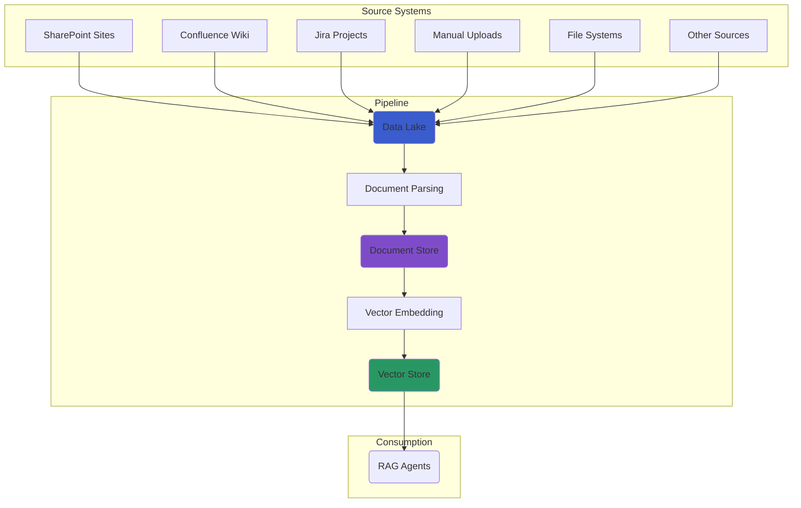

# Datenaufnahme-Pipeline

Die Datenaufnahme ist die Grundlage jeder Wissensverarbeitungspipeline. AI-Hub bietet bewährte Muster zum Extrahieren, Parsen und Transformieren von Geschäftsdokumenten aus verschiedenen Quellen in KI-bereite Formate. Dieser Abschnitt behandelt die häufigsten Aufnahmeszenarien und Implementierungsansätze.

## Die Kernarchitektur der Datenaufnahme {#ingestion-architecture}

::: warning
AI-Hub verfolgt ein **universelles Data-Lake-Muster**, bei dem alle Dokumentenquellen in einen zentralisierten Data Lake einspeisen, der dann die standardisierte **Data Lake zu Vektor-Datenbank** Pipeline speist, die RAG-Agenten antreibt.
:::



### Zweistufiger Verarbeitungsansatz {#two-stage-processing}

::: tip Universelles Pipeline-Muster
**Stufe 1: Quelle → Data Lake** – Mehrere quellspezifische Aufnahme-Pipelines

- Jede Quelle hat einen eigenen Konnektor (SharePoint, Wiki, Confluence, Jira, etc.)
- Alle Quellen schreiben in dasselbe standardisierte Data-Lake-Format
- Quellspezifische Metadaten werden erhalten und normalisiert

**Stufe 2: Data Lake → Vektor-Datenbank** – Eine einzige standardisierte Verarbeitungspipeline

- Eine Pipeline verarbeitet alle Dokumente, unabhängig von der ursprünglichen Quelle
- Konsistentes Dokument-Parsen, Chunking und Embedding
- Optimiert für RAG-Agenten-Retrieval und Wissenszugriff
:::

## Der Dokumentenaufnahme-Prozess {#processing-journey}

::: info
Die Verarbeitung vom Data Lake zur Vektor-Datenbank folgt einem standardisierten mehrstufigen Ansatz, der Konsistenz, Zuverlässigkeit und Beobachtbarkeit gewährleistet.
:::

1.  **Data-Lake-Überwachung**: Erkennung neuer oder geänderter Dokumente im zentralisierten Data Lake
2.  **Dokumentenabruf**: Abrufen von Dokumentendaten und -metadaten zur Verarbeitung
3.  **Dokumentenanalyse (Parsing)**: Extrahieren von Text, Bildern und Struktur mithilfe geeigneter Parser
4.  **Inhaltsanreicherung**: Hinzufügen von Metadaten, Generieren von Beschreibungen und Sicherstellen der Datenqualität
5.  **Vektor-Speicherung**: Erstellen von Embeddings und Speichern in einer Vektor-Datenbank für den Zugriff durch RAG-Agenten

## Beispiel einer vollständigen Dokumentenaufnahme-Pipeline {#complete-rag-pipeline}

::: tip End-to-End Implementierung
Dieser Abschnitt bietet ein vollständiges, lauffähiges Beispiel zum Aufbau einer produktionsreifen RAG-Pipeline mithilfe des aihub_pipeline SDK. Verfolgen Sie es, um zu verstehen, wie alle Komponenten zusammenarbeiten.
:::

### Voraussetzungen und Einrichtung {#pipeline-setup}

Bevor Sie Ihre Pipeline erstellen, stellen Sie sicher, dass Ihre AI-Hub Entwicklungsumgebung läuft und das aihub_pipeline SDK installiert ist.

### Erstellen der vollständigen Pipeline {#building-pipeline}

Erstellen Sie eine neue Datei `my_rag_pipeline.py`, die alle Schlüsselkomponenten demonstriert:

::: code-group
```python [my_rag_pipeline.py]
"""Complete RAG Pipeline Example using aihub_pipeline SDK."""

from dagster import AssetKey, Definitions, DynamicPartitionsDefinition
from aihub_lib.generative_ai.resources.models.llm.EmbeddingModelConfig import EmbeddingModelConfig
from aihub_lib.generative_ai.resources.models.llm.LLMConfig import LLMConfig

# Import AI-Hub pipeline factories and resources
from aihub_pipeline.assets.factories.data_lake_to_vector_store.observable_data_lake_factory import (
    observable_data_lake_factory,
)
from aihub_pipeline.assets.factories.data_lake_to_vector_store.documents_factory import documents_factory
from aihub_pipeline.assets.factories.data_lake_to_vector_store.nodes_factory import nodes_factory
from aihub_pipeline.assets.factories.data_lake_to_vector_store.summary_nodes_factory import summary_nodes_factory
from aihub_pipeline.resources.factory import (
    local_mongo_milvus_storage_context_resource,
    default_io_manager_s3_datalake_resources,
    s3_data_lake_resources,
)
from aihub_pipeline.resources.parser.DocumentParserResource import DocumentParserResource, LoaderType
from aihub_pipeline.resources.parser.MarkdownStructuralNodeParserResource import MarkdownStructuralNodeParserResource
from aihub_pipeline.resources.parser.RecursiveSummaryParserResource import RecursiveSummaryParserResource
from aihub_pipeline.resources.llm.EmbeddingModelResource import EmbeddingModelResource
from aihub_pipeline.resources.llm.LanguageModelResource import LanguageModelResource
from aihub_pipeline.jobs.factory import observe_source_job
from aihub_pipeline.sensors.factory import default_automation_sensor
from aihub_pipeline.schedules.factory import daily_schedule_at

# Pipeline configuration
DATA_LAKE_KEY = AssetKey(["my_company", "data_lake"])
DOCUMENTS_KEY = AssetKey(["my_company", "documents"]) 
NODES_KEY = AssetKey(["my_company", "nodes"])
SUMMARY_NODES_KEY = AssetKey(["my_company", "summary_nodes"])

NAMESPACE = "my_company"
CONTAINER_NAME = "documents"
DIRECTORY_NAME = "sample_docs"

# Dynamic partitions for scalable document processing
document_partitions = DynamicPartitionsDefinition(name="company_documents")

# Step 1: Observable data lake asset (monitors for new/changed documents)
data_lake_observer = observable_data_lake_factory(
    key=DATA_LAKE_KEY,
    partitions=document_partitions
)

# Step 2: Document processing asset (parses documents into RefDoc format)
documents_asset = documents_factory(
    key=DOCUMENTS_KEY,
    data_lake_key=DATA_LAKE_KEY,
    partitions=document_partitions
)

# Step 3: Node generation asset (chunks documents for optimal retrieval)
nodes_asset = nodes_factory(
    key=NODES_KEY,
    document_key=DOCUMENTS_KEY,
    partitions=document_partitions
)

# Step 4: Summary nodes asset (generates hierarchical summaries)
summary_nodes_asset = summary_nodes_factory(
    key=SUMMARY_NODES_KEY,
    document_key=DOCUMENTS_KEY,
    nodes_key=NODES_KEY,
    partitions=document_partitions
)

# Combine all pipeline assets
pipeline_assets = [
    data_lake_observer,
    documents_asset,
    nodes_asset,
    summary_nodes_asset,
]

# Create observation job for monitoring data lake changes
observe_job = observe_source_job(
    observable_asset=data_lake_observer,
    namespace_name=NAMESPACE,
)

# Complete pipeline definition
defs = Definitions(
    assets=pipeline_assets,
    resources={
        # I/O managers for data lake integration
        **default_io_manager_s3_datalake_resources(
            container_name=CONTAINER_NAME,
            directory_name=DIRECTORY_NAME
        ),
        
        # S3/Data lake resources
        **s3_data_lake_resources(
            container_name=CONTAINER_NAME,
            directory_name=DIRECTORY_NAME,
            figures_directory_name="__figures__",
        ),
        
        # Document processing resources
        "document_parser": DocumentParserResource(
            loader_type=LoaderType.DOCLING  # Advanced document parsing
        ),
        "node_parser": MarkdownStructuralNodeParserResource(),
        "summary_parser": RecursiveSummaryParserResource(),
        
        # AI model resources
        "embedding_model": EmbeddingModelResource(
            embedding_config=EmbeddingModelConfig(
                model_name="azure/text-embedding-3-large"
            )
        ),
        "language_model": LanguageModelResource(
            llm_config=LLMConfig(
                model_name="azure/gpt-4o-mini"
            )
        ),
        
        # Vector storage (local Milvus for development)
        **local_mongo_milvus_storage_context_resource(
            vector_store_uri="http://localhost:19530",
            store_name=CONTAINER_NAME,
            namespace_name=NAMESPACE,
        ),
    },
    jobs=[observe_job],
    sensors=[default_automation_sensor(pipeline_assets)],
    schedules=[daily_schedule_at(observe_job, hour=2, minute=0)],
)
```
:::

### Verständnis der Pipeline-Komponenten (Assets) {#pipeline-components}

::: info
Erklärung des Asset-Flusses: Jedes Asset in der Pipeline stellt eine konkrete Datentransformationsstufe mit automatischer Abhängigkeitsverwaltung dar.
:::

1.  **Beobachtbares Data-Lake-Asset** (`observable_data_lake`)
    - Überwacht Ihre Datenquelle auf Änderungen
    - Erstellt automatisch neue Partitionen, wenn Dokumente hinzugefügt/geändert werden
    - Löst nachgelagerte Verarbeitung nur für geänderte Inhalte aus

2.  **Dokumente-Asset** (`document`)
    - Parst Rohdateien (PDF, DOCX, MD) in ein strukturiertes RefDoc-Format
    - Extrahiert Textinhalte, Bilder und Metadaten
    - Speichert geparste Dokumente in einem MongoDB Dokumentenspeicher

3.  **Nodes-Asset** (`nodes`)
    - Zerlegt Dokumente in optimal große Text-Nodes
    - Verwendet intelligentes Parsen, um die Dokumentstruktur zu respektieren
    - Bereitet Inhalte für die Generierung von Vektor-Embeddings vor

4.  **Zusammenfassungs-Nodes-Asset** (`summary_nodes`)
    - Erstellt hierarchische Zusammenfassungen von Dokumentenabschnitten
    - Verbessert die Kontexterhaltung für das RAG-Retrieval
    - Generiert mehrstufige Abstraktionen von Inhalten

5.  **Entfernte Dokumente-Asset** (`removed_documents`)
    - Pseudo-Asset, das Dokumente aus dem Dokumentenspeicher und dem Vektorspeicher entfernt, die nicht mehr im Data Lake vorhanden sind

### Ausführen Ihrer Aufnahme-Pipeline {#running-pipeline}

```bash [Start Pipeline Server]
# Start the Dagster development server
poetry run dagster dev -m my_rag_pipeline

# Access Dagster UI at http://localhost:3000
```

**Beispieldokumente hinzufügen** Kopieren Sie Dokumente in Ihr Data-Lake-Verzeichnis. Das beobachtbare Asset wird sie automatisch erkennen.

### Ablauf der Pipeline-Ausführung {#execution-flow}

::: warning Automatische Verarbeitungskette
Wenn Sie Dokumente zum Data Lake hinzufügen, verarbeitet die Pipeline diese automatisch durch alle Stufen.
:::

::: info Verarbeitungssequenz
1.  **Erkennung**: Beobachtbares Asset erkennt neue Datei
2.  **Parsen**: Dokument-Parser extrahiert Text und Metadaten
3.  **Chunking**: Inhalt wird in durchsuchbare Text-Nodes aufgeteilt
4.  **Embedding**: Vektor-Embeddings werden für jeden Node generiert
5.  **Speicherung**: Embeddings werden in der Milvus Vektor-Datenbank gespeichert
6.  **Verfügbarkeit**: Inhalt ist jetzt für RAG-Agenten-Abfragen verfügbar
:::

### Überwachung und Debugging {#monitoring-debugging}

Die Dagster UI bietet umfassende Beobachtbarkeit:

::: tip Funktionen zur Pipeline-Beobachtbarkeit
- **Asset-Abstammung**: Visuelle Darstellung von Datenabhängigkeiten
- **Ausführungsprotokolle**: Detaillierte Protokolle für jeden Verarbeitungsschritt
- **Asset-Materialisierung**: Status und Ausgaben jeder Pipeline-Stufe
- **Partitionsverwaltung**: Anzeigen des Verarbeitungsstatus pro Dokument
- **Fehleranalyse**: Stack-Traces und Fehleranalyse
- **Dateninspektion**: Vorschau von verarbeiteten Dokumenten und Embeddings
:::

## Konfigurationsoptionen {#configuration-options}

AI-Hub unterstützt mehrere Ansätze zum Dokumenten-Parsen, abhängig von Ihren Anforderungen.

::: code-group
```python [Docling Configuration]
"document_parser": DocumentParserResource(
    loader_type=LoaderType.DOCLING,
)
```

```python [Document Intelligence Configuration]
"document_parser": DocumentParserResource(
    loader_type=LoaderType.DOCUMENT_INTELLIGENCE,
)
```
:::

## Nächste Schritte {#next-steps}

- [Job-Scheduling](../4_job_scheduling/) – Machen Sie Ihre Pipeline produktionsreif, indem Sie Jobs und Schedules konfigurieren
