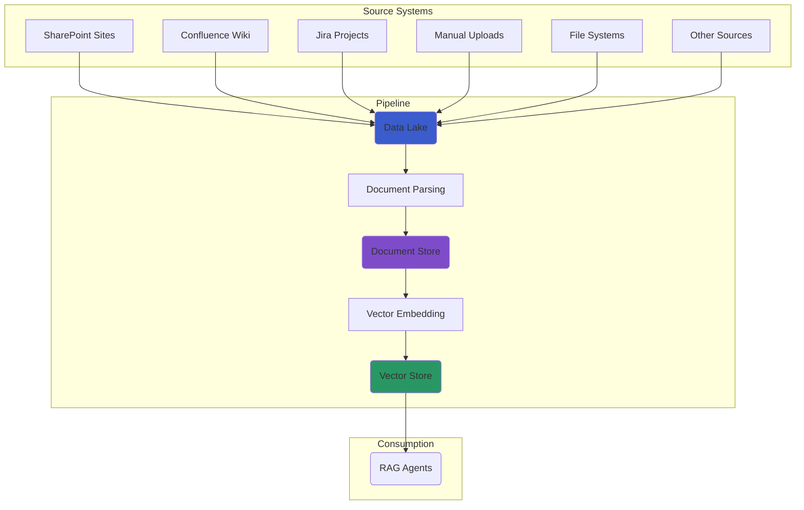

# Data Ingestion Pipeline

Data ingestion is the foundation of any knowledge processing pipeline. AI-Hub provides proven patterns for extracting,
parsing, and transforming business documents from various sources into AI-ready formats. This section covers the most
common ingestion scenarios and implementation approaches.

## The core ingestion architecture {#ingestion-architecture}

::: warning
AI-Hub follows a **universal data lake pattern** where all document sources feed into a centralized data lake, which
then feeds the standardized **data lake to vector store** pipeline that powers RAG agents.
:::



### Two-stage processing approach {#two-stage-processing}

::: tip Universal Pipeline Pattern
**Stage 1: Source → Data Lake** - Multiple source-specific ingestion pipelines

- Each source has its own connector (SharePoint, Wiki, Confluence, Jira, etc.)
- All sources write to the same standardized data lake format
- Source-specific metadata is preserved and normalized

**Stage 2: Data Lake → Vector Store** - Single standardized processing pipeline

- One pipeline handles all documents regardless of original source
- Consistent document parsing, chunking, and embedding
- Optimized for RAG agent retrieval and knowledge access
:::

## The document ingestion process {#processing-journey}

::: info
The data lake to vector store processing follows a standardized multi-stage approach that ensures consistency,
reliability, and observability.
:::

1. **Data lake monitoring**: Detect new or changed documents in the centralized data lake
2. **Document retrieval**: Fetch document data and metadata for processing
3. **Document parsing**: Extract text, images, and structure using appropriate parsers
4. **Content enrichment**: Add metadata, generate descriptions, and ensure data quality
5. **Vector storage**: Create embeddings and store in vector database for RAG agent access

## Complete document ingestion pipeline example {#complete-rag-pipeline}

::: tip
End-to-End Implementation This section provides a complete, runnable example of building a production-ready RAG pipeline
using the aihub_pipeline SDK. Follow along to understand how all the components work together.
:::

### Prerequisites and setup {#pipeline-setup}

Before building your pipeline, ensure you have the AI-Hub development environment running and the aihub_pipeline SDK
installed.

### Building the complete pipeline {#building-pipeline}

Create a new file `my_rag_pipeline.py` that demonstrates all the key components:

::: code-group
```python [my_rag_pipeline.py]
"""Complete RAG Pipeline Example using aihub_pipeline SDK."""

from dagster import AssetKey, Definitions, DynamicPartitionsDefinition
from aihub_lib.generative_ai.resources.models.llm.EmbeddingModelConfig import EmbeddingModelConfig
from aihub_lib.generative_ai.resources.models.llm.LLMConfig import LLMConfig

# Import AI-Hub pipeline factories and resources
from aihub_pipeline.assets.factories.data_lake_to_vector_store.observable_data_lake_factory import (
    observable_data_lake_factory,
)
from aihub_pipeline.assets.factories.data_lake_to_vector_store.documents_factory import documents_factory
from aihub_pipeline.assets.factories.data_lake_to_vector_store.nodes_factory import nodes_factory
from aihub_pipeline.assets.factories.data_lake_to_vector_store.summary_nodes_factory import summary_nodes_factory
from aihub_pipeline.resources.factory import (
    local_mongo_milvus_storage_context_resource,
    default_io_manager_s3_datalake_resources,
    s3_data_lake_resources,
)
from aihub_pipeline.resources.parser.DocumentParserResource import DocumentParserResource, LoaderType
from aihub_pipeline.resources.parser.MarkdownStructuralNodeParserResource import MarkdownStructuralNodeParserResource
from aihub_pipeline.resources.parser.RecursiveSummaryParserResource import RecursiveSummaryParserResource
from aihub_pipeline.resources.llm.EmbeddingModelResource import EmbeddingModelResource
from aihub_pipeline.resources.llm.LanguageModelResource import LanguageModelResource
from aihub_pipeline.jobs.factory import observe_source_job
from aihub_pipeline.sensors.factory import default_automation_sensor
from aihub_pipeline.schedules.factory import daily_schedule_at

# Pipeline configuration
DATA_LAKE_KEY = AssetKey(["my_company", "data_lake"])
DOCUMENTS_KEY = AssetKey(["my_company", "documents"]) 
NODES_KEY = AssetKey(["my_company", "nodes"])
SUMMARY_NODES_KEY = AssetKey(["my_company", "summary_nodes"])

NAMESPACE = "my_company"
CONTAINER_NAME = "documents"
DIRECTORY_NAME = "sample_docs"

# Dynamic partitions for scalable document processing
document_partitions = DynamicPartitionsDefinition(name="company_documents")

# Step 1: Observable data lake asset (monitors for new/changed documents)
data_lake_observer = observable_data_lake_factory(
    key=DATA_LAKE_KEY,
    partitions=document_partitions
)

# Step 2: Document processing asset (parses documents into RefDoc format)
documents_asset = documents_factory(
    key=DOCUMENTS_KEY,
    data_lake_key=DATA_LAKE_KEY,
    partitions=document_partitions
)

# Step 3: Node generation asset (chunks documents for optimal retrieval)
nodes_asset = nodes_factory(
    key=NODES_KEY,
    document_key=DOCUMENTS_KEY,
    partitions=document_partitions
)

# Step 4: Summary nodes asset (generates hierarchical summaries)
summary_nodes_asset = summary_nodes_factory(
    key=SUMMARY_NODES_KEY,
    document_key=DOCUMENTS_KEY,
    nodes_key=NODES_KEY,
    partitions=document_partitions
)

# Combine all pipeline assets
pipeline_assets = [
    data_lake_observer,
    documents_asset,
    nodes_asset,
    summary_nodes_asset,
]

# Create observation job for monitoring data lake changes
observe_job = observe_source_job(
    observable_asset=data_lake_observer,
    namespace_name=NAMESPACE,
)

# Complete pipeline definition
defs = Definitions(
    assets=pipeline_assets,
    resources={
        # I/O managers for data lake integration
        **default_io_manager_s3_datalake_resources(
            container_name=CONTAINER_NAME,
            directory_name=DIRECTORY_NAME
        ),
        
        # S3/Data lake resources
        **s3_data_lake_resources(
            container_name=CONTAINER_NAME,
            directory_name=DIRECTORY_NAME,
            figures_directory_name="__figures__",
        ),
        
        # Document processing resources
        "document_parser": DocumentParserResource(
            loader_type=LoaderType.DOCLING  # Advanced document parsing
        ),
        "node_parser": MarkdownStructuralNodeParserResource(),
        "summary_parser": RecursiveSummaryParserResource(),
        
        # AI model resources
        "embedding_model": EmbeddingModelResource(
            embedding_config=EmbeddingModelConfig(
                model_name="azure/text-embedding-3-large"
            )
        ),
        "language_model": LanguageModelResource(
            llm_config=LLMConfig(
                model_name="azure/gpt-4o-mini"
            )
        ),
        
        # Vector storage (local Milvus for development)
        **local_mongo_milvus_storage_context_resource(
            vector_store_uri="http://localhost:19530",
            store_name=CONTAINER_NAME,
            namespace_name=NAMESPACE,
        ),
    },
    jobs=[observe_job],
    sensors=[default_automation_sensor(pipeline_assets)],
    schedules=[daily_schedule_at(observe_job, hour=2, minute=0)],
)
```
:::

### Understanding the pipeline components (assets) {#pipeline-components}

::: info
Asset Flow Explanation Each asset in the pipeline represents a concrete data transformation stage with automatic
dependency management.
::: 

1. **Observable Data Lake Asset** (`observable_data_lake`)

   - Monitors your data source for changes
   - Automatically creates new partitions when documents are added/modified
   - Triggers downstream processing only for changed content

2. **Documents Asset** (`document`)

   - Parses raw files (PDF, DOCX, MD) into structured RefDoc format
   - Extracts text content, images, and metadata
   - Stores parsed documents in MongoDB document store

3. **Nodes Asset** (`nodes`)

   - Chunks documents into optimally-sized text nodes
   - Uses intelligent parsing to respect document structure
   - Prepares content for vector embedding generation

4. **Summary Nodes Asset** (`summary_nodes`)

   - Creates hierarchical summaries of document sections
   - Improves context preservation for RAG retrieval
   - Generates multi-level abstractions of content

5. **Removed Documents Asset** (`removed_documents`)

   - Pseudo-Asset that removes documents from the document store and vector store that are no longer present in the Data
     Lake

### Running your Ingestion pipeline {#running-pipeline}

```bash [Start Pipeline Server]
# Start the Dagster development server
poetry run dagster dev -m my_rag_pipeline

# Access Dagster UI at http://localhost:3000
```

**Add Sample Documents** Copy documents to your data lake directory. The observable asset will automatically detect
them.

### Pipeline execution flow {#execution-flow}

::: warning
Automatic Processing Chain When you add documents to the data lake, the pipeline automatically processes them through
all stages.
:::

::: info Processing Sequence
1. **Detection**: Observable asset detects new file
2. **Parsing**: Document parser extracts text and metadata
3. **Chunking**: Content is split into searchable text nodes
4. **Embedding**: Vector embeddings are generated for each node
5. **Storage**: Embeddings are stored in Milvus vector database
6. **Availability**: Content is now available for RAG agent queries
:::

### Monitoring and debugging {#monitoring-debugging}

The Dagster UI provides comprehensive observability:

::: tip Pipeline Observability Features
- **Asset Lineage**: Visual graph showing data dependencies
- **Execution Logs**: Detailed logs for each processing step
- **Asset Materialization**: Status and outputs of each pipeline stage
- **Partition Management**: View processing status per document
- **Error Investigation**: Stack traces and failure analysis
- **Data Inspection**: Preview processed documents and embeddings
:::

## Configuration Options {#configuration-options}

AI-Hub supports multiple document parsing approaches depending on your requirements.

::: code-group
```python [Docling Configuration]
"document_parser": DocumentParserResource(
    loader_type=LoaderType.DOCLING,
)
```

```python [Document Intelligence Configuration]
"document_parser": DocumentParserResource(
    loader_type=LoaderType.DOCUMENT_INTELLIGENCE,
)
```
:::

## Next steps {#next-steps}

- [Job Scheduling](../4_job_scheduling/) - Make your pipeline production-ready by configuring jobs and schedules
