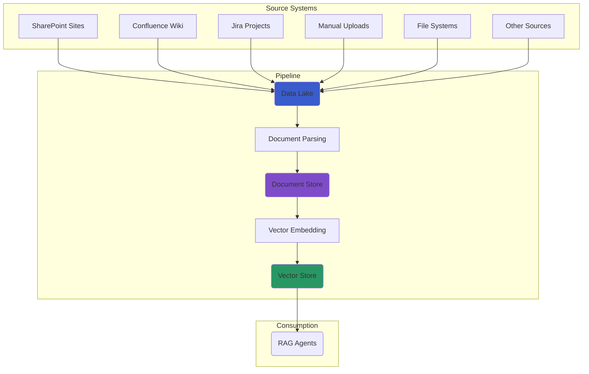

# Daten-Ingestion-Pipeline

Das AI-Hub Pipeline SDK bietet vorgefertigte, produktionsreife Pipeline-Definitionen, die Sie mit minimaler
Konfiguration verwenden können. Diese **Factories** kapseln Best Practices für die Aufnahme von Dokumenten und deren
Vorbereitung für RAG-Anwendungen.

## Die zweistufige Ingestion-Architektur

Unser Ingestion-Prozess ist in zwei separate Stufen unterteilt, wobei jede von ihrer eigenen
Pipeline-Definitions-Factory behandelt wird. Dies fördert Modularität und Wiederverwendbarkeit.

1. **Stufe 1: Quelle zum Data Lake** (Optional): Diese Pipeline verbindet sich mit einer externen Quelle (wie
   SharePoint) und synchronisiert deren Dateien mit einem zentralen S3 Data Lake.
2. **Stufe 2: Data Lake zum Vector Store**: Diese Pipeline überwacht den S3 Data Lake, verarbeitet die Dokumente und
   speichert die resultierenden Embeddings in einem Vector Store.



## 1. Die Rclone Universal-Quelle-zum-Data-Lake-Pipeline

Verwenden Sie die `default_rclone_to_datalake_definitions` Factory, um Dokumente von **jedem Cloud-Speicheranbieter**
mit Ihrem S3 Data Lake zu synchronisieren. Dies ist der empfohlene Ansatz für die meisten Anwendungsfälle, da er über 70
Speicher-Backends mit einer einzigen, vereinheitlichten Implementierung unterstützt.

- **Was es tut**: Überwacht jedes von Rclone unterstützte Remote, lädt neue oder aktualisierte Dateien herunter und
  bereinigt Dateien im Data Lake, die aus der Quelle gelöscht wurden.
- **Wichtige Assets**: `observable_rclone`, `data_lake_files`, `removed_data_lake_files`.
- **Unterstützte Quellen**: SharePoint, OneDrive, Google Drive, AWS S3, Azure Blob, SFTP, lokales Dateisystem und
  [über 70 weitere](https://rclone.org/overview/).

### Schnellstart mit Templates

AI-Hub bietet vorkonfigurierte Templates für häufige Unternehmensquellen. Jedes Template enthält Umgebungsvariablen,
Pipeline-Code und Setup-Anweisungen.

| Template         | Anwendungsfall                                     | Umgebungspräfix       |
| :--------------- | :------------------------------------------------- | :-------------------- |
| **SharePoint**   | Microsoft 365 Dokumentbibliotheken                 | `RCLONE_SHAREPOINT_*` |
| **OneDrive**     | Microsoft 365 persönlicher/geschäftlicher Speicher | `RCLONE_ONEDRIVE_*`   |
| **Google Drive** | Google Workspace Organisationen                    | `RCLONE_GDRIVE_*`     |
| **S3**           | AWS S3, MinIO, S3-kompatibler Speicher             | `RCLONE_S3_*`         |
| **Azure Blob**   | Azure Blob Storage                                 | `RCLONE_AZUREBLOB_*`  |
| **SFTP**         | Altsysteme, sichere Dateiübertragungen             | `RCLONE_SFTP_*`       |
| **Local FS**     | Gemountete Netzwerkfreigaben (NFS, SMB)            | Direkter Pfad         |

Templates befinden sich in `aihub_pipeline/templates/sources/`.

### Anwendungsbeispiel: SharePoint

**1. Umgebungsvariablen konfigurieren** (kopieren Sie aus `templates/sources/sharepoint/.env.template`):

```bash
RCLONE_SHAREPOINT_NAME=sharepoint
RCLONE_SHAREPOINT_TYPE=onedrive
RCLONE_SHAREPOINT_CLIENT_ID=your-client-id
RCLONE_SHAREPOINT_CLIENT_SECRET=your-secret
RCLONE_SHAREPOINT_TENANT=your-tenant-id
RCLONE_SHAREPOINT_SITE_URL=https://your-tenant.sharepoint.com/sites/your-site
RCLONE_SHAREPOINT_DRIVE_TYPE=documentLibrary
```

**2. Erstellen Sie Ihre Pipeline**:

```python
from aihub_lib.infrastructure.rclone.RcloneSourceFactory import sharepoint_source
from aihub_pipeline.util.definitions_util import default_rclone_to_datalake_definitions

# Load config from SHAREPOINT_* environment variables
sharepoint = sharepoint_source()

# Create pipeline
defs = default_rclone_to_datalake_definitions(
    datalake_container_name="my-company-docs",
    source_remote=f"{sharepoint.name}:",
    rclone_config=sharepoint,
    include_patterns=["*.pdf", "*.docx"],
    exclude_patterns=["**/archive/**"],
)
```

### Anwendungsbeispiel: Google Drive

```python
from aihub_lib.infrastructure.rclone.RcloneSourceFactory import google_drive_source
from aihub_pipeline.util.definitions_util import default_rclone_to_datalake_definitions

gdrive = google_drive_source()

defs = default_rclone_to_datalake_definitions(
    datalake_container_name="gdrive-docs",
    source_remote=f"{gdrive.name}:Shared Documents",
    rclone_config=gdrive,
)
```

### Anwendungsbeispiel: Lokales Dateisystem / Gemountete Freigaben

Für lokale Pfade oder gemountete Netzwerkfreigaben (NFS, SMB, Azure Files) ist keine Rclone-Konfiguration erforderlich:

```python
from aihub_pipeline.util.definitions_util import default_rclone_to_datalake_definitions

defs = default_rclone_to_datalake_definitions(
    datalake_container_name="local-docs",
    source_remote="/mnt/shared-drive/documents",
)
```

### Verfügbare Quell-Helper-Funktionen

Die `RcloneSourceFactory` bietet Komfortfunktionen, die aus Umgebungsvariablen lesen:

```python
from aihub_lib.infrastructure.rclone.RcloneSourceFactory import (
    sharepoint_source,    # Reads RCLONE_SHAREPOINT_* env vars
    onedrive_source,      # Reads RCLONE_ONEDRIVE_* env vars
    google_drive_source,  # Reads RCLONE_GDRIVE_* env vars
    s3_source,            # Reads RCLONE_S3_* env vars
    azure_blob_source,    # Reads RCLONE_AZUREBLOB_* env vars
    sftp_source,          # Reads RCLONE_SFTP_* env vars
    local_fs_source,      # Reads RCLONE_LOCAL_FS_* env vars
)
```

### Muster für Umgebungsvariablen

Alle Quellkonfigurationen folgen einem konsistenten Muster mit dem Präfix `RCLONE_`:

```bash
RCLONE_<SOURCE>_NAME=remote-name       # Rclone remote name
RCLONE_<SOURCE>_TYPE=backend-type      # Rclone backend (onedrive, drive, s3, etc.)
RCLONE_<SOURCE>_CLIENT_ID=...          # OAuth client ID (if applicable)
RCLONE_<SOURCE>_CLIENT_SECRET=...      # OAuth client secret (if applicable)
RCLONE_<SOURCE>_TENANT=...             # Azure AD tenant (Microsoft sources)
RCLONE_<SOURCE>_<OPTION>=value         # Additional rclone options
```

Zusätzliche Optionen werden direkt an Rclone als Backend-spezifische Parameter übergeben:

```bash
RCLONE_S3_REGION=eu-west-1
RCLONE_S3_ENDPOINT=https://minio.example.com
RCLONE_SFTP_HOST=sftp.example.com
RCLONE_SFTP_PORT=22
```

### Rclone Service-Authentifizierung

In Produktionsumgebungen erfordert der Rclone-Service eine Authentifizierung über die Umgebungsvariablen
`RCLONE_RC_USER` und `RCLONE_RC_PASS`.

> **Sicherheitshinweis**: Die Standardanmeldeinformationen (`admin`/`changeme`) sind nur für die Entwicklung vorgesehen.
> **Ändern Sie diese Anmeldeinformationen immer bei Produktions-Deployments**, um unbefugten Zugriff auf Ihre
> Datenquellen zu verhindern.

```bash
# Production environment - set strong, unique credentials
RCLONE_RC_USER=your-secure-username
RCLONE_RC_PASS=your-strong-password
```

## 2. Die Data-Lake-zum-Vector-Store-Pipeline

Dies ist die Kern-RAG-Pipeline. Verwenden Sie die `default_definitions` Factory, um Dokumente aus Ihrem S3 Data Lake in
einem Vector Store zu verarbeiten.

- **Was es tut**: Überwacht einen S3-Bucket, analysiert Dokumente, segmentiert sie in Nodes, erstellt optional
  Zusammenfassungs-Nodes und speichert die Embeddings in Milvus. Es verarbeitet auch Dokumentlöschungen.
- **Wichtige Assets**: `observable_data_lake`, `documents`, `nodes`, `summary_nodes`, `removed_documents`.

### Anwendungsbeispiel

```python
from aihub_pipeline.util.definitions_util import default_definitions

defs = default_definitions(
    datalake_container_name="my-company-docs",
    embedding_model_name="azure/text-embedding-3-large", # Configure the embedding model
    llm_model_name="azure/gpt-4o-mini",                 # Configure the LLM for summaries
    with_summary_nodes=True                             # Enable summary node generation
)
```

## Standard-Datenmapping

Das SDK verwendet eine konsistente Namenskonvention, um Ihre Data-Lake-Struktur den zugrunde liegenden Speicher-Backends
(Document Store und Vector Store) zuzuordnen.

### Container/Bucket → Datenbank/Collection

Der Top-Level-S3-Bucket-Name wird als primärer Bezeichner für Ihre Speicherressourcen verwendet und bietet eine starke
Datenisolation.

**Beispiel:**

- **Data Lake Bucket**: `s3://hr-documents/`
- **Document Store DB**: `hr-documents`
- **Vector Store Collection**: `hr-documents`

### Verzeichnis → Namespace

Innerhalb eines Buckets können Sie Verzeichnisse verwenden, um logische Trennungen zu schaffen, die **Namespaces**
innerhalb des Vector Stores zugeordnet werden. Dies ermöglicht Multi-Tenancy oder logische Gruppierungen innerhalb einer
einzigen Collection.

**Beispiel:**

- **Data Lake Path**: `s3://hr-documents/onboarding/`
- **Vector Store Namespace**: `onboarding`

## Pipelines ausführen und kombinieren

Um eine Pipeline auszuführen, speichern Sie Ihren Definitions-Code (z.B. `my_pipeline.py`) und verwenden Sie die Dagster
CLI.

```bash
# Start the Dagster UI and development server
dagster dev -f my_pipeline.py
```
