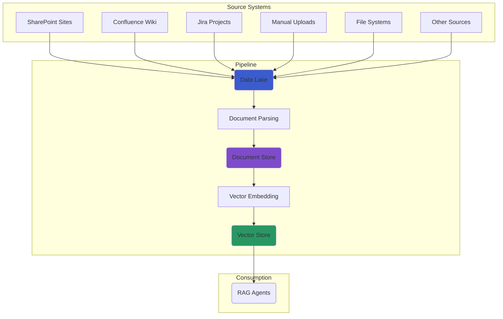

# Datenaufnahme-Pipeline

Das AI-Hub Pipeline SDK bietet vorgefertigte, produktionsreife Pipeline-Definitionen, die Sie mit minimaler
Konfiguration verwenden können. Diese **Fabriken** kapseln Best Practices für die Aufnahme von Dokumenten und deren
Vorbereitung für RAG-Anwendungen.

## Die zweistufige Aufnahme-Architektur

Unser Aufnahmeprozess ist in zwei unterschiedliche Stufen unterteilt, die jeweils von einer eigenen
Pipeline-Definitions-Fabrik gehandhabt werden. Dies fördert Modularität und Wiederverwendbarkeit.

1. **Stufe 1: Quelle zum Data Lake** (Optional): Diese Pipeline verbindet sich mit einer externen Quelle (wie
   SharePoint) und synchronisiert ihre Dateien mit einem zentralen S3 Data Lake.
2. **Stufe 2: Data Lake zum Vektorspeicher**: Diese Pipeline überwacht den S3 Data Lake, verarbeitet die Dokumente und
   speichert die resultierenden Embeddings in einem Vektorspeicher.



## 1. Die SharePoint zu Data Lake Pipeline

Verwenden Sie die Fabrik `default_sharepoint_to_datalake_definitions`, um Dokumente von einer SharePoint-Site mit Ihrem
S3 Data Lake zu synchronisieren.

- **Was sie tut**: Überwacht einen SharePoint-Speicherort, lädt neue oder aktualisierte Dateien herunter und bereinigt
  Dateien im Data Lake, die aus SharePoint gelöscht wurden.
- **Wichtige Assets**: `observable_sharepoint`, `data_lake_files`, `removed_data_lake_files`.

### Anwendungsbeispiel

```python
from aihub_pipeline.util.definitions_util import default_sharepoint_to_datalake_definitions

defs = default_sharepoint_to_datalake_definitions(
    datalake_container_name="my-company-docs",
    datalake_directory_name="from_sharepoint",
    target_folders=["Shared Documents/Projects"], # Folders to sync from SharePoint
    exclude_folders=["Shared Documents/Projects/Archive"]
)
```

## 2. Die Data Lake zu Vektorspeicher Pipeline

Dies ist die zentrale RAG-Pipeline. Verwenden Sie die Fabrik `default_definitions`, um Dokumente aus Ihrem S3 Data Lake
in einen Vektorspeicher zu verarbeiten.

- **Was sie tut**: Überwacht einen S3-Bucket, parst Dokumente, zerlegt sie in Nodes, erstellt optional
  Zusammenfassungs-Nodes und speichert die Embeddings in Milvus. Sie handhabt auch Dokumentlöschungen.
- **Wichtige Assets**: `observable_data_lake`, `documents`, `nodes`, `summary_nodes`, `removed_documents`.

### Anwendungsbeispiel

```python
from aihub_pipeline.util.definitions_util import default_definitions

defs = default_definitions(
    datalake_container_name="my-company-docs",
    embedding_model_name="azure/text-embedding-3-large", # Configure the embedding model
    llm_model_name="azure/gpt-4o-mini",                 # Configure the LLM for summaries
    with_summary_nodes=True                             # Enable summary node generation
)
```

## Standard-Datenzuordnung

Das SDK verwendet eine konsistente Namenskonvention, um Ihre Data Lake-Struktur auf die zugrundeliegenden
Speicher-Backends (Document Store und Vector Store) abzubilden.

### Container/Bucket → Datenbank/Collection

Der Name des übergeordneten S3-Buckets wird als primärer Bezeichner für Ihre Speicherressourcen verwendet und bietet
eine starke Datenisolation.

**Beispiel:**

- **Data Lake Bucket**: `s3://hr-documents/`
- **Document Store DB**: `hr-documents`
- **Vector Store Collection**: `hr-documents`

### Verzeichnis → Namespace

Innerhalb eines Buckets können Sie Verzeichnisse verwenden, um logische Trennungen zu schaffen, die Namespaces innerhalb
des Vektorspeichers zugeordnet werden. Dies ermöglicht Multi-Tenancy oder logische Gruppierung innerhalb einer einzigen
Collection.

**Beispiel:**

- **Data Lake Path**: `s3://hr-documents/onboarding/`
- **Vector Store Namespace**: `onboarding`

## Ausführen und Kombinieren von Pipelines

Um eine Pipeline auszuführen, speichern Sie Ihren Definitions-Code (z.B. `my_pipeline.py`) und verwenden Sie die Dagster
CLI.

```bash
# Start the Dagster UI and development server
dagster dev -f my_pipeline.py
```

```python
from dagster import Definitions
from aihub_pipeline.util.definitions_util import (
    default_sharepoint_to_datalake_definitions,
    default_definitions,
)

# Definitions von beiden Fabriken abrufen
sharepoint_defs = default_sharepoint_to_datalake_definitions(...)
datalake_defs = default_definitions(...)

# Alle Assets, Ressourcen, Jobs usw. zu einer einzigen Definition kombinieren
defs = Definitions(
    assets=[*sharepoint_defs.assets, *datalake_defs.assets],
    resources={**sharepoint_defs.resources, **datalake_defs.resources},
    jobs=[*sharepoint_defs.jobs, *datalake_defs.jobs],
    schedules=[*sharepoint_defs.schedules, *datalake_defs.schedules],
    sensors=[*sharepoint_defs.sensors, *datalake_defs.sensors],
)
```
