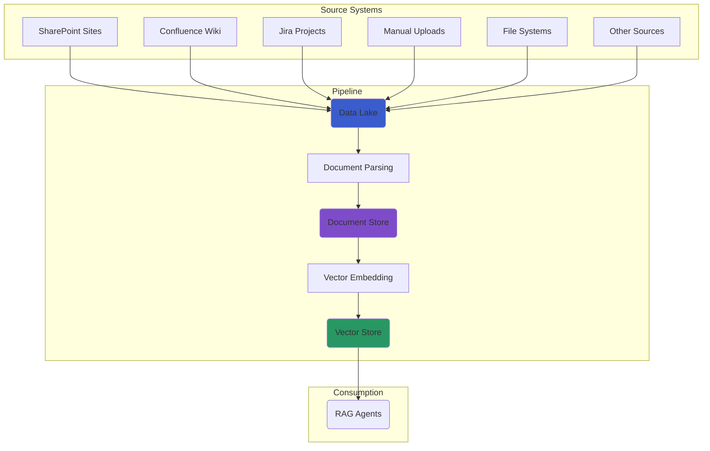

# Data Ingestion Pipeline

The AI-Hub Pipeline SDK provides pre-built, production-ready pipeline definitions that you can use with minimal configuration. 
These **factories** encapsulate best practices for ingesting documents and preparing them for RAG applications.

## The Two-Stage Ingestion Architecture

Our ingestion process is split into two distinct stages, each handled by its own pipeline definition factory. This promotes modularity and reusability.

1.  **Stage 1: Source to Data Lake** (Optional): This pipeline connects to an external source (like SharePoint) and syncs its files to a central S3 data lake.
2.  **Stage 2: Data Lake to Vector Store**: This pipeline monitors the S3 data lake, processes the documents, and stores the resulting embeddings in a vector store.




## 1. The SharePoint to Data Lake Pipeline

Use the `default_sharepoint_to_datalake_definitions` factory to sync documents from a SharePoint site to your S3 data lake.

  * **What it does**: Observes a SharePoint location, downloads new or updated files, and cleans up files in the data lake that were deleted from SharePoint.
  * **Key Assets**: `observable_sharepoint`, `data_lake_files`, `removed_data_lake_files`.

### Usage Example

```python
from aihub_pipeline.util.definitions_util import default_sharepoint_to_datalake_definitions

defs = default_sharepoint_to_datalake_definitions(
    datalake_container_name="my-company-docs",
    datalake_directory_name="from_sharepoint",
    target_folders=["Shared Documents/Projects"], # Folders to sync from SharePoint
    exclude_folders=["Shared Documents/Projects/Archive"]
)
```

## 2. The Data Lake to Vector Store Pipeline

This is the core RAG pipeline. Use the `default_definitions` factory to process documents from your S3 data lake into a vector store.

  * **What it does**: Observes an S3 bucket, parses documents, chunks them into nodes, optionally creates summary nodes, and stores the embeddings in Milvus. It also handles document deletions.
  * **Key Assets**: `observable_data_lake`, `documents`, `nodes`, `summary_nodes`, `removed_documents`.

### Usage Example

```python
from aihub_pipeline.util.definitions_util import default_definitions

defs = default_definitions(
    datalake_container_name="my-company-docs",
    embedding_model_name="azure/text-embedding-3-large", # Configure the embedding model
    llm_model_name="azure/gpt-4o-mini",                 # Configure the LLM for summaries
    with_summary_nodes=True                             # Enable summary node generation
)
```

## Default Data Mapping

The SDK uses a consistent naming convention to map your data lake structure to the underlying storage backends (Document Store and Vector Store).

### Container/Bucket → Database/Collection

The top-level S3 bucket name is used as the primary identifier for your storage resources, providing strong data isolation.

**Example:**

  * **Data Lake Bucket**: `s3://hr-documents/`
  * **Document Store DB**: `hr-documents`
  * **Vector Store Collection**: `hr-documents`

### Directory → Namespace

Within a bucket, you can use directories to create logical separations, which map to **namespaces** within the vector store. This allows for multi-tenancy or logical grouping within a single collection.

**Example:**

  * **Data Lake Path**: `s3://hr-documents/onboarding/`
  * **Vector Store Namespace**: `onboarding`

## Running and Combining Pipelines

To run a pipeline, save your definitions code (e.g., `my_pipeline.py`) and use the Dagster CLI.

```bash
# Start the Dagster UI and development server
dagster dev -f my_pipeline.py
```

```python
from dagster import Definitions
from aihub_pipeline.util.definitions_util import (
    default_sharepoint_to_datalake_definitions,
    default_definitions,
)

# Get definitions from both factories
sharepoint_defs = default_sharepoint_to_datalake_definitions(...)
datalake_defs = default_definitions(...)

# Combine all assets, resources, jobs, etc. into a single definition
defs = Definitions(
    assets=[*sharepoint_defs.assets, *datalake_defs.assets],
    resources={**sharepoint_defs.resources, **datalake_defs.resources},
    jobs=[*sharepoint_defs.jobs, *datalake_defs.jobs],
    schedules=[*sharepoint_defs.schedules, *datalake_defs.schedules],
    sensors=[*sharepoint_defs.sensors, *datalake_defs.sensors],
)
```