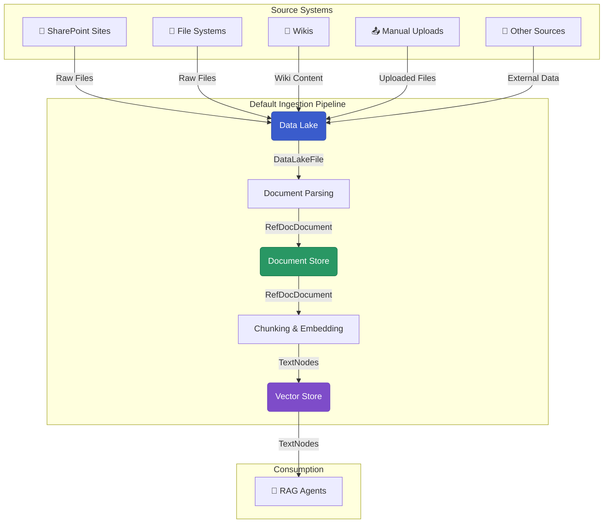

# Pipelines erstellen mit dem AI-Hub Pipeline SDK

Erfahren Sie, wie Sie das `aihub_pipeline` SDK für Ihre Dokumentenverarbeitungsworkflows verwenden, konfigurieren und erweitern können.

## Was Sie lernen werden

- **Wie der AI Hub Dagster nutzt**: Observable Assets, Automatisierungsbedingungen, I/O-Manager und warum diese Muster effektiv sind
- **Konfigurieren der Standard-Pipeline**: Einrichten, konfigurieren und anpassen der vorgefertigten Dokumentenverarbeitungs-Pipeline
- **Produktionseinsatz**: Hinzufügen von Jobs, Zeitplänen (Schedules) und Sensoren für den automatisierten Betrieb und zur Überwachung Ihrer Pipelines

## Voraussetzungen

Schließen Sie die [Einrichtung der Entwicklungsumgebung](../1_quick_start/1_dev_environment_setup/) und
[Ihre erste Pipeline](../1_quick_start/4_your_first_pipeline/) ab, bevor Sie beginnen.

## Die Standard-Pipeline vom Data Lake zum Vector Store

Das AI-Hub Pipeline SDK bietet eine produktionsreife Pipeline, die den gängigsten Dokumentenverarbeitungsworkflow abdeckt:
Dokumente aus verschiedenen Quellen aufnehmen, parsen und durchsuchbare Vektor-Embeddings für RAG-Systeme erstellen.



## Schnellstart: Verwendung der Standard-Pipeline

Der einfachste Weg, um zu beginnen, ist die Verwendung unserer vorgefertigten Asset Factories und Ressourcenkonfigurationen. Erstellen Sie eine neue Python-Datei (z.B. `my_pipeline.py`) und fügen Sie den folgenden Code hinzu:

```python
from aihub_lib.generative_ai.resources.models.llm.EmbeddingModelConfig import EmbeddingModelConfig
from dagster import AssetKey, AssetSelection, Definitions, DynamicPartitionsDefinition

from aihub_pipeline.assets.factories.data_lake_to_vector_store.documents_factory import documents_factory
from aihub_pipeline.assets.factories.data_lake_to_vector_store.nodes_factory import nodes_factory
from aihub_pipeline.assets.factories.data_lake_to_vector_store.observable_data_lake_factory import (
    observable_data_lake_factory,
)
from aihub_pipeline.assets.factories.data_lake_to_vector_store.removed_documents_factory import (
    removed_documents_factory,
)
from aihub_pipeline.executors.factory import default_process_executor
from aihub_pipeline.jobs.factory import materialize_asset_job, observe_source_job
from aihub_pipeline.resources.factory import (
    default_io_manager_s3_datalake_resources,
    local_mongo_milvus_storage_context_resource,
    s3_data_lake_resources,
)
from aihub_pipeline.resources.llm.EmbeddingModelResource import EmbeddingModelResource
from aihub_pipeline.resources.parser.DocumentParserResource import DocumentParserResource, LoaderType
from aihub_pipeline.resources.parser.MarkdownStructuralNodeParserResource import MarkdownStructuralNodeParserResource
from aihub_pipeline.resources.parser.RecursiveSummaryParserResource import RecursiveSummaryParserResource
from aihub_pipeline.schedules.factory import daily_schedule_at
from aihub_pipeline.sensors.factory import default_automation_sensor

DATA_LAKE_KEY = AssetKey(["playground", "data_lake"])
DOCUMENT_KEY = AssetKey(["playground", "documents"])
NODES_KEY = AssetKey(["playground", "nodes"])
REMOVED_DOCUMENTS_KEY = AssetKey(["playground", "removed_documents"])
SUMMARY_NODES_KEY = AssetKey(["playground", "summary_nodes"])

DATALAKE_CONTAINER_NAME = "playground"
DATALAKE_DIRECTORY_NAME = "test"
NAMESPACE_NAME = DATALAKE_DIRECTORY_NAME
STORE_NAME = DATALAKE_CONTAINER_NAME
FIGURES_DIRECTORY_NAME = "__figures__"

document_partitions = DynamicPartitionsDefinition(name="document_partitions")

observable_asset = observable_data_lake_factory(DATA_LAKE_KEY, document_partitions)
assets = [
    observable_asset,
    removed_documents_factory(REMOVED_DOCUMENTS_KEY, data_lake_key=DATA_LAKE_KEY),
    documents_factory(DOCUMENT_KEY, data_lake_key=DATA_LAKE_KEY, partitions=document_partitions),
    nodes_factory(NODES_KEY, document_key=DOCUMENT_KEY, partitions=document_partitions),
]

job = observe_source_job(
    observable_asset=observable_asset,
    namespace_name=NAMESPACE_NAME,
)

remove_job = materialize_asset_job(
    namespace_name=NAMESPACE_NAME,
    job_name="remove_documents",
    asset_selection=AssetSelection.keys(REMOVED_DOCUMENTS_KEY),
)

defs = Definitions(
    assets=assets,
    resources={
        **default_io_manager_s3_datalake_resources(
            container_name=DATALAKE_CONTAINER_NAME, directory_name=DATALAKE_DIRECTORY_NAME
        ),
        "document_parser": DocumentParserResource(loader_type=LoaderType.DOCLING),
        "node_parser": MarkdownStructuralNodeParserResource(),
        "summary_parser": RecursiveSummaryParserResource(),
        **local_mongo_milvus_storage_context_resource(
            vector_store_uri="http://localhost:19530",
            store_name=STORE_NAME,
            namespace_name=NAMESPACE_NAME,
        ),
        **s3_data_lake_resources(
            container_name=DATALAKE_CONTAINER_NAME,
            directory_name=DATALAKE_DIRECTORY_NAME,
            figures_directory_name=FIGURES_DIRECTORY_NAME,
        ),
        "embedding_model": EmbeddingModelResource(
            embedding_config=EmbeddingModelConfig(model_name="local/qwen-embedding"),
        ),
    },
    sensors=[default_automation_sensor(assets)],
    executor=default_process_executor(),
    jobs=[job, remove_job],
    schedules=[daily_schedule_at(job, hour=0, minute=0), daily_schedule_at(remove_job, hour=1, minute=0)],
)

```

**Was Sie dadurch erhalten:**

- **Observable Data Lake**: Erkennt automatisch neue/geänderte Dokumente
- **Dokumentenverarbeitung**: Parst PDFs, Word-Dokumente, Markdown mithilfe von Docling AI
- **Vektorsuche**: Erstellt durchsuchbare Embeddings, die in Milvus gespeichert sind
- **Produktionsreif**: Beinhaltet Fehlerbehandlung, Wiederholungsversuche und Observability

## Architekturphilosophie

Das AI-Hub Pipeline SDK folgt mehreren Schlüsselprinzipien:

**Ereignisgesteuerte Verarbeitung (Change-Driven Processing)**: Anstatt Pipelines nach festen Zeitplänen auszuführen, verwenden wir observable Assets, die Änderungen in externen Systemen erkennen und die Verarbeitung nur für geänderte Daten auslösen.

**Dokumentenebene-Partitionierung (Document-Level Partitioning)**: Jedes Dokument erhält eine eigene Partition, was eine unabhängige Verarbeitung, Fehlerisolierung und selektive Neuverarbeitung ermöglicht.

**Umgebungskonsistenz (Environment Consistency)**: Derselbe Pipeline-Code funktioniert über Entwicklungs-, Test- und Produktionsumgebungen hinweg, indem Resource Factory Patterns verwendet werden.

**Typsicherheit (Type Safety)**: Benutzerdefinierte I/O-Manager und streng typisierte Datenmodelle gewährleisten einen zuverlässigen Datenfluss und eine bessere Fehlerbehandlung.

Diese Muster ermöglichen Pipelines, die effizient, skalierbar und wartbar sind und gleichzeitig eine produktionsreife Zuverlässigkeit bieten.

## Erste Schritte

Wenn Sie neu im AI-Hub Pipeline SDK sind, folgen Sie diesem Lernpfad:

1.  **[Pipeline-Muster (Pipeline Patterns)](./1_pipeline_patterns/)** – Verstehen Sie die architektonischen Entscheidungen und Muster für den Aufbau von Pipelines
2.  **[Datenaufnahme-Pipeline (Data Ingestion Pipeline)](./2_data_ingestion_pipeline/)** – Konfigurieren und erweitern Sie die Standard-Pipeline
3.  **[Job-Planung (Job Scheduling)](./4_job_scheduling/)** – Planen Sie Ihre Pipelines für automatische Ausführungen
4.  **[Pipeline-Überwachung (Pipeline Observation)](./5_pipeline_observation/)** – Überwachen Sie Ihre Pipelines auf Leistung und Fehler
