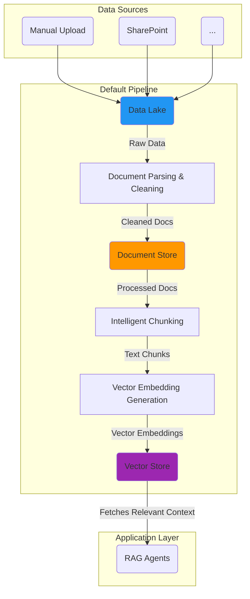

[WIP]

# Building Pipelines

In the Swiss AI-Hub, pipelines handle the complete lifecycle from raw document ingestion to creating search-ready vector 
embeddings that power your agents' knowledge retrieval capabilities.
> [!NOTE]
> AI-Hub pipelines are built on [Dagster](https://dagster.io/), providing a robust, observable approach to data processing. 
This chapter does not cover Dagster fundamentals; please refer to the [Dagster documentation](https://docs.dagster.io/) for that.


## The default pipeline  {#data-flow}

> [!IMPORTANT]
> AI-Hub's core pipeline follows a **data lake to vector store** pattern, designed specifically to power RAG agents with searchable document knowledge.




## Pipeline architecture patterns {#architecture-patterns}

### Asset factories for reusability {#asset-factories}

Create configurable asset definitions that can be adapted across different projects:

::: code-group

```python [Asset Factory]
def documents_factory(
    key: AssetKey, 
    data_lake_key: AssetKey, 
    partitions: DynamicPartitionsDefinition
) -> graph_asset:
    """Factory for creating document processing assets."""
    
    @graph_asset(
        key=key,
        ins={"data_lake_file": AssetIn(key=data_lake_key)},
        partitions_def=partitions,
        automation_condition=AutomationCondition.eager(),
    )
    def documents(data_lake_file: DataLakeFile) -> RefDocDocument:
        return insert_ref_doc_into_docstore(
            ensure_refdoc_default_metadata(
                parse_document_from_data_lake(data_lake_file)
            )
        )
    
    return documents
```

```python [Usage Example]
# Create reusable document processing assets
document_asset = documents_factory(
    key=AssetKey(["production", "documents"]),
    data_lake_key=AssetKey(["production", "data_lake"]),
    partitions=DynamicPartitionsDefinition(name="doc_partitions"),
)
```

:::

### Observable automation {#observable-automation}

Instead of running on schedules, pipelines react to data changes:

::: code-group

```python [Observable Asset]
@observable_source_asset(
    key=AssetKey(["data_lake"]),
    partitions_def=document_partitions,
)
def data_lake_observer(context):
    """Observe data lake for new or changed documents."""
    changed_files = scan_data_lake_for_changes()
    
    data_versions = {}
    for file_info in changed_files:
        partition_key = file_info.id
        data_version = DataVersion(file_info.modified_time.isoformat())
        data_versions[partition_key] = data_version
    
    return DataVersions(data_versions)
```

```python [Automation Condition]
@graph_asset(
    automation_condition=AutomationCondition.eager(),
)
def reactive_processing(data_lake_file):
    """Process immediately when data changes."""
    return process_document(data_lake_file)
```

:::

### Resource management {#resource-management}

Configure external dependencies like parsers, databases, and AI models:

```python
{
    "document_parser": DocumentParserResource(
        loader_type=LoaderType.DOCLING
    ),
    "embedding_model": EmbeddingModelResource(
        embedding_config=EmbeddingModelConfig(
            model_name="azure/text-embedding-3-large"
        )
    ),
    "vector_store": VectorStoreResource(
        connection_string="mongodb://localhost:27017"
    ),
}
```

## When to build pipelines {#use-cases}

> [!IMPORTANT]
> Pipelines are essential when you need to process business documents at scale and maintain data freshness for AI agents.

::: tip Pipeline Use Cases
- **Process business documents at scale** - Convert your organization's knowledge into AI-readable formats
- **Maintain data freshness** - Automatically update vector stores when source documents change
- **Track data lineage** - Understand exactly which documents contributed to agent responses
- **Handle multiple data sources** - Integrate content from SharePoint, file shares, databases, and APIs
- **Ensure reliability** - Build robust processing that handles errors gracefully and provides visibility into failures
:::

## Next steps {#next-steps}

This section will guide you through:

::: info Pipeline Documentation Structure
- [Pipeline fundamentals](./1_pipeline_fundamentals/) - Core concepts and architecture patterns
- [Data ingestion patterns](./2_data_ingestion_patterns/) - Common approaches to document processing
- [Observable assets](./3_observable_assets/) - Building reactive, data-driven pipelines
- [Testing pipelines](./4_testing_pipelines/) - Ensuring reliability and correctness
- [Production scheduling](./5_production_scheduling/) - Deploying and managing pipelines at scale
- [Pipeline observation](./6_pipeline_observation/) - Monitoring and debugging pipeline executions
:::
