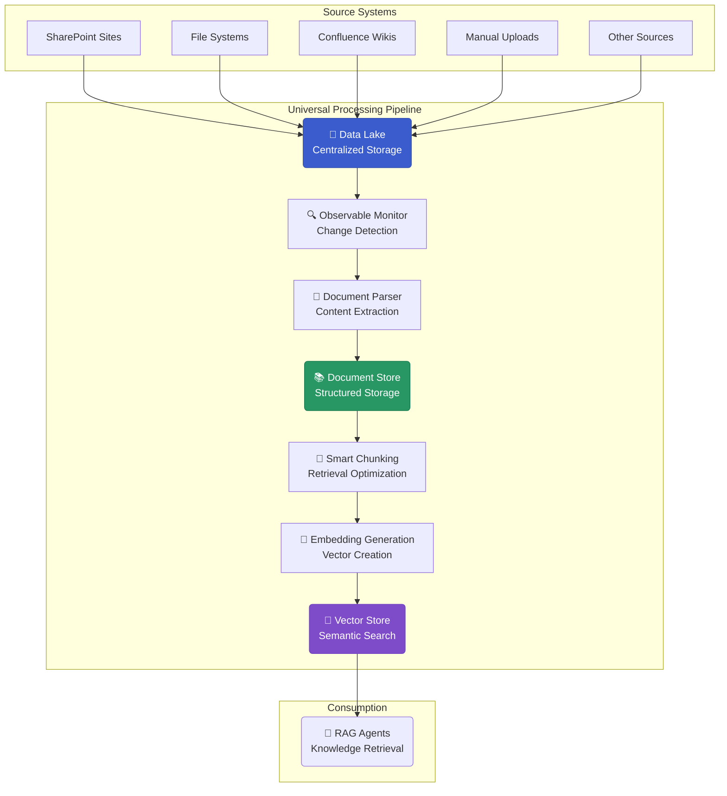

# Building Pipelines

Pipelines are an integral part of AI systems, Retrieval-Augmented Generation (RAG) pipelines ingest, process, and index documents from multiple sources. 
These sources can vary in format, update frequency, and access methods. This section describes a set of patterns for building such pipelines, focusing on concepts like observable assets, eager automation, dynamic partitioning, and configurable resources.

> [!NOTE] Foundation
> The pipelines described here are implemented using [Dagster](https://dagster.io/), an asset-based data orchestrator. The following sections explain the architectural patterns used in the implementation.

## Challenges in Document Processing for RAG

To understand the design of these pipelines, it is useful to first consider the common challenges involved.

### Pipeline Requirements for RAG Systems

For a RAG system to be effective, its underlying data pipeline should address several key requirements:

::: tip RAG Pipeline Requirements

  * **Freshness**: The system should work with up-to-date information.
  * **Optimal Chunking**: Documents need to be divided into chunks suitable for semantic search.
  * **Source Attribution**: All information should be traceable to its original source.
  * **Coverage**: All relevant knowledge sources should be included.
  * **Performance**: The retrieval process must be fast enough for interactive applications.
:::

These requirements inform the architectural patterns discussed in the following sections.

## Architectural Patterns for Document Pipelines

### Observable Assets Pattern

Instead of processing data on a fixed schedule, the observable assets pattern initiates processing based on data changes. 
An observation job periodically checks a source system for new or modified data. 
If a change is detected, it triggers the downstream pipeline to process only the affected data.

```python
@observable_source_asset(
    key=AssetKey(["documents", "data_lake"]),
    partitions_def=document_partitions,
)
def data_lake_observer(context):
    """Scheduled job observes data lake for changes."""
    changed_files = scan_for_changes()
    
    # Return only partitions that have changed since last observation
    data_versions = {}
    for file_info in changed_files:
        data_versions[file_info.id] = DataVersion(file_info.modified_time.isoformat())
    
    return DataVersions(data_versions)

# The observation itself is scheduled
observe_job = observe_source_job(
    observable_asset=data_lake_observer,
    namespace_name="documents",
)

# Schedule runs the observation job, not the processing directly
schedules=[daily_schedule_at(observe_job, hour=2, minute=0)]
```

**Characteristics:**

  * **Change Detection**: Processes only documents where changes have been detected.
  * **Scheduled Observation**: Observation jobs run on a schedule (e.g., hourly, daily).
  * **Conditional Processing**: Downstream processing is triggered only when changes are found.
  * **Partition Isolation**: Each document change can be mapped to a specific partition.

### Eager Automation Pattern

When an observable asset detects a change, downstream processing can be triggered immediately. 
This is known as an eager automation pattern.

```python
@graph_asset(
    automation_condition=AutomationCondition.eager(),
    partitions_def=document_partitions,
)
def process_documents(data_lake_file: DataLakeFile) -> RefDocDocument:
    """Process documents immediately when upstream changes are detected."""
    return parse_and_store_document(data_lake_file)
```

**Characteristics:**

  * **Immediate Processing**: Assets are processed as soon as their upstream dependencies change.
  * **Partition-Level Isolation**: Each document partition is processed independently.
  * **Load Distribution**: Processing load is spread out over time as changes occur, rather than being concentrated in large batches.
  * **Reduced Latency**: New content is available for retrieval sooner, as it does not have to wait for a scheduled batch window.

### Dynamic Partitioning Approach

Static partitioning schemes, such as time-based partitions (e.g., daily or hourly), may not align well with how documents are added or updated. Dynamic partitioning allows for the creation of partitions based on the characteristics of the data itself, such as creating a unique partition for each document.

```python
document_partitions = DynamicPartitionsDefinition(name="documents")

# Partitions are created at runtime when new documents are detected.
# Each document can be assigned its own partition for independent processing.
```

**Characteristics:**

  * **Runtime Partition Creation**: Partitions are created when new documents are discovered.
  * **Independent Processing**: Each partition can be processed, retried, or debugged separately.
  * **Parallelization**: Processing can be distributed across multiple partitions concurrently.
  * **Selective Reprocessing**: If a change occurs, only the affected partition needs to be reprocessed.

## The Data Lake to Vector Store Architecture

A common architecture involves a two-stage process: first ingesting documents from various sources into a central data lake, and then processing them from the data lake into a vector store.



### Rationale for the Two-Stage Approach

**Stage 1: Source Ingestion to Data Lake**

  * Each source system has a dedicated connector for authentication and data extraction.
  * All connectors write data in the data lake.
  * Source-specific metadata is preserved and normalized.
  * Change detection occurs at the data lake level.

**Stage 2: Universal Processing from Data Lake to Vector Store**

  * A single, universal pipeline processes all documents from the data lake, regardless of their original source.
  * This ensures consistent parsing, chunking, and embedding strategies.
  * The pipeline is optimized for the needs of RAG systems.
  * Observable assets automatically trigger processing for new or changed content.

Decoupling source ingestion from document processing in this way helps manage complexity. Rather than building a full processing pipeline for each data source, this approach centralizes the complex logic, making it easier to maintain and update. It also improves reliability, as an outage in one source system does not block the processing of documents from other sources already in the data lake.

## Using Asset Factories for Reusability

For complex pipelines, creating reusable and configurable components is important. An asset factory is a function that generates a configured asset. This pattern promotes reusability across different projects and environments.

```python
def documents_factory(
    key: AssetKey,
    data_lake_key: AssetKey,
    partitions: DynamicPartitionsDefinition,
    config: Optional[ProcessingConfig] = None,
) -> graph_asset:
    """Factory for creating document processing assets."""
    
    @graph_asset(
        key=key,
        ins={"data_lake_file": AssetIn(key=data_lake_key)},
        partitions_def=partitions,
        automation_condition=AutomationCondition.eager(),
    )
    def documents(data_lake_file: DataLakeFile) -> RefDocDocument:
        # Process document through parsing and enrichment steps
        parsed = parse_document_from_data_lake(data_lake_file)
        enriched = ensure_refdoc_default_metadata(parsed)
        return insert_ref_doc_into_docstore(enriched)
    
    return documents
```

**Benefits of this pattern:**

  * **Composability**: Factories can be combined to build complete pipelines.
  * **Configuration**: The same processing logic can be used with different configurations for each project.
  * **Type Safety**: Static type checking can be applied to factory parameters.
  * **Testability**: Individual factories can be unit-tested in isolation.

### Composing a Pipeline with Factories

Asset factories can be used together to define an end-to-end processing pipeline.

```python
# Create the assets needed for a RAG pipeline
pipeline_assets = [
    # Monitor data lake for changes
    observable_data_lake_factory(
        key=AssetKey(["company", "data_lake"]),
        partitions=document_partitions
    ),
    
    # Parse documents into a structured format
    documents_factory(
        key=AssetKey(["company", "documents"]),
        data_lake_key=AssetKey(["company", "data_lake"]),
        partitions=document_partitions
    ),
    
    # Chunk documents for retrieval
    nodes_factory(
        key=AssetKey(["company", "nodes"]),  
        document_key=AssetKey(["company", "documents"]),
        partitions=document_partitions
    ),
    
    # Generate hierarchical summaries
    summary_nodes_factory(
        key=AssetKey(["company", "summary_nodes"]),
        document_key=AssetKey(["company", "documents"]),
        nodes_key=AssetKey(["company", "nodes"]),
        partitions=document_partitions
    ),
]
```

This composition automatically defines dependencies between assets, allows for parallel processing of independent partitions, and enables incremental updates where only changed data flows through the pipeline.

## Managing External Connections with Resources

Pipelines need to connect to external systems like document parsers, embedding models, and databases. Hard-coding these connections can be problematic when moving between different environments (e.g., development, testing, production). A "resource" is an object that manages the connection to an external service, allowing configurations to be changed without altering the core pipeline logic.

**Example of a Configurable Resource:**

```python
class DocumentParserResource(ConfigurableResource):
    """Configurable document parsing with multiple backends."""
    
    loader_type: LoaderType = LoaderType.DOCLING
    timeout: int = 120
    max_retries: int = 3
    
    def get_document_parser_for_filetype(self, filetype: str) -> BaseReader:
        """Get appropriate parser for file type."""
        if self.loader_type == LoaderType.DOCLING:
            return DoclingReader(timeout=self.timeout)
        elif self.loader_type == LoaderType.DOCUMENT_INTELLIGENCE:
            return AzureDocIntelligenceReader(
                timeout=self.timeout,
                max_retries=self.max_retries
            )
```

**Environment-Specific Configurations:**

Different configurations can be defined for different environments.

```python
# Local setup: Uses local services for local development or deployment
local_resources = {
    "document_parser": DocumentParserResource(
        loader_type=LoaderType.DOCLING,
    ),
    "vector_store": local_milvus_resource("http://localhost:19530"),
    "embedding_model": EmbeddingModelResource(
        embedding_config=EmbeddingModelConfig(
            model_name="local/qwen-embedding" 
        )
    ),
}

# Cloud setup: Uses managed services optimized for scale  
prod_resources = {
    "document_parser": DocumentParserResource(
        loader_type=LoaderType.DOCUMENT_INTELLIGENCE,
    ),
    "vector_store": azure_ai_search_resource(),
    "embedding_model": EmbeddingModelResource(
        embedding_config=EmbeddingModelConfig(
            model_name="azure/text-embedding-3-large" 
        )
    ),
}
```

## Example of a Complete RAG Pipeline

The following example shows how these patterns combine to form a complete pipeline for processing enterprise documents.

::: code-group

```python [Complete Pipeline]
"""Production RAG Pipeline using described patterns."""

from dagster import AssetKey, Definitions, DynamicPartitionsDefinition
from aihub_pipeline.assets.factories.data_lake_to_vector_store import (
    observable_data_lake_factory,
    documents_factory, 
    nodes_factory,
    summary_nodes_factory,
)
from aihub_pipeline.resources.factory import (
    local_mongo_milvus_storage_context_resource,
    default_io_manager_s3_datalake_resources,
)
from aihub_pipeline.resources.parser.DocumentParserResource import DocumentParserResource, LoaderType
from aihub_pipeline.resources.llm.EmbeddingModelResource import EmbeddingModelResource
from aihub_pipeline.jobs.factory import observe_source_job
from aihub_pipeline.sensors.factory import default_automation_sensor

# Configuration
NAMESPACE = "enterprise_knowledge"
document_partitions = DynamicPartitionsDefinition(name=f"{NAMESPACE}_documents")

# Asset definitions using factories
assets = [
    # Observable asset: monitors data lake, creates partitions for changed docs
    observable_data_lake_factory(
        key=AssetKey([NAMESPACE, "data_lake"]),
        partitions=document_partitions
    ),
    
    # Processing pipeline: each asset depends on the previous one
    documents_factory(
        key=AssetKey([NAMESPACE, "documents"]),
        data_lake_key=AssetKey([NAMESPACE, "data_lake"]),
        partitions=document_partitions
    ),
    
    nodes_factory(
        key=AssetKey([NAMESPACE, "nodes"]),
        document_key=AssetKey([NAMESPACE, "documents"]), 
        partitions=document_partitions
    ),
    
    summary_nodes_factory(
        key=AssetKey([NAMESPACE, "summary_nodes"]),
        document_key=AssetKey([NAMESPACE, "documents"]),
        nodes_key=AssetKey([NAMESPACE, "nodes"]),
        partitions=document_partitions
    ),
]

# Job for orchestration
observe_job = observe_source_job(
    observable_asset=assets[0],  # The data lake observer
    namespace_name=NAMESPACE,
)

# Complete pipeline definition
defs = Definitions(
    assets=assets,
    resources={
        # Configurable resources for this environment
        **default_io_manager_s3_datalake_resources(
            container_name="knowledge-base",
            directory_name="documents"
        ),
        **local_mongo_milvus_storage_context_resource(
            vector_store_uri="http://localhost:19530",
            store_name="enterprise_kb",
            namespace_name=NAMESPACE,
        ),
        "document_parser": DocumentParserResource(
            loader_type=LoaderType.DOCLING
        ),
        "embedding_model": EmbeddingModelResource(
            embedding_config=EmbeddingModelConfig(
                model_name="azure/text-embedding-3-large"
            )
        ),
    },
    jobs=[observe_job],
    sensors=[default_automation_sensor(assets)],  # Enables eager automation
)
```

:::

### Pipeline Execution Flow

When this pipeline is running, a typical workflow is as follows:

1.  **Document Arrival**: A new document is uploaded to a source system like SharePoint.
2.  **Change Detection**: The data lake's observable asset detects the new file.
3.  **Partition Creation**: A new, dynamic partition is created specifically for this document.
4.  **Eager Processing**: Downstream assets immediately begin processing this new partition.
5.  **Parallel Execution**: This document is processed independently of any other ongoing document processing.
6.  **Error Isolation**: If an error occurs while parsing this document, other documents are unaffected.
7.  **Availability**: Once successfully processed, the document's content becomes available for querying by RAG agents.

## Summary of Pattern Characteristics

The architectural patterns described here result in specific operational characteristics.

::: info Implementation Characteristics

**Development Characteristics:**

  * **Environment Consistency**: The same patterns are used in both local development and production.
  * **Debugging**: Asset lineage provides clear dependency tracking for troubleshooting.
  * **Component Reusability**: Asset factories allow components to be reused across projects.
  * **Type Safety**: Static typing helps identify configuration errors early.

**Operational Characteristics:**

  * **Resource Utilization**: Processing is triggered by actual data changes, not fixed schedules.
  * **Horizontal Scaling**: The workload can be distributed across multiple workers.
  * **Fault Isolation**: Document-level partitioning isolates processing failures.
  * **Observability**: The asset-based model provides detailed execution metrics and lineage.
:::

## Documentation Structure

The following sections provide more detailed guidance for implementing these pipeline patterns:

::: info Pipeline Documentation Sections

1.  **[Pipeline Fundamentals](https://www.google.com/search?q=./1_pipeline_fundamentals/)**: Covers asset factories, operations, and resource configuration.
2.  **[Data Ingestion Patterns](https://www.google.com/search?q=./2_data_ingestion_patterns/)**: Describes the full RAG pipeline implementation and common processing scenarios.
3.  **[Observable Assets](https://www.google.com/search?q=./3_observable_assets/)**: Details the implementation of change-driven processing.
4.  **[Job Scheduling](https://www.google.com/search?q=./4_job_scheduling/)**: Explains orchestration and scheduling configuration.
5.  **[Pipeline Observation](https://www.google.com/search?q=./5_pipeline_observation/)**: Focuses on monitoring, debugging, and performance analysis.
:::
