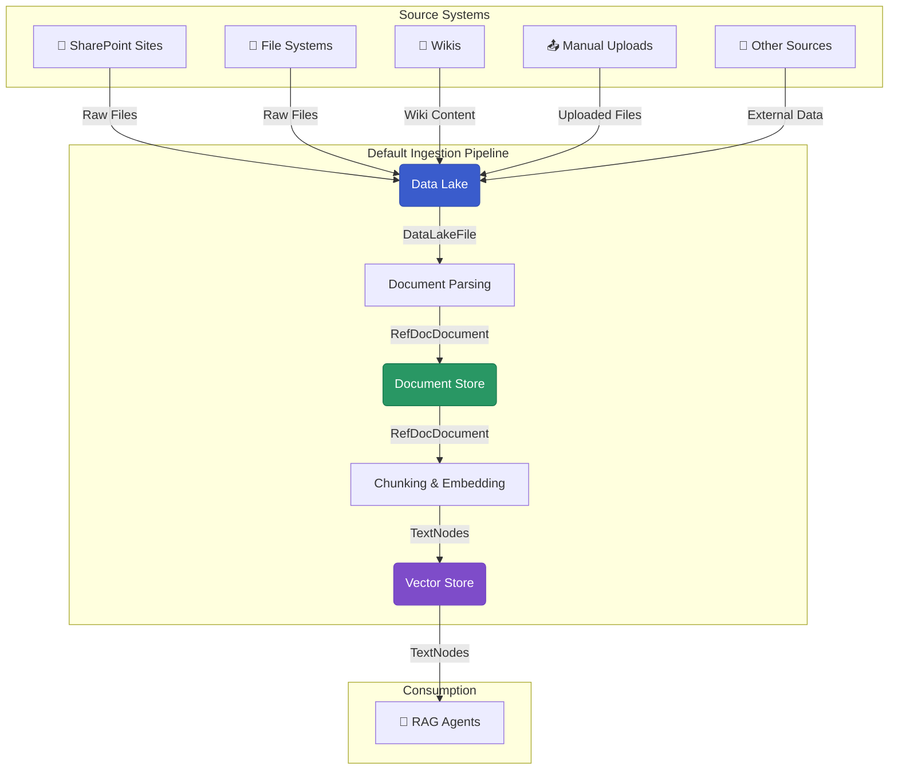

# Building Pipelines with AI-Hub Pipeline SDK

Learn how to use, configure, and extend the `aihub_pipeline` SDK for your document processing workflows.


## What you'll learn

- **How the AI Hub Uses Dagster**: Observable assets, automation conditions, I/O managers, and why these patterns are effective
- **Configuring the Default Pipeline**: Set up, configure, and customize the ready-made document processing pipeline
- **Production Usage**: Add jobs, schedules, and sensors for automated operation and monitor your pipelines

## Prerequisites

Complete the [Development Environment Setup](../1_quick_start/1_dev_environment_setup/) and [Your First Pipeline](../1_quick_start/4_your_first_pipeline/) before starting.

## The Default Data Lake to Vector Store Pipeline

The AI-Hub Pipeline SDK provides a production-ready pipeline that handles the most common document processing workflow: ingesting documents from various sources, parsing them, and creating searchable vector embeddings for RAG systems.



## Quick Start: Using the Default Pipeline

The simplest way to get started is to use our pre-built asset factories and resource configurations. 
Create a new Python file (e.g. `my_pipeline.py`) and add the following code:


```python
from aihub_lib.generative_ai.resources.models.llm.EmbeddingModelConfig import EmbeddingModelConfig
from dagster import AssetKey, AssetSelection, Definitions, DynamicPartitionsDefinition

from aihub_pipeline.assets.factories.data_lake_to_vector_store.documents_factory import documents_factory
from aihub_pipeline.assets.factories.data_lake_to_vector_store.nodes_factory import nodes_factory
from aihub_pipeline.assets.factories.data_lake_to_vector_store.observable_data_lake_factory import (
    observable_data_lake_factory,
)
from aihub_pipeline.assets.factories.data_lake_to_vector_store.removed_documents_factory import (
    removed_documents_factory,
)
from aihub_pipeline.executors.factory import default_process_executor
from aihub_pipeline.jobs.factory import materialize_asset_job, observe_source_job
from aihub_pipeline.resources.factory import (
    default_io_manager_s3_datalake_resources,
    local_mongo_milvus_storage_context_resource,
    s3_data_lake_resources,
)
from aihub_pipeline.resources.llm.EmbeddingModelResource import EmbeddingModelResource
from aihub_pipeline.resources.parser.DocumentParserResource import DocumentParserResource, LoaderType
from aihub_pipeline.resources.parser.MarkdownStructuralNodeParserResource import MarkdownStructuralNodeParserResource
from aihub_pipeline.resources.parser.RecursiveSummaryParserResource import RecursiveSummaryParserResource
from aihub_pipeline.schedules.factory import daily_schedule_at
from aihub_pipeline.sensors.factory import default_automation_sensor

DATA_LAKE_KEY = AssetKey(["playground", "data_lake"])
DOCUMENT_KEY = AssetKey(["playground", "documents"])
NODES_KEY = AssetKey(["playground", "nodes"])
REMOVED_DOCUMENTS_KEY = AssetKey(["playground", "removed_documents"])
SUMMARY_NODES_KEY = AssetKey(["playground", "summary_nodes"])

DATALAKE_CONTAINER_NAME = "playground"
DATALAKE_DIRECTORY_NAME = "test"
NAMESPACE_NAME = DATALAKE_DIRECTORY_NAME
STORE_NAME = DATALAKE_CONTAINER_NAME
FIGURES_DIRECTORY_NAME = "__figures__"

document_partitions = DynamicPartitionsDefinition(name="document_partitions")

observable_asset = observable_data_lake_factory(DATA_LAKE_KEY, document_partitions)
assets = [
    observable_asset,
    removed_documents_factory(REMOVED_DOCUMENTS_KEY, data_lake_key=DATA_LAKE_KEY),
    documents_factory(DOCUMENT_KEY, data_lake_key=DATA_LAKE_KEY, partitions=document_partitions),
    nodes_factory(NODES_KEY, document_key=DOCUMENT_KEY, partitions=document_partitions),
]

job = observe_source_job(
    observable_asset=observable_asset,
    namespace_name=NAMESPACE_NAME,
)

remove_job = materialize_asset_job(
    namespace_name=NAMESPACE_NAME,
    job_name="remove_documents",
    asset_selection=AssetSelection.keys(REMOVED_DOCUMENTS_KEY),
)

defs = Definitions(
    assets=assets,
    resources={
        **default_io_manager_s3_datalake_resources(
            container_name=DATALAKE_CONTAINER_NAME, directory_name=DATALAKE_DIRECTORY_NAME
        ),
        "document_parser": DocumentParserResource(loader_type=LoaderType.DOCLING),
        "node_parser": MarkdownStructuralNodeParserResource(),
        "summary_parser": RecursiveSummaryParserResource(),
        **local_mongo_milvus_storage_context_resource(
            vector_store_uri="http://localhost:19530",
            store_name=STORE_NAME,
            namespace_name=NAMESPACE_NAME,
        ),
        **s3_data_lake_resources(
            container_name=DATALAKE_CONTAINER_NAME,
            directory_name=DATALAKE_DIRECTORY_NAME,
            figures_directory_name=FIGURES_DIRECTORY_NAME,
        ),
        "embedding_model": EmbeddingModelResource(
            embedding_config=EmbeddingModelConfig(model_name="local/qwen-embedding"),
        ),
    },
    sensors=[default_automation_sensor(assets)],
    executor=default_process_executor(),
    jobs=[job, remove_job],
    schedules=[daily_schedule_at(job, hour=0, minute=0), daily_schedule_at(remove_job, hour=1, minute=0)],
)

```

**What this gives you:**
- **Observable Data Lake**: Automatically detects new/changed documents
- **Document Processing**: Parses PDFs, Word docs, Markdown using Docling AI  
- **Vector Search**: Creates searchable embeddings stored in Milvus
- **Production Ready**: Includes error handling, retries, and observability


## Architecture Philosophy

The AI-Hub Pipeline SDK follows several key principles:

**Change-Driven Processing**: Instead of running pipelines on fixed schedules, we use observable assets that detect changes in external systems and trigger processing only for changed data.

**Document-Level Partitioning**: Each document gets its own partition, enabling independent processing, fault isolation, and selective reprocessing.

**Environment Consistency**: The same pipeline code works across development, testing, and production environments using resource factory patterns.

**Type Safety**: Custom I/O managers and strongly typed data models ensure reliable data flow and better error handling.

These patterns enable pipelines that are efficient, scalable, and maintainable while providing production-grade reliability.

## Getting Started

If you're new to the AI-Hub Pipeline SDK, follow this learning path:

1. **[Pipeline Patterns](./1_pipeline_patterns/)** - Understand the architectural decisions and patterns for building pipelines
2. **[Data Ingestion Pipeline](./2_data_ingestion_pipeline/)** - Configure and extend the default pipeline
3. **[Job Scheduling](./4_job_scheduling/)** - Schedule your pipelines for automatic runs
4. **[Pipeline Observation](./5_pipeline_observation/)** Monitor your pipelines for performance and errors
