# Architecture Review: Overview

**Document type**: Executive Summary for stakeholders.

**Audience**: C-level, Product, Business, Compliance/Legal, Architects, Technical Leads.

**Scope**: Swiss AI Hub ecosystem covering:

- `aihub-core` - platform application stack
- **Customer deployments**:
  - `aihub-b*d`, `aihub-c*c` - Gen 1 (Azure VM + shell scripts), in production
  - `aihub-Ig*s`, `aihub-Dem*scope`, `aihub-W*P`, `aihub-Balmer-E*` - TBD (deployment generation, version, status
    pending team input)
- **Infrastructure repos (Gen 2)**:
  - `aihub-playbook` - Ansible Pull infrastructure-as-code (every 15-min reconcile)
  - `aihub-ops` - VM provisioning automation for OpenStack (cloud-init + setup script)
  - `aihub-{customer_id}` - per-customer encrypted secrets + custom config repos (template pattern)

The document structure is extensible for additional customer projects.

**Document objectives**:

1. **Assess the current high-level architecture** against production standards for enterprise / multi-customer
   (10-pillar framework, [WAF](https://learn.microsoft.com/en-us/azure/well-architected/),
   [STRIDE](https://learn.microsoft.com/en-us/azure/security/develop/threat-modeling-tool-threats),
   [OWASP LLM Top 10](https://genai.owasp.org/llm-top-10/), [CNCF maturity](https://maturitymodel.cncf.io/),
   [GDPR](https://gdpr-info.eu/) and [revDSG](https://www.fedlex.admin.ch/eli/cc/2022/491/de)). Full references at the
   end of the document.
2. **List the concerns** that are blocking or slowing production readiness, with a clear `What → How → Direction` per
   concern.
3. **Propose high-level recommendations** so the team can plan an improvement roadmap.

**What this document does NOT do**:

- Does not prescribe implementation details (deep-dives belong in dedicated ADRs and planning sessions).
- Is not a gate / final NO-GO verdict - it is **input** for roadmap decisions on improvement priorities.
- Does not cover detailed code review or specific performance benchmarks.

## Component versions

_Snapshot as of 2026-05-26._

| Component                   | Version        | Note                                                                            |
| --------------------------- | -------------- | ------------------------------------------------------------------------------- |
| aihub-core (HEAD on `main`) | v0.289.10      | Application stack - Latest dev                                                  |
| aihub-b\*d using core       | v0.279.2       | Customer Gen 1 - Azure VM + shell scripts, 10 minors behind core                |
| aihub-c\*c using core       | v0.274.3       | Customer Gen 1 - Azure VM + shell scripts, 15 minors behind core, 5 behind b\*d |
| aihub-Ig\*s                 | TBD            | Customer - version + deployment gen details pending                             |
| aihub-W\*P                  | TBD            | Customer - version + deployment gen details pending                             |
| aihub-Dem\*scope            | TBD            | Customer - version + deployment gen details pending                             |
| aihub-Balmer-E\*            | TBD            | Customer - version + deployment gen details pending                             |
| aihub-playbook              | HEAD on `main` | Infra Gen 2 - Ansible Pull (every 15 min), 3-repo coordination                  |
| aihub-ops                   | HEAD on `main` | VM provisioning automation (OpenStack Infomaniak)                               |
| aihub-\{customer_id}        | per-customer   | Encrypted Ansible Vault + custom config (template repo pattern)                 |

Warnings:

- The two existing customers (B*D/C*C) run different SDK versions, both older than core. No policy enforces upgrades.
- Security patches on `main` do not propagate automatically to Gen 1 customers; Gen 2 (Ansible Pull) auto-deploys within
  15 min.
- B*D/C*C migration path from Gen 1 (Azure manual) to Gen 2 (Infomaniak OpenStack + Ansible) is not yet documented.

______________________________________________________________________

## Table of Contents

1. [Summary](#1-summary)
2. [Ecosystem Diagram](#2-ecosystem-diagram)
3. [Priority items for go-live (CRITICAL + HIGH)](#3-priority-items-for-go-live-critical--high) 3.1.
   [aihub-core (Platform)](#31-aihub-core-platform) 3.2. [aihub-b\*d](#32-aihub-bd) 3.3. [aihub-c\*c](#33-aihub-cc)
4. [Assessment](#4-assessment) 4.1. [By 10-pillar framework](#41-by-10-pillar-framework) 4.2.
   [Business core values vs reality](#42-business-core-values-vs-reality)
5. [Concerns and Documentation Backlog](#5-concerns-and-documentation-backlog)
6. [Recommendations](#6-recommendations)

______________________________________________________________________

## 1. Summary

**Purpose of this section**: give stakeholders a fast overview of platform strengths and weaknesses before diving into
§3-§6.

| Strengths                                                                                                                                                                                                          | Weaknesses                                                                                                                                                     |
| ------------------------------------------------------------------------------------------------------------------------------------------------------------------------------------------------------------------ | -------------------------------------------------------------------------------------------------------------------------------------------------------------- |
| Event-driven architecture (NATS JetStream and Swiss AI Agent Protocol)                                                                                                                                             | Sovereignty violation - B*D/C*C use Azure OpenAI/Foundry, violating ADR `2026_02_24`                                                                           |
| 43 ADRs documenting major decisions                                                                                                                                                                                | Gen 1 customer backup on the same VM (violates [3-2-1 rule](https://www.cisa.gov/news-events/news/data-backup-options)); Gen 2 partial fix via Restic→Swift    |
| OpenTelemetry observability stack (cross-service traces)                                                                                                                                                           | No HA architecture - every stateful service is single-instance (PostgreSQL/NATS/Valkey/Milvus/Keycloak/etcd)                                                   |
| Agent framework supports common enterprise AI patterns (conversational, RAG single+multi-source, document parsing, tool calling/MCP, HITL, multi-agent, voice STT/TTS, code execution sandbox, browser automation) | AI use case scope not documented in an ADR, coverage claim not defensible for audit; vision / predictive analytics / fine-tuning out of scope but not explicit |
| Full CI/CD (lint, semantic-pr, per-package build)                                                                                                                                                                  | UsageLimits partially wired (agent endpoints + OpenAI route) but no 4-layer enforcement, no pre-flight estimation, no hard cap → LLM cost runaway risk         |
| Hierarchical permission template with AccessChecker tenant-ceiling (BDD tested)                                                                                                                                    | AuditLogEntity missing, GDPR right-to-erasure unimplementable, false docs claims                                                                               |
| LiteLLM gateway abstracts the LLM provider (easy to swap)                                                                                                                                                          | Large customer SDK drift - B*D 10 minors, C*C 15 minors, no versioning policy                                                                                  |
| Dagster pipeline orchestration with asset lineage                                                                                                                                                                  | No customer-facing SLA, no alerting infra; only Slack notification on Ansible Pull failure                                                                     |
| License compliance OK (402 Python + 993 npm + 33 Docker images approved)                                                                                                                                           | Single-server ceiling (Docker Compose only, no K8s, no horizontal scale)                                                                                       |
| 43 ADRs and existing arc42 chapters for the platform                                                                                                                                                               | Customer docs gap - B*D/C*C have no arc42 or ADRs                                                                                                              |
| Hierarchical scoping protocol (Thread → Display → Run)                                                                                                                                                             | Missing connector framework - every customer rebuilds (O(N×M) onboarding cost)                                                                                 |
| Multi-language i18n for the UI (DE/EN/FR/IT)                                                                                                                                                                       | Presidio is DE-only, multilingual PII gap for Swiss FR/IT/EN                                                                                                   |
| **Gen 2 deployment: Ansible Pull self-configuring VMs (15-min auto-reconcile)**                                                                                                                                    | B*D/C*C still Gen 1 (Azure manual) - no migration plan to Gen 2                                                                                                |
| **Infomaniak OpenStack - Swiss-sovereign cloud for Gen 2**                                                                                                                                                         | Restic → Swift uses same provider Infomaniak; no cross-provider replication                                                                                    |
| **3-repo coordination pattern (playbook/core/customer) - separation of concerns**                                                                                                                                  | 3-repo version compatibility has no matrix / CI gate testing combos                                                                                            |
| **Customer onboarding template (`setup-aihub.sh`)** automated VM provisioning                                                                                                                                      | Ansible Pull 15-min cadence too slow for hot-fix; GitHub dependency = deploy SPOF                                                                              |
| **Ansible Vault encrypted secrets + auto-gen random via vault-vars-routing.yml**                                                                                                                                   | Vault password stored on VM filesystem - VM compromise = full unlock                                                                                           |
| **Traefik + Let's Encrypt ACME** automated SSL cert lifecycle                                                                                                                                                      | Deploy key rotation policy implicit ("periodically"), no automation / audit                                                                                    |
| **SigNoz OTEL collector role** (host metrics + OTLP traces + journald)                                                                                                                                             | SigNoz Cloud region "eu" - unclear data sovereignty implication                                                                                                |
| **Env vars drift detection CI** (`check_env_drift.py` nightly)                                                                                                                                                     | Drift check only for env vars, doesn't cover docs claims                                                                                                       |
| Langfuse cost tracking per LLM call                                                                                                                                                                                | No per-tenant cost attribution → showback impossible                                                                                                           |
| Open-source self-hosted positioning                                                                                                                                                                                | Open-source dependency lock-in (parser/embedding/reranker/vector store not abstracted)                                                                         |
| BDD test integration with real NATS                                                                                                                                                                                | Test coverage zero in C*C, 59 lines in B*D                                                                                                                     |
| Trace context propagated via NATS message headers                                                                                                                                                                  | Bot scope lacks OTEL → trace breaks at the bot boundary                                                                                                        |
| Pulumi adopted as IaC framework (ADR `2024_12_18`) — superseded by Ansible Pull for Gen 2                                                                                                                          | ADR exists but no Pulumi code in `aihub-core` repo; no K8s migration path (no Helm chart, no StatefulSets)                                                     |

**Next steps**

1. §3 - priority CRITICAL + HIGH items for go-live (3 tables Core/B*D/C*C).
2. §4 - detailed 10-pillar assessment (table format) and business values vs reality.
3. §5 - every concern listed in `Concern → Direction` format (tactical) or trade-off block (strategic).
4. §6 - high-level recommendations grouped into Immediate / Strategic / Documentation / Process.
5. The team uses this document as input for the improvement roadmap.

______________________________________________________________________

## 2. Ecosystem Diagram

```mermaid
flowchart TB
    subgraph CORE["Swiss AI Hub Core (aihub-core v0.289.10)"]
        direction TB
        CorePkgs["packages/<br/>core • agent • api • pipeline<br/>bot • backup • web • process"]
        CoreADR["43 ADRs"]
        CoreInfra["30+ containers<br/>per deployment"]
    end

    subgraph B*D["aihub-b*d v0.279.2 (drift 10 minors)"]
        direction TB
        B*DAgents["Agents (3)<br/>b*d · expert_rag · expert_asking"]
        B*DPipes["Pipelines (4)<br/>customers × 2-stage<br/>suppliers × 2-stage"]
        B*DCfg["Configs (16 services)<br/>SMB path hardcoded<br/>SNK enrichment"]
        B*DExt["External: Azure OpenAI (Sweden)<br/>Cohere reranking<br/>SMB share"]
    end

    subgraph C*C["aihub-c*c v0.274.3 (drift 15 minors)"]
        direction TB
        C*CAgents["Agents (4)<br/>chat · jira · log<br/>retrieval_orchestrator"]
        C*CPipes["Pipelines (6)<br/>jira/confluence/sharepoint<br/>× 2-stage"]
        C*CAPI["Custom API<br/>Jira webhook<br/>Support Desk"]
        C*CLib["lib/common/<br/>events · types · ops"]
        C*CExt["External: Azure Foundry SUI+SWE<br/>Azure Doc Intelligence<br/>Azure AD B2C · Key Vault · VM<br/>Jira · Confluence · SharePoint"]
    end

    Future["Other customers (TBD info):<br/>Ig*s · Dem*scope · W*P · Balmer-E*<br/>(deployment gen + components pending)"]

    subgraph INFRA["Infrastructure Repos (Gen 2)"]
        direction TB
        Playbook["aihub-playbook<br/>Ansible Pull (every 15min)<br/>docker_runtime · traefik_proxy<br/>signoz · aihub_application<br/>os_backups (Restic→Swift)"]
        Ops["aihub-ops<br/>OpenStack VM provisioning<br/>setup-aihub.sh · cloud-init<br/>vault-vars-routing.yml<br/>nightly drift check"]
        CustomerRepo["aihub-{customer_id}<br/>Ansible Vault (encrypted)<br/>Custom config + secrets"]
    end

    CORE -.->|git tag<br/>v0.279.2| B*D
    CORE -.->|git tag<br/>v0.274.3| C*C
    CORE -.->|git tag<br/>vX.Y.Z| Future

    Playbook -->|pulls every 15min| Future
    Ops -.->|provisions VM| Future
    CustomerRepo -.->|vault secrets| Future

    style CORE fill:#e8f0ff
    style B*D fill:#fff4e8
    style C*C fill:#fff4e8
    style Future stroke-dasharray: 5 5,stroke:#888,fill:#f5f5f5
    style INFRA fill:#e8ffe8
```

**Customer Registry** (extend when new customers join)

Components format: `A` = agents, `P` = pipelines, `API` = custom API. Drift = number of minor versions behind core
latest. Sovereignty annotation inline in LLM Provider. **Deployment Gen**: Gen 1 = Azure VM + shell scripts (manual);
Gen 2 = OpenStack Infomaniak + Ansible Pull (aihub-playbook/aihub-ops).

| Customer              | Status            | Core ver (drift)     | Components      | Deployment Gen                                          | Data sources                         | LLM Provider                                        | Identity                |        Off-site Backup         | Own arc42 + ADRs | Test coverage               |
| --------------------- | ----------------- | -------------------- | --------------- | ------------------------------------------------------- | ------------------------------------ | --------------------------------------------------- | ----------------------- | :----------------------------: | :--------------: | --------------------------- |
| aihub-b\*d            | Production 4/2026 | v0.279.2 (10 behind) | 3A / 4P / -     | **Gen 1** - On-prem (SMB share)                         | SMB share (customer + supplier docs) | Azure OpenAI Sweden - **sovereignty violated**      | Keycloak SaaS           |          No (same VM)          |        No        | Minimal (59 lines / 1 util) |
| aihub-c\*c            | Production        | v0.274.3 (15 behind) | 4A / 6P / 1 API | **Gen 1** - Azure VM (SUI+SWE)                          | Jira / Confluence / SharePoint       | Azure AI Foundry SUI+SWE - **sovereignty violated** | Keycloak + Azure AD B2C |          No (same VM)          |        No        | Zero                        |
| aihub-Ig\*s           | TBD               | TBD                  | TBD             | TBD                                                     | TBD                                  | TBD                                                 |                         |                                |                  |                             |
| aihub-W\*P            | TBD               | TBD                  | TBD             | TBD                                                     | TBD                                  | TBD                                                 |                         |                                |                  |                             |
| aihub-Dem\*scope      | TBD               | TBD                  | TBD             | TBD                                                     | TBD                                  | TBD                                                 |                         |                                |                  |                             |
| aihub-Balmer-E\*      | TBD               | TBD                  | TBD             | TBD                                                     | TBD                                  | TBD                                                 |                         |                                |                  |                             |
| Customer #N+ (future) | Template ready    | TBD                  | TBD             | **Gen 2** - OpenStack Infomaniak (Swiss) + Ansible Pull | TBD                                  | TBD                                                 | TBD                     | Restic → Swift (partial 3-2-1) | TBD via template | TBD                         |

______________________________________________________________________

## 3. Priority items for go-live (CRITICAL + HIGH)

This section highlights items to prioritize for go-live preparation, grouped by scope (Core / B*D / C*C). Severity:

- **CRITICAL**: blocks go-live; causes data loss / security breach / compliance violation / fatal scenario if not
  addressed
- **HIGH**: significant impact on scale, reliability, or compliance; should be addressed before expanding the customer
  base

**Severity note**: Severity assumes the scenario "new customer onboarding with mid-to-high compliance requirement"
(Swiss enterprise / regulated industry such as banking, healthcare, gov). For other scenarios (e.g., internal-only
customer with low regulation, or shared multi-tenant SaaS), review severity individually; many items may downgrade or
upgrade depending on context.

Use this list as input for the team to prioritize go-live roadmap tasks. Full technical details in §4 Assessment and §5
Concerns. MEDIUM-severity items (business / scoping / nice-to-have) are tracked in §6 Recommendations instead of this
list.

### 3.1. aihub-core (Platform)

| #   | Item                                                                                                     |   Severity   | Recommendation actions                                                                                                                                        |
| --- | -------------------------------------------------------------------------------------------------------- | :----------: | ------------------------------------------------------------------------------------------------------------------------------------------------------------- |
| 1   | Sovereignty path not yet decided                                                                         | **CRITICAL** | Choose Option A (self-hosted local LLM) / B (hybrid with updated ADR allowing Azure-EU) / C (per-customer sovereignty tier); update ADR `2026_02_24`          |
| 2   | UsageLimits enforcement incomplete (wired at agent endpoints + OpenAI route, missing 4-layer + hard cap) | **CRITICAL** | Extend to 4-layer enforcement (per-user/tenant/model/global) across all routes; pre-flight cost estimation; hard cap with circuit breaker (see `adr_012`)     |
| 3   | Multi-tenant data layer not isolated                                                                     | **CRITICAL** | Add required `tenant_id` field; per-tenant Milvus collection; NATS subject namespace `aihub.tenant.{id}.*`; Valkey key prefix; auto-filter repository wrapper |
| 4   | Document ACL not inherited into Milvus                                                                   | **CRITICAL** | ACL metadata field in Milvus + retrieval-time filter by `user_groups` (see `adr_020`)                                                                         |
| 5   | MCP tool args bypass Presidio                                                                            | **CRITICAL** | Implement `SecureMCPExecutor` with Presidio sanitization + tool authorization (see `adr_019`)                                                                 |
| 6   | `AuditLogEntity` missing                                                                                 | **CRITICAL** | Write-once entity with retention policy + tamper-evident hash chain (see `adr_011`); fixes GDPR Art. 30 / ISO 27001 A.12.4 / SOC2 violation                   |
| 7   | GDPR right-to-erasure unimplementable                                                                    | **CRITICAL** | Implement cascade DELETE endpoint for user/tenant across Mongo/Milvus/Neo4j/Valkey/SeaweedFS; document compliance procedure                                   |
| 8   | No DLQ for JetStream poison messages                                                                     | **CRITICAL** | DLQ subject `aihub.dlq.*` with max-retry policy + alerting; avoid consumer crash loop blocking downstream                                                     |
| 9   | No circuit breaker for external deps                                                                     | **CRITICAL** | `pybreaker` per LiteLLM/Keycloak/Milvus with threshold + half-open recovery; avoid outage cascade across the platform                                         |
| 10  | No HA architecture (every stateful service single instance)                                              |     HIGH     | HA roadmap per service: Postgres streaming replication, NATS 3-node cluster, Valkey Sentinel, Milvus cluster mode, Keycloak Infinispan, etcd 3-node           |
| 11  | No DB migration framework                                                                                |     HIGH     | Versioned migration framework (Alembic-like) + metadata collection tracking applied migrations                                                                |
| 12  | False docs claims (Presidio, GDPR right-to-erasure, audit immutable)                                     |     HIGH     | Remove false claims from CLAUDE.md + GDPR docs; sync with reality; add doc-code drift detection CI                                                            |
| 13  | Presidio DE-only multilingual gap                                                                        |     HIGH     | Per-language Presidio routing (DE/FR/IT/EN) + Swiss custom recognizers (AHV, CHE-UID, +41 phone)                                                              |
| 14  | No mTLS service-to-service                                                                               |     HIGH     | mTLS for NATS/Mongo/Redis with automated cert rotation (cert-manager / Vault)                                                                                 |
| 15  | No supply chain security (SBOM/signing/scan)                                                             |     HIGH     | syft (SBOM) + cosign (image signing) + trivy (vuln scan) in CI                                                                                                |
| 16  | No API rate limiting                                                                                     |     HIGH     | Redis-backed rate limiter middleware per user + per tenant                                                                                                    |
| 17  | Milvus single-node memory wall (122 GB for 10M × 3072d)                                                  |     HIGH     | Milvus cluster mode + DISKANN benchmark for disk-backed index                                                                                                 |
| 18  | No formal alerting infrastructure                                                                        |     HIGH     | Prometheus AlertManager + PagerDuty/OpsGenie on-call routing + per-service severity rules                                                                     |
| 19  | No business metrics + formal SLI/SLO                                                                     |     HIGH     | Business metrics export (agent_runs, HITL escalations, RAG latency); formal SLI/SLO documented per service                                                    |
| 20  | No K8s migration path                                                                                    |     HIGH     | K8s migration plan with Helm chart + StatefulSets for stateful services + HPA for stateless                                                                   |
| 21  | No load test baseline                                                                                    |     HIGH     | Load test suite (k6/Locust) in CI with baseline numbers per critical path                                                                                     |
| 22  | Connector framework missing                                                                              |     HIGH     | `BaseSourceConnector` framework + 12 built-in connectors (SMB, S3, SharePoint, Confluence, Jira, GitHub, Notion, Drive, Box, Salesforce, IMAP)                |
| 23  | Code RAG semantic-only (missing structural chunks)                                                       |     HIGH     | tree-sitter AST chunking + code-specific embedding (CodeBERT/UniXcoder) + hybrid index (vector + symbol + Neo4j call-graph)                                   |
| 24  | Open-source dependency lock-in                                                                           |     HIGH     | Hexagonal Ports & Adapters for 6 layers (DocumentParser/EmbeddingProvider/Reranker/VectorStore/PIIDetector/SpeechProcessor) + contract tests                  |
| 25  | Workflow architecture Process vs Agentic undecided                                                       |     HIGH     | Strategic decision: Option A (activate hybrid Process+Agentic with routing criteria) or Option B (deprecate process cleanly + migration guide)                |
| 26  | No run / AITL timeout                                                                                    |     HIGH     | Explicit timeout per agent run + `MAX_AITL_DEPTH = 5` hardcap for recursive escalation                                                                        |
| 27  | Container resource limits in production                                                                  |     HIGH     | Explicit `deploy.resources.limits` (CPU/memory) per service in docker-compose; profile-based sizing; avoid 1 container OOM = host crash                       |
| 28  | Backup encryption at rest not verified                                                                   |     HIGH     | Verify Restic encryption is enabled for off-host backup; document encryption key management; key rotation procedure                                           |
| 29  | Keycloak signing key rotation procedure missing                                                          |     HIGH     | Document JWT signing key rotation (every 6 months); automation script; audit log; avoid compromised key = unlimited token forgery                             |
| 30  | Image vulnerability remediation SLA missing                                                              |     HIGH     | SLA for critical CVE (7 days), high (30 days), medium (90 days); track in dashboard; separate from supply chain detection (scanning)                          |

### 3.2. aihub-b\*d

| #   | Item                                                            |   Severity   | Recommendation actions                                                                                                                                             |
| --- | --------------------------------------------------------------- | :----------: | ------------------------------------------------------------------------------------------------------------------------------------------------------------------ |
| 1   | Backup destination on the same VM (FATAL: VM dies = total loss) | **CRITICAL** | Emergency cron sync to Swiss-sovereign off-site (Infomaniak CH / Exoscale CH / Hetzner); long-term migrate to Gen 2 (Restic→Swift)                                 |
| 2   | Azure OpenAI (Sweden) sovereignty violation                     |     HIGH     | Tied to Core sovereignty path decision (Option A/B/C); ADR documenting trade-off or migration plan. Severity depends on customer compliance contract               |
| 3   | Test coverage near-zero (59 lines / 1 utility)                  |     HIGH     | Baseline test plan (smoke tests per agent / pipeline); integration test with staging data; coverage threshold 60% for new code                                     |
| 4   | SDK drift 10 minor versions (v0.279.2 vs v0.289.10)             |     HIGH     | SDK upgrade plan with security delta audit; extract reusable patterns (`resolve_selection`, HITL helpers) to core; CI gate blocking drift > N versions             |
| 5   | Cohere reranking US/Canada vendor                               |     HIGH     | ADR documenting sovereignty trade-off or migrate to sovereign alternative (local BGE, local Jina)                                                                  |
| 6   | Storage multiplier 3.9x (1.9 TB insufficient for 2+ customers)  |     HIGH     | Data partitioning strategy (sharding / time-based / customer-based / cold storage); ADR documenting strategy                                                       |
| 7   | Hardcoded customer config (SNK_ANCHOR, BASE_PATH SMB)           |     HIGH     | Pydantic Settings from env per deployment; documented config matrix                                                                                                |
| 8   | Weak model malformed JSON breaks workflow                       |     HIGH     | Structured output / JSON mode (`response_format`) + Pydantic validation + fallback chain weak→strong model + golden test suite in CI                               |
| 9   | No resource limits in docker-compose                            |     HIGH     | Explicit CPU/memory limits per service; profile-based sizing                                                                                                       |
| 10  | Internal import violation `pipelines/snk_enrichment.py:2`       |     HIGH     | Fix import via core public API (`__init__.py`); lint rule blocking internal imports                                                                                |
| 11  | No own arc42 + ADRs                                             |     HIGH     | arc42 12 chapters skeleton + C4 L1/L2 + 10 ADRs answering design questions (sovereignty, partitioning, SMB path, SNK enrichment, regex utils, Cohere choice, etc.) |

### 3.3. aihub-c\*c

| #   | Item                                                                           |   Severity   | Recommendation actions                                                                                                                                                                                                                                                                                                                                                                                                                    |
| --- | ------------------------------------------------------------------------------ | :----------: | ----------------------------------------------------------------------------------------------------------------------------------------------------------------------------------------------------------------------------------------------------------------------------------------------------------------------------------------------------------------------------------------------------------------------------------------- |
| 1   | Backup destination on the same Azure VM (FATAL)                                | **CRITICAL** | Tier 1 emergency cron sync to Swiss off-site; plan migration to Gen 2 with cross-region replication                                                                                                                                                                                                                                                                                                                                       |
| 2   | Azure AI Foundry + Azure DI sovereignty violation                              | **CRITICAL** | Standardize on core stack (MinerU + LiteLLM gateway); migration roadmap DI → MinerU, Foundry → vLLM/Swiss LLM Cloud via LiteLLM                                                                                                                                                                                                                                                                                                           |
| 3   | Per-user data access control missing (3 manifestations, same root cause)       | **CRITICAL** | Holistic fix: (a) per-user OAuth delegated permissions for Jira/SharePoint/Confluence instead of service account shared keys; (b) move isolation down to the data layer (per-tenant Milvus collection, per-user ACL filter at retrieval query, pre-filter chunks before LLM context); (c) ACL inheritance into Milvus metadata + retrieval-time filter; (d) documented user access matrix; forensic audit log. GDPR Art. 32/25 compliance |
| 4   | Test coverage ZERO (4 agents + 6 pipelines + custom API + lib/common untested) |     HIGH     | Baseline test plan; smoke tests per component; integration test with staging Jira/Confluence/SharePoint                                                                                                                                                                                                                                                                                                                                   |
| 5   | SDK drift 15 minor versions (largest drift)                                    |     HIGH     | SDK upgrade with security delta audit; standardize uv workflow; deprecate poetry.lock; CI gate blocking drift                                                                                                                                                                                                                                                                                                                             |
| 6   | SharePoint over-permissioned `Sites.Read.All` tenant-wide                      |     HIGH     | Scoped permission `Sites.Selected` per site; documented access matrix per site (sub-aspect of item #3)                                                                                                                                                                                                                                                                                                                                    |
| 7   | Hardcoded Jira config (URL/IDs)                                                |     HIGH     | Pydantic Settings from env per deployment                                                                                                                                                                                                                                                                                                                                                                                                 |
| 8   | Naming camouflage (gpt-oss-120b → azure/gpt-5-nano)                            |     HIGH     | Transparent naming convention (e.g., `azure-eu/gpt-5-nano`); ADR documenting trade-off                                                                                                                                                                                                                                                                                                                                                    |
| 9   | Jira webhook not idempotent (`JiraWebhookController`)                          |     HIGH     | Idempotency key from webhook event ID; Redis lock pattern                                                                                                                                                                                                                                                                                                                                                                                 |
| 10  | Custom API not yet contributed to core                                         |     HIGH     | Extract Jira webhook + Support Desk endpoint to core as extension points; ADR decision on when to extract                                                                                                                                                                                                                                                                                                                                 |
| 11  | External services cascade risk (Jira/Confluence/SharePoint/Azure outage)       |     HIGH     | Circuit breaker per source; cached fallback for read paths; documented DR plan                                                                                                                                                                                                                                                                                                                                                            |
| 12  | Azure stack triple redundancy (DI + Foundry + core MinerU+LiteLLM)             |     HIGH     | Standardize on core stack; ADR documenting Azure-specific justification; migration roadmap                                                                                                                                                                                                                                                                                                                                                |
| 13  | Azure AD B2C vendor lock-in                                                    |     HIGH     | ADR documenting trade-off; evaluate pure Keycloak federation alternative                                                                                                                                                                                                                                                                                                                                                                  |
| 14  | Internal import violation `lib/common/types/RetrievalAgentInTheLoop.py:1-4`    |     HIGH     | Fix import via core public API; lint rule blocking                                                                                                                                                                                                                                                                                                                                                                                        |
| 15  | Dual lock files (poetry.lock 84KB + uv.lock)                                   |     HIGH     | Migrate to uv-only workflow; deprecate poetry.lock; standard uv commands                                                                                                                                                                                                                                                                                                                                                                  |
| 16  | No own arc42 + ADRs                                                            |     HIGH     | arc42 12 chapters skeleton + C4 L1/L2 + 13 ADRs answering design questions (Azure Foundry, DI vs MinerU, naming camouflage, service account, AD B2C, etc.)                                                                                                                                                                                                                                                                                |

______________________________________________________________________

## 4. Assessment

Two parallel perspectives.

### 4.1. By 10-pillar framework

10 pillars based on the [Well-Architected Framework](https://learn.microsoft.com/en-us/azure/well-architected/),
extended with platform-specific pillars for multi-customer platforms (Multi-Tenancy, SDK Versioning, Observability,
Quality Assurance). Each cell lists findings for that scope. A cell marked `-` means that scope has no specific finding.

| #   | Pillar - Status                                                              | Core                                                                                                                                                                                                                                                                                                                                                                                                                                                                                                                                                                                                                                                                                                                                                                                                                                                                                                                                                                                                                                                                                                                                                                               | B\*D                                                                                                                                                                                                                                                   | C\*C                                                                                                                                                                                                                                                                                                                                                | Ig\*s | Dem\*scope | W\*P | Balmer-E\* | Cross-cutting                                                                                                                                                                                                                   |
| --- | ---------------------------------------------------------------------------- | ---------------------------------------------------------------------------------------------------------------------------------------------------------------------------------------------------------------------------------------------------------------------------------------------------------------------------------------------------------------------------------------------------------------------------------------------------------------------------------------------------------------------------------------------------------------------------------------------------------------------------------------------------------------------------------------------------------------------------------------------------------------------------------------------------------------------------------------------------------------------------------------------------------------------------------------------------------------------------------------------------------------------------------------------------------------------------------------------------------------------------------------------------------------------------------- | ------------------------------------------------------------------------------------------------------------------------------------------------------------------------------------------------------------------------------------------------------ | --------------------------------------------------------------------------------------------------------------------------------------------------------------------------------------------------------------------------------------------------------------------------------------------------------------------------------------------------- | ----- | ---------- | ---- | ---------- | ------------------------------------------------------------------------------------------------------------------------------------------------------------------------------------------------------------------------------- |
| 1   | **Multi-Tenancy & Customer Isolation** - Critical                            | • NATS subjects lack hierarchy `aihub.tenant.{id}.*` • Milvus collections not namespaced per-tenant • MongoDB entities lack required `tenant_id` field • Valkey keys lack per-tenant prefix • Neo4j graphs single, not namespaced • No tenant provisioning workflow / automation API • No per-tenant feature flags • No per-tenant resource quotas (rate limit, storage, LLM budget) • Tenant exists only at Keycloak layer (groups `/tenants/{id}`)                                                                                                                                                                                                                                                                                                                                                                                                                                                                                                                                                                                                                                                                                                       | -                                                                                                                                                                                                                                                      | -                                                                                                                                                                                                                                                                                                                                                   | TBD   | TBD        | TBD  | TBD        | • Each customer = separate Docker stack • Cannot run shared multi-tenant SaaS • Operational cost grows linearly with customers • No cross-tenant isolation test in CI                                                  |
| 2   | **SDK Versioning & Extension Contract** - Gap                                | • No public SDK release (PyPI/internal registry), only git+ssh • No policy on breaking change, deprecation window • No CHANGELOG categorization • No downstream CI integration test with customers • No lint rule blocking imports from internal modules                                                                                                                                                                                                                                                                                                                                                                                                                                                                                                                                                                                                                                                                                                                                                                                                                                                                                                               | • Drift 10 minor versions (v0.279.2 vs v0.289.10) • Internal import violation `pipelines/snk_enrichment.py:2` • Patterns not extracted to core (`resolve_selection()`, HITL helpers)                                                             | • Drift 15 minor versions (v0.274.3 vs v0.289.10) • Internal import violation `lib/common/types/RetrievalAgentInTheLoop.py:1-4` • Custom `switch_dependencies.py` instead of standard uv workflow • Dual lock files `poetry.lock` (84KB) + `uv.lock` • Multi-agent orchestrator and Jira/Confluence/SharePoint connectors not extracted | TBD   | TBD        | TBD  | TBD        | -                                                                                                                                                                                                                               |
| 3   | **Security & Compliance** - Partial                                          | **Strengths**: 5 auth handlers (Keycloak/Token/Bearer/OAuth2/OpenWebUI) with JWKS 6h cache; hierarchical permission template with wildcards; AccessChecker tenant-ceiling + BDD tests; two-stage access control tested. **Gaps**: • UsageLimits partially wired (agent endpoints + OpenAI route only); no 4-layer enforcement or hard cap • No `AuditLogEntity` (violates GDPR Art. 30, ISO 27001 A.12.4, SOC2) • Event payloads not signed (JetStream unsigned JSON) • NATS token-only auth, no mTLS; MongoDB/Redis connection string • Presidio claim ≠ reality (code uses fragile LLM-based guard) • MCP tool args bypass LiteLLM → Presidio guards bypassed 100% • File upload trusts mime-type, no content sniffing • OpenWebUI renders model list bypassing RBAC • Docker volume not encrypted at rest • No rate limiting per user/tenant at API • No SAST / dep vuln scan / SBOM / image signing / container vuln scan                                                                                                                                                                                                                  | • Cohere reranking (US/Canada vendor) • Hardcoded customer-specific config (SNK_ANCHOR, BASE_PATH) • No secrets rotation policy                                                                                                                  | • Service account shared keys for Jira/SharePoint/Confluence (violates least-privilege) • SharePoint Azure AD app-only `Sites.Read.All` tenant-wide • Hardcoded Jira IDs (URL, Service Desk, Request Type, Project) • Azure AD B2C federation instead of pure Keycloak (vendor lock-in)                                                    | TBD   | TBD        | TBD  | TBD        | • Document ACL not inherited from Jira/SharePoint/Confluence into Milvus • Service account ingests everything, users query everything (cross-user leak) • Presidio is DE-only, Swiss multilingual FR/IT/EN PII not masked |
| 4   | **Reliability & Data Integrity** - Critical (Gen 2 partial fix)              | • No DB migration framework (schemas created implicitly by Pydantic + MongoEngine at startup) • Cross-store consistency not guaranteed (NATS + Mongo + Valkey) • No documented RTO/RPO • No automated DR test / restore drill • Backup encryption at rest unclear for Gen 1 • Milvus has no upsert-by-id → re-ingest = duplicate vectors • Agent config schema evolution has no versioning • No agent versioning for in-flight runs • No run / delegation timeout • No circuit breaker for external deps (LiteLLM, Keycloak, Milvus cascade) • No DLQ for JetStream poison messages • No HA architecture (PostgreSQL/NATS/Valkey/Milvus/Keycloak/etcd all single-instance) • **Gen 2 partial fix**: Ansible Pull auto-reconciles container drift; Restic backup to OpenStack Swift container (off-host) • Still missing: cross-provider replication, HA stateful services, no automated DR drill                                                                                                                                                                                                                                            | • **Gen 1 fatal**: Backup destination on same SeaweedFS, same VM → VM dies = total loss • No off-site replication • Production 3.9x storage multiplier (1 TB → 5.1 TB) • Not yet migrated to Gen 2 (Restic→Swift)                             | • **Gen 1 fatal**: Backup destination on same Azure VM • Jira webhook not idempotent (`JiraWebhookController`): same event 2x = 2 agent runs • External services cascade (Jira/Confluence/SharePoint/Azure outage) • Not yet migrated to Gen 2 (Restic→Swift)                                                                              | TBD   | TBD        | TBD  | TBD        | • Gen 2 Restic→Swift is off-host but **same cloud provider** (Infomaniak) - Infomaniak region outage = loses both primary and backup • No cross-provider replication yet                                                     |
| 5   | **Operational Excellence** - Partial (improved with Gen 2)                   | **Strengths**: Full CI/CD (lint-pr, semantic-pr, build-\* per package, deploy-docs, auto-tag); pre-commit hooks; 43 ADRs; Docker Compose Jinja2 templates; **Gen 2 Ansible Pull pattern** (aihub-playbook every 15min auto-reconcile); **customer onboarding automation** (`setup-aihub.sh`); **Ansible Vault encrypted secrets** with auto-gen via `vault-vars-routing.yml`; **Traefik + Let's Encrypt ACME** automated SSL; **env vars drift detection CI** (`check_env_drift.py` nightly). **Gaps**: • No Operations Guide / Runbook for incident response • No Incident Response Process (severity, escalation) • No Upgrade Procedure documented • No K8s/Helm chart for production • Health checks don't distinguish liveness vs readiness • arc42 ch.11 (Risks) needs update with new findings • CLAUDE.md has false claims (Presidio integration) • GDPR docs have false claims (right to erasure, audit logs immutable) • Ansible Pull 15-min cadence too slow for hot-fix • GitHub is a deploy SPOF (no local mirror) • 3-repo version compatibility has no matrix / CI gate • Deploy key rotation policy implicit, no automation | • Gen 1 deployment (Azure manual, not yet Gen 2) • Own CI (build-agents, build-pipelines, auto-tag) • No own arc42 docs (12 chapters required) • No own ADRs (8+ key decisions) • 6 docker-compose files separation rationale undocumented | • Gen 1 deployment (Azure VM + shell scripts, not yet Gen 2) • Own CI (build-agents, build-pipelines, build-api, lint-pr) • No own arc42 docs (12 chapters required) • No own ADRs (13+ key decisions) • Azure IaC `.iac/scripts/` shell scripts instead of Pulumi • Custom API deployment monitoring undocumented                   | TBD   | TBD        | TBD  | TBD        | • No formal alerting infrastructure (only Slack on Ansible Pull failure) • Customer documentation gate before go-production undefined • B*D/C*C migration path from Gen 1 → Gen 2 missing                                 |
| 6   | **Performance & Scalability** - Critical                                     | • Single-server ceiling (Docker Compose only, no K8s) • Milvus single-node, HNSW memory wall (122 GB RAM for 10M × 3072d × 4B) • PostgreSQL single instance (no replica, no failover) • SeaweedFS single master/volume/filer (no HA, replication="000") • NATS single node, `max_memory_store: 512MB`, `max_file_store: 10GB` (dev config) • Valkey single instance (SPOF) • Pipeline ops use `in_process_executor` (single-thread) • Dagster dynamic partition explosion risk (1 partition per file) • Embedding batch size not tuned (recursive bisection fallback) • LiteLLM throughput limit undocumented • Tenant membership not cached (Keycloak call per request) • GPU pinned to device 0, multi-GPU not utilized • No resource limits in docker-compose                                                                                                                                                                                                                                                                                                                                                                               | • Production sizing (4/2026): 16 CPU + 64 GiB RAM + 1.9 TB disk • 1.9 TB disk insufficient for 2+ shared customers                                                                                                                                  | -                                                                                                                                                                                                                                                                                                                                                   | TBD   | TBD        | TBD  | TBD        | • No Load Test Baseline (k6, Locust) • No Performance Baseline document • No Horizontal Scaling Guide                                                                                                                     |
| 7   | **Observability** - Traces strong, metrics weak (improved with Gen 2 SigNoz) | **Strengths**: Comprehensive OTEL (NATS/Mongo/Redis/Milvus/HTTP/asyncio); `SmartTracer` + `@trace_fn`; trace context cross-service via NATS headers; Langfuse LLM observability (prompt/response, cost); Docker healthchecks; HealthController; **Gen 2 SigNoz OTEL collector role** (host metrics, OTLP traces, journald log collection); **Slack failure notifications** from Ansible Pull. **Gaps**: • Bot scope (`packages/bot`) lacks OTEL → trace broken at bot boundary • No business metrics (agent_runs, HITL escalations, ingestion rate, RAG latency) • No formal SLO/SLI • No Prometheus AlertManager with per-service severity rules • No Grafana dashboards • No on-call routing (PagerDuty/OpsGenie) • Logs unstructured, default WARNING level • No centralized log aggregation (self-hosted ELK/Loki) • No per-tenant cost attribution in Langfuse • No synthetic monitoring • **SigNoz Cloud region "eu"** - observability data leaves tenant infra; sovereignty implication unclear • SigNoz only on Gen 2; Gen 1 (B*D/C*C) doesn't have it                                                                              | • Gen 1 - no SigNoz • Business-level metrics missing                                                                                                                                                                                                | • Gen 1 - no SigNoz • Business-level metrics missing • Custom API endpoints lack monitoring                                                                                                                                                                                                                                                   | TBD   | TBD        | TBD  | TBD        | -                                                                                                                                                                                                                               |
| 8   | **Quality Assurance** - Gap                                                  | **Strengths**: ~69 test files in `packages/core`, ~35 `packages/api`, ~33 `packages/agent`; BDD via pytest-bdd; integration tests with real NATS (`SimulatedAgentApiTestRunner`); E2E for key flows. **Gaps**: • No Load test in CI • No Chaos engineering • No coverage threshold enforcement (no 80% gate) • No SAST in CI • No dependency audit (pip-audit, trivy)                                                                                                                                                                                                                                                                                                                                                                                                                                                                                                                                                                                                                                                                                                                                                                                            | • Test coverage: 59 lines total (`tests/test_snk_enrichment.py`) • 9 parametrized tests for 1 utility function only • Agents and pipelines have no tests                                                                                         | • Test coverage: ZERO • No tests directory • 4 agents + 6 pipelines + custom API + `lib/common` all untested                                                                                                                                                                                                                                  | TBD   | TBD        | TBD  | TBD        | • No integration test between core release and customer projects • No E2E test for multi-tenant isolation                                                                                                                    |
| 9   | **Cost Optimization** - Critical                                             | • LLM cost tracking via `LLMCostEvent` (per-model, per-token rates) • Per-agent run cost attribution via Langfuse • S3 file expiration 7 days (`FILE_EXPIRATION_DAYS = 7`) • Backup retention configured • `UsageLimits` partially wired (agent endpoints + OpenAI route only); no 4-layer enforcement → LLM cost unbounded for non-covered paths • No pre-flight cost estimation • No hard per-tenant cost cap • No per-tenant storage quota • No showback mechanism • No budget alert • MCP tool costs NOT tracked (external API costs invisible) • Mongo collections unbounded (no TTL) = storage cost growth                                                                                                                                                                                                                                                                                                                                                                                                                                                                                                                                  | -                                                                                                                                                                                                                                                      | -                                                                                                                                                                                                                                                                                                                                                   | TBD   | TBD        | TBD  | TBD        | • No per-tenant cost attribution in Langfuse • No cold storage tier (all data in hot storage)                                                                                                                                |
| 10  | **Sustainability** - Critical                                                | • Cloud-native capable in theory (containerized, stateless) • License compliance OK (402 Python + 993 npm + 33 Docker all approved) • Python 3.13 slim base images • No Region/Data-Residency strategy • No carbon footprint metrics • No energy consumption tracking • No sustainability reporting • LLM calls not optimized (no aggressive caching, batching, prompt compression) • No hardware lifecycle management • No efficient algorithm benchmarking (HNSW vs DISKANN) • Compute-heavy LLM calls not scheduled for off-peak                                                                                                                                                                                                                                                                                                                                                                                                                                                                                                                                                                                                                  | -                                                                                                                                                                                                                                                      | -                                                                                                                                                                                                                                                                                                                                                   | TBD   | TBD        | TBD  | TBD        | -                                                                                                                                                                                                                               |

### 4.2. Business core values vs reality

| Core value                         | Statement / Source                                                            | Core (Platform)                                                                                                                                                                                                                                                             | b\*d                                         | c\*c                                                                                         | Ig\*s | Dem\*scope | W\*P | Balmer-E\* |        Status        |
| ---------------------------------- | ----------------------------------------------------------------------------- | --------------------------------------------------------------------------------------------------------------------------------------------------------------------------------------------------------------------------------------------------------------------------- | -------------------------------------------- | -------------------------------------------------------------------------------------------- | ----- | ---------- | ---- | ---------- | :------------------: |
| Swiss data sovereignty             | ADR `2026_02_24`: "All cloud inference must stay within Swiss infrastructure" | Declared via ADR, enforced via self-hosted local LLM or Swiss LLM Cloud                                                                                                                                                                                                     | 100% Azure OpenAI (Sweden region)            | 100% Azure AI Foundry (SUI+SWE) + Azure Document Intelligence                                | TBD   | TBD        | TBD  | TBD        |       VIOLATED       |
| No vendor lock-in                  | Platform principle                                                            | OK (no lock-in in core)                                                                                                                                                                                                                                                     | Cohere reranking (US/Canada vendor)          | Lock-in to Azure across 5 layers (VM, Key Vault, AD B2C, OpenAI, Doc Intelligence) + Jina AI | TBD   | TBD        | TBD  | TBD        |       VIOLATED       |
| Self-hosted, on-premise capable    | Marketing claim                                                               | Infrastructure self-hosted OK                                                                                                                                                                                                                                               | Infra self-hosted, LLM via Azure cloud       | Infra Azure VM, LLM Azure cloud                                                              | TBD   | TBD        | TBD  | TBD        |       PARTIAL        |
| "Swiss Sovereign AI" marketing     | Public positioning                                                            | Infrastructure-level correct                                                                                                                                                                                                                                                | B\*D uses Azure LLM → claim scope misaligned | C\*C uses Azure LLM → claim scope misaligned                                                 | TBD   | TBD        | TBD  | TBD        | Needs wording review |
| Open-source platform               | License declaration                                                           | OK (BSD/MIT/Apache verified)                                                                                                                                                                                                                                                | OK                                           | OK                                                                                           | TBD   | TBD        | TBD  | TBD        |          OK          |
| Multi-tenant SaaS support          | ADRs 2026_03_30, 2026_02_20                                                   | Tenant only at Keycloak; data layer not namespaced                                                                                                                                                                                                                          | Single-tenant deployment                     | Single-tenant deployment                                                                     | TBD   | TBD        | TBD  | TBD        |      NOT READY       |
| GDPR Art. 17 right to erasure      | Compliance docs claim "implemented"                                           | No user/tenant DELETE endpoint                                                                                                                                                                                                                                              | N/A                                          | N/A                                                                                          | TBD   | TBD        | TBD  | TBD        |     FALSE CLAIM      |
| Audit log immutability             | GDPR docs claim "audit logs remain immutable"                                 | No `AuditLogEntity` in codebase                                                                                                                                                                                                                                             | N/A                                          | N/A                                                                                          | TBD   | TBD        | TBD  | TBD        |     FALSE CLAIM      |
| Presidio PII protection            | CLAUDE.md claims integrated                                                   | Code uses fragile LLM-based guard, not Presidio                                                                                                                                                                                                                             | N/A                                          | N/A                                                                                          | TBD   | TBD        | TBD  | TBD        |     FALSE CLAIM      |
| MCP secure tool execution          | Implied by MCP integration                                                    | Tool args bypass LiteLLM → Presidio bypassed 100%                                                                                                                                                                                                                           | N/A                                          | High risk given agent-heavy use case                                                         | TBD   | TBD        | TBD  | TBD        |      LEAK RISK       |
| Document ACL respect               | Implied by RBAC architecture                                                  | Milvus has no ACL field, retrieval doesn't filter by user                                                                                                                                                                                                                   | N/A                                          | Service account ingests everything; cross-user data leak                                     | TBD   | TBD        | TBD  | TBD        |      LEAK RISK       |
| Multi-language Swiss (DE/FR/IT/EN) | Platform i18n declared                                                        | Presidio hardcoded `de` across 10 LiteLLM config files in `infra/configs/litellm/`                                                                                                                                                                                          | i18n DE/EN/FR/IT translations present        | N/A                                                                                          | TBD   | TBD        | TBD  | TBD        |       PARTIAL        |
| Cost protection per tenant         | Implied by UsageLimits class                                                  | `UsageLimits` partially wired (agent endpoints + OpenAI route via `Depends(use_usage_limits)`); missing 4-layer enforcement, pre-flight estimation, hard cap                                                                                                                | N/A                                          | N/A                                                                                          | TBD   | TBD        | TBD  | TBD        |       PARTIAL        |
| Disaster recovery capability       | Backup service exists                                                         | Backup destination = same SeaweedFS instance on same VM                                                                                                                                                                                                                     | No off-site backup                           | No off-site backup                                                                           | TBD   | TBD        | TBD  | TBD        |        FATAL         |
| Common enterprise AI patterns      | Agent framework capability                                                    | Conversational, RAG single+multi-source, document parsing, tool calling/MCP, HITL, multi-agent, voice STT/TTS, code execution, browser automation: working. Vision / predictive analytics / fine-tuned model serving: out of scope (see `adr_aihub_supported_use_cases.md`) | RAG agents working                           | Multi-agent orchestration working                                                            | TBD   | TBD        | TBD  | TBD        |          OK          |

______________________________________________________________________

## 5. Concerns and Documentation Backlog

Each concern follows the format `Concern → Direction`. **Concern** = what the issue is and how it manifests.
**Direction** = high-level fix (detailed implementation deep-dive in §6 and dedicated ADRs). Strategic concerns (with
trade-offs to choose between) are presented as full blocks. Documentation deliverables are listed at the end of each
scope.

### 5.1. aihub-core (Platform)

#### Sovereignty and Compliance

**Sovereignty path violation**

- _Concern_:
  - B\*D uses Azure OpenAI (Sweden region)
  - C\*C uses Azure AI Foundry (SUI+SWE) and Azure Document Intelligence
  - Directly violates ADR `2026_02_24` (Swiss sovereign dual-mode inference)
  - "Swiss Sovereign AI" marketing claim needs scope clarification
  - Compliance considerations under
    [Schrems II](https://curia.europa.eu/juris/document/document.jsf?docid=228677&doclang=EN) and
    [US Cloud Act](https://www.congress.gov/bill/115th-congress/house-bill/4943)
- _Direction_: choose 1 of 3 options:
  - **Option A** - self-hosted local LLM for every customer
  - **Option B** - hybrid with ADR updated to explicitly allow Azure-EU regions
  - **Option C** - per-customer sovereignty tier (customer chooses by plan)

**False documentation claims**

- _Concern_:
  - CLAUDE.md claims Presidio is integrated but the code uses a fragile LLM-based guard
  - GDPR docs claim right-to-erasure is implemented but there is no user DELETE endpoint
  - GDPR docs claim audit logs are immutable but there is no `AuditLogEntity`
- _Direction_:
  - Remove false claims from CLAUDE.md and GDPR docs
  - Sync docs with reality (only claim what the code actually does)
  - Add doc-code drift detection in CI to catch early

**AuditLogEntity missing**

- _Concern_:
  - No dedicated `AuditLogEntity` in the codebase
  - Violates [GDPR Art. 30](https://gdpr-info.eu/art-30-gdpr/) (records of processing)
  - Violates [ISO 27001 A.12.4](https://www.iso.org/standard/27001) (event logging)
  - Violates [SOC2 CC7.2](https://www.aicpa-cima.com/topic/audit-assurance/audit-and-assurance-greater-than-soc-2)
    (system monitoring)
- _Direction_:
  - Implement write-once entity with retention policy
  - Tamper-evident hash chain for integrity
  - Details: see `adr_011_audit_log_entity.md`

**GDPR right-to-erasure unimplementable**

- _Concern_:
  - No cascade user/tenant DELETE endpoint
  - Data spread across Mongo / Milvus / Neo4j / Valkey / SeaweedFS with no deletion path
  - Customer erasure requests cannot be fulfilled → compliance fail
- _Direction_:
  - Implement cascade DELETE endpoint across every data store
  - Document compliance procedure per data store
  - Test with a dry-run erasure flow

#### Security

**UsageLimits enforcement incomplete**

- _Concern_:
  - `UsageLimits` class defined and partially wired via `Depends(use_usage_limits)` at
    `agent_endpoints_discovery_service.py` and `openai_service.UsageLimits.check_and_raise`
  - **Gaps**: not applied across all routes; no 4-layer enforcement (per-user / per-tenant / per-model / global); no
    pre-flight cost estimation; no hard cap / circuit breaker
  - LLM cost still effectively unbounded for non-covered paths
  - User spam requests → cost runaway risk
- _Direction_: extend to 4-layer enforcement across all routes, add pre-flight estimation and hard cap. Details:
  `adr_012_usage_limits_enforcement.md`.

**MCP tool args bypass Presidio**

- _Concern_:
  - MCP tool execution sends args directly, not via LiteLLM proxy
  - Presidio PII guard bypassed 100% for every tool call
  - PII leaks to external tool servers
- _Direction_: implement `SecureMCPExecutor` with:
  - Presidio sanitization on tool args
  - Tool authorization check
  - Details: `adr_019_mcp_secure_executor.md`

**Document ACL not inherited**

- _Concern_:
  - ACL from Jira / SharePoint / Confluence / SMB not inherited into Milvus metadata
  - Service account ingests every document
  - Retrieval doesn't filter by user
  - → cross-user data leak via RAG (user A queries see user B's data)
- _Direction_:
  - ACL metadata field in the Milvus collection
  - Retrieval-time filter by `user_groups`
  - Details: `adr_020_document_acl_inheritance.md`

**Presidio DE-only, multilingual gap**

- _Concern_:
  - Presidio analyzer hardcodes `de` across 10 LiteLLM config files in `infra/configs/litellm/`
  - Swiss customer data in FR/IT/EN is not PII-masked before reaching the LLM
  - PII leak for non-German users
- _Direction_:
  - Per-language Presidio routing (DE/FR/IT/EN)
  - Swiss custom recognizers: AHV, CHE-UID, +41 phone number

**File upload trusts mime-type**

- _Concern_:
  - API trusts header mime-type, no content sniffing
  - Attacker uploads `.exe` disguised as `.pdf`
  - Malware lands in storage
- _Direction_:
  - python-magic content sniffing before accept
  - Malware scan (ClamAV) before committing to storage

**Volumes not encrypted at rest**

- _Concern_:
  - Docker volumes mounted plain
  - Disk theft or VM snapshot exposure = all data in plaintext
- _Direction_:
  - LUKS encryption per deployment
  - Documented procedure per stage (dev / staging / prod)

**No service-to-service mTLS**

- _Concern_:
  - NATS is token-only auth
  - Mongo / Redis use connection strings
  - Internal traffic is not encrypted or mutually authenticated
  - MITM risk inside the cluster
- _Direction_:
  - mTLS for NATS / Mongo / Redis
  - Automated cert rotation (cert-manager or Vault)

**OpenWebUI bypasses RBAC**

- _Concern_:
  - Model list endpoint doesn't filter by user permissions
  - Users can see names of agents they're not authorized for (agent existence leak)
- _Direction_: reverse proxy filter before reaching OpenWebUI (filter model list by user's groups).

**No supply chain security**

- _Concern_:
  - No SBOM (Software Bill of Materials)
  - No image signing
  - No vulnerability scanning
  - Unknown CVEs in images
  - Supply chain attack risk
- _Direction_:
  - SBOM generation via syft
  - Image signing via cosign
  - Vuln scan via trivy in CI

**No API rate limiting**

- _Concern_:
  - API has no per-user / per-tenant rate limit
  - DoS risk via spam requests
  - Cost runaway if requests reach LLM endpoints
- _Direction_:
  - Rate limiter middleware (Redis-backed)
  - Tiers per user and per tenant

#### Reliability and Data Integrity

**No DB migration framework**

- _Concern_:
  - Schemas created implicitly by Pydantic + MongoEngine at startup
  - Core version upgrade may silently drop fields
  - No rollback path
  - No migration history
- _Direction_:
  - Versioned migration framework (Alembic-like)
  - Metadata collection tracking applied migrations

**Milvus duplicate vectors on re-ingest**

- _Concern_:
  - Milvus has no upsert-by-id
  - Ingestion always inserts → re-ingesting the same document = duplicate vectors
  - Retrieval returns wrong results (same chunk shows up N times)
- _Direction_: delete-then-insert pattern by `document_id` before insert.

**No DLQ for JetStream**

- _Concern_:
  - Poison messages have no dead-letter queue
  - A bad event = consumer crash loop
  - Downstream processing is blocked
- _Direction_:
  - Dedicated DLQ subject (`aihub.dlq.*`)
  - Max-retry policy
  - Alerting when messages land in DLQ

**No circuit breaker for external deps**

- _Concern_:
  - Calls to LiteLLM / Keycloak / Milvus have no breaker
  - External outages cascade across the platform
  - No degraded mode
- _Direction_:
  - `pybreaker` per external dep
  - Threshold-based open
  - Half-open recovery probe

**No run / AITL timeout**

- _Concern_:
  - Agent runs have no time budget
  - AITL recursion has no depth cap
  - Stuck loops = resource leak
  - Recursive AITL escalation = cost explosion
- _Direction_:
  - Explicit timeout per run (configurable)
  - `MAX_AITL_DEPTH = 5` hardcap

**Mongo TTL missing**

- _Concern_:
  - Collections `agent_events` and `threads` have no TTL
  - Storage grows unbounded
  - No archival pattern
- _Direction_:
  - TTL indexes with retention policy per collection
  - Archival job for long-term data

**Cross-store snapshot inconsistency**

- _Concern_:
  - Backup mid-run may be inconsistent across NATS, Mongo, Valkey
  - No coordinated checkpoint
  - Restore may land in an invalid state
- _Direction_:
  - Snapshot orchestration with short-pause-then-flush
  - Or event-sourced backup from JetStream (replayable)

**No High Availability architecture**

- _Concern_: every stateful service runs as a **single instance** = SPOF:
  - **PostgreSQL** - no read replica, no streaming replication, no failover
  - **NATS** - single node, `max_memory_store: 512MB` dev config
  - **Valkey** - single instance (SPOF for agent RunContext / ThreadContext)
  - **SeaweedFS** - single master + single volume + single filer, `replication="000"`
  - **Milvus** - single-node
  - **Keycloak** - single instance
  - **etcd** - single (metadata backend for Milvus and SeaweedFS - losing etcd loses both)
  - Container restart = full request failure, no graceful degradation
- _Direction_: HA roadmap per service:
  - **PostgreSQL** - streaming replication or Patroni cluster with failover
  - **NATS** - 3-node cluster with replicated JetStream storage
  - **Valkey** - Sentinel or Redis Cluster mode
  - **SeaweedFS** - multi-master + `replication="001"` (cross-host)
  - **Milvus** - cluster mode
  - **Keycloak** - Infinispan cluster
  - **etcd** - 3-node cluster
  - Load balancer with health checks
  - Multi-AZ deployment when on K8s
  - Document failover RTO per service

#### Observability

**Bot scope has no OTEL**

- _Concern_:
  - `packages/bot` has no OTEL instrumentation
  - Traces break at the bot boundary
  - Can't debug MS Teams / Slack → agent flow
- _Direction_: add OTEL instrumentation in the bot scope (auto-instrumentation plus manual spans for key paths).

**No alerting infrastructure** _[Partial fix for Gen 2]_

- _Concern_:
  - No Prometheus AlertManager
  - No on-call routing
  - Production failures don't page on-call
  - Depend on manual log inspection
- _Status_: **Partial fix for Gen 2** - Slack notification on Ansible Pull failure (`notify_failure.yml`); SigNoz
  collector ships metrics to SigNoz Cloud which has alert rules. **Still missing**: per-service severity rules, on-call
  rotation (PagerDuty/OpsGenie), formal incident response procedure.
- _Direction_:
  - Formal Prometheus + AlertManager setup or use SigNoz alert rules
  - On-call routing via PagerDuty / OpsGenie
  - Alert rules per service severity (P1/P2/P3)
  - Incident response runbook

**No business metrics and SLI/SLO**

- _Concern_:
  - Only technical traces, no business metrics
  - Missing: agent_runs, HITL escalations, ingestion rate, RAG latency
  - No formal SLI / SLO documented
- _Direction_:
  - Business metrics export via Prometheus
  - Formal SLI / SLO documented per service
  - Grafana dashboards

**Unstructured logs and no aggregation** _[Partial fix for Gen 2]_

- _Concern_:
  - Logs are unstructured (default text format)
  - Default WARNING level (miss INFO debugging info)
  - No central aggregation
  - Debugging production requires SSHing into individual containers
  - No cross-service search
- _Status_: **Partial fix for Gen 2** - SigNoz OTEL collector journald (system logs) + OTLP receiver (app traces);
  central aggregation via SigNoz Cloud. **Still missing**: JSON structured logging (logs still text format), log level
  config per env, self-hosted alternative for sovereignty.
- _Direction_:
  - JSON structured logging in app code (separate concern from SigNoz)
  - Log level config per env
  - Consider self-hosted SigNoz or Loki if cloud sovereignty is an issue

**No per-tenant cost attribution**

- _Concern_:
  - Langfuse tracks cost overall, doesn't break down per-tenant
  - In multi-tenant deployments you can't compute cost per customer
  - Showback is impossible
- _Direction_:
  - Tenant label in Langfuse traces
  - Per-tenant cost dashboard
  - Automated monthly cost report

**AI use case scope undefined**

- _Concern_:
  - Doc claim "agent framework covers 9 of 10 enterprise AI use cases" has no ADR backing
  - No canonical taxonomy specifying "what the 10 use cases are"
  - Audit / customer pre-sales asking "is use case X supported" has no authoritative answer
  - Vision / predictive analytics / fine-tuning are out of scope but not explicit
  - Marketing claims may exceed actual capability
- _Direction_:
  - **Authoritative ADR** defining the supported use cases list (✅ Full / ⚠️ Partial / ❌ Out of scope)
  - See `adr_037_aihub_supported_use_cases.md` (proposed)
  - Quarterly review cycle to track coverage maturity
  - Pre-sales playbook anchored to the ADR list

#### Strategic concerns

**Workflow architecture - Process (auto-workflow) vs Agentic** _[Strategic]_

- _Concern_: `packages/process` (declarative orchestration for agents + humans + external programs) is **dead code** (0
  external imports). The team in practice uses agentic workflows in `packages/agent`. CLAUDE.md and arc42 still describe
  process as a production component → architecture drift, false claim.
- _Trade-off_:
  - **Process**: ✓ deterministic, clear audit trail, no LLM cost, easy to test, compliance-friendly · ✗ rigid paths,
    brittle, can't handle ambiguous tasks
  - **Agentic**: ✓ flexible for open-ended tasks, self-correcting, NL friendly · ✗ non-deterministic, LLM cost on every
    decision, fuzzy audit, hallucination risk, no guaranteed execution path
  - Dropping entirely = loss of capability for **compliance customers** (banking/healthcare/gov); high-volume
    low-variance tasks via agentic are **overkill in cost/latency**; CLAUDE.md still claims it → **false architecture
    claim**.
- _Direction_: **Option A (hybrid, recommended)** - activate process for deterministic / compliance flows, agentic for
  ambiguous, document explicit routing criteria (audit requirement / fixed steps → process; open-ended / reasoning →
  agentic). **Option B (deprecate cleanly)** - delete code, update CLAUDE.md + arc42 + docs, migration guide to
  Temporal/self-hosted n8n/Camunda. **Needs its own ADR.**

**Connector framework missing** _[Strategic]_

- _Concern_: No shared connector SDK in core. B*D built its own SMB; C*C built Jira/Confluence/SharePoint; new customers
  must build Salesforce/Notion/GitHub/Drive/Box from scratch.
- _Impact_: Onboarding time = **O(N × M)** instead of O(M); every customer reimplements
  auth/pagination/rate-limit/dedup/incremental sync/schema mapping; bug fixes don't propagate; **biggest entry barrier**
  for new customers; uncompetitive vs Airbyte/Fivetran/Meltano (300+ connectors built-in).
- _Direction_: `BaseSourceConnector` abstract framework with plugin discovery; ship built-in common connectors (SMB, S3,
  SharePoint, Confluence, Jira, GitHub, GitLab, Notion, Drive, Box, Salesforce, IMAP) - covers 80% of use cases;
  long-term **connector marketplace** (community-contributable).

**Code RAG - semantic chunks only, structural missing** _[Strategic]_

- _Concern_: The parsing pipeline only does semantic chunking (BGE-M3 + MinerU), suitable for prose documents but **not
  for code** - cuts mid-method, breaks syntactic boundaries, loses call graph, loses scope.
- _Impact_: A "which function handles X" query retrieves half a method → broken context; "all callers of Y" is
  infeasible without a call-graph index; AI assistant for codebase (C\*C IT services use case, future DevOps customers)
  is unreliable.
- _Direction_: **tree-sitter AST chunking** (100+ languages) plus **code-specific embedding**
  (CodeBERT/GraphCodeBERT/UniXcoder) plus **hybrid index** (vector plus symbol ctags/scip plus call-graph Neo4j) plus a
  code-aware reranker. A deferred plan exists in memory and needs to be unblocked.

**Open-source dependency lock-in** _[Strategic]_

- _Concern_: LLM is already abstracted via the **LiteLLM gateway**, but parser (MinerU), embedding (BGE-M3), reranker
  (BGE), PII (Presidio), vector store (Milvus), STT-TTS (Speaches) **have no equivalent abstraction** - hardcoded
  throughout pipeline code.
- _Impact_: License precedent (Elasticsearch → Elastic License 2024, MongoDB → SSPL, Redis → RSAL/SSPL, Terraform → BSL)
  \- **open-source ≠ no lock-in**; MinerU/BGE/Milvus could go the same way; swapping to a better alternative (MinerU2,
  Qwen embedding, Qdrant) is hard because the dep is embedded throughout the code; no integration test verifies a swap.
- _Direction_: **[Hexagonal Ports and Adapters](https://alistair.cockburn.us/hexagonal-architecture/)** for 6 layers
  (`DocumentParser` / `EmbeddingProvider` / `Reranker` / `VectorStore` / `PIIDetector` / `SpeechProcessor`); **contract
  tests** per interface; config-driven implementation selection; **dedicated ADR per major dep** with exit plan.

#### Performance

**Pipeline single-thread executor**

- _Concern_:
  - Dagster ops use `in_process_executor`
  - Single-threaded for ops within a run
  - Throughput is low when parsing / embedding many files
- _Direction_: Multiprocess executor with explicit worker pool config.

**Milvus single-node memory wall**

- _Concern_:
  - Milvus runs single-node
  - HNSW index memory wall: 10M × 3072d × 4B = 122 GB RAM
  - Multi-customer scale is blocked
- _Direction_:
  - Milvus cluster mode
  - DISKANN benchmark for disk-backed index (memory-efficient)

**Dagster dynamic partition explosion**

- _Concern_:
  - 1 partition per file pattern
  - 1M files = 1M partitions
  - DAG explosion, slow scheduler
- _Direction_: temporal partitioning (per day / per week) instead of dynamic per-file.

**No load test baseline**

- _Concern_:
  - No k6 / Locust scripts in the repo
  - Throughput limit is unknown
  - No regression detection
- _Direction_:
  - Load test suite (k6) in CI
  - Baseline numbers per critical path
  - Alert when regression exceeds threshold

**Embedding batch not tuned**

- _Concern_:
  - Batch size uses recursive bisection fallback (heuristic)
  - Throughput not optimal
  - GPU underutilized
- _Direction_:
  - Explicit batch config per model
  - Profile-based tuning per GPU memory

#### Documentation deliverables (team owners required)

- High-Level Architecture Diagram (HLAD) reflecting actual production
- C4 Level 1 (System Context) and C4 Level 2 (Container) - verify draft from review
- arc42 chapter 11 (Risks) update with new findings
- ADR for `packages/process` decision (Option A activate / Option B deprecate)
- ADR for connector framework strategy
- ADR for code RAG architecture
- Dedicated ADR for each major external dependency (MinerU/BGE/Milvus/Presidio/Speaches) with exit plan

### 5.2. aihub-b\*d

#### Concerns

**SDK version drift**

- _Concern_:
  - Drift of 10 minor versions (v0.279.2 vs core v0.289.10)
  - Internal import violation `pipelines/snk_enrichment.py:2`
  - Patterns not yet extracted to core (`resolve_selection()`, HITL helpers)
- _Direction_:
  - SDK upgrade plan with security delta audit
  - Extract reusable patterns to core
  - SDK versioning CI gate to block PRs when drift is too large

**Backup destination same VM**

- _Concern_:
  - Backup SeaweedFS runs on the same VM as primary data
  - VM failure = loss of both primary and backup
  - Violates the 3-2-1 rule
- _Direction_:
  - Emergency cron sync to Swiss-sovereign off-site (Infomaniak CH / Exoscale CH / Hetzner)
  - Long-term: cross-region replication

**Cohere reranking US/Canada**

- _Concern_:
  - Cohere is a US/Canada vendor
  - Conflicts with the sovereignty story when serving Swiss customers
- _Direction_:
  - ADR documenting the trade-off (acceptable risk or must migrate)
  - Or migrate to a sovereign alternative (local BGE, local Jina)

**Storage multiplier 3.9x**

- _Concern_:
  - Production sizing 1 TB source → 5.1 TB total (3.9x multiplier)
  - 1.9 TB disk insufficient for 2+ shared customers
  - Storage cost scales linearly
- _Direction_:
  - Data partitioning strategy: sharding / time-based / customer-based / cold storage
  - ADR documenting the strategy
  - Cold storage tier for rarely-accessed data

**No test coverage on agents/pipelines**

- _Concern_:
  - Test coverage = 59 lines (1 utility function)
  - 3 agents and 4 pipelines completely untested
  - High regression risk on upgrades
- _Direction_:
  - Baseline test plan (smoke tests per agent / pipeline)
  - Integration tests with staging data
  - Coverage threshold of 60% for new code

**Hardcoded customer config**

- _Concern_:
  - SNK_ANCHOR, BASE_PATH `/mnt/smb_b*d/30 GP/31 Kunden` hardcoded
  - Deployment can't serve other customers
  - Hard to test with different data
- _Direction_:
  - Pydantic Settings from env
  - Documented config matrix per env

**Weak model malformed JSON**

- _Concern_:
  - Weak models (`gpt-oss-120b`, small models) return malformed JSON
  - Breaks downstream workflow steps
  - Team retries the same prompt = same failure pattern
  - Cost runaway risk, root cause not addressed
- _Direction_:
  - **Structured output / JSON mode** (OpenAI `response_format`, function calling with schema)
  - Pydantic validation on the client
  - **Fallback chain** weak → strong model (cost-aware escalation)
  - **Golden test suite** for the JSON contract in CI

**No resource limits in docker-compose**

- _Concern_:
  - Containers have no CPU / memory limits
  - A single leaky container can OOM the entire host
- _Direction_:
  - Explicit resource limits per service
  - Profile-based sizing

#### Documentation deliverables

- arc42 12 chapters for B\*D
- C4 Level 1 (System Context) plus C4 Level 2 (Container): 3 agents plus 4 pipelines plus configs
- ADRs answering 10 design questions: Azure OpenAI sovereignty trade-off; customer/supplier data split; partitioning
  strategy; SMB base path rationale; SNK enrichment placement; regex utils placement; Cohere reranking choice; 6
  docker-compose separation; `snk_enrichment.py:2` import fix; test strategy

### 5.3. aihub-c\*c

#### Concerns

**SDK version drift (larger than B\*D)**

- _Concern_:
  - Drift of 15 minor versions (v0.274.3 vs core v0.289.10)
  - Internal import violation `lib/common/types/RetrievalAgentInTheLoop.py:1-4`
  - Custom tooling `switch_dependencies.py` instead of standard uv workflow
  - Dual lock files (poetry.lock 84KB plus active uv.lock)
- _Direction_:
  - SDK upgrade with security delta audit
  - Standardize uv workflow
  - Deprecate poetry.lock

**Backup destination same VM**

- _Concern_:
  - Same fatal pattern as B\*D
  - Backup on the same Azure VM as primary
  - VM failure = total loss
- _Direction_:
  - Tier 1 - emergency cron sync to Swiss-sovereign storage
  - Tier 2 - Dagster scheduled replication
  - Tier 3 - cross-region replication with encryption

**Service account shared keys**

- _Concern_:
  - Jira / SharePoint / Confluence use a service account shared key
  - Bypasses least-privilege principle
  - Bypasses per-user permissions from source systems
- _Direction_:
  - Per-user OAuth delegated permissions
  - Source systems enforce their own ACL
  - Audit trail per user query

**SharePoint over-permissioned**

- _Concern_:
  - SharePoint Azure AD app-only `Sites.Read.All` tenant-wide
  - = super-admin level access
  - Accesses all tenant data instead of scoped sites
- _Direction_:
  - Scoped permission `Sites.Selected` per site
  - Document access matrix per site

**Hardcoded Jira config**

- _Concern_:
  - Jira URL, Service Desk ID, Request Type ID, Project ID hardcoded
  - Deployment can't serve another instance
  - Hard to test with fixture data
- _Direction_: Pydantic Settings from env per deployment.

**Naming camouflage**

- _Concern_:
  - Alias `gpt-oss-120b` → `azure/gpt-5-nano` in the LiteLLM config
  - Developers / auditors reading the model name don't know the underlying service
  - Sovereignty audit is hard to trace
- _Direction_:
  - Transparent naming convention (e.g., `azure-eu/gpt-5-nano`)
  - ADR documenting the trade-off if an alias is needed

**Jira webhook not idempotent**

- _Concern_:
  - `JiraWebhookController` has no idempotency-key check
  - Same event delivered twice = 2 agent runs
  - Duplicate cost plus inconsistent state
- _Direction_:
  - Idempotency key from webhook event ID
  - Redis lock pattern

**Custom API extension not contributed to core**

- _Concern_:
  - Jira webhook handler plus Support Desk endpoint built in C\*C
  - Pattern is useful for other customers
  - Locked-in to customer scope
- _Direction_:
  - Extract to core as extension points
  - ADR decision on when to extract (criteria: > N customers need it)

**Test coverage zero**

- _Concern_:
  - No `tests/` directory
  - 4 agents plus 6 pipelines plus custom API plus `lib/common` completely untested
  - High regression risk
- _Direction_:
  - Baseline test plan
  - Smoke tests per component
  - Integration tests with staging Jira / Confluence / SharePoint

**External services cascade risk**

- _Concern_:
  - Hard dependency on Jira / Confluence / SharePoint / Azure
  - Outage = full agent failure
  - No degraded mode
- _Direction_:
  - Circuit breaker per source
  - Cached fallback for read paths
  - Documented DR plan

**Data leak via prompt-based isolation**

- _Concern_:
  - Multi-source data (Jira / Confluence / SharePoint) is not isolated at the data layer
  - Team uses prompt instructions to guide agents not to mix data
  - **Defensive layer at the wrong level**:
    - Prompt-injection bypass is easy
    - RAG retrieval happens **before** the LLM sees the prompt
    - LLM may mix data during reasoning even when told not to
    - No forensic audit trail
- _Direction_: move isolation down to the **data layer**:
  - Per-tenant Milvus collection
  - Per-user ACL filter at retrieval query
  - Pre-filter chunks by permissions before the LLM context
  - Forensic audit log (see `adr_020`)

**Per-user data access unclear**

- _Concern_:
  - Unclear whether C\*C enforces per-user access
  - Service account shared key bypasses per-user permissions
  - Risk that user A sees user B's data
  - [GDPR Art. 32](https://gdpr-info.eu/art-32-gdpr/) (security of processing / access control) plus
    [Art. 25](https://gdpr-info.eu/art-25-gdpr/) (privacy by design) violation
- _Direction_:
  - Per-user OAuth for every source connector
  - ACL inheritance into Milvus metadata
  - Retrieval-time filter
  - Documented user access matrix

**Azure stack triple redundancy (DI + Foundry + core MinerU+LiteLLM)**

- _Concern_:
  - C\*C uses Azure Document Intelligence for parsing
  - plus Azure AI Foundry for LLM
  - while core already provides MinerU plus LiteLLM
  - → pay 2x cost (Azure DI plus Foundry tokens plus core infra)
  - **Double sovereignty exposure** (both Azure services outside Switzerland)
  - Parallel maintenance of two stacks
  - Team must master both ecosystems
- _Direction_:
  - **Standardize on the core stack**:
    - MinerU for parsing (per ADR `2026_02_09`)
    - LiteLLM gateway for LLM routing
  - Azure-specific feature → ADR business justification plus deprecation plan
  - Migration roadmap:
    - DI → MinerU
    - Foundry → self-hosted vLLM or Swiss LLM Cloud via LiteLLM

#### Documentation deliverables

- arc42 12 chapters for C\*C
- C4 Level 1 (System Context) plus C4 Level 2 (Container): 4 agents plus 6 pipelines plus custom API plus lib/common
- ADRs answering 13 design questions: Azure Foundry sovereignty; Azure DI vs MinerU; naming camouflage; multi-agent
  orchestrator pattern; custom API extension contribution path; service account vs per-user OAuth; Azure AD B2C vs
  Keycloak; Azure IaC vs Pulumi; dual lock files migration; `switch_dependencies.py` rationale; hardcoded Jira IDs;
  `lib/common` extraction criteria; `RetrievalAgentInTheLoop` import fix
- Technical answers: data quality strategy at ingest; RAG improvement strategy; idempotency solution; Milvus upsert;
  document ACL inheritance; custom API monitoring; DR plan; test coverage plan; large data ingestion strategy; cost
  monitoring Azure Foundry+DI

### 5.4. Other customer projects (placeholders pending input)

The following customer projects are in scope for this review but their deployment, version, components, data sources,
sovereignty status, and test coverage details have not been provided. Each will have a structure similar to §5.2 B*D /
§5.3 C*C once information is available.

| Customer         | Status placeholder        |
| ---------------- | ------------------------- |
| aihub-Ig\*s      | TBD - awaiting team input |
| aihub-W\*P       | TBD - awaiting team input |
| aihub-Dem\*scope | TBD - awaiting team input |
| aihub-Balmer-E\* | TBD - awaiting team input |

**Per-customer info to provide** (each customer):

- Status (production date / pilot / onboarding)
- Core version + drift in minor versions
- Components (number of agents / pipelines / custom APIs)
- Deployment generation (Gen 1 Azure manual / Gen 2 Infomaniak Ansible Pull / other)
- Data sources (SharePoint / Jira / SMB / custom / etc.)
- LLM provider + sovereignty annotation
- Identity provider (Keycloak / Azure AD / SaaS)
- Off-site backup status
- Own arc42 + ADRs available?
- Test coverage estimate
- Key concerns / blockers specific to the customer
- Migration plan Gen 1 → Gen 2 (if applicable)

When information is available, each customer will expand into its own section similar to B*D/C*C: Concerns (categorized)
\+ Documentation deliverables.

### 5.5. Cross-cutting (Infrastructure, Process, Governance)

#### Concerns

**Infrastructure topology undocumented** _[Resolved for Gen 2]_

- _Concern_:
  - Network zones undocumented
  - Container resource sizing has no matrix
  - Service dependencies unclear
  - IaC not standardized
- _Status_: **Resolved for Gen 2** - aihub-ops/setup README documents OpenStack network zones, security groups, volume
  topology, VM sizing in full. aihub-playbook standardizes via Ansible roles.
- _Direction_: B*D/C*C still need HLAD + network zone diagram for Gen 1; migrate to Gen 2 with the same documentation
  pattern.

**Operations runtime undocumented** _[Resolved for Gen 2]_

- _Concern_:
  - Secret management plus rotation has no procedure
  - TLS certificate lifecycle has no owner
  - Time / locale handling not documented
- _Status_: **Resolved for Gen 2** - Ansible Vault encrypted (AES256) with auto-gen via `vault-vars-routing.yml`;
  Traefik + Let's Encrypt ACME handles cert lifecycle (acme_email config); ops runbook in aihub-ops/setup README and
  aihub-playbook AGENTS.md.
- _Direction_: B*D/C*C need to migrate to Gen 2 pattern; deploy key rotation policy should be explicit (current
  AGENTS.md is vague - "periodically"); time/locale standardization for Gen 2 still pending.

**Supply chain visibility missing** _[Open]_

- _Concern_:
  - No SBOM
  - No image signing
  - No vuln scanning
  - No log aggregation topology
- _Status_: Log aggregation **partial fix** via SigNoz OTEL collector (Gen 2); SBOM/signing/vuln scan still missing.
- _Direction_:
  - syft (SBOM generation)
  - cosign (image signing)
  - trivy (vuln scan)
  - All integrated in CI

**Off-site backup strategy** _[Partial fix for Gen 2]_

- _Concern_:
  - Both B*D and C*C back up on the same VM
  - Violates the 3-2-1 rule
  - Hardware failure = total loss
- _Status_: **Partial fix for Gen 2** - Restic backs up to OpenStack Swift container (`vol-backup`) achieving the
  "off-host" component of 3-2-1; retention policy documented (24h/7d/4w/12m/7y); restore tested via
  `restore-restic-backup.sh`. **Still missing**: cross-provider replication (Swift on same Infomaniak as primary VM).
- _Direction_:
  - **B*D/C*C**: migrate to Gen 2 (urgent) - emergency cron sync to Swiss-sovereign off-site
  - **Gen 2 enhancement**: cross-provider tier (Infomaniak Swift → Hetzner / Exoscale / bare-metal secondary)
  - Reference: `adr_030_offsite_backup_replication.md`

**No RTO/RPO documented and no DR drill**

- _Concern_:
  - Recovery objectives undefined
  - No automated restore drill
  - DR capability unverified
- _Direction_:
  - Document RTO/RPO per service tier
  - Monthly automated DR drill
  - Restore verification in CI

**No K8s migration path**

- _Concern_:
  - Docker Compose single-server ceiling
  - No Helm chart
  - No StatefulSet pattern for stateful services
- _Direction_:
  - K8s migration plan
  - Helm chart for every service
  - StatefulSets for the data layer
  - HPA for stateless services

**No customer onboarding template** _[Resolved for Gen 2 deployment]_

- _Concern_:
  - New customers must reinvent arc42
  - Reinvent ADRs
  - Reinvent deployment scripts
  - Spend weeks on structure before building features
- _Status_: **Deployment template resolved** via `setup-aihub.sh` + 3-repo pattern (aihub-playbook + aihub-core +
  aihub-\{customer_id}); automated VM provisioning on OpenStack; SSH deploy keys + Ansible Vault auto-setup. **Docs
  template (arc42 + ADRs) still missing**.
- _Direction_:
  - arc42 12 chapters skeleton template (still missing)
  - ADR list (required decisions) template
  - Customer repo structure docs for aihub-\{customer_id}

**No SDK versioning policy**

- _Concern_:
  - No max version-drift policy
  - No security patch SLA
  - No CI gate blocking outdated customers
  - No breaking change communication
- _Direction_:
  - Formal SDK versioning policy document
  - CI gate (block PR if drift > N versions)
  - Documented security patch SLA (e.g., critical = 7 days)

**No documentation gate before go-production**

- _Concern_:
  - Customer launches don't require arc42
  - Don't require ADRs
  - No sign-off checklist
  - Doc gaps only surface at audit time
- _Direction_:
  - Documentation gate in the release process
  - Required artifacts list
  - Sign-off matrix per stakeholder

**No ADR compliance audit process**

- _Concern_:
  - Major architectural decisions don't require an ADR before merge
  - Architecture drifts over time
  - False claim risk
- _Direction_:
  - ADR compliance gate in PR workflow
  - Lint rule checking an ADR exists when an architecture path is touched

**No documentation drift detection** _[Partial fix for env vars]_

- _Concern_:
  - Doc claims don't match code (Presidio, GDPR examples)
  - Discovered late at audit time
- _Status_: **Partial fix** - `check_env_drift.py` + nightly GitHub Actions workflow (`vault-vars-routing-drift.yml`)
  detect env vars drift between aihub-core `.env.template` and aihub-ops `vault-vars-routing.yml`. **Only covers env
  vars**, doesn't cover prose docs claims.
- _Direction_:
  - Extend drift detection to docs claims (Presidio, GDPR, audit log)
  - Claim parser plus code grep cross-check
  - Fail the build if a claim cannot be verified

**No customer-facing SLA**

- _Concern_:
  - No formal Service Level Agreement for customers
  - Uptime commitment undefined (e.g., 99.5% / 99.9% / 99.95%)
  - Response time guarantees per endpoint class missing (chat / RAG query / ingest)
  - Incident response time per severity missing
  - Scheduled maintenance window policy missing
  - Downtime credit / refund policy missing
  - When a customer hits an outage there is no baseline to measure breach
  - SLA not linked to HA architecture (99.9% requires HA stack, 99.95% requires multi-AZ)
- _Direction_:
  - **Define SLA tiers per customer plan** (e.g., Bronze 99.0% / Silver 99.5% / Gold 99.9%):
    - Uptime commitment per tier
    - Response time per endpoint class
    - Support response time per severity
    - Credit / refund policy
  - **Map tier → infrastructure requirement**:
    - Bronze - single-VM
    - Silver - HA single-AZ
    - Gold - multi-AZ K8s
  - Link RTO/RPO matrix to SLA targets
  - Public status page (statuspage.io / Atlassian Statuspage / self-hosted Cachet)
  - Automated monthly SLA report driven by the observability stack

#### Gen 2 deployment pattern (Ansible Pull / OpenStack)

**3-repo coordination version compatibility**

- _Concern_:
  - 3 repos must sync state: `aihub-playbook` (infra) + `aihub-core` (apps) + `aihub-{customer}` (secrets)
  - If `aihub-core` upgrades with breaking changes but `aihub-playbook` is not updated → next Ansible Pull (15 min
    later) breaks the VM
  - Similarly: customer vault schema change → playbook doesn't handle = deployment fails
  - No compatibility matrix today; no CI gate testing combinations
- _Direction_:
  - **Documented version compatibility matrix** (e.g., playbook v1.5+ supports core v0.280-v0.290)
  - **CI integration test** spawning an ephemeral VM with a combination (playbook + core + customer template) to
    validate
  - **Pin core version** in playbook config (instead of always `latest`)
  - Release coordination: breaking change in core → playbook PR in the same release cycle

**GitHub as deployment SPOF**

- _Concern_:
  - VMs fetch the aihub-core release archive via the GitHub REST API every 15 min
  - AGENTS.md confirms: "no local fallback if api.github.com is unreachable - sustained GitHub outages block deploys"
  - `GHCR_TOKEN` requires both scopes (`read:packages` + `contents:read`); a fine-grained PAT missing one will fail
  - GitHub rate limit (5000 req/hour authenticated) - N customers × 4 pulls/hour = N×4 requests/customer
- _Direction_:
  - **Local mirror / private registry fallback** for release tarballs
  - Cache release tarballs locally on the VM (only pull when version changes)
  - Document GitHub dependency in the DR plan
  - Monitor rate limit usage; consider a GitHub Enterprise mirror at scale

**Same-cloud backup (Restic → Swift on same Infomaniak)**

- _Concern_:
  - Primary VM on Infomaniak OpenStack
  - Restic backup → Swift on same Infomaniak
  - Infomaniak region outage / account suspension / billing issue = loses both
  - Achieves off-host in 3-2-1 rule but **not off-site / off-provider**
- _Direction_:
  - **Cross-provider tier** (Tier 2 in adr_030):
    - Primary: Infomaniak Swift
    - Secondary: Hetzner Storage Box / Exoscale Object Store / Backblaze B2 / bare-metal NAS
  - Rclone job replicates Swift → secondary daily
  - Document cloud-provider-failure scenario in the DR runbook

**Ansible Pull 15-min cadence for hot-fix**

- _Concern_:
  - Security patch pushed to main = wait up to 15 min before VMs apply
  - During an outage requires manual `systemctl start infra-pull.service` per VM
  - N customers = N SSH sessions for emergency deploy
  - No centralized emergency trigger
- _Direction_:
  - **Emergency push mechanism**:
    - Webhook trigger from GitHub Actions after a security release
    - Or NATS broadcast subject `aihub.infra.emergency-pull` → VMs subscribe and trigger immediately
    - Or central SSH fan-out script
  - Document emergency deploy SLA (e.g., P0 security patch deployed < 5 min from release)
  - Manual override procedure in the incident response runbook

**SigNoz Cloud data sovereignty**

- _Concern_:
  - SigNoz collector role defaults to `signoz_region: "eu"` - ships observability data to SigNoz Cloud (EU region)
  - Observability data may contain: user IDs, tenant identifiers, prompt fragments in traces, error messages containing
    PII
  - Swiss customer data → leaves tenant infra → contradicts the sovereignty story when serving regulated industries
  - SigNoz Cloud has no Swiss region (only US / EU / India)
- _Direction_:
  - **Self-hosted SigNoz** alternative (full stack: query service + clickhouse + collector in a Swiss VM)
  - Or **Grafana Cloud EU region** with data residency guarantees
  - Or self-hosted **Loki + Tempo + Mimir** stack
  - Document trace data sanitization: redact PII / user IDs before export
  - Dedicated ADR for the observability data sovereignty trade-off

**Vault password storage on VM**

- _Concern_:
  - Ansible Vault password stored on the VM filesystem (needed to decrypt on every pull)
  - VM compromise = full vault unlock = leaks every secret (API keys, DB passwords, OAuth secrets, SUPERUSER_TOKEN)
  - VM snapshot exposure = vault password inside the snapshot
  - No short-lived token / HSM-backed pattern
- _Direction_:
  - **HSM / KMS-backed vault password**:
    - OpenStack Barbican (key management service) - fetched at boot
    - Or Azure Key Vault / HashiCorp Vault retrieval at boot
  - **Short-lived decryption token** (e.g., 1 hour TTL, auto-refresh)
  - Audit log access to the vault password
  - VM snapshot encryption with a separate key (not stored on the VM)

**B*D/C*C migration Gen 1 → Gen 2**

- _Concern_:
  - B*D/C*C still on Gen 1 (Azure VM + manual shell scripts)
  - Backup still has the fatal pattern (same VM)
  - Security patches don't auto-deploy
  - Customer Registry shows discrepancy with Customer #3+ (Gen 2)
  - Migration path undocumented; risk that migration breaks customer running production
- _Direction_:
  - **Documented migration playbook**:
    - Phase 1: Provision Gen 2 VM on Infomaniak (parallel to Gen 1 Azure)
    - Phase 2: Data migration (volume snapshot → restore on Gen 2)
    - Phase 3: DNS cutover with rollback plan
    - Phase 4: Decommission Gen 1
  - **Pilot migration** with B*D (smaller surface area) before C*C
  - Customer communication: SLA window, downtime expectation, rollback guarantee
  - Skill transfer for the customer ops team (Azure portal → Infomaniak OpenStack)

**Deploy key rotation policy implicit**

- _Concern_:
  - AGENTS.md mentions "Rotate deploy keys and vault passwords periodically" but:
    - No concrete period (quarterly? yearly?)
    - No automation script
    - No audit log "key X rotated on date Y"
    - 3 deploy keys per VM (playbook + core + customer) → manual rotation is complex
  - A compromised key may go undetected
- _Direction_:
  - **Formal rotation policy** (e.g., quarterly for deploy keys, monthly for vault passwords)
  - **Automation script**:
    - Generate a new key
    - Push to the repo via GitHub API
    - Push via `setup-aihub.sh` re-run to the VM
    - Revoke the old key
    - Log the rotation event
  - Audit dashboard: key age, last rotation date per VM
  - Alert if a key has not been rotated for > X months

**AI evaluation framework (Core/B*D/C*C)** _[Strategic]_

- _Concern_: When the eval dataset for RAG/agents produces poor results, the team's approach is to **tweak the prompt
  and retry** → local optimization, doesn't address root causes.
- _Impact_: Prompt tuning isn't transferable when changing models; no systematic A/B; no regression detection; can't
  distinguish retrieval miss vs weak generation.
- _Direction_: **Multi-lever framework** instead of prompt-only - **Retrieval** (BGE-M3 tuning, hybrid dense plus BM25,
  query rewriting, BGE reranker); **Chunking** (semantic, parent-document, metadata enrichment); **Context** (top-k
  tuning, context compression); **Generation** (model routing easy→cheap hard→strong, few-shot, CoT); **Eval loop**
  (Langfuse datasets plus RAGAS metrics faithfulness/relevancy/context-precision, automated LLM-as-judge, regression
  test on PR); **Fine-tuning/DPO** when prompt plus retrieval hit the ceiling. **Every tweak measured against the eval
  dataset, not by intuition.**

#### Documentation deliverables

- Customer onboarding template (arc42 plus ADRs plus deployment scripts)
- Formal SDK versioning policy document
- Documentation gate checklist
- ADR compliance gate procedure
- Documentation drift detection CI workflow
- Multi-customer pattern extraction roadmap

______________________________________________________________________

## 6. Recommendations

> High-level direction. Detailed implementation, cost, ownership will be deep-dived in subsequent sessions.

### 6.1. Immediate decisions

- **Sovereignty decision**: choose Option A (self-hosted local LLM) / B (hybrid with updated ADR) / C (per-customer
  tier)
- **Review "Swiss Sovereign AI" marketing positioning** — note: this claim does not yet fully align with reality
  (B*D/C*C use Azure for LLM); consider softening the wording or clarifying scope until the sovereignty path decision is
  finalized
- **Backup Tier 1 emergency mitigation**: cron sync to Swiss-sovereign off-site target (Infomaniak/Exoscale CH)
- **Wire UsageLimits middleware**: block LLM cost runaway risk
- **Decide `packages/process` fate**: delete or activate
- **Security delta audit** from v0.274.3 → v0.289.10, force-upgrade customers if security patches exist

### 6.2. Strategic priorities

- **Multi-tenant data layer**: NATS namespace, Mongo `tenant_id`, Milvus per-tenant collection, Valkey key prefix
- **Security hardening**: SecureMCPExecutor, Document ACL inheritance, audit log entity, service-to-service mTLS
- **Per-user OAuth** for Jira/SharePoint/Confluence connectors (replace service account shared keys)
- **K8s migration**: Helm chart, StatefulSets for stateful services, HPA for stateless
- **Milvus cluster mode**: prepare for multi-customer scale
- **DB migration framework**: versioned scripts for upgrade safety
- **Off-site backup full**: Tier 2 configurable target + Tier 3 Dagster cross-region replication
- **Observability stack**: Prometheus + AlertManager + dashboards + SLI/SLO
- **Third-party penetration test** after security hardening is complete

### 6.3. Documentation deliverables (team owners required)

- **Core platform**: HLAD, C4 L1/L2, update false-claim docs, audit log + GDPR ADRs
- **Customer aihub-b\*d**: arc42 12 chapters, C4 L1/L2, 10 ADRs answering design questions
- **Customer aihub-c\*c**: arc42 12 chapters, C4 L1/L2, 13 ADRs answering design questions, technical questions
- **Infrastructure**: deployment topology + operations runtime + observability/supply chain
- **Customer onboarding template** for new customers

### 6.4. Process and governance

- **Formal SDK versioning policy** (max drift, security patch SLA, CI gate)
- **Documentation gate** before customer go-production (sign-off checklist)
- **ADR compliance gate** in development workflow (major decision = required ADR)
- **Documentation drift detection** in CI (catch claims that don't match code)
- **Pattern extraction roadmap**: customer patterns → core (multi-agent orchestrator, industry connectors)

______________________________________________________________________

## References and Standards

This document references the following frameworks, standards, and regulations:

### Architecture frameworks

- **Well-Architected Framework**:
  - Azure: https://learn.microsoft.com/en-us/azure/well-architected/
  - AWS: https://aws.amazon.com/architecture/well-architected/
  - Google Cloud: https://cloud.google.com/architecture/framework
- **AWS SaaS Lens** (multi-tenancy patterns): https://docs.aws.amazon.com/wellarchitected/latest/saas-lens/
- **arc42 documentation template**: https://arc42.org/
- **C4 Model** (Simon Brown): https://c4model.com/
- **CNCF Cloud Native Maturity Model**: https://maturitymodel.cncf.io/
- **Hexagonal Architecture (Ports & Adapters)** - Alistair Cockburn:
  https://alistair.cockburn.us/hexagonal-architecture/
- **ADR (Architecture Decision Records)** - Michael Nygard:
  https://github.com/joelparkerhenderson/architecture-decision-record

### Backup / DR / Resilience

- **3-2-1 Backup Rule** - US-CERT / CISA: https://www.cisa.gov/news-events/news/data-backup-options
- **3-2-1-1-0 (modern anti-ransomware variant)** - Veeam: https://www.veeam.com/blog/321-backup-rule.html
- **ISO 22301 Business Continuity Management**: https://www.iso.org/standard/75106.html
- **Site Reliability Engineering (SLO/SLI/SLA)** - Google SRE: https://sre.google/sre-book/service-level-objectives/

### Security

- **STRIDE threat model** - Microsoft:
  https://learn.microsoft.com/en-us/azure/security/develop/threat-modeling-tool-threats
- **OWASP Top 10 for LLM Applications**: https://genai.owasp.org/llm-top-10/
- **OWASP Top 10 (Web)**: https://owasp.org/www-project-top-ten/
- **SLSA (Supply-chain Levels for Software Artifacts)**: https://slsa.dev/
- **SBOM (Software Bill of Materials)** - CISA: https://www.cisa.gov/sbom
- **CycloneDX SBOM standard**: https://cyclonedx.org/
- **mTLS / Zero Trust** - NIST SP 800-207: https://csrc.nist.gov/publications/detail/sp/800-207/final

### Compliance / Privacy

- **GDPR** - EU General Data Protection Regulation: https://gdpr-info.eu/
  - Art. 17 (right to erasure): https://gdpr-info.eu/art-17-gdpr/
  - Art. 25 (privacy by design): https://gdpr-info.eu/art-25-gdpr/
  - Art. 30 (records of processing): https://gdpr-info.eu/art-30-gdpr/
  - Art. 32 (security of processing): https://gdpr-info.eu/art-32-gdpr/
- **Swiss revDSG** (Federal Data Protection Act, revised 2023): https://www.fedlex.admin.ch/eli/cc/2022/491/de
- **Schrems II ruling** (CJEU Case C-311/18, 2020):
  https://curia.europa.eu/juris/document/document.jsf?docid=228677&doclang=EN
- **US Cloud Act** (2018): https://www.congress.gov/bill/115th-congress/house-bill/4943
- **ISO/IEC 27001** (Information Security Management): https://www.iso.org/standard/27001
- **ISO/IEC 27040** (Storage Security): https://www.iso.org/standard/80194.html
- **SOC 2 Trust Services Criteria** - AICPA:
  https://www.aicpa-cima.com/topic/audit-assurance/audit-and-assurance-greater-than-soc-2

### Quality / Process

- **ISO/IEC 25010** (Software Product Quality): https://iso25000.com/index.php/en/iso-25000-standards/iso-25010
- **Conventional Commits 1.0.0**: https://www.conventionalcommits.org/

### AI / RAG evaluation

- **RAGAS metrics** (RAG evaluation framework): https://docs.ragas.io/
- **Langfuse LLM observability**: https://langfuse.com/docs

### Tools referenced

- **syft (SBOM generator)**: https://github.com/anchore/syft
- **cosign (image signing)**: https://github.com/sigstore/cosign
- **trivy (vulnerability scanner)**: https://github.com/aquasecurity/trivy
- **Presidio (Microsoft PII detection)**: https://microsoft.github.io/presidio/
- **LiteLLM (LLM gateway)**: https://docs.litellm.ai/
- **tree-sitter (AST parser)**: https://tree-sitter.github.io/tree-sitter/

### Gen 2 deployment stack

- **Ansible**: https://docs.ansible.com/
- **Ansible Pull mode**: https://docs.ansible.com/ansible/latest/cli/ansible-pull.html
- **Ansible Vault**: https://docs.ansible.com/ansible/latest/vault_guide/index.html
- **Ansible Lint**: https://ansible-lint.readthedocs.io/
- **Cloud-init**: https://cloudinit.readthedocs.io/
- **OpenStack documentation**: https://docs.openstack.org/
- **OpenStack Swift (Object Storage)**: https://docs.openstack.org/swift/latest/
- **OpenStack Barbican (Key Management)**: https://docs.openstack.org/barbican/latest/
- **Infomaniak Public Cloud**: https://docs.infomaniak.cloud/
- **Traefik (reverse proxy)**: https://doc.traefik.io/traefik/
- **Let's Encrypt ACME**: https://letsencrypt.org/docs/
- **Restic (encrypted backup)**: https://restic.readthedocs.io/
- **SigNoz (OpenTelemetry observability)**: https://signoz.io/docs/
- **arillso.restic Ansible role**: https://github.com/arillso/ansible.restic
- **systemd timers**: https://www.freedesktop.org/software/systemd/man/systemd.timer.html

______________________________________________________________________

**Document type**: Overview (for stakeholders)
