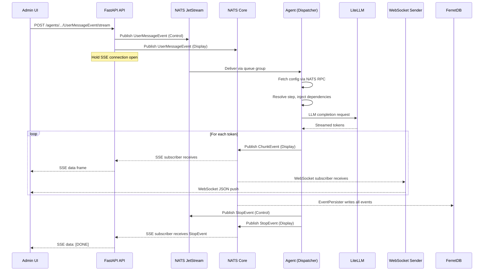
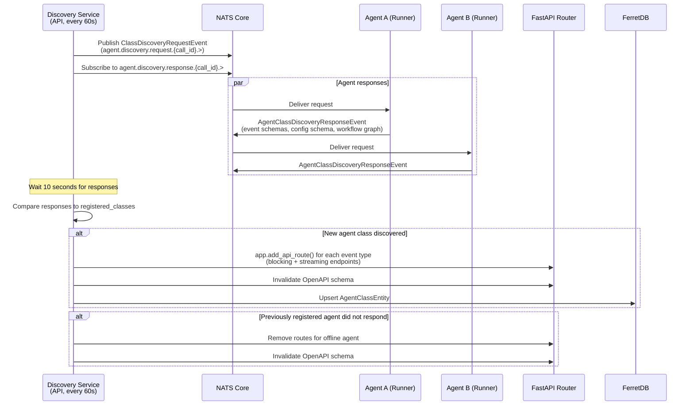

# Runtime view

This chapter describes six runtime scenarios that illustrate how the platform's building blocks interact during
execution. The scenarios were selected because each exercises a different communication pattern and a different subset
of infrastructure components. Together they cover the four primary runtime concerns: synchronous request handling,
asynchronous event-driven workflows, batch data processing, and failure recovery.

## User message to agent response

This scenario traces the full path of a user message from the browser to an agent and back. It is the most common
runtime interaction and exercises the SSE, WebSocket, JetStream, and NATS Core communication channels simultaneously.

### API receives the message

The user sends a message through one of three transport mechanisms. The Admin UI sends an HTTP POST to a dynamically
registered SSE streaming endpoint at `/agents/classes/{AgentClass}/instances/{agent_id}/{EventName}/stream`. OpenWebUI
sends the same payload through its OpenAI-compatible pipeline, which calls `ChatService` internally. The Admin UI also
maintains a persistent WebSocket connection at `/events/ws` for receiving display events.

The streaming endpoint was not defined at compile time. It was registered at runtime by `AgentEndpointsDiscoveryService`
after discovering the agent class on NATS (described in the next scenario). The endpoint closure calls
`AgentService.send_agent_input_event_stream()`, which returns a `StreamingResponse` wrapping an SSE generator.

### Event distribution to NATS

`ExternalAgentEventDistributor.distribute_event()` bridges the HTTP boundary into the event-driven world. For a
`StartEvent` (which `UserMessageEvent` is), the distributor generates a fresh `run_id`, constructs an
`AgentThreadTopicManager` for each agent assigned to the thread, and publishes the event to JetStream on subject like
`agent.{class}.{id}.{thread}.{display}.{run}.control_event.{event_name}.{event_id}`. Because `UserMessageEvent` is both
a `StartEvent` and a `DisplayEvent`, the distributor also publishes it to NATS Core on the display subject so that the
user's own message appears immediately in the event stream.

JetStream publication is durable. If the agent is temporarily offline, the message persists in the stream and will be
delivered when the agent reconnects.

### Agent dispatches the event to a step

The agent's `AgentJSSubscriber` receives the event from JetStream. A queue group (`agent_runner_{agent_class}`) ensures
that only one agent instance processes each event, even when multiple instances are running for horizontal scaling.

`AgentDispatcher.handle_event()` performs several operations before any step executes. It stores the event in
`JetStreamEventStore` for replay. It creates `RunContext` and `ThreadContext` objects backed by Valkey. Because this is
a `StartEvent`, it fetches the agent's configuration via NATS RPC (`AgentConfigClient.fetch_config()` sends a request to
`aihub.rpc.config.agent.{class}.{id}`, and `AgentConfigResponder` in the API replies with the configuration from
MongoDB). The dispatcher deep-merges the fetched user-configured values with the agent's non-configurable defaults and
validates the result into a typed `AgentConfig` Pydantic model stored in `RunContext`.

The dispatcher then calls `agent.get_steps_waiting_for_event(type(event))` to find all `@step`-annotated methods whose
input type annotations include the incoming event type. For each candidate, `is_step_ready()` checks that all required
input events are present in the event store, that the step has not exceeded its `max_executions_per_run` limit, and that
any declared precondition function returns true. Ready steps are launched as `asyncio.create_task()` calls, allowing
independent steps to execute concurrently within the same run.

### Step execution and display event publishing

`execute_step()` instantiates a fresh agent object (agents are stateless; no in-memory state carries between steps) and
injects dependencies through type-annotation-based resolution. Parameters annotated with `RunContext`, `ThreadContext`,
`AgentConfig`, `EventDisplayer`, `AgentMemory`, or `AgentLocaleHandler` are constructed and passed automatically. An
idempotency check (`StepStore.was_called_with_events()`) hashes the input event IDs and skips execution if the same
combination was already processed, preventing duplicate work under JetStream's at-least-once delivery guarantee.

During execution, the step publishes display events through `EventDisplayer`. `display_chunk()` emits `ChunkEvent`
objects containing streaming LLM tokens. `display_thought()` emits `ThoughtEvent` objects exposing agent reasoning. RAG
steps emit `RetrieverEvent` and `RerankerEvent` with retrieval results. All display events are published to NATS Core
(ephemeral, fire-and-forget) on the display subject. Control events returned by the step (the next workflow event) are
published to JetStream (durable), where they trigger the next step in the workflow graph.

### Response streams back to the frontend

Display events reach the frontend through two independent paths that operate simultaneously.

The first path serves the SSE connection that initiated the request. When `AgentService` started the interaction, it
created a per-request `AgentNCSubscriber` scoped to the thread's display subject. Each display event arriving on this
subscriber is placed into an `asyncio.Queue`. The SSE generator drains the queue and yields each event as a
`data: {json}\n\n` frame. When a `StopEvent` or `ExceptionEvent` arrives, the generator emits `data: [DONE]\n\n` and
closes the connection.

The second path serves the WebSocket. The API's `WebSocketSender`, started during the API lifetime, subscribes to all
agent display events (`agent.*.*.*.*.*.display_event.>`). For each event, it looks up the thread's participant user IDs
(cached with a 60-second TTL), wraps the event in a `ContextualizedAgentEvent` (adding agent class, thread ID, run ID,
and localized display names), and sends it as JSON to every active WebSocket connection for each participant.
`WebSocketManager` tracks connections per user ID and prunes stale connections lazily when a `send_json` call fails.

The `EventPersister`, also started during the API lifetime, subscribes to all agent events (`agent.>`) on a separate
NATS Core subscription and writes every event to MongoDB as a `PersistedAgentEventEntity`. This creates the audit trail
that the Admin UI uses to render the complete event timeline for any thread.

## Agent discovery and dynamic endpoint registration

This scenario describes how the API gateway learns about available agents at runtime without any static configuration or
registration endpoint. It runs continuously in the background and determines the platform's API surface.

### Discovery broadcast

`AgentEndpointsDiscoveryService` runs a loop every 60 seconds. Each iteration generates a unique `call_id`, subscribes
to `agent.discovery.response.{call_id}.>` on NATS Core, and publishes a `ClassDiscoveryRequestEvent` to
`agent.discovery.request.{call_id}.>`. It then waits 10 seconds for responses to accumulate before stopping the
subscriber.

### Agent response

Each running agent has a NATS Core subscriber for discovery requests, registered during `AgentRunner.start()`. When the
request arrives, the handler inspects the agent class to collect its start events, stop events, human-in-the-loop
events, workflow graph (built by `WorkflowVisualizer`), and configuration schema (built by `ConfigSpecs` from the
agent's Pydantic form model). It packages this metadata into an `AgentClassDiscoveryResponseEvent` and publishes it back
on the response subject.

The response includes an `is_conversational` flag, set to true when any of the agent's start events is a subclass of
`UserMessageEvent`. This tells the frontend whether to render a chat interface for this agent.

### Dynamic route registration

Back in the API, the discovery service iterates over the collected responses. For each agent class not already in the
`registered_classes` set, it calls `_register_class_endpoints()`, which uses `app.add_api_route()` to create FastAPI
routes for each start event and each human-in-the-loop response event. Each event type gets two routes: a blocking
endpoint that returns the `StopEvent` as JSON, and a streaming endpoint that returns an SSE `text/event-stream`
response. The route paths follow the pattern `/agents/classes/{AgentClass}/instances/{agent_id}/{EventName}[/stream]`.

After registering new routes, the service sets `app.openapi_schema = None` to invalidate the cached OpenAPI
specification. The next request to the OpenAPI endpoint regenerates the schema, which now includes the new agent's
endpoints. The generated TypeScript SDK in the frontend is built from this schema.

For agent classes that were previously registered but did not respond in this discovery cycle,
`_deregister_endpoints_for_class()` removes their routes. Agent class metadata (name, description, icon, event schemas,
configuration schema, workflow graph) is upserted into MongoDB (FerredDB) via `AgentClassEntity.create_or_update()`, and
the `last_discovered` timestamp determines whether the class is considered online.

The same discovery pattern applies to processes, with `ProcessEndpointsDiscoveryService` broadcasting
`ProcessClassDiscoveryRequestEvent` and dynamically registering process-specific routes.
