# C4 Model Diagrams — Swiss AI Hub Ecosystem

**Method**: Simon Brown's C4 Model (4 levels of abstraction). **Scope**: Platform (aihub-core v0.290.4) + 5
customer deployments (aihub-bmd, aihub-ctc, aihub-demoscope, aihub-wpe, aihub-fmh). This file covers Platform + bmd +
ctc; detailed per-customer diagrams live in `c4/` (see [Cross-reference](#cross-reference-per-customer-c4-files) at the
end of the file). **Format**: Mermaid (renders in VitePress, GitHub, IDE preview). **Companion documents**:

- [Architecture Review Overview](01_architecture_review_overview.en.md): Executive summary for stakeholders.
- [Architecture Review Details](02_architecture_review_details.md): Technical deep-dive for the dev team.

______________________________________________________________________

## Table of Contents

- [Level 1 — System Context](#level-1--system-context)
- [Level 2 — Container](#level-2--container) (3 views)
- [Level 3 — Component](#level-3--component) (4 zooms)
- [Dynamic Diagrams](#dynamic-diagrams) (5 sequences)
- [Deployment Diagram](#deployment-diagram)
- [Multi-Customer Topology View](#multi-customer-topology-view)
- [Future-State Target Architecture](#future-state-target-architecture)

______________________________________________________________________

## Level 1 — System Context

**Purpose**: Place Swiss AI Hub in context — who uses it and which systems it integrates with.

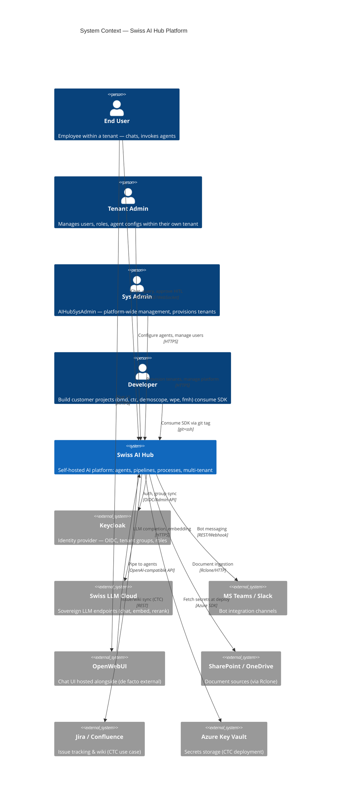

**Observations from the Context**:

| Actor         | Interaction frequency   | Main concern                       |
| ------------- | ----------------------- | ---------------------------------- |
| End User      | High (chat, HITL)       | Latency, accuracy, privacy         |
| Tenant Admin  | Medium                  | Config UI usability, audit log     |
| Sys Admin     | Low                     | Tenant provisioning, observability |
| Developer     | Medium                  | SDK ergonomics, version stability  |
| Keycloak      | Per request (cached 6h) | Availability — outage cascades     |
| LiteLLM Cloud | Per LLM call            | Cost, latency, data residency      |
| OpenWebUI     | Per chat                | RBAC bypass risk (gap G1.5)        |

**Trust boundaries**:

```
┌──────────────────── INTERNAL (trusted) ────────────────────┐
│  end_user, tenant_admin, sys_admin, dev                    │
│  Swiss AI Hub (all containers)                             │
│  Keycloak (same network zone)                              │
└────────────────────────────────────────────────────────────┘
                            ↕ TLS
┌──────────────────── EXTERNAL (untrusted) ───────────────────┐
│  LiteLLM Cloud, Teams/Slack, SharePoint, Jira/Confluence   │
│  Azure Key Vault                                           │
└────────────────────────────────────────────────────────────┘
```

> **Gap visible at this level**:
>
> - OpenWebUI is "outside" the trust boundary but has direct access to agents → G1.5 (RBAC bypass).
> - LiteLLM Cloud processes PII that has not been scrubbed by Presidio (DTC-3) before being sent out.

______________________________________________________________________

## Level 2 — Container

### View 2.1 — Platform Container Diagram

**Purpose**: The "containers" (deployable units) of Swiss AI Hub.

```mermaid
C4Container
    title Container Diagram — Swiss AI Hub Platform (aihub-core)

    Person(user, "User", "End user / Admin")
    System_Ext(keycloak, "Keycloak", "Identity provider")
    System_Ext(litellm_cloud, "Swiss LLM Cloud", "Sovereign LLMs")

    System_Boundary(aihub, "Swiss AI Hub") {
        Container(web, "Admin UI", "Nuxt 3, Vue 3, PrimeVue", "Tenant + agent admin")
        Container(openwebui_proxy, "OpenWebUI", "Open source", "Chat UI (modelproxy → API)")
        Container(api, "API Gateway", "FastAPI, Python 3.13", "REST + WebSocket + SSE")
        Container(agents, "Agent Workers", "Python (DispatchableWorkflow)", "8 agent types; horizontal scale via NATS")
        Container(bot, "Bot Service", "FastAPI", "Teams/Slack integration")
        Container(pipelines, "Pipeline Workers", "Dagster", "Document ingestion (2-stage)")
        Container(backup, "Backup Service", "Dagster (independent)", "Daily backup all stateful")
        Container(litellm_proxy, "LiteLLM Proxy", "Python", "LLM gateway + cost tracking")
        Container(traefik, "Traefik", "Reverse proxy", "TLS termination, routing")

        ContainerDb(postgres, "PostgreSQL", "4 DBs", "openwebui, langfuse, dagster, litellm")
        ContainerDb(ferretdb, "FerretDB", "MongoDB wire over PG", "Entities, configs, threads, events")
        ContainerDb(milvus, "Milvus", "Vector DB", "Embeddings + sparse BM25 (1023 partitions)")
        ContainerDb(neo4j, "Neo4j", "Graph DB", "Knowledge graph (optional)")
        ContainerDb(valkey, "Valkey", "Redis-compat", "StepStore, ThreadContext, RunContext")
        ContainerQueue(nats, "NATS JetStream", "Event broker", "Control + Display events")
        ContainerDb(seaweedfs, "SeaweedFS", "S3-compat", "Documents, artifacts, backups")
        ContainerDb(etcd, "etcd", "KV store", "Metadata for Milvus + SeaweedFS")
    }

    Rel(user, traefik, "HTTPS")
    Rel(traefik, web, "")
    Rel(traefik, openwebui_proxy, "")
    Rel(traefik, api, "")

    Rel(web, api, "REST", "HTTPS/SSE")
    Rel(openwebui_proxy, api, "OpenAI-compat", "HTTPS")

    Rel(api, keycloak, "JWT verify, group sync")
    Rel(api, nats, "Publish events")
    Rel(api, ferretdb, "CRUD entities")
    Rel(api, valkey, "Step state, sessions")
    Rel(api, seaweedfs, "File upload/download")

    Rel(agents, nats, "Subscribe events, publish")
    Rel(agents, valkey, "RunContext, ThreadContext")
    Rel(agents, ferretdb, "Persist events")
    Rel(agents, milvus, "Vector search RAG")
    Rel(agents, neo4j, "Graph queries")
    Rel(agents, litellm_proxy, "LLM calls")

    Rel(bot, nats, "Bot events")
    Rel(bot, agents, "Via NATS")

    Rel(pipelines, seaweedfs, "Documents")
    Rel(pipelines, milvus, "Insert vectors")
    Rel(pipelines, ferretdb, "Document metadata")
    Rel(pipelines, litellm_proxy, "Embedding calls")
    Rel(pipelines, nats, "Triggers, sensors")

    Rel(backup, postgres, "pg_dump")
    Rel(backup, ferretdb, "Mongo dump")
    Rel(backup, milvus, "milvus-backup CLI")
    Rel(backup, neo4j, "neo4j-admin")
    Rel(backup, valkey, "RDB snapshot")
    Rel(backup, nats, "Stream snapshot")
    Rel(backup, seaweedfs, "Store backups")

    Rel(litellm_proxy, litellm_cloud, "LLM API", "HTTPS")

    Rel(milvus, etcd, "Metadata")
    Rel(seaweedfs, etcd, "Filer coordination")
    Rel(ferretdb, postgres, "Storage backend")

    UpdateLayoutConfig($c4ShapeInRow="4", $c4BoundaryInRow="1")
```

**30+ actual containers** in `infra/docker-compose.dev.yml` — the diagram above consolidates auxiliary services (etcd,
postgres-ferretdb) into logical containers.

**Container vs scaling readiness**:

| Container        | Stateless? | Horizontal scale ready? | Bottleneck                           |
| ---------------- | :--------: | :---------------------: | ------------------------------------ |
| Admin UI (Nuxt)  |     ✅     |           ✅            | Asset CDN needed                     |
| OpenWebUI        |     ⚠️     |           ⚠️            | DB-backed sessions                   |
| API Gateway      |     ✅     |           ✅            | Keycloak call per req                |
| Agent Workers    |     ✅     |           ✅            | NATS consumer groups OK              |
| Bot Service      |     ✅     |           ✅            | -                                    |
| Pipeline Workers |     ❌     |           ❌            | `in_process_executor` (DTC-6)        |
| Backup Service   |     ❌     |           N/A           | Singleton design OK                  |
| LiteLLM Proxy    |     ✅     |           ✅            | Single instance currently            |
| PostgreSQL       |     ❌     |           ❌            | Single instance                      |
| FerretDB         |     ❌     |           ❌            | **FerretDB does not shard**          |
| Milvus           |     ❌     |           ❌            | **Single-node, HNSW wall**           |
| Neo4j            |     ❌     |           ⚠️            | Cluster mode feasible                |
| Valkey           |     ❌     |           ❌            | **Single instance**                  |
| NATS JetStream   |     ⚠️     |           ⚠️            | Single node currently                |
| SeaweedFS        |     ❌     |           ⚠️            | **replication="000"** (no replicate) |

### View 2.2 — Customer Project Container Diagram (BMD example)

**Purpose**: How a customer project consumes the SDK.

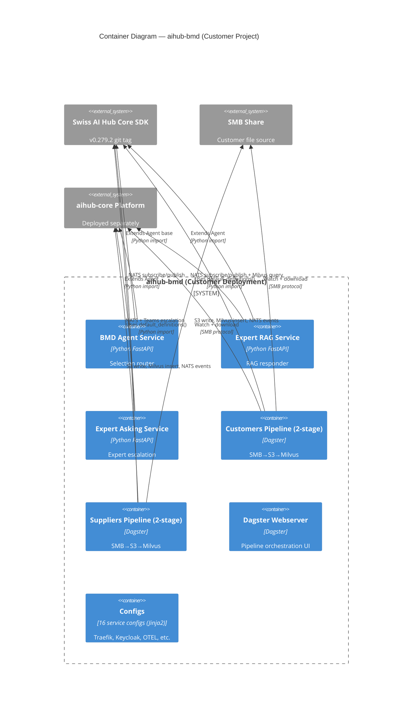

**BMD observations**:

- 5 self-running deployable containers (3 agent services + 2 pipelines).
- All use `aihub-core SDK v0.279.2` via git tag.
- Depends on the aihub-core platform deployment for NATS, Milvus, SeaweedFS, FerretDB.
- 6 docker-compose files: split by concern (agents, pipelines, backfill).
- `configs/` are Jinja2 templates for 16 service configs — duplicate effort with core.

### View 2.3 — Customer Project Container Diagram (CTC example)

**Purpose**: A more complex customer — has a custom API.

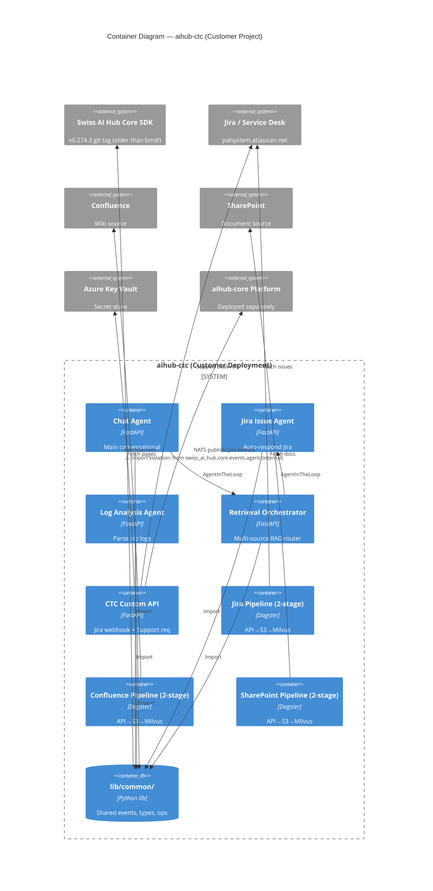

**CTC observations**:

- 9 deployable containers (4 agents + 1 custom API + 3 pipelines + shared lib).
- **Has `lib/common/`** — a pattern bmd does NOT have. Good for code sharing within the same customer, but raises the
  question of why it isn't in core.
- **Import-rule violation** (`lib/common/types/RetrievalAgentInTheLoop.py:1-4`).
- **Custom API** with 2 endpoints (Jira webhook + Support request) — not in bmd, not in core.
- Integrates Azure Key Vault (enterprise-grade); bmd uses .env files.
- SDK version OLDER than bmd (v0.274.3 vs v0.279.2).

______________________________________________________________________

## Level 3 — Component

### View 3.1 — `packages/core` Components

**Purpose**: Zoom into the shared infrastructure package.

```mermaid
C4Component
    title Component Diagram — packages/core (shared infrastructure)

    Container_Ext(api, "API Gateway")
    Container_Ext(agents, "Agent Workers")
    Container_Ext(pipelines, "Pipeline Workers")
    Container_Ext(keycloak, "Keycloak")
    ContainerDb_Ext(nats, "NATS")
    ContainerDb_Ext(mongo, "FerretDB")
    ContainerDb_Ext(redis, "Valkey")

    Container_Boundary(core, "packages/core") {
        Component(auth_handlers, "Auth Handlers", "5 implementations", "Keycloak/Token/Bearer/OAuth2/OpenWebUI")
        Component(access_checker, "AccessChecker", "RBAC + ABAC", "Hierarchical permission template, tenant ceiling")
        Component(usage_limits, "UsageLimits", "❌ NOT WIRED", "Defined but not enforced — DTC-1")
        
        Component(base_event, "BaseEvent", "Auto-registry", "Polymorphic deserialization via _event_registry")
        Component(publishers, "JSPublisher", "NATS publish", "UUID + Nats-Msg-Id, 60s dedup")
        Component(subscribers, "AbstractSubscriber", "NATS subscribe", "Ack-on-receive, no DLQ")
        Component(topics, "TopicManager", "Subject hierarchy", "Topic._topic_registry")
        Component(streams, "StreamManager", "JetStream config", "duplicate_window=60s, retention")
        
        Component(workflow, "DispatchableWorkflow", "Base class", "Used by Agent + Process (process dead)")
        Component(dispatcher, "BaseDispatcher", "Event-driven step exec", "Step replay from JetStream")
        Component(step_store, "StepStore", "Redis-backed", "MD5(events) idempotency key")
        
        Component(persistence, "Persistence", "MongoEngine", "Entity classes — version field unused (I5)")
        Component(rag_vectors, "RAG Vectors", "Milvus client wrapper", "PartitionAwareMilvusVectorStore — no upsert (DTC-4)")
        Component(rag_documents, "RAG Documents", "Document mgmt", "Hash-based ID")
        
        Component(forms, "Form System", "Pydantic + FormKit", "28 elements × 2 modes — high surface")
        Component(controller, "Controller", "FastAPI base", "Fluent builder, TenantScopedController")
        Component(routes, "Routes", "REST endpoints", "Inherits Controller")
        
        Component(otel, "OpenTelemetry", "Tracing", "SmartTracer, @trace_fn, NATSMessageHeaders")
        Component(langfuse_int, "Langfuse Integration", "LLM tracing", "Prompt/response, cost tracking")
        Component(health, "HealthController", "Liveness check", "⚠️ Does not distinguish readiness")
        
        Component(settings, "Pydantic Settings", "20+ classes", "MongoSettings, NatsSettings, etc.")
        Component(i18n, "LocaleHandler", "i18n", "DE/EN/FR/IT translations")
    }

    Rel(api, controller, "Inherits")
    Rel(api, auth_handlers, "DI")
    Rel(api, access_checker, "Permission check")

    Rel(agents, workflow, "Extends")
    Rel(agents, dispatcher, "Uses")
    Rel(agents, step_store, "Idempotency")
    Rel(agents, publishers, "Emit events")
    Rel(agents, subscribers, "Listen events")
    Rel(agents, rag_vectors, "Vector search")

    Rel(pipelines, rag_vectors, "Insert (no upsert)")
    Rel(pipelines, rag_documents, "Mgmt")

    Rel(publishers, nats, "JetStream API")
    Rel(subscribers, nats, "Pull/push")
    Rel(persistence, mongo, "ODM")
    Rel(step_store, redis, "Atomic ops")
    Rel(rag_vectors, mongo, "Metadata")

    Rel(auth_handlers, keycloak, "JWT verify, JWKS")

    UpdateLayoutConfig($c4ShapeInRow="4", $c4BoundaryInRow="1")
```

**Critical components highlighted**:

- 🔴 `UsageLimits` — defined but NOT wired (DTC-1)
- 🔴 `PartitionAwareMilvusVectorStore` — no upsert (DTC-4)
- 🔴 `AbstractSubscriber` — ack-on-receive, no DLQ (I3)
- ⚠️ `Persistence` — `version` field exists but is unused (I5)
- ⚠️ `HealthController` — does not distinguish liveness/readiness
- ⚠️ `Form System` — 28 elements × 2 modes = 56 surfaces (maintenance cost)

### View 3.2 — `packages/agent` Components

**Purpose**: Agent framework internals.

```mermaid
C4Component
    title Component Diagram — packages/agent (Agent Framework)

    Container_Ext(api, "API Gateway")
    ContainerDb_Ext(nats, "NATS")
    ContainerDb_Ext(redis, "Valkey")
    Container_Ext(litellm, "LiteLLM Proxy")

    Container_Boundary(agent_pkg, "packages/agent") {
        Component(agent_base, "Agent", "Extends DispatchableWorkflow", "Introspection: get_start/stop/hitl events")
        
        Component(step_decorator, "@step decorator", "Workflow building block", "params: name, precondition, max_executions, stop_on_error")
        Component(precondition, "@precondition", "Async callable→bool", "Gates step execution")
        
        Component(agent_dispatcher, "AgentDispatcher", "Step executor", "Replay events, MD5 idempotency check")
        Component(event_store, "JetStreamEventStore", "Durable event log", "Subscribe per execution_context")
        
        Component(run_context, "RunContext", "Redis-backed", "Per-run ephemeral, 30d TTL")
        Component(thread_context, "ThreadContext", "Redis-backed", "Per-thread persistent, no TTL")
        
        Component(displayer, "EventDisplayer", "DI", "Emit DisplayEvents for streaming UI")
        Component(memory, "AgentMemory", "mem0 integration", "User + org memory")
        Component(tracer, "AgentRunTracer", "OTEL + Langfuse", "Span per agent run")
        
        Component(mcp_client, "MCP Client Factory", "fastmcp>=3.0", "Discover + call MCP tools")
        Component(agent_itl, "AgentInTheLoop", "Sub-workflow", "AgentInTheLoopRequestEvent → wait StopEvent")
        Component(hitl, "HITL", "Human-In-The-Loop", "HumanInTheLoopRequestEvent")

        Container_Boundary(pre_built, "app/ - Pre-built Agents") {
            Component(rag_agent, "RAGAgent", "Multi-source retrieval + memory")
            Component(llm_wrap, "LLMWrappingAgent", "Simple 2-step LLM chat")
            Component(expert_ask, "ExpertAskingAgent", "HITL escalation Teams/Slack")
            Component(expert_rag, "ExpertRAGAgent", "RAG + HITL consent")
            Component(few_shot, "FewShotAgent", "Pattern matching + examples")
            Component(ns_select, "NamespaceSelectionAgent", "HITL namespace approval")
            Component(retrieval, "RetrievalAgent", "Pure retrieval (no LLM)")
            Component(mcp_react, "MCP_ReactAgent", "ReAct loop + MCP tools")
            Component(duy_wip, "DuyAgent (WIP)", "Under development")
        }
    }

    Rel(rag_agent, agent_base, "Extends")
    Rel(llm_wrap, agent_base, "Extends")
    Rel(expert_ask, agent_base, "Extends")
    Rel(expert_rag, agent_base, "Extends + uses AgentInTheLoop")
    Rel(few_shot, agent_base, "Extends")
    Rel(ns_select, agent_base, "Extends + HITL")
    Rel(retrieval, agent_base, "Extends")
    Rel(mcp_react, agent_base, "Extends + MCP")

    Rel(agent_base, step_decorator, "Decorate methods")
    Rel(step_decorator, precondition, "Optional gate")

    Rel(agent_dispatcher, event_store, "Replay")
    Rel(agent_dispatcher, run_context, "State")
    Rel(agent_dispatcher, thread_context, "State")

    Rel(rag_agent, displayer, "Stream")
    Rel(rag_agent, memory, "Recall")
    Rel(rag_agent, tracer, "Trace")

    Rel(mcp_react, mcp_client, "Tool calls")

    Rel(event_store, nats, "JetStream")
    Rel(run_context, redis, "Get/Set")
    Rel(thread_context, redis, "Get/Set")

    Rel(api, agent_base, "Trigger via NATS event")
    Rel(rag_agent, litellm, "LLM call")

    UpdateLayoutConfig($c4ShapeInRow="3", $c4BoundaryInRow="1")
```

**Framework gaps highlighted** (see 02_architecture_review_details.md §12):

- ❌ No `@step(timeout=...)` parameter
- ❌ No native `@step(retry={"attempts": 3, "backoff": "exp"})`
- ❌ No cron trigger event class
- ❌ No per-tenant MCP tool authorization layer

### View 3.3 — `packages/pipeline` Components

**Purpose**: Dagster-based ingestion pipeline internals.

```mermaid
C4Component
    title Component Diagram — packages/pipeline (Dagster Pipelines)

    Container_Ext(rclone, "Rclone")
    Container_Ext(mineru, "MinerU API")
    Container_Ext(litellm, "LiteLLM (embedding)")
    ContainerDb_Ext(seaweedfs, "SeaweedFS S3")
    ContainerDb_Ext(milvus, "Milvus")
    ContainerDb_Ext(nats, "NATS")
    ContainerDb_Ext(mongo, "FerretDB")

    Container_Boundary(pipeline_pkg, "packages/pipeline") {
        Component(definitions_util, "definitions_util.py", "Factory", "default_definitions(), default_local_filesystem_to_datalake_definitions()")
        
        Container_Boundary(stage1, "Stage 1 — Source → Data Lake") {
            Component(obs_factory, "ObservableSourceFactory", "Asset factory", "Dynamic partitions by file URI")
            Component(rclone_resource, "RcloneResource", "Dagster resource", "Manage rclone client")
            Component(file_sensor, "FileSensor", "Polling 60s default", "Detect new files")
            Component(replace_partitions, "replace_partition_keys()", "Partition mgmt", "Max 1000 per tick — explosion risk DTC-10")
        }
        
        Container_Boundary(stage2, "Stage 2 — Data Lake → Vector Store") {
            Component(parse_op, "parse_document_op", "MinerU integration", "VLM parsing (no per-doc timeout)")
            Component(chunk_op, "chunk_md_structural", "MarkdownStructuralNodeParser", "Heading-based, no semantic/sliding")
            Component(embed_op, "embed_nodes", "LlamaIndex batch", "RetryPolicy(6, exp backoff). No explicit batch size — recursive bisection fallback")
            Component(milvus_write, "MilvusWriteOp", "Insert vectors", "❌ No upsert-by-doc-id (DTC-4)")
            Component(nats_sensor, "nats_document_uploaded_sensor", "Cross-pipeline trigger", "Triggers when file in S3")
        }
        
        Component(executor_factory, "executors/factory.py", "❌ in_process_executor", "Single-thread ops (DTC-6)")
        Component(io_managers, "IOManagers", "Asset persistence", "S3, Milvus")
        Component(automation_cond, "AutomationCondition.eager()", "Auto-materialize", "Triggered by upstream")
    }

    Rel(obs_factory, rclone_resource, "Use")
    Rel(rclone_resource, rclone, "RC API")
    Rel(file_sensor, replace_partitions, "Add new partition keys")
    Rel(obs_factory, seaweedfs, "Write parsed files")

    Rel(nats_sensor, nats, "Subscribe doc-uploaded")
    Rel(parse_op, mineru, "VLM call")
    Rel(parse_op, seaweedfs, "Read")
    Rel(chunk_op, parse_op, "Pipe")
    Rel(embed_op, chunk_op, "Pipe")
    Rel(embed_op, litellm, "Embedding call")
    Rel(milvus_write, milvus, "Insert (no upsert)")
    Rel(milvus_write, mongo, "Metadata")

    Rel(definitions_util, obs_factory, "Compose")
    Rel(definitions_util, executor_factory, "Use")
    Rel(definitions_util, automation_cond, "Use")

    UpdateLayoutConfig($c4ShapeInRow="3", $c4BoundaryInRow="1")
```

**Critical issues highlighted**:

- 🔴 `executor_factory` uses `in_process_executor` → all ops single-thread (DTC-6)
- 🔴 `MilvusWriteOp` no upsert-by-id → vector duplication (DTC-4)
- 🟠 `replace_partition_keys()` max 1000/tick → 1M files = DAG explosion (DTC-10)
- 🟠 `parse_op` has no per-document timeout — pipeline stuck on a slow doc
- 🟠 `embed_op` has no explicit batch size — recursive bisection suboptimal

### View 3.4 — Customer Extension Points (Mapping)

**Purpose**: When a customer (bmd/ctc) extends core, which points do they extend.

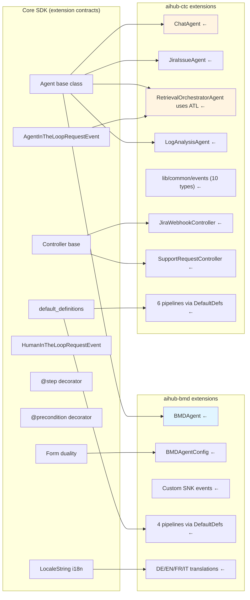

**Extension-pattern observations**:

| Extension type               | BMD usage      | CTC usage             |            Reusable?            |
| ---------------------------- | -------------- | --------------------- | :-----------------------------: |
| `Agent` base class           | 3 services     | 4 agents              |         ✅ Core pattern         |
| `AgentConfig (Form)`         | BMDAgentConfig | Multiple configs      |         ✅ Core pattern         |
| `Controller` base            | ❌ Not used    | 2 custom controllers  |           ⚠️ CTC-only           |
| `AgentInTheLoopRequestEvent` | ❌ Not used    | RetrievalOrchestrator | ✅ Core pattern (underutilized) |
| `HumanInTheLoopRequestEvent` | BMDAgent       | NamespaceSelection    |               ✅                |
| `default_definitions()`      | 4 pipelines    | 6 pipelines           |         ✅ Core pattern         |
| Custom events                | SNK events     | 10 event types        |        ⚠️ Repeated pattern       |
| i18n LocaleString            | DE/EN/FR/IT    | (scope unclear)       |               ✅                |

**Key insight**: CTC's `RetrievalOrchestratorAgent` uses core's `AgentInTheLoop` pattern correctly. The multi-agent
orchestration pattern SHOULD be clearly documented in arc42 + an example extracted into `packages/agent/app/`.

______________________________________________________________________

## Dynamic Diagrams

### Dynamic 4.1 — Agent Workflow Execution (Happy Path)

**Scenario**: User sends a message via OpenWebUI → RAGAgent processes it.

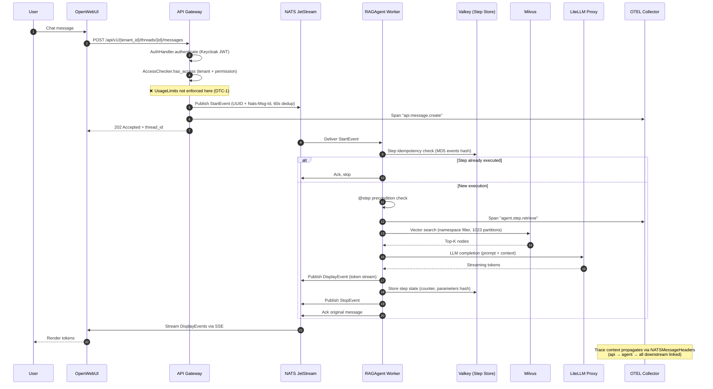

**Tracing**: ✅ End-to-end visible. **Idempotency**: ✅ Step execution dedup. **Gaps marked**: ❌ UsageLimits not checked.

### Dynamic 4.2 — Document Ingestion Pipeline (2-Stage)

**Scenario**: A new file in SharePoint → indexed into Milvus.

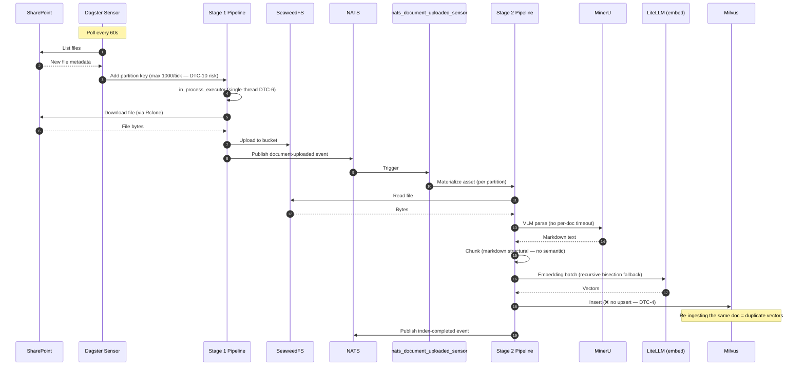

**Issues highlighted**:

- 🔴 DTC-6: `in_process_executor` → throughput limited
- 🔴 DTC-4: Milvus insert (no upsert) → vector duplication
- 🟠 DTC-10: Dynamic partitions per file → DAG explosion at scale
- 🟠 No per-doc timeout on MinerU
- 🟠 No explicit batch size on embedding

### Dynamic 4.3 — HITL (Human-In-The-Loop) Flow

**Scenario**: Agent hits an uncertain situation → escalates to an expert.

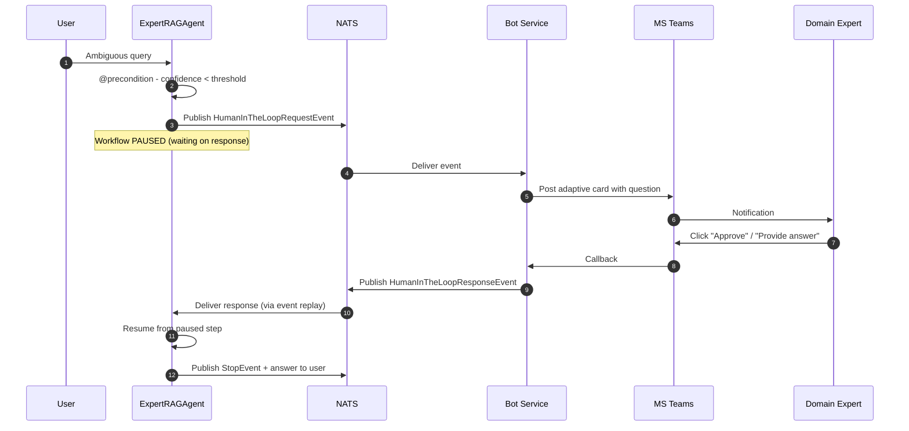

**Strength**: HITL is first-class in the framework. ✅

### Dynamic 4.4 — Multi-Agent Collaboration (AgentInTheLoop)

**Scenario**: CTC's RetrievalOrchestratorAgent routes query to multiple retrievers.

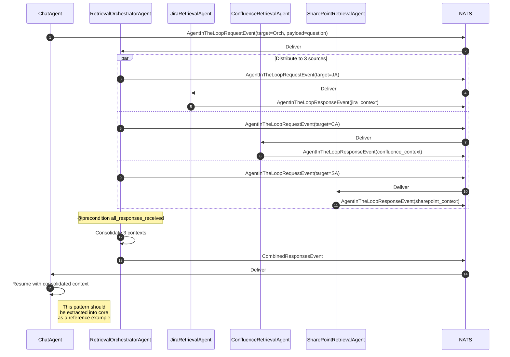

**Insight**: CTC built this pattern custom, but uses the correct core primitives (`AgentInTheLoopRequestEvent`). Core
should document it clearly and provide an example.

### Dynamic 4.5 — Failure Scenario (Poison Message Without DLQ)

**Scenario**: An event causes the handler to crash repeatedly.

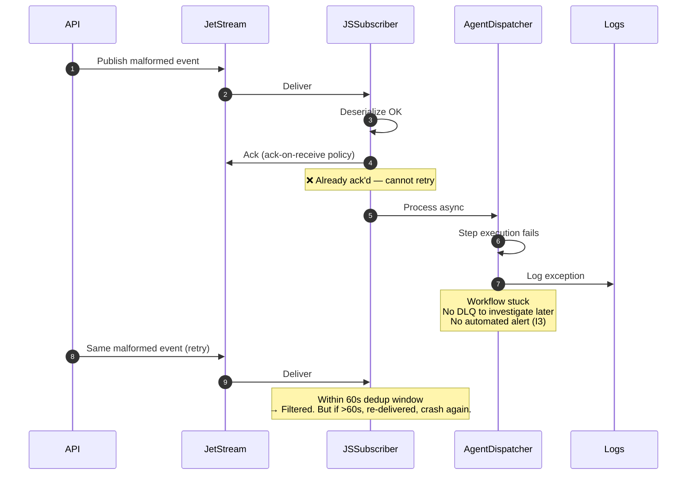

**Gap I3**: JSSubscriber ack-on-receive policy means poison messages silently fail. Need DLQ implementation.

______________________________________________________________________

## Deployment Diagram

### View 5.1 — Current Single-Host Deployment

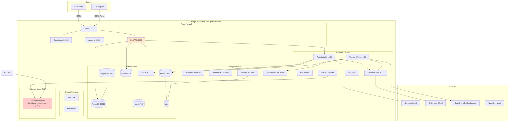

**Critical issues highlighted in deployment**:

- 🔴 **Single host** = single point of failure (G6.1)
- 🔴 **Volumes not encrypted** at rest (G3.3)
- 🔴 **All stateful services single-instance** — no HA
- 🟠 **NATS single node** — no cluster
- 🟠 **No K8s** — no Helm chart (G5.5)
- 🟠 **No resource limits** in docker-compose

### View 5.2 — Network Zones (Defense in Depth)

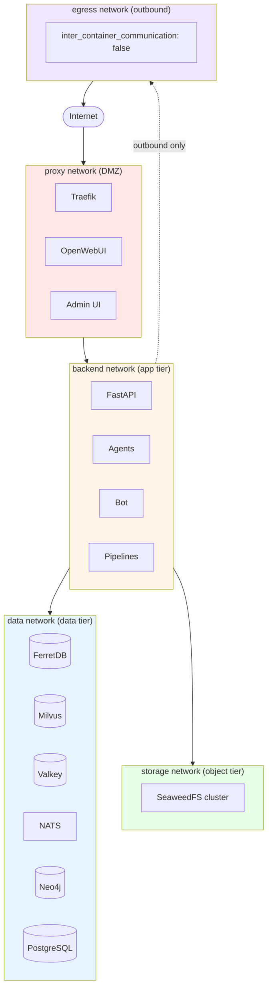

**5 Docker networks** (ADR `2026_01_22_docker_network_isolation`):

| Network   | Purpose                                 | Note                                   |
| --------- | --------------------------------------- | -------------------------------------- |
| `proxy`   | DMZ — TLS termination, external ingress | Traefik mounted here                   |
| `backend` | App tier — stateless services           | Agents, API, Bot, Pipelines            |
| `data`    | Data tier — DBs, cache, broker          | Restricted access                      |
| `storage` | Object storage cluster                  | SeaweedFS only                         |
| `egress`  | Outbound to internet                    | `inter_container_communication: false` |

**Strength**: ✅ Network isolation good (defense in depth). **Gap**: ⚠️ Service-to-service auth inside the network has no
mTLS (DTC-9).

______________________________________________________________________

## Multi-Customer Topology View

### View 6.1 — Current — Per-Customer Stack

```mermaid
flowchart TB
    subgraph customer_bmd["aihub-bmd (v0.279.2, drift 11)"]
        BMD_All[Stack 30+ containers<br/>Azure OpenAI Sweden + Cohere<br/>SMB data source<br/>1 host, 1 set DBs]
    end

    subgraph customer_ctc["aihub-ctc (v0.274.3, drift 16)"]
        CTC_All[Stack 30+ containers<br/>Azure Foundry SUI+SWE<br/>Jira/Confluence/SharePoint<br/>+ Custom API + lib/common]
    end

    subgraph customer_demoscope["aihub-demoscope (v0.246.4*, drift 44)"]
        DS_All[Stack 30+ containers<br/>Azure OpenAI SUI + local vLLM<br/>MongoDB + Phoenix divergence<br/>MinIO backup same VM]
    end

    subgraph customer_wpe["aihub-wpe (v0.255.6, drift 35)"]
        WPE_All[Deploy-only ~30 containers<br/>Azure OpenAI (region not in repo)<br/>Azure AD/Entra<br/>TLS key in git — see adr_041]
    end

    subgraph customer_fmh["aihub-fmh (v0.186.0, drift 104)"]
        FMH_All[Stack 30+ containers + bot<br/>Azure OpenAI SUI + Azure AI Search<br/>Pulumi committed (10 deploy units)<br/>LlamaIndex monkey-patch]
    end

    subgraph customer_n["Customer N (future)"]
        N_All[Entire stack repeated<br/>aihub-core v?.?.?<br/>1 host, 1 set DBs]
    end

    subgraph shared["Shared / External"]
        SLC[Swiss LLM Cloud]
        AzOAI[Azure OpenAI<br/>multiple regions]
        KCSaaS[Keycloak SaaS<br/>shared realms]
        Repo[(GitHub aihub-core<br/>git tag references)]
    end

    customer_bmd -->|LLM API| AzOAI
    customer_ctc -->|LLM API| AzOAI
    customer_demoscope -->|partial LLM| AzOAI
    customer_wpe -->|LLM API| AzOAI
    customer_fmh -->|LLM API| AzOAI
    customer_n -->|LLM API| SLC

    customer_bmd -.->|OIDC| KCSaaS
    customer_ctc -.->|OIDC + Azure AD B2C| KCSaaS
    customer_demoscope -.->|OAuth Azure| KCSaaS
    customer_wpe -.->|Azure AD| KCSaaS
    customer_fmh -.->|Azure AD| KCSaaS

    customer_bmd -.->|git clone tag| Repo
    customer_ctc -.->|git clone tag| Repo
    customer_demoscope -.->|git clone tag*| Repo
    customer_wpe -.->|CORE_VERSION env| Repo
    customer_fmh -.->|git clone tag| Repo

    style customer_bmd fill:#e1f5ff
    style customer_ctc fill:#fff4e1
    style customer_demoscope fill:#e1ffe1
    style customer_wpe fill:#ffe1e1
    style customer_fmh fill:#f5e1ff
    style customer_n stroke-dasharray: 5 5,fill:#f5f5f5
```

> *Demoscope SDK pin cannot be verified from `pyproject.toml` (see footnote in the Overview Component-versions table).

**Problems**:

- 🔴 Operating cost grows linearly with the number of customers.
- 🔴 Uncontrolled version drift.
- 🔴 Each customer = 30+ self-managed containers — operational burden.
- 🔴 No shared resources (Milvus, Mongo, NATS) → wasted capacity.

### View 6.2 — Target — Shared Multi-Tenant SaaS (H3 vision)

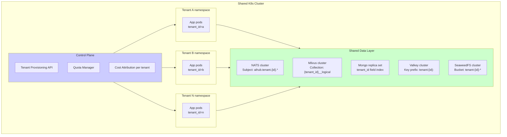

**To reach the target**:

| Component           | Current state                       | Target state                   | Gap          |
| ------------------- | ----------------------------------- | ------------------------------ | ------------ |
| NATS subjects       | Flat hierarchy                      | `aihub.tenant.{id}.*`          | G1.1 part 1  |
| Mongo entities      | No tenant_id                        | Required tenant_id + index     | G1.1 part 2  |
| Milvus collections  | Single collection, NAMESPACE filter | Per-tenant collection          | G1.1 part 3  |
| Valkey keys         | Mixed                               | Prefix per tenant              | G1.1 part 4  |
| Resource quotas     | None                                | Per-tenant CPU/mem/storage/LLM | New ADR      |
| Tenant provisioning | Manual Keycloak + Mongo             | API + automation               | G1.3         |
| Cost attribution    | LiteLLM tracks per-call             | Per-tenant aggregate + cap     | DTC-1 part 2 |

______________________________________________________________________

## Future-State Target Architecture

### View 7.1 — Architecture after H1 + H2 (6 months)

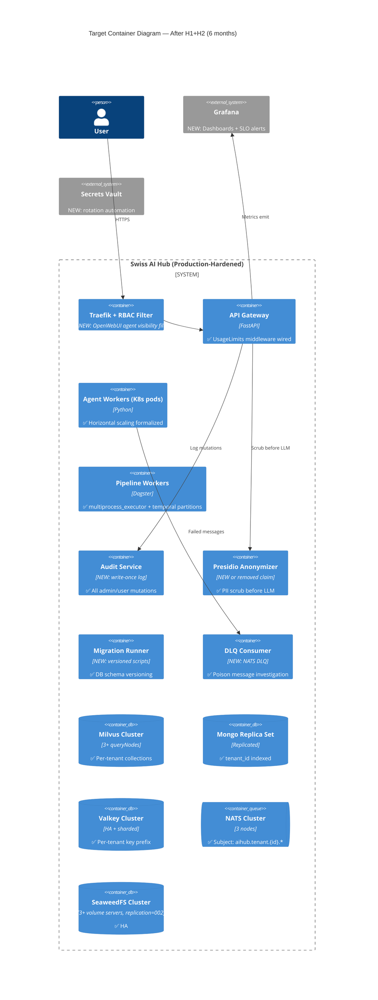

**Additions after H1+H2**:

- ✅ Audit Service (DTC-2)
- ✅ Presidio integration (DTC-3) OR remove the claim
- ✅ Migration Runner (G4.1)
- ✅ DLQ Consumer (I3)
- ✅ Milvus cluster mode (DTC-7)
- ✅ NATS cluster with tenant subjects (G1.1)
- ✅ Mongo replica set with tenant_id index (G1.1)
- ✅ Valkey cluster (sharding + HA)
- ✅ SeaweedFS HA (replication=002)
- ✅ Grafana + AlertManager
- ✅ Secrets Vault with rotation

> **As-built note (Gen 3 / `aihub-k8s`)**: this view is the *target*. The shipped `aihub-k8s` charts diverge in two
> ways verified from the repo: (1) **NATS, Redis and Neo4j are deployed per-tenant** (each `tenant-<name>` namespace runs
> its own), not as a shared cluster with `aihub.tenant.{id}.*` subjects; (2) tenant isolation is **logical, not
> hardened** — no NetworkPolicy, no ResourceQuota, and a **shared Milvus credential across tenants**. See
> [`c4/deployment_generations.md`](c4/deployment_generations.md) for the real split and
> [`05_proposed_adrs/adr_047_gen3_tenant_isolation_hardening.md`](05_proposed_adrs/adr_047_gen3_tenant_isolation_hardening.md)
> for the hardening plan.

### View 7.2 — Quick Reference: Containers That Differ

| Container          | Today             | After H1 (3m)                  | After H2 (6m)             | After H3 (12m)            |
| ------------------ | ----------------- | ------------------------------ | ------------------------- | ------------------------- |
| Milvus             | Standalone        | Standalone (DISKANN benchmark) | Cluster mode              | Cluster + cross-region    |
| NATS               | Single node       | Single node + DLQ              | Cluster (3 nodes)         | Cluster + cross-region    |
| Mongo              | Single (FerretDB) | Single + tenant_id index       | Replica set               | Sharded by tenant_id      |
| Valkey             | Single            | Single                         | Cluster (HA)              | Cluster (HA + sharding)   |
| SeaweedFS          | replication=000   | replication=000                | Cluster + replication=002 | Cross-region async        |
| Pipelines executor | in_process        | multiprocess                   | multiprocess + Celery     | K8s Jobs                  |
| Audit Service      | ❌                | ✅ New                         | ✅ + Compliance           | ✅ + Real-time alerts     |
| Migration Runner   | ❌                | ✅ New                         | ✅ Mature                 | ✅ Auto-migrate on deploy |
| DLQ Consumer       | ❌                | ✅ New                         | ✅ + UI                   | ✅ + Auto-retry           |
| Presidio           | ❌ Claim only     | ✅ Integrated OR removed       | ✅                        | ✅ Multi-language         |

______________________________________________________________________

## Phase 3 Summary

### Deliverables produced

| #   | Diagram                        | Purpose                             |
| --- | ------------------------------ | ----------------------------------- |
| 1   | System Context                 | Actors + external systems           |
| 2.1 | Platform Container             | All Swiss AI Hub containers         |
| 2.2 | aihub-bmd Container            | Customer A consumes SDK             |
| 2.3 | aihub-ctc Container            | Customer B consumes SDK + custom API |
| 3.1 | `packages/core` Components     | Shared infrastructure internals     |
| 3.2 | `packages/agent` Components    | Agent framework internals           |
| 3.3 | `packages/pipeline` Components | Pipeline internals                  |
| 3.4 | Extension Points Mapping       | How a customer extends core         |
| 4.1 | Dynamic: Agent Workflow        | Happy path end-to-end               |
| 4.2 | Dynamic: Document Ingestion    | 2-stage pipeline with gaps marked   |
| 4.3 | Dynamic: HITL Flow             | Human-in-the-loop                   |
| 4.4 | Dynamic: Multi-Agent Collab    | CTC's orchestrator pattern          |
| 4.5 | Dynamic: Failure (Poison Msg)  | Gap analysis I3                     |
| 5.1 | Deployment: Current            | Single-host topology                |
| 5.2 | Deployment: Network Zones      | 5 Docker networks                   |
| 6.1 | Multi-Customer: Current        | Per-customer stack                  |
| 6.2 | Multi-Customer: Target         | Shared SaaS vision                  |
| 7.1 | Future: After H1+H2            | Target architecture 6 months        |
| 7.2 | Future: Container delta        | Container progression table         |

### Link to the assessment

Each diagram references gaps identified in
[02_architecture_review_details.md](02_architecture_review_details.md):

- Container 2.1 highlights the stateful single instances (G6.x)
- Component 3.1 marks DTC-1, DTC-4, I3, I5
- Dynamic 4.2 marks DTC-6, DTC-4, DTC-10
- Dynamic 4.5 illustrates I3 (no DLQ)
- Deployment 5.1 marks G3.3, G6.1, G5.5

### Rendering diagrams

All diagrams use Mermaid syntax. They render in:

- VitePress (already set up in `docs/.vitepress/config.mts`)
- GitHub markdown preview
- VS Code Markdown Preview Mermaid Support extension
- mermaid.live (online editor)

### Next

- **Phase 4**: arc42 multi-customer view (12 chapters)
- **Phase 5**: 15 Proposed ADRs for critical gaps
- **Phase 6**: Executive Summary + Index page

______________________________________________________________________

**Version**: 1.1 — 2026-05-28 (refresh: v0.290.4 + 47 ADRs + 5 customer coverage in the Multi-Customer Topology
View) **Links**:

- [02_architecture_review_details.md](02_architecture_review_details.md) — Detailed architecture review
- [05_proposed_adrs/](05_proposed_adrs/) — Proposed ADRs (40 total)
- [c4/](c4/) — Per-customer C4 diagrams (Platform / B*D / C*C / Dem*scope / W*P / F*H)

______________________________________________________________________

## Cross-reference: Per-customer C4 files

This file (`03_c4_diagrams.md`) is the cross-customer aggregate view. Per-customer detail lives in the
[`c4/`](c4/) folder:

| File                            | Scope                                  |
| ------------------------------- | -------------------------------------- |
| [`c4/platform.md`](c4/platform.md) | aihub-core L1 + L2 (extracted from §1, §2.1) |
| [`c4/bmd.md`](c4/bmd.md)           | aihub-bmd L1 + L2 (SMB, Azure Sweden + Cohere) |
| [`c4/ctc.md`](c4/ctc.md)           | aihub-ctc L1 + L2 (Jira/Confluence/SharePoint, Azure Foundry, custom API) |
| [`c4/demoscope.md`](c4/demoscope.md) | aihub-demoscope L1 + L2 (Azure SUI + local vLLM, MongoDB, MinIO) |
| [`c4/wpe.md`](c4/wpe.md)           | aihub-wpe L1 + L2 (deploy-only, Azure OpenAI, TLS-key-in-git annotation) |
| [`c4/fmh.md`](c4/fmh.md)           | aihub-fmh L1 + L2 (Azure SUI + Azure AI Search, Pulumi committed, bot, evaluation framework) |

Deployment diagram + Multi-Customer Topology View remain in this file as the cross-customer reference. Each
per-customer file links back here for the cross-customer view.
