<!-- _class: lead -->

# Swiss AI Hub

## Team Handover & Path to Enterprise Scale

**From**: Outgoing maintainer team **To**: Our team (full ownership: core + 5 customers) **Duration**: 90 minutes
**Date**: 2026-05-28

<!--
RENDERING NOTE:
This deck uses Mermaid diagrams in fenced code blocks. To render:
- VitePress (this project): renders natively in `pnpm run docs:dev`
- VS Code Marp extension: install + enable Mermaid integration in settings
- Marp CLI: `marp --html 04_po_presentation_deck.md -o deck.html` (HTML preserves Mermaid)
- For PDF/PPTX export: render to HTML first via VitePress, print to PDF, OR use the Marp extension's preview-as-PDF feature with mermaid plugin enabled.
-->

<!--
Opening. Set tone: this is a constructive working session. We've taken time to study the platform thoroughly so we can step in confidently and keep momentum.
Frame: "we want to grow this platform into an enterprise product with many more customers. To do that well, we need to align on three things — what we're inheriting, what we plan to do, and the support we need."
-->

______________________________________________________________________

# Agenda · 90 minutes

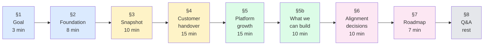

> **Reading the colors**: blue = context · yellow = current state · green = our plan · pink = decisions + commitments
>
> Interrupt freely. §6 is where we ask for decisions; §7 is what we commit to deliver based on those decisions.

<!--
Setting expectations. The deck is structured so that by the end of §5 they have full context, §6 is where we ask for decisions, §7 is what we commit to deliver.
-->

______________________________________________________________________

<!-- _class: lead -->

# §1 · Goal of this session

______________________________________________________________________

# What we want from this session

**Our position**: we've completed a thorough review of `aihub-core` + all 5 customer projects. The platform is a solid
product. Our team is ready to take ownership.

**Three asks from leadership today**:

1. **Confirm shared understanding** of the current state — strengths, customer status, areas to improve.

2. **Align on 5 strategic decisions** (sovereignty path, Process package, K8s timeline, customer priority, marketing
   wording) — these unlock the roadmap.

3. **Commit on resourcing + cadence** so we can deliver the Q3-Q4 plan and onboard the next customer faster than today.

**What we are NOT doing today**:

- Debating technical implementation details (that's in detailed ADRs).
- Renegotiating customer scope (that stays with each customer's contract).

<!--
Three asks → three deliverables. Keep this slide visible mentally throughout the session.
This is positive framing: we're not asking permission to fix things; we're asking for alignment so we can move fast.
-->

______________________________________________________________________

<!-- _class: lead -->

# §2 · The strong foundation we're inheriting

8 minutes · platform strengths + working production

______________________________________________________________________

# Platform maturity — what's already done well

**Architecture & engineering**:

- <span class="ok">Event-driven backbone</span> — NATS JetStream + Swiss AI Agent Protocol (Control + Display events,
  hierarchical scoping)
- <span class="ok">LLM gateway abstraction</span> — LiteLLM means swapping providers is a config change, not code
- <span class="ok">Observability</span> — OpenTelemetry across all services + Langfuse for LLM cost/trace
- <span class="ok">Identity</span> — 5 auth handlers (Keycloak/Token/Bearer/OAuth2/OpenWebUI), JWKS 6h cache,
  hierarchical permission template with AccessChecker
- <span class="ok">Capability breadth</span> — 9/10 enterprise AI patterns supported out of the box (conversational,
  single+multi-source RAG, doc parsing, MCP tool calling, HITL, multi-agent, voice STT/TTS, code sandbox, browser
  automation)

**Process & docs**:

- <span class="ok">47 ADRs</span> in `docs/arc42/decisions/` — most architecture decisions are already documented
- <span class="ok">arc42 chapters + C4 model</span> for the platform (L1 + 3×L2 + 4×L3 + 5 sequence diagrams +
  deployment view)
- <span class="ok">CI/CD</span> — semantic-pr, branchlint, lint-pr, per-package build, auto-tag

<!--
Lead with strengths. We're inheriting a mature platform — that's the good news. This isn't a salvage job; it's a hardening + scale job.
The 9/10 use cases line is important: marketing/sales can sell this to enterprise customers today.
-->

______________________________________________________________________

# The ecosystem we're inheriting

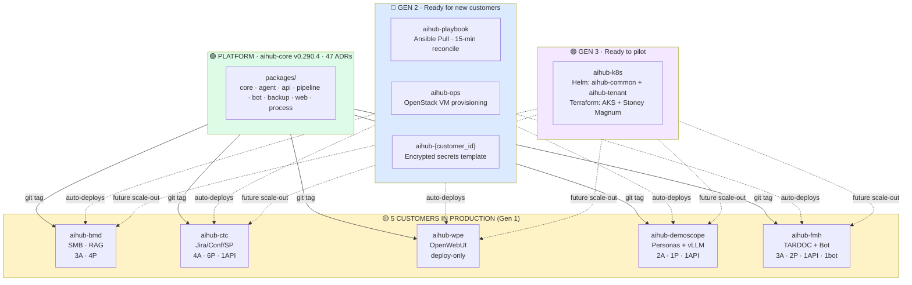

> 🟢 platform mature · 🟡 5 customers in revenue · 🔵 self-healing infra ready · 🟣 K8s scale-out ready

<!--
Walk through the diagram. Stress: "we are not starting from zero".
Every box on this diagram represents work already done. Our job is to connect them — pilot Gen 3 with a real customer, harden the 5 in production, prepare for customer #6.
-->

______________________________________________________________________

# Use cases already in production

| Customer        | Use case                                      | Why it matters                                     |
| --------------- | --------------------------------------------- | -------------------------------------------------- |
| aihub-bmd       | On-prem RAG over SMB customer/supplier docs   | Reference for SMB / on-prem deployments            |
| aihub-ctc       | IT-services chat + Jira/Confluence/SharePoint | Reference for multi-source enterprise RAG          |
| aihub-wpe       | User-managed knowledge via OpenWebUI          | Reference for deploy-only template                 |
| aihub-demoscope | Persona-based Q&A with local vLLM             | Reference for sovereign LLM stack                  |
| aihub-fmh       | TARDOC/TARMED medical billing + MS Teams bot  | Reference for regulated industry + bot integration |

> We start with revenue-generating production AND 5 distinct enterprise use-case references. Our job is to harden +
> grow, not to rebuild.

<!--
The phrase "revenue-generating production" is intentional — leadership cares about that.
Note we're emphasizing investments already made (Gen 2 + Gen 3 groundwork). Our team gets to leverage that, not build from scratch.
-->

______________________________________________________________________

# What this means for our team

**We are not starting from zero. We have**:

1. A working platform with 47 ADRs of context
2. 5 customers in production paying for the platform today
3. Gen 2 infrastructure (Ansible Pull) ready for new customers
4. Gen 3 infrastructure (K8s) ready for enterprise scale-out
5. Documented architecture (arc42, C4) at the platform level

**Our job in the next 6 months**:

- **Stabilize** — bring each customer to a known, documented, upgradable state
- **Harden** — close the operational and compliance gaps (backup, audit, ACL)
- **Scale** — enable customer #6, #7, #8 to onboard in days, not weeks
- **Position** — turn the platform into an enterprise-defensible product

> The platform is mature. Our value-add is making it production-grade at scale.

<!--
This is the framing we want leadership to remember: stabilize → harden → scale → position. Each of the next sections maps to one of these.
-->

______________________________________________________________________

<!-- _class: lead -->

# §3 · Honest snapshot of where we are

10 minutes · 5 areas where we'll invest

______________________________________________________________________

# Customer SDK alignment — visual snapshot

**Drift below core HEAD v0.290.4** (each bar = ~10 minors):

```
                  Drift (minors)   Months   Effort to upgrade
                  0         50        100+
aihub-bmd     ▓▓ 11          ──┤      ~1 mo    🟢 simple
aihub-ctc     ▓▓▓ 16         ──┤      ~1.5 mo  🟢 simple
aihub-wpe     ▓▓▓▓▓▓▓ 35     ──┤      ~3.5 mo  🟡 moderate
aihub-demoscope ▓▓▓▓▓▓▓▓▓ 44 ──┤      ~4.5 mo  🟡 moderate
aihub-fmh     ▓▓▓▓▓▓▓▓▓▓▓▓▓▓▓▓▓▓▓▓▓ 104  10+ mo  🔴 multi-step plan
```

| Customer        | Components                                    | Deployment                 |
| --------------- | --------------------------------------------- | -------------------------- |
| aihub-bmd       | 3 agents · 4 pipelines                        | Gen 1 manual VM            |
| aihub-ctc       | 4 agents · 6 pipelines · 1 API · lib          | Gen 1 Azure VM             |
| aihub-wpe       | Deploy-only (no custom code)                  | Gen 1 manual VM            |
| aihub-demoscope | 2 agents (4 deployed) · 1 pipeline · 1 API    | Gen 1 (Pulumi README-only) |
| aihub-fmh       | 3 agents · 2 pipelines · 1 API · 1 bot · eval | Gen 1 (Pulumi committed)   |

> \*Demoscope SDK pin not in repo `pyproject.toml`; figure carried over from prior snapshot — we'll verify operationally
> first.

<!--
Visual emphasis: B*D / C*C are short bars = quick wins. F*H is the long bar = needs the multi-step plan.
The colored dots after each row give an at-a-glance read.
-->

______________________________________________________________________

# 5 improvement areas — at a glance

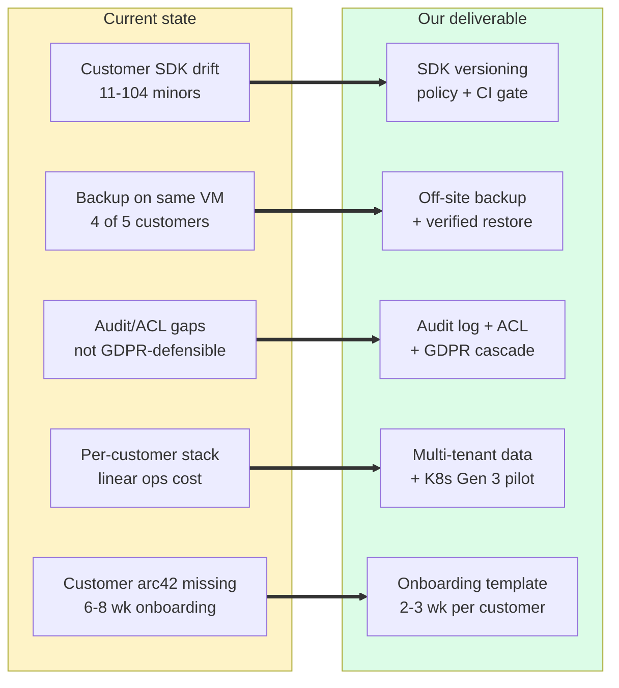

> Each arrow is paired in §4 (per customer) and §5 (platform-wide). No issue is raised without a paired deliverable.

<!--
Tone check: this is honest information, not an alarm. Each customer has a known plan in §4.
Don't dwell on the 104-minor drift on F*H — yes it's large, yes it's manageable. The detailed plan is in §4.
-->

______________________________________________________________________

# Where the platform is already strong

We don't need to invest in these — they're working and we'll preserve them:

- <span class="ok">Event-driven architecture</span> — NATS JetStream + protocol design is sound
- <span class="ok">LLM gateway</span> — LiteLLM abstraction is in place; provider swap is a config change
- <span class="ok">Identity layer</span> — 5 auth handlers + hierarchical permission template work as designed
- <span class="ok">License compliance</span> — 402 Python + 993 npm + 33 Docker images all approved
- <span class="ok">Multi-language UI</span> — DE / EN / FR / IT working
- <span class="ok">Gen 2 infrastructure</span> — Ansible Pull, Restic backup, SigNoz collector ready for new customers
- <span class="ok">Gen 3 chart</span> — `aihub-k8s` Helm structure done; we just need to pilot it with a real customer

> Our job is to **build on** these strengths, not redesign them. That's why we can deliver §4-§5 in 6 months, not 18.

<!--
This slide buys credibility. We've studied the codebase carefully — we know what NOT to touch. That tells leadership we'll be efficient with their resources.
-->

______________________________________________________________________

<!-- _class: lead -->

# §4 · Per-customer handover plan

15 minutes · 5 customers · clear path each

______________________________________________________________________

# Handover sequencing — timeline view

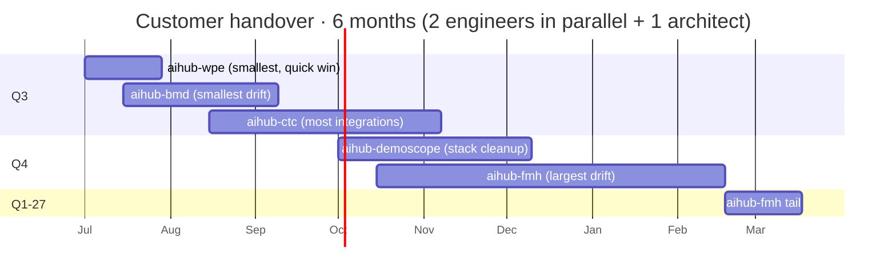

**Sequencing rationale**:

| Why                               | Customer                  | Effort                      |
| --------------------------------- | ------------------------- | --------------------------- |
| Quick win to demonstrate the plan | aihub-wpe (3-4 wk)        | smallest scope, deploy-only |
| Good SDK-upgrade pilot            | aihub-bmd (6-8 wk)        | smallest drift (11 minors)  |
| Most pattern-extraction value     | aihub-ctc (11-13 wk)      | enterprise multi-source RAG |
| Stack cleanup well-scoped         | aihub-demoscope (9-11 wk) | divergence + IaC fix        |
| Deepest customer, multi-step plan | aihub-fmh (16-20 wk)      | largest drift + AI Search   |

> **Total**: ~45-56 engineering-weeks · ~6 months calendar with 2 engineers in parallel + 1 architect oversight. Order
> is flexible — see §6 Decision #4. Customer-relationship signals from leadership can override.

<!--
Honest about timeline. 6 months calendar is ambitious but achievable with the right team.
The "Why this order" column is important — it shows we've thought about sequencing, not just listed customers alphabetically.
-->

______________________________________________________________________

# aihub-wpe · 3-4 weeks to stabilized

**What it is**: deploy-only repo. No custom agents/pipelines/API. Pulls core images via `CORE_VERSION` env. ~30
containers behind Traefik.

**What we'll deliver**:

1. <span class="first">Week 1</span> — **TLS cert rotation** (production `wpe.ai-agents.ch` cert is committed in git
   alongside private key — see [`adr_041`](05_proposed_adrs/adr_041_tls_key_committed_remediation.md)). Rotate via
   Traefik+ACME, add `*.pem` to `.gitignore`, rewrite git history, coordinate clones.
2. <span class="next">Week 1-2</span> — Reproducible deploy script (replace manual `cp docker-compose.latest.yml`) +
   post-deploy smoke tests.
3. <span class="next">Week 2-3</span> — Pin `CORE_VERSION`, remove `:-latest` fallback. SDK upgrade v0.255.6 → v0.290.4.
4. <span class="next">Week 3-4</span> — Off-site backup configured (Restic → Swift cross-region). Minimal arc42 (3
   chapters) + 6 ADRs.

**End state**: documented, automated, off-site-backed, on current SDK. Candidate for **first Gen 3 K8s pilot** in Q4.

<!--
W*P is our first win. Quick scope, visible delivery, lots of "tick the boxes" outcomes.
The TLS rotation is presented as the first action item — already framed positively (we have the runbook).
-->

______________________________________________________________________

# aihub-bmd · 6-8 weeks to stabilized

**What it is**: 3 agents (bmd, expert_rag, expert_asking) + 4 pipelines (customers × 2-stage, suppliers × 2-stage). SMB
share data source. Azure OpenAI Sweden + Cohere reranking.

**What we'll deliver**:

1. <span class="first">Week 1-2</span> — Off-site backup (emergency cron sync to Swiss-sovereign storage) + verified
   restore drill.
2. <span class="first">Week 2-4</span> — SDK upgrade v0.279.2 → v0.290.4 (11 minors). Security delta audit. Fix
   `pipelines/snk_enrichment.py:2` import path (replace deep import with public API).
3. <span class="next">Week 3-6</span> — Test coverage: smoke tests per agent + pipeline; integration test with staging
   SMB. Target 60% on new code.
4. <span class="next">Week 5-8</span> — Customer arc42 (12 chapters) + 10 ADRs (sovereignty trade-off, partitioning, SMB
   path, Cohere choice, etc.). Pydantic Settings to replace hardcoded paths.
5. <span class="later">Cohere reranking trade-off ADR — pairs with the sovereignty decision in §6.</span>

**End state**: documented, tested, on current SDK, off-site-backed, configuration externalized.

<!--
B*D is our second win and our SDK-upgrade learning exercise. The patterns we develop here (security delta audit, public-API refactor) we'll reuse for the other 4 customers.
-->

______________________________________________________________________

# aihub-ctc · 11-13 weeks to stabilized

**What it is**: 4 agents + 6 pipelines (Jira/Confluence/SharePoint × 2-stage) + custom API (Jira webhook + Support Desk)
\+ `lib/common/`. Azure AI Foundry SUI+SWE. Keycloak federated with Azure AD B2C.

**What we'll deliver**:

1. <span class="first">Week 1-3</span> — Off-site backup; SDK upgrade v0.274.3 → v0.290.4 (16 minors). Fix internal
   imports (`RetrievalAgentInTheLoop.py:1-4` + new deep imports in `ChatAgent.py`) → contributes to
   [`adr_038`](05_proposed_adrs/adr_038_sdk_import_discipline.md).
2. <span class="first">Week 2-6</span> — Per-user OAuth for Jira/SharePoint/Confluence (replace service-account shared
   key) + document ACL inheritance into Milvus ([`adr_020`](05_proposed_adrs/adr_020_document_acl_inheritance.md)).
   **Enterprise pattern — extracted to core for reuse**.
3. <span class="next">Week 4-8</span> — SharePoint scoped permission (`Sites.Selected` instead of tenant-wide). Jira
   webhook idempotency. Test coverage extension (chat/jira/orchestrator agents + 6 pipelines + custom API).
4. <span class="next">Week 6-12</span> — Customer arc42 + 13 ADRs (Azure Foundry trade-off, naming convention, custom
   API extension contribution path, etc.).
5. <span class="later">Pattern extraction</span> — Multi-agent orchestrator + Jira/SharePoint/Confluence connectors →
   contribute to core connector framework.

**End state**: documented, tested, per-user OAuth, ACL-aware retrieval. Patterns extracted to core for next customer's
benefit.

<!--
C*C is where we earn our keep. It has the most enterprise-relevant patterns (per-user OAuth, multi-source RAG orchestration, custom API extensions). The pattern extraction in step 5 is what makes future customers onboard faster.
-->

______________________________________________________________________

# aihub-demoscope · 9-11 weeks to stabilized

**What it is**: 2 agent packages (`persona_agent`, `multi_personas_agent`) with 4 deployed variants (public/private
each) + 1 pipeline (personas with imputation + insertion). Azure OpenAI SUI + **local vLLM** (Gemma-3 12b/27b +
gte-Qwen2 + bge-reranker). MongoDB + Redis + Phoenix stack.

**What we'll deliver**:

1. <span class="first">Week 1-2</span> — **Verify SDK pin** from operational sources (CI logs, deploy manifests) —
   `pyproject.toml` doesn't declare it. Document the actual deployed version.
2. <span class="first">Week 2-4</span> — Off-site backup (MinIO co-located with primary today). Replace ad-hoc
   `backup_updater_script.py` with official `milvus-backup` to off-host bucket.
3. <span class="next">Week 3-5</span> — Replace manual SSH+screen+scp migration with a Dagster job tracking progress in
   DB.
4. <span class="next">Week 4-8</span> — Hash-partition utility consolidation (single source of truth in
   `lib/common/partition_utils.py` + CI assertion). Document the 4-variant public/private split rationale (or merge to
   single binary with config flag).
5. <span class="next">Week 6-10</span> — Commit Pulumi IaC (or pick Terraform) — README mentions Pulumi but `.iac/` is
   not in repo. Stack divergence ADR (Mongo+Redis+Phoenix vs core FerretDB+Valkey+Langfuse).
6. <span class="next">Week 8-11</span> — Customer arc42 + 9 ADRs.

**End state**: SDK pin verified, IaC committed, automated migration, off-site backup, documented.

<!--
Dem*scope is the cleanup-heavy customer. Lots of "make it match the platform standard" work. Also the most interesting one technically — only customer with local vLLM.
-->

______________________________________________________________________

# aihub-fmh · 16-20 weeks (Q4-Q1)

**What it is**: 3 agents (handbook, rules, routing) + 2 pipelines (handbook_ingestion, position_ingestion) + custom API
\+ **MS Teams bot** + own evaluation framework (`evaluation/`). Azure OpenAI **Switzerland North** + **Azure AI Search**
(not Milvus). Pulumi committed (10 deploy units).

**What we'll deliver**:

1. <span class="first">Week 1-2</span> — Verify Azure backup policy + cross-region replication for TARDOC/TARMED data
   (not visible in Pulumi `stores/`).
2. <span class="first">Week 2-12</span> — **Multi-step SDK upgrade**: v0.186.0 → v0.220 → v0.260 → v0.290. Each step:
   security delta audit, behavior tests against the existing `evaluation/` testset (this is our regression safety net).
3. <span class="next">Week 4-8</span> — Replace LlamaIndex monkey-patch (`lib/common/register_openai_models.py`) with
   first-class GPT-5 support contributed to core. The patch drops automatically on SDK upgrade.
4. <span class="next">Week 6-10</span> — **Azure AI Search vs Milvus decision**
   ([`adr_039`](05_proposed_adrs/adr_039_fmh_azure_ai_search_vs_milvus.md)) — keep with formal cost analysis, or migrate
   to Milvus. Either choice committed to ADR.
5. <span class="next">Week 8-14</span> — Hardcoded handbook namespace → Pydantic Settings (allow monthly snapshots in
   parallel). Stack migration plan (Phoenix → Langfuse per ADR `2026_02_10`; Mongo → FerretDB).
6. <span class="next">Week 12-20</span> — Customer arc42 + 9 ADRs. Pattern extraction — evaluation framework (best of
   any customer!) becomes a candidate for core contribution.

**End state**: on current SDK, monkey-patch removed, AI-Search decision committed, evaluation framework preserved.

<!--
F*H is the biggest scope but also has the strongest assets (evaluation framework, committed Pulumi). The evaluation framework is uniquely good — we want to extract it to core for use by other customers.
The 16-20 week timeline is realistic; we use the evaluation framework as the regression safety net during the multi-step SDK upgrade.
-->

______________________________________________________________________

# Pattern extraction — every migration compounds

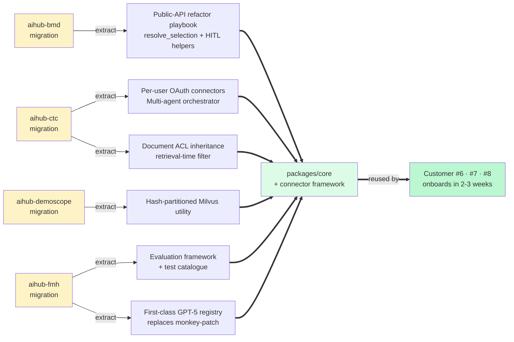

> Every week we spend on the 5 customers reduces onboarding cost for customer #6, #7, #8. Customer migrations aren't
> "operational chores" — they're **product-development work that compounds**.

<!--
This is THE slide that flips the narrative. Leadership often sees customer migrations as cost. This slide reframes them as investment.
Make the arrow trace by hand: "we migrate B*D, we learn the public-API refactor playbook, every future customer benefits."
-->

<!--
This is the slide that flips the narrative: customer migration isn't just operational work, it's product-development work that compounds.
Leadership cares about leverage — show them the leverage explicitly.
-->

______________________________________________________________________

<!-- _class: lead -->

# §5 · Platform improvements that unlock growth

15 minutes · 6 strategic deliverables

______________________________________________________________________

# Six platform improvements — overview

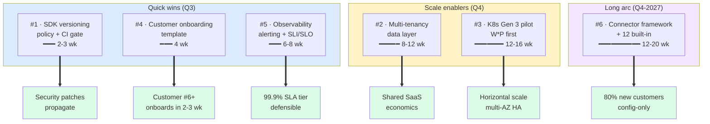

> **Not all in flight at once.** Q3 = #1 + #5 + start #2 + W\*P pilot. Q4 = finish #2 + #3 + #4. Connector framework
> (#6) starts late Q4, continues 2027.

<!--
Six items, but only 4 in flight. This shows discipline. Leadership likes to see a team that prioritizes.
The "Customer-facing outcome" column is the framing for each — these aren't engineering chores, they're growth enablers.
-->

______________________________________________________________________

# Improvement #1 · SDK versioning policy

**What we'll deliver**:

- Max-drift policy (proposed: 20 minors) with security-patch SLA (critical 7 days, high 30 days)
- CI gate that blocks customer PRs if drift exceeds threshold
- Public SDK release on internal registry (not just `git+ssh` tag)
- ADR [`adr_NEW-001`](05_proposed_adrs/README.md) finalized + adopted

**Effort**: 2-3 weeks.

**Customer-facing outcome**:

- Security patches propagate to all customers within SLA
- Predictable quarterly upgrade cycles
- Force-upgrade rights documented for critical security patches

**Decision needed** (§6): max-drift threshold value. We propose 20. Leadership may want stricter (10) or looser (30) —
affects customer upgrade cadence.

> Cheapest improvement, highest leverage. Without this, every other platform improvement takes weeks to propagate to
> customers.

<!--
This is the foundational policy item. Do it first; everything else benefits.
-->

______________________________________________________________________

# Improvement #2 · Multi-tenancy data layer

**The problem we're solving**: today each customer = separate VM + separate database set. Operational cost grows
linearly with customers.

**What we'll deliver** ([`adr_NEW-002`](05_proposed_adrs/README.md)):

- NATS subject hierarchy `aihub.tenant.{id}.*`
- Mongo entities: required `tenant_id` field + index
- Milvus: per-tenant collection
- Valkey: per-tenant key prefix
- SeaweedFS: per-tenant bucket prefix
- Per-tenant resource quotas (rate limit, storage, LLM budget)
- Per-tenant cost attribution in Langfuse → showback to customers

**Effort**: 8-12 weeks (cross-cutting).

**Customer-facing outcome**:

- Onboard new customer in days, not weeks
- Multiple customers on shared infrastructure → margin improvement
- Per-customer cost reporting and budget enforcement

**Prereq**: tenant provisioning API ([`adr_NEW-008`](05_proposed_adrs/README.md)).

<!--
This is the strategic enabler for scale. Pair it with K8s migration (Gen 3) for full effect.
The phrase "shared SaaS economics" should resonate with leadership thinking about margins.
-->

______________________________________________________________________

# Improvement #3 · K8s Gen 3 — production pilot

**Where we are**: chart structure done (`aihub-common` + `aihub-tenant`), Terraform for AKS + Stoney Magnum done, 3 test
tenants running. **No production customer migrated yet.**

**What we'll deliver**:

1. Pilot one customer (**recommend W\*P** — smallest scope, deploy-only)
2. Validate cluster-mode Milvus, HPA, Keycloak realm-per-tenant pattern
3. Fix chart core-version pinning ([`adr_040`](05_proposed_adrs/adr_040_k8s_chart_core_version_pinning.md)) — chart
   should pin a version, not fall back to `:latest`
4. Document Gen 1 → Gen 3 migration playbook
5. Adopt Gen 3 as the official forward path (ADR)

**Effort**: 12-16 weeks (including W\*P cutover).

**Customer-facing outcome**:

- Horizontal scale (no single-VM ceiling)
- Multi-AZ HA capability
- 99.9% SLA tier becomes technically feasible

**Decision needed** (§6): timeline commitment. Pilot in Q3 vs Q4 vs 2027 — depends on whether we expect to onboard new
customers soon.

<!--
Gen 3 = K8s = horizontal scale + HA. The pilot on W*P is low-risk because W*P has no custom code — pure infrastructure exercise.
-->

______________________________________________________________________

# Improvement #4 · Customer onboarding template

**The problem we're solving**: each new customer today reinvents arc42 + ADRs + deployment scripts. ~6-8 weeks per new
customer.

**What we'll deliver**:

- arc42 12-chapter skeleton template (Markdown + frontmatter)
- Required ADR list (8-13 decisions per customer) with stub files
- `aihub-{customer_id}` repo template strengthened — including strict `.gitignore` (prevents recurrence of
  TLS-key-in-git pattern)
- Documentation gate before customer go-production (sign-off checklist)
- Pre-commit hooks: `gitleaks` / `detect-secrets`

**Effort**: 4 weeks (one-time investment, big leverage).

**Customer-facing outcome**:

- Next customer onboarding drops to **2-3 weeks** (vs 6-8 today)
- Audit-ready documentation by default
- Lower onboarding skill bar (junior engineers can drive customer setup)

**Pairs with**: Gen 2 deployment template (`setup-aihub.sh` already automates VM provisioning — we just need the docs
scaffold).

<!--
4 weeks of work that saves 4-5 weeks per future customer. If we onboard 3 customers in 2027, this pays back 5x.
-->

______________________________________________________________________

# Improvement #5 · Observability — alerting + SLI/SLO

**Where we are**: OpenTelemetry + Langfuse + SigNoz collector are in place. Traces and LLM cost work. Missing: alerting
\+ on-call + formal SLI/SLO.

**What we'll deliver**:

- Prometheus + AlertManager (or SigNoz alert rules)
- On-call routing via PagerDuty / OpsGenie
- Formal SLI/SLO per service (e.g., API p99 < 2s, RAG p99 < 5s)
- Grafana dashboards (or SigNoz dashboards) per service
- Business metrics export (agent_runs, HITL escalations, ingestion rate, RAG latency)
- Incident response runbook

**Effort**: 6-8 weeks.

**Customer-facing outcome**:

- Customer-facing SLA tiers become defensible:
  - **Bronze** 99.0% (single-VM)
  - **Silver** 99.5% (HA single-AZ)
  - **Gold** 99.9% (multi-AZ K8s)
- Production page-out coverage
- Monthly automated SLA report per customer

> Pairs with Gen 3 K8s migration (#3) — together they unlock the Gold tier.

<!--
The SLA tier framing is sales-friendly. Marketing can tier the offering once we have technical backing.
-->

______________________________________________________________________

# Improvement #6 · Connector framework

**The problem we're solving**: B*D rebuilt SMB. C*C rebuilt Jira/Confluence/SharePoint. F\*H rebuilt Azure Data Lake.
Every new customer rebuilds connectors from scratch.

**What we'll deliver**:

- `BaseSourceConnector` abstract framework with plugin discovery
- 12 built-in connectors (covers ~80% of cases): SMB, S3, SharePoint, Confluence, Jira, GitHub, GitLab, Notion, Drive,
  Box, Salesforce, IMAP
- Pattern extraction from C*C (Jira/Confluence/SharePoint) and B*D (SMB) → core
- Long-term: community-contributable connector marketplace

**Effort**: 12-20 weeks (depending on connector count we commit to).

**Customer-facing outcome**:

- 80% of new customers become config-driven (no custom code)
- Onboarding time drops further (combined with #4 template)
- Competitive parity with Airbyte / Fivetran / Meltano in connector breadth

> This is the slowest improvement but the biggest growth multiplier. Probably starts in Q4 and continues into 2027.

<!--
Be honest about the scope. Connectors are the kind of work that pays off over years.
-->

______________________________________________________________________

<!-- _class: lead -->

# §5b · What our team can build today

## With design-first discipline · 10 minutes

______________________________________________________________________

# What we can take on — capability matrix

```mermaid
flowchart TB
    subgraph TEAM["🧑‍💻 Our team — full-stack capability across the platform"]
        direction TB
        A["AI Agents<br/>chat · RAG · multi-agent<br/>HITL · voice · MCP tools"]
        P["Data Pipelines<br/>Dagster ingestion + parsing<br/>embedding + indexing"]
        AP["API Endpoints<br/>FastAPI REST + WebSocket + SSE<br/>extension controllers"]
        BO["Bot Integrations<br/>MS Teams · Slack<br/>WebChat · custom channels"]
        FE["Frontend<br/>Nuxt 3 · Vue 3 · PrimeVue<br/>Admin UI extensions"]
        IN["Infrastructure<br/>Docker · Helm · Ansible<br/>Terraform · K8s"]
        DO["Documentation<br/>arc42 · ADRs · C4<br/>customer onboarding"]
        EV["Evaluation<br/>BDD test suites<br/>RAGAS · Langfuse datasets"]
    end

    style TEAM fill:#dcfce7
    style A  fill:#dbeafe
    style P  fill:#dbeafe
    style AP fill:#dbeafe
    style BO fill:#dbeafe
    style FE fill:#fef3c7
    style IN fill:#fef3c7
    style DO fill:#f3e8ff
    style EV fill:#f3e8ff
```

> Anything on this canvas — **we can take on**. We have the skills + the codebase context. The constraint isn't
> capability. The constraint is **discipline** — which is what §5b is really about.

<!--
This is the "show capability without bragging" slide. Don't dwell on each box; the point is breadth.
Then transition: "the question isn't can we build it — it's how we build it so we don't repeat the issues we found."
-->

______________________________________________________________________

# Design-first workflow — how we'll build

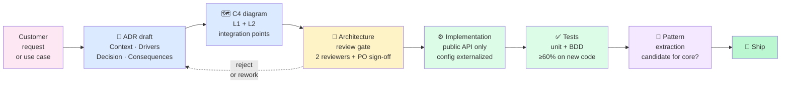

**Two gates that didn't exist before**:

1. **Architecture review** (after ADR + C4, before any code) — ensures the design is sound and aligned with platform
   direction
2. **Pattern extraction review** (before ship) — every new agent / pipeline / API is evaluated for "should this go in
   core?"

> Design-first is what separates us from the current state. Same code velocity, fewer landmines.

<!--
This is THE slide that builds trust with PO. We're not just saying "we'll do better" — we're showing the concrete workflow that prevents the issues we found.
The reject loop on the review gate is intentional — it shows the design IS allowed to be rejected, not rubber-stamped.
-->

______________________________________________________________________

# How design-first avoids what we found

| Issue we found in current projects                 | What design-first prevents                                              |
| -------------------------------------------------- | ----------------------------------------------------------------------- |
| Hardcoded SNK_ANCHOR, Jira URL, handbook namespace | ADR step forces "what's configurable" question                          |
| Deep imports (ChatAgent.py, snk_enrichment.py)     | C4 step + review gate forbid internal-path imports                      |
| `Sites.Read.All` over-permissioned                 | Architecture review checks least-privilege at design time               |
| 4 deployed variants without documented rationale   | ADR step requires public/private split rationale up front               |
| LlamaIndex monkey-patch                            | Review gate would flag third-party global mutation                      |
| Pulumi mentioned in README but code not committed  | C4 step requires actual deploy unit diagram                             |
| `${CORE_VERSION:-latest}` fallback to latest       | Review gate checks reproducibility                                      |
| TLS private key committed to git                   | Pre-commit hook (`gitleaks` / `detect-secrets`) + template `.gitignore` |
| 0 tests on agents / pipelines                      | Tests gate before ship — ≥60% on new code                               |
| Customer arc42 missing                             | ADR + C4 ARE the customer arc42 starting point                          |

> Each row maps to a real finding in the architecture review. Design-first is the systematic answer.

<!--
This is the slide that ties §5b back to §3 ("issues we found"). One-to-one mapping. Concrete, not aspirational.
PO question expected: "what if design-first slows us down?" Answer: it doesn't. The ADR + C4 step is 1-2 days; the review gate is 1 day; the rest is normal work. Total overhead per medium-sized feature: ~3 days. Saves 2-4 weeks of rework downstream.
-->

______________________________________________________________________

# Example walkthrough — building a new agent

**Scenario**: PO asks for a new agent — *"compliance Q&A for a new banking customer"*

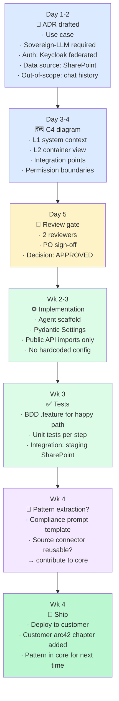

**Total**: ~4 weeks design + build + ship + extract. **Compared to**: ~6-8 weeks today without the design-first scaffold
(because rework + missing config + missing tests).

> Same end result. Less rework. Permanent investment in the platform.

<!--
Concrete example pays off here. PO sees: 4 weeks for a new agent end-to-end, with all the right artifacts.
If PO pushes "can we skip design for an urgent request?" — answer: yes, but we mark it as technical debt with an ADR-NEW-XXX placeholder and revisit in next cycle. Discipline doesn't mean rigid.
-->

______________________________________________________________________

# What design-first does NOT mean

❌ **Not** — endless design meetings, paralysis by analysis, 50-page documents before any code

✅ **Is** — lightweight ADR (1-2 pages, 1-2 hours to write) + C4 sketch + 1-day review

❌ **Not** — every micro-task needs an ADR

✅ **Is** — design-first triggers on *architectural* decisions: new agent, new pipeline, new integration, new dependency,
new pattern. Bug fixes and config tweaks skip the gate.

❌ **Not** — slowing down the team to look thorough

✅ **Is** — investing 3 days up front to save 2-4 weeks downstream of rework, missing tests, and undocumented decisions

❌ **Not** — replacing existing customer code overnight

✅ **Is** — applying design-first to *new* work; existing customer code gets refactored as part of each customer's
migration plan (§4)

> We are not adding bureaucracy. We are adding the **minimum scaffold** that keeps the platform shippable at scale.

<!--
Anticipated pushback handled directly. Use this slide to reassure: we're not slowing down, we're investing where the multiplier is.
-->

______________________________________________________________________

<!-- _class: lead -->

# §6 · Alignment items

## 5 decisions to make together

10 minutes · we have proposals for each

______________________________________________________________________

# Decision overview — visual map

```mermaid
flowchart TB
    subgraph D1["#1 · Sovereignty path"]
        D1A["Option A<br/>self-hosted local LLM"]:::reject
        D1B["✅ Option B<br/>hybrid + updated ADR"]:::accept
        D1C["Option C<br/>per-customer tier"]:::reject
    end
    subgraph D2["#2 · Process package"]
        D2A["Activate hybrid"]:::reject
        D2B["✅ Delete + update docs"]:::accept
    end
    subgraph D3["#3 · K8s Gen 3 timing"]
        D3A["✅ Pilot W*P in Q3"]:::accept
        D3B["Defer to Q4"]:::reject
        D3C["Wait 2027+"]:::reject
    end
    subgraph D4["#4 · Customer order"]
        D4["✅ W*P → B*D → C*C → DS → F*H<br/>(flexible per leadership input)"]:::accept
    end
    subgraph D5["#5 · Marketing wording"]
        D5A["Hold the claim"]:::reject
        D5B["✅ Soften to 'Swiss-aware AI'<br/>until sovereignty completes"]:::accept
        D5C["Tier the claim"]:::reject
    end

    classDef accept fill:#bbf7d0,stroke:#15803d,stroke-width:2px
    classDef reject fill:#f3f4f6,stroke:#9ca3af,color:#6b7280
```

> ✅ = our recommendation · grey = considered but not recommended · Each detailed in the next 5 slides.

<!--
This is the slide that anchors the §6 walk-through. Show leadership we've done the work — we're not asking them to decide cold, we're asking them to confirm or adjust an informed recommendation.
-->

______________________________________________________________________

# Decision #1 · Sovereignty path

**Current state**: ADR `2026_02_24` says "all cloud inference stays within Swiss infrastructure". Reality today: B*D
Sweden, C*C SUI+SWE, W*P unverified, Dem*scope partial, F\*H Switzerland (defensible for TARDOC).

**Our recommendation: Option B — hybrid with updated ADR**

| Option      | What it means                                                        | Cost                                                | Customer impact                             |
| ----------- | -------------------------------------------------------------------- | --------------------------------------------------- | ------------------------------------------- |
| **A**       | Self-hosted local LLM for every customer                             | Hardware upfront + ops; possible model quality drop | Premium tier only                           |
| **B** (rec) | Hybrid: update ADR to allow Azure-EU + Switzerland; soften marketing | Doc update + comms only                             | Customers stay on Azure where appropriate   |
| **C**       | Per-customer sovereignty tier                                        | Build tier system + per-tier pricing                | Premium tier customers get full sovereignty |

**Why B**: minimal disruption to existing customers, honest with audit + marketing, leaves the door open for Option A/C
later when local LLM quality matches Azure GPT-5.

**Asks**: confirm Option B + update marketing wording → see Decision #5.

<!--
Option B is the pragmatic recommendation. A would require expensive hardware now; C requires building a tier system we don't have.
B says: we're honest about reality, we keep our customers happy, we don't promise more than we deliver.
-->

______________________________________________________________________

# Decision #2 · Process package fate

**Current state**: `packages/process` has 0 external imports — it's dead code. But docs (CLAUDE.md, arc42) still
describe it as a production component → false architecture claim.

**Our recommendation: Delete + update docs**

**Why delete**:

- The team is doing agentic workflows in `packages/agent` in practice
- Maintaining dead code costs review time + bloats the SDK
- Regulated customers (banking/healthcare/gov) can still use Temporal/n8n/Camunda externally — we provide the agentic
  layer

**Alternative**: Activate as hybrid (Process for deterministic flows, Agentic for ambiguous). Adds maintenance burden
for a capability no current customer uses.

**Effort**: 2 weeks decision + 4-8 weeks action (code removal + doc updates + migration guide).

**Asks**: confirm Delete; we'll write the migration guide for any future customer who needs declarative workflow.

> If a future customer requires declarative workflow, we recommend integration with Temporal rather than rebuilding
> `packages/process`.

<!--
This is a cheap decision with a small but important payoff. False claims in docs are landmines at audit time.
-->

______________________________________________________________________

# Decision #3 · K8s Gen 3 adoption timeline

**Current state**: chart structure ready, test tenants running, no production customer migrated.

**Our recommendation: Pilot W\*P in Q3 (weeks 8-12)**

**Why now**:

- W\*P is small scope (deploy-only) — perfect pilot
- Gen 3 is needed before we onboard customer #6 at enterprise scale
- The longer Gen 3 sits unproven, the harder it gets to commit to

**Alternative options**:

| Option   | Timeline   | Effect                                           |
| -------- | ---------- | ------------------------------------------------ |
| **Now**  | Q3 wk 8-12 | W\*P pilot — recommended                         |
| **2026** | Q4         | Adds 3 months of test-only state                 |
| **Wait** | 2027+      | Keeps Gen 1/Gen 2; defers scale-out indefinitely |

**Asks**:

- Commit to W\*P pilot in Q3
- Require Gen 3 (not Gen 1) for customer #6+ onboarding
- Approve the resource budget (mostly DevOps time, see §7)

<!--
The pilot is low-risk because W*P is deploy-only. If the pilot succeeds, customer #6 onboards on Gen 3 directly.
-->

______________________________________________________________________

# Decision #4 · Customer migration priority

**Our recommendation**:

| Order | Customer        | Why this order                                               |
| ----- | --------------- | ------------------------------------------------------------ |
| 1     | aihub-wpe       | Quick win (3-4 weeks); demonstrates the takeover plan        |
| 2     | aihub-bmd       | Smallest drift; good SDK-upgrade pilot                       |
| 3     | aihub-ctc       | Most external integrations; biggest pattern-extraction value |
| 4     | aihub-demoscope | Stack divergence cleanup                                     |
| 5     | aihub-fmh       | Largest drift + Azure AI Search decision                     |

**Where we want leadership input**:

- Customer-relationship signals (which customer is most demanding right now?)
- Revenue-at-risk considerations (any customer renewal coming up?)
- Whether to run customers in parallel (needs +1 engineer) or sequentially

**Flexibility**: we can swap order — the engineering effort doesn't change, only the schedule.

> If C*C has a near-term audit, we'd accelerate it ahead of B*D. Leadership has visibility we don't.

<!--
Show that we're making an informed recommendation but explicitly inviting leadership input. This is the kind of decision where customer relationship matters more than engineering optimal.
-->

______________________________________________________________________

# Decision #5 · Marketing wording

**Current claim**: "Swiss Sovereign AI"

**Reality** (5 customers): only F*H is fully Swiss-region; W*P unverified; B*D / C*C / Dem\*scope use Azure outside
Switzerland for some/all LLM calls.

**Our recommendation: Soften to "Swiss-aware AI" or "Swiss-capable AI" until sovereignty completes**

**Alternative options**:

- **Hold the claim** → Decision #1 must be Option A (expensive, slow)
- **Tier the claim** → Decision #1 must be Option C; only sovereign-tier customers get the strong claim
- **Soften** (rec) → Decision #1 is Option B; marketing language matches reality

**What changes**:

- Website, pitch decks, customer contract templates
- Pre-sales playbook
- Existing customer communication (proactive disclosure on next review)

**Coordination needed**: this is marketing-led; engineering supports with ADR + technical evidence. We recommend a joint
engineering+marketing+legal review session.

<!--
Sensitive but important. The risk of NOT deciding is a customer-facing inconsistency that gets caught at audit.
We're offering to help marketing get this right, not asking them to fix something we broke.
-->

______________________________________________________________________

<!-- _class: lead -->

# §7 · Roadmap Q3-Q4 + team commitments

7 minutes · what we'll deliver, what we need

______________________________________________________________________

# Q3 2026 — Stabilize + first wins

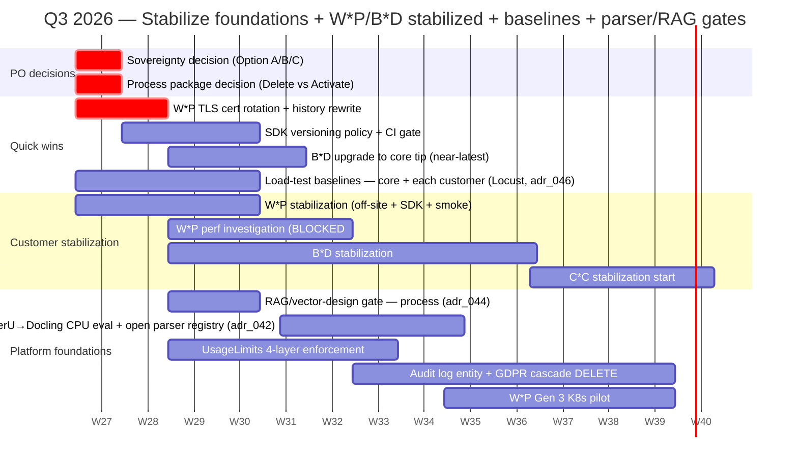

**End of Q3 — what's done**: W*P stabilized + Gen 3 piloting (perf investigation pending customer) · B*D upgraded to
core tip + stabilized · C\*C started · SDK policy + UsageLimits + audit log committed · **load-test baselines** (core +
customers) · **RAG/vector-design gate** adopted · **Docling CPU parser eval** done.

<!--
Visual roadmap. Color-coded by criticality (red = decisions blocking everything else; rest by section).
Pause here for "any questions about timing?" — leadership often pushes back on whether 4 weeks for W*P is realistic. Answer: yes, because W*P is deploy-only.
-->

<!--
This is the realistic Q3 plan. Notice we deliver visible value early (W*P stable in 4 weeks, B*D in 10 weeks).
-->

______________________________________________________________________

# Q4 2026 — Scale + enterprise readiness

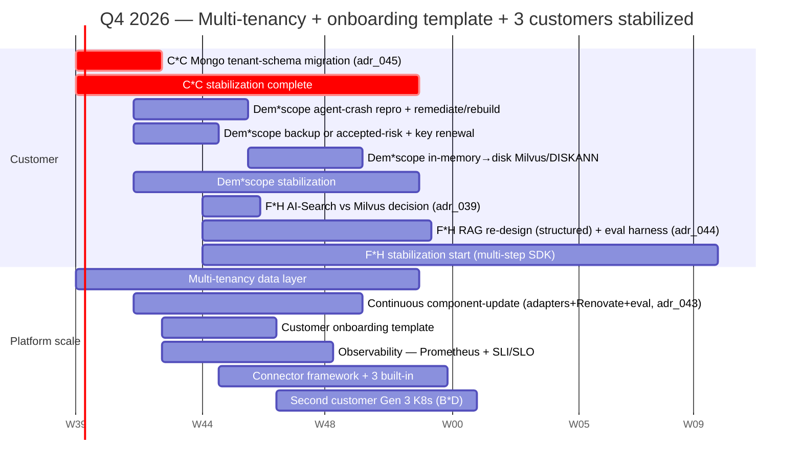

**End of Q4 — what's done**: 3 customers stabilized (W*P · B*D · C*C, incl. \*\*C*C tenant-schema migration\*\*) ·
Dem*scope nearly done (**crash fixed · backup/accepted-risk · vectors moved off-RAM**) · F*H upgrade started + **RAG
re-designed for structured data + eval harness** · multi-tenancy + onboarding template + observability + **continuous
component-update strategy** committed · 2 customers on Gen 3.

**Q1 2027 onwards**: F\*H completion (incl. AI-Search-vs-Milvus outcome) · connector framework expansion · customer #6
onboarding on Gen 3 + onboarding template (target 2-3 wk).

<!--
Q4 is dense — multi-tenancy is the big platform item, paired with onboarding template + observability for SLA defensibility.
The "second customer Gen 3" item (B*D in Nov) is the proof that Gen 3 isn't a one-customer pilot.
-->

<!--
Q4 stacks the strategic items. By end of Q4, we have 3 customers stabilized AND the multi-tenancy + observability + onboarding template that enable customer #6.
-->

______________________________________________________________________

# What we need — team + resources

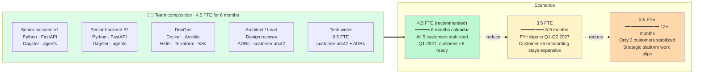

> **Knowledge transfer from outgoing team**: ~2 weeks overlap recommended — focused on F\*H specifics (it has the most
> undocumented context).

<!--
Be specific about resource needs. Leadership prefers concrete asks over vague "we need more people".
-->

______________________________________________________________________

# Expected outcomes — 6 months from today

**For the platform**:

- 47 → 60+ ADRs (customer ADRs + new platform ADRs adopted)
- Gen 3 K8s validated with first production customer
- Multi-tenancy data layer in place
- Customer onboarding template + connector foundation ready

**For each customer**:

- All 5 customers on max-drift policy (within 20 minors of HEAD)
- All 5 customers have off-site backup verified
- All 5 customers have own arc42 + ADRs
- 3 customers stabilized end-to-end (W*P, B*D, C*C); 2 in progress (Dem*scope, F\*H)

**For growth**:

- Customer #6 onboarding cost: ~2-3 weeks (vs 6-8 today)
- 80% of future customer connectors config-only
- Gold SLA tier (99.9%) technically defensible
- Marketing claim aligned with reality

**For the team**:

- Full knowledge transfer complete
- Owning core + 5 customers with confidence
- Pattern catalog growing every quarter

<!--
End on the destination. This is the "what success looks like" picture.
-->

______________________________________________________________________

<!-- _class: lead -->

# §8 · Recap & next steps

______________________________________________________________________

# Recap — 5 things to remember

1. <span class="ok">**Platform foundation is strong**</span> — event-driven, 47 ADRs, 9/10 enterprise patterns. We're
   hardening + scaling, not rebuilding.

2. <span class="ok">**5 customers in revenue-producing production**</span>. Our job is to stabilize, document, and bring
   all 5 onto a uniform support model in 6 months.

3. <span class="ok">**Five strategic improvements**</span> compound — SDK policy, multi-tenancy, K8s, onboarding
   template, observability — together they make customer #6+ cheap to onboard.

4. <span class="ok">**Five decisions today**</span> from leadership: sovereignty path, Process package fate, K8s
   timeline, customer migration priority, marketing wording. We have a recommendation for each.

5. <span class="ok">**Our ask**</span>: 4.5 FTE for 6 months + 2 weeks knowledge-transfer overlap. We'll deliver: 3
   customers stabilized end-to-end, Gen 3 pilot complete, customer onboarding cost dropped from 6-8 weeks to 2-3.

> We've studied. We have a plan. We're ready to execute.

<!--
The closing. Confident but not arrogant. Concrete asks. Clear deliverables.
-->

______________________________________________________________________

# Next steps after this session

**This week**:

- Confirm sovereignty decision (Option A/B/C) — written confirmation to architect
- Approve W\*P TLS rotation window (1 day scheduling)
- Confirm Process package decision (Delete / Activate)

**Next week**:

- Customer migration priority confirmation
- Marketing wording alignment session (engineering + marketing + legal)
- Resource commitment (4.5 FTE confirmation)

**Within 30 days**:

- W\*P stabilization complete (TLS, off-site backup, SDK upgrade)
- SDK versioning policy live in CI
- B\*D off-site backup live
- First customer arc42 (W\*P) draft circulated

**Cadence going forward**:

- Bi-weekly status with leadership (15 min — RAG status, decisions needed, escalations)
- Monthly customer-level reviews (each customer reports its own KPI)
- Quarterly architecture review (next: 2026-08)

<!--
Concrete next steps. No "we'll get back to you". The PO leaves the session with action items they own.
-->

______________________________________________________________________

# Reference materials

**Source documents** (this deck distills from):

- [`01_architecture_review_overview.en.md`](01_architecture_review_overview.en.md) — full executive overview
- [`02_architecture_review_details.md`](02_architecture_review_details.md) — technical deep-dive
- [`03_c4_diagrams.md`](03_c4_diagrams.md) — C4 platform diagrams
- [`c4/`](c4/) — per-customer C4 (platform / bmd / ctc / demoscope / wpe / fmh)
- [`05_proposed_adrs/`](05_proposed_adrs/) — 11 detailed ADRs + 29 listed (40 total)

**Most-cited proposed ADRs**:

- [`adr_000`](05_proposed_adrs/adr_000_sovereignty_compliance_path.md) — Sovereignty path
- [`adr_011`](05_proposed_adrs/adr_011_audit_log_entity.md) — Audit log entity
- [`adr_012`](05_proposed_adrs/adr_012_usage_limits_enforcement.md) — UsageLimits enforcement
- [`adr_019`](05_proposed_adrs/adr_019_mcp_secure_executor.md) — MCP secure executor
- [`adr_020`](05_proposed_adrs/adr_020_document_acl_inheritance.md) — Document ACL inheritance
- [`adr_030`](05_proposed_adrs/adr_030_offsite_backup_replication.md) — Off-site backup replication
- [`adr_037`](05_proposed_adrs/adr_037_aihub_supported_use_cases.md) — Supported AI use cases
- [`adr_038`](05_proposed_adrs/adr_038_sdk_import_discipline.md) — SDK import discipline (NEW)
- [`adr_039`](05_proposed_adrs/adr_039_fmh_azure_ai_search_vs_milvus.md) — F\*H Azure AI Search vs Milvus (NEW)
- [`adr_040`](05_proposed_adrs/adr_040_k8s_chart_core_version_pinning.md) — K8s chart pin policy (NEW)
- [`adr_041`](05_proposed_adrs/adr_041_tls_key_committed_remediation.md) — W\*P TLS key remediation (NEW)

______________________________________________________________________

<!-- _class: lead -->

# Q&A

**Common questions we're ready for**:

- "Can we accelerate the F\*H upgrade?"
- "What if we hire fewer than 4.5 FTE?"
- "Which customer is the biggest revenue risk?"
- "How do we communicate to existing customers about changes?"
- "What does success look like at month 3?"

<!--
Anticipated questions + prepared answers:

1. "Can we accelerate F*H?" → Yes, but it competes with C*C. F*H's 104 minors of drift means each step needs evaluation-framework regression — that's actually our safety net but it takes time. Doubling F*H speed = +1 engineer or descope evaluation.

2. "What if we hire fewer than 4.5 FTE?" → 3.5 FTE: stretch to 8-9 months, F*H slips to 2027. 2.5 FTE: only 3 customers stabilized in 2026; strategic improvements slip; customer #6 onboarding stays expensive.

3. "Which customer is the biggest revenue risk?" → We don't have visibility into revenue-per-customer. Leadership input drives Decision #4. Engineering-wise, F*H has the most code and the largest drift, so its upgrade timeline carries the most schedule risk.

4. "How do we communicate to existing customers?" → Pair with marketing: each stabilized customer gets a "platform status update" memo. Sovereignty wording change handled at the next customer review cycle per customer.

5. "What does success at month 3 look like?" → W*P fully stabilized + on Gen 3 K8s pilot; B*D stabilized + on current SDK; C*C in progress on per-user OAuth; SDK policy + UsageLimits + audit log live. 1 customer fully on the new model.
-->

______________________________________________________________________

<!-- _class: lead -->

# Thank you

**Deck**: `docs/arc42/review-2026-05/04_po_presentation_deck.md` **Source**:
[`01_architecture_review_overview.en.md`](01_architecture_review_overview.en.md) **Date**: 2026-05-28

**Engagement going forward**:

- Bi-weekly status: 15 min, async-friendly
- Monthly customer reviews: per-customer KPI
- Quarterly architecture review: next 2026-08

**Contact**: [your name / channel]

We're ready to take it from here.
